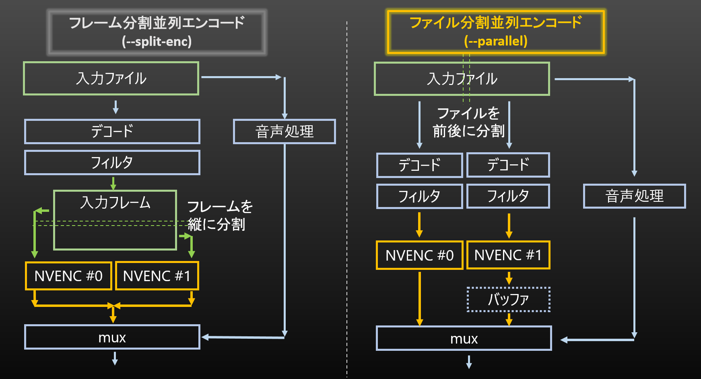


# NVEncC オプションリスト <!-- omit in toc -->

- [コマンドラインの例](#コマンドラインの例)
  - [基本的なコマンドの表記](#基本的なコマンドの表記)
  - [もっと実用的なコマンド](#もっと実用的なコマンド)
    - [hwデコードを使用する例](#hwデコードを使用する例)
    - [hwデコードを使用する例 (インタレ保持)](#hwデコードを使用する例-インタレ保持)
    - [avs(Avisynth)の例 (avsやvpyはvfw経由でも読み込み可能です)](#avsavisynthの例-avsやvpyはvfw経由でも読み込み可能です)
    - [パイプ利用の例](#パイプ利用の例)
    - [ffmpegからパイプ渡し](#ffmpegからパイプ渡し)
    - [ffmpegから映像と音声を両方パイプ渡したい](#ffmpegから映像と音声を両方パイプ渡したい)
    - [raw H.264/ESのmux](#raw-h264esのmux)
- [オプションの指定方法](#オプションの指定方法)
- [表示系オプション](#表示系オプション)
  - [-h,-? --help](#-h----help)
  - [-v, --version](#-v---version)
  - [--option-list](#--option-list)
  - [--check-device](#--check-device)
  - [--check-hw \[\<int\>\]](#--check-hw-int)
  - [--check-features \[\<int\>\]](#--check-features-int)
  - [--check-environment](#--check-environment)
  - [--check-codecs, --check-decoders, --check-encoders](#--check-codecs---check-decoders---check-encoders)
  - [--check-profiles \<string\>](#--check-profiles-string)
  - [--check-formats](#--check-formats)
  - [--check-protocols](#--check-protocols)
  - [--check-avdevices](#--check-avdevices)
  - [--check-filters](#--check-filters)
  - [--check-avversion](#--check-avversion)
- [エンコードの基本的なオプション](#エンコードの基本的なオプション)
  - [-d, --device \<int\>](#-d---device-int)
  - [-c, --codec \<string\>](#-c---codec-string)
  - [-o, --output \<string\>](#-o---output-string)
  - [-i, --input \<string\>](#-i---input-string)
  - [--raw](#--raw)
  - [--y4m](#--y4m)
  - [--avi](#--avi)
  - [--avs](#--avs)
  - [--vpy](#--vpy)
  - [--avsw \[\<string\>\]](#--avsw-string)
  - [--avhw](#--avhw)
  - [--interlace \<string\>](#--interlace-string)
  - [--crop \<int\>,\<int\>,\<int\>,\<int\>](#--crop-intintintint)
  - [--frames \<int\>](#--frames-int)
  - [--fps \<int\>/\<int\> or \<float\>](#--fps-intint-or-float)
  - [--input-res \<int\>x\<int\>](#--input-res-intxint)
  - [--output-res \<int\>x\<int\>\[,\<string\>=\<string\>\]](#--output-res-intxintstringstring)
  - [--input-csp \<string\>](#--input-csp-string)
- [エンコードモードのオプション](#エンコードモードのオプション)
  - [--qvbr  \<float\> (固定品質モード)](#--qvbr--float-固定品質モード)
  - [--cbr \<int\>   (固定ビットレート)](#--cbr-int---固定ビットレート)
  - [--vbr \<int\>   (可変ビットレート)](#--vbr-int---可変ビットレート)
  - [--cqp \<int\> or \<int\>:\<int\>:\<int\>　(固定量子化量)](#--cqp-int-or-intintint固定量子化量)
- [その他のオプション](#その他のオプション)
  - [-u, --preset](#-u---preset)
  - [--output-depth \<int\>](#--output-depth-int)
  - [--output-csp \<string\>](#--output-csp-string)
  - [--lossless  \[H.264/HEVC\]](#--lossless--h264hevc)
  - [--multipass \<string\>](#--multipass-string)
  - [--max-bitrate \<int\>](#--max-bitrate-int)
  - [--vbv-bufsize \<int\>](#--vbv-bufsize-int)
  - [--qp-init \<int\> or \<int\>:\<int\>:\<int\>](#--qp-init-int-or-intintint)
  - [--qp-min \<int\> or \<int\>:\<int\>:\<int\>](#--qp-min-int-or-intintint)
  - [--qp-max \<int\> or \<int\>:\<int\>:\<int\>](#--qp-max-int-or-intintint)
  - [--chroma-qp-offset \<int\>  \[H.264/HEVC\]](#--chroma-qp-offset-int--h264hevc)
  - [--vbr-quality \<float\>](#--vbr-quality-float)
  - [--dynamic-rc \<int\>:\<int\>:\<int\>\<int\>,\<param1\>=\<value1\>\[,\<param2\>=\<value2\>\],...](#--dynamic-rc-intintintintparam1value1param2value2)
  - [--lookahead \<int\>](#--lookahead-int)
  - [--lookahead-level \<int\> \[HEVC\]](#--lookahead-level-int-hevc)
  - [--no-i-adapt](#--no-i-adapt)
  - [--no-b-adapt](#--no-b-adapt)
  - [--strict-gop](#--strict-gop)
  - [--gop-len \<int\>](#--gop-len-int)
  - [-b, --bframes \<int\>](#-b---bframes-int)
  - [--ref \<int\>](#--ref-int)
  - [--multiref-l0 \<int\>  \[H.264/HEVC\]](#--multiref-l0-int--h264hevc)
  - [--multiref-l1 \<int\>  \[H.264/HEVC\]](#--multiref-l1-int--h264hevc)
  - [--weightp](#--weightp)
  - [--nonrefp](#--nonrefp)
  - [--aq](#--aq)
  - [--aq-temporal](#--aq-temporal)
  - [--aq-strength \<int\>](#--aq-strength-int)
  - [--bref-mode \<string\>](#--bref-mode-string)
  - [--temporal-layers \<int\>](#--temporal-layers-int)
  - [--direct \<string\> \[H.264\]](#--direct-string-h264)
  - [--hierarchial-p \[H.264\]](#--hierarchial-p-h264)
  - [--hierarchial-b \[H.264\]](#--hierarchial-b-h264)
  - [--mv-precision \<string\>](#--mv-precision-string)
  - [--slices \<int\> \[H.264/HEVC\]](#--slices-int-h264hevc)
  - [--cabac \[H.264\]](#--cabac-h264)
  - [--cavlc \[H.264\]](#--cavlc-h264)
  - [--bluray \[H.264\]](#--bluray-h264)
  - [--(no-)deblock \[H.264\]](#--no-deblock-h264)
  - [--cu-max \<int\> \[HEVC\]](#--cu-max-int-hevc)
  - [--cu-min \<int\> \[HEVC\]](#--cu-min-int-hevc)
  - [--alpha-bitrate-ratio \<int\> \[HEVC\]](#--alpha-bitrate-ratio-int-hevc)
  - [--alpha-channel-mode \<string\> \[HEVC\]](#--alpha-channel-mode-string-hevc)
  - [--tf-level \<int\>](#--tf-level-int)
  - [--part-size-min \<int\> \[AV1\]](#--part-size-min-int-av1)
  - [--part-size-max \<int\> \[AV1\]](#--part-size-max-int-av1)
  - [--tile-columns \<int\> \[AV1\]](#--tile-columns-int-av1)
  - [--tile-rows \<int\> \[AV1\]](#--tile-rows-int-av1)
  - [--refs-forward \<int\> \[AV1\]](#--refs-forward-int-av1)
  - [--refs-backward \<int\> \[AV1\]](#--refs-backward-int-av1)
  - [--level \<string\>](#--level-string)
  - [--profile \<string\>](#--profile-string)
  - [--tier \<string\>](#--tier-string)
  - [--sar \<int\>:\<int\>](#--sar-intint)
  - [--dar \<int\>:\<int\>](#--dar-intint)
  - [--colorrange \<string\>](#--colorrange-string)
  - [--videoformat \<string\>](#--videoformat-string)
  - [--colormatrix \<string\>](#--colormatrix-string)
  - [--colorprim \<string\>](#--colorprim-string)
  - [--transfer \<string\>](#--transfer-string)
  - [--chromaloc \<int\> or "auto"](#--chromaloc-int-or-auto)
  - [--max-cll \<int\>,\<int\> or "copy" \[HEVC, AV1\]](#--max-cll-intint-or-copy-hevc-av1)
  - [--master-display \<string\> or "copy" \[HEVC, AV1\]](#--master-display-string-or-copy-hevc-av1)
  - [--atc-sei \<string\> or \<int\> \[HEVCのみ\]](#--atc-sei-string-or-int-hevcのみ)
  - [--dhdr10-info \<string\> \[HEVC, AV1\]](#--dhdr10-info-string-hevc-av1)
  - [--dhdr10-info copy \[HEVC, AV1\]](#--dhdr10-info-copy-hevc-av1)
  - [--dolby-vision-profile \<string\> \[HEVC, AV1\]](#--dolby-vision-profile-string-hevc-av1)
  - [--dolby-vision-rpu \<string\> \[HEVC, AV1\]](#--dolby-vision-rpu-string-hevc-av1)
  - [--dolby-vision-rpu copy \[HEVC, AV1\]](#--dolby-vision-rpu-copy-hevc-av1)
  - [--dolby-vision-rpu-prm \<param1\>=\<value1\>\[,\<param2\>=\<value2\>\]...](#--dolby-vision-rpu-prm-param1value1param2value2)
  - [--aud \[H.264/HEVC\]](#--aud-h264hevc)
  - [--repeat-headers](#--repeat-headers)
  - [--pic-struct \[H.264/HEVC\]](#--pic-struct-h264hevc)
  - [--split-enc \<string\>](#--split-enc-string)
  - [--ssim](#--ssim)
  - [--psnr](#--psnr)
  - [--vmaf \[\<param1\>=\<value1\>\]\[,\<param2\>=\<value2\>\],...](#--vmaf-param1value1param2value2)
- [入出力 / 音声 / 字幕などのオプション](#入出力--音声--字幕などのオプション)
  - [--input-analyze \<float\>](#--input-analyze-float)
  - [--input-probesize \<int\>](#--input-probesize-int)
  - [--trim \<int\>:\<int\>\[,\<int\>:\<int\>\]\[,\<int\>:\<int\>\]...](#--trim-intintintintintint)
  - [--seek \[\[\<int\>:\]\<int\>:\]\<int\>\[.\<int\>\]](#--seek-intintintint)
  - [--seekto \[\[\<int\>:\]\<int\>:\]\<int\>\[.\<int\>\]](#--seekto-intintintint)
  - [--input-format \<string\>](#--input-format-string)
  - [-f, --output-format \<string\>](#-f---output-format-string)
  - [--video-track \<int\>](#--video-track-int)
  - [--video-streamid \<int\>](#--video-streamid-int)
  - [--video-tag \<string\>](#--video-tag-string)
  - [--video-metadata \[\<int\>?\]\<string\> or \[\<int\>?\]\<string\>=\<string\>](#--video-metadata-intstring-or-intstringstring)
  - [--audio-copy \[\<int/string\>;\[,\<int/string\>\]...\]](#--audio-copy-intstringintstring)
  - [--audio-codec \[\[\<int/string\>?\]\<string\>\[:\<string\>=\<string\>\[,\<string\>=\<string\>\]...\]...\]](#--audio-codec-intstringstringstringstringstringstring)
  - [--audio-bitrate \[\<int/string\>?\]\<int\>](#--audio-bitrate-intstringint)
  - [--audio-quality \[\<int/string\>?\]\<int\>](#--audio-quality-intstringint)
  - [--audio-profile \[\<int/string\>?\]\<string\>](#--audio-profile-intstringstring)
  - [--audio-stream \[\<int/string\>?\]{\<string1\>}\[:\<string2\>\]](#--audio-stream-intstringstring1string2)
  - [--audio-samplerate \[\<int/string\>?\]\<int\>](#--audio-samplerate-intstringint)
  - [--audio-resampler \<string\>](#--audio-resampler-string)
  - [--audio-delay \[\<int/string\>?\]\<float\>](#--audio-delay-intstringfloat)
  - [--audio-file \[\<int\>\]\[\<string\>?\]\<string\>](#--audio-file-intstringstring)
  - [--audio-filter \[\<int/string\>?\]\<string\>](#--audio-filter-intstringstring)
  - [--audio-disposition \[\<int/string\>?\]\<string\>\[,\<string\>\]\[\]...](#--audio-disposition-intstringstringstring)
  - [--audio-metadata \[\<int/string\>?\]\<string\> or \[\<int/string\>?\]\<string\>=\<string\>](#--audio-metadata-intstringstring-or-intstringstringstring)
  - [--audio-bsf \[\<int/string\>?\]\<string\>](#--audio-bsf-intstringstring)
  - [--audio-ignore-decode-error \<int\>](#--audio-ignore-decode-error-int)
  - [--audio-source \<string\>\[:\[{\<int\>?}\]\[;\<param1\>=\<value1\>...\]/\[\]...\]](#--audio-source-stringintparam1value1)
  - [--chapter \<string\>](#--chapter-string)
  - [--chapter-copy](#--chapter-copy)
  - [--chapter-no-trim](#--chapter-no-trim)
  - [--key-on-chapter](#--key-on-chapter)
  - [--keyfile \<string\>](#--keyfile-string)
  - [--sub-source \<string\>\[:{\<int\>?}\[;\<param1\>=\<value1\>\]...\]...](#--sub-source-stringintparam1value1)
  - [--sub-copy \[\<int/string\>;\[,\<int/string\>\]...\]](#--sub-copy-intstringintstring)
  - [--sub-disposition \[\<int/string\>?\]\<string\>\[,\<string\>\]\[\]...](#--sub-disposition-intstringstringstring)
  - [--sub-metadata \[\<int/string\>?\]\<string\> or \[\<int/string\>?\]\<string\>=\<string\>](#--sub-metadata-intstringstring-or-intstringstringstring)
  - [--sub-bsf \[\<int/string\>?\]\<string\>](#--sub-bsf-intstringstring)
  - [--data-copy \[\<int\>\[,\<int\>\]...\]](#--data-copy-intint)
  - [--attachment-copy \[\<int\>\[,\<int\>\]...\]](#--attachment-copy-intint)
  - [--attachment-source \<string\>\[:{\<int\>?}\[;\<param1\>=\<value1\>\]...\]...](#--attachment-source-stringintparam1value1)
  - [--input-option \<string1\>:\<string2\>](#--input-option-string1string2)
  - [-m, --mux-option \<string1\>:\<string2\>](#-m---mux-option-string1string2)
  - [--metadata \<string\> or \<string\>=\<string\>](#--metadata-string-or-stringstring)
  - [--avsync \<string\>](#--avsync-string)
  - [--timecode \[\<string\>\]](#--timecode-string)
  - [--tcfile-in \<string\>](#--tcfile-in-string)
  - [--timebase \<int\>/\<int\>](#--timebase-intint)
  - [--input-hevc-bsf \<string\>](#--input-hevc-bsf-string)
  - [--allow-other-negative-pts](#--allow-other-negative-pts)
- [vppオプション](#vppオプション)
  - [vppフィルタの適用順](#vppフィルタの適用順)
  - [--vpp-colorspace \[\<param1\>=\<value1\>\]\[,\<param2\>=\<value2\>\],...](#--vpp-colorspace-param1value1param2value2)
  - [--vpp-libplacebo-tonemapping \[\<param1\>=\<value1\>\]\[,\<param2\>=\<value2\>\],...](#--vpp-libplacebo-tonemapping-param1value1param2value2)
  - [--vpp-libplacebo-tonemapping-lut \<string\>](#--vpp-libplacebo-tonemapping-lut-string)
  - [--vpp-delogo \<string\>\[,\<param1\>=\<value1\>\]\[,\<param2\>=\<value2\>\],...](#--vpp-delogo-stringparam1value1param2value2)
  - [--vpp-deinterlace \<string\>](#--vpp-deinterlace-string)
  - [--vpp-rff](#--vpp-rff)
  - [--vpp-afs \[\<param1\>=\<value1\>\]\[,\<param2\>=\<value2\>\],...](#--vpp-afs-param1value1param2value2)
  - [--vpp-nnedi \[\<param1\>=\<value1\>\]\[,\<param2\>=\<value2\>\],...](#--vpp-nnedi-param1value1param2value2)
  - [--vpp-yadif \[\<param1\>=\<value1\>\]](#--vpp-yadif-param1value1)
  - [--vpp-decomb \[\<param1\>=\<value1\>\]\[,\<param2\>=\<value2\>\],...](#--vpp-decomb-param1value1param2value2)
  - [--vpp-decimate \[\<param1\>=\<value1\>\]\[,\<param2\>=\<value2\>\],...](#--vpp-decimate-param1value1param2value2)
  - [--vpp-mpdecimate \[\<param1\>=\<value1\>\]\[,\<param2\>=\<value2\>\],...](#--vpp-mpdecimate-param1value1param2value2)
  - [--vpp-select-every \<int\>\[,\<param1\>=\<int\>\]](#--vpp-select-every-intparam1int)
  - [--vpp-rotate \<int\>](#--vpp-rotate-int)
  - [--vpp-transform \[\<param1\>=\<value1\>\]\[,\<param2\>=\<value2\>\],...](#--vpp-transform-param1value1param2value2)
  - [--vpp-convolution3d \[\<param1\>=\<value1\>\]\[,\<param2\>=\<value2\>\],...](#--vpp-convolution3d-param1value1param2value2)
  - [--vpp-nvvfx-denoise \[\<param1\>=\<value1\>\]\[,\<param2\>=\<value2\>\],...](#--vpp-nvvfx-denoise-param1value1param2value2)
  - [--vpp-nvvfx-artifact-reduction \[\<param1\>=\<value1\>\]\[,\<param2\>=\<value2\>\],...](#--vpp-nvvfx-artifact-reduction-param1value1param2value2)
  - [--vpp-smooth \[\<param1\>=\<value1\>\]\[,\<param2\>=\<value2\>\],...](#--vpp-smooth-param1value1param2value2)
  - [--vpp-denoise-dct \[\<param1\>=\<value1\>\]\[,\<param2\>=\<value2\>\],...](#--vpp-denoise-dct-param1value1param2value2)
  - [--vpp-fft3d \[\<param1\>=\<value1\>\]\[,\<param2\>=\<value2\>\],...](#--vpp-fft3d-param1value1param2value2)
  - [--vpp-knn \[\<param1\>=\<value1\>\]\[,\<param2\>=\<value2\>\],...](#--vpp-knn-param1value1param2value2)
  - [--vpp-nlmeans \[\<param1\>=\<value1\>\[,\<param2\>=\<value2\>\]...\]](#--vpp-nlmeans-param1value1param2value2)
  - [--vpp-pmd \[\<param1\>=\<value1\>\]\[,\<param2\>=\<value2\>\],...](#--vpp-pmd-param1value1param2value2)
  - [--vpp-gauss \<int\>](#--vpp-gauss-int)
  - [--vpp-subburn \[\<param1\>=\<value1\>\]\[,\<param2\>=\<value2\>\],...](#--vpp-subburn-param1value1param2value2)
  - [--vpp-libplacebo-shader \[\<param1\>=\<value1\>\]\[,\<param2\>=\<value2\>\],...](#--vpp-libplacebo-shader-param1value1param2value2)
  - [--vpp-resize \<string\> or \[\<param1\>=\<value1\>\]\[,\<param2\>=\<value2\>\],...](#--vpp-resize-string-or-param1value1param2value2)
  - [--vpp-unsharp \[\<param1\>=\<value1\>\]\[,\<param2\>=\<value2\>\],...](#--vpp-unsharp-param1value1param2value2)
  - [--vpp-edgelevel \[\<param1\>=\<value1\>\]\[,\<param2\>=\<value2\>\],...](#--vpp-edgelevel-param1value1param2value2)
  - [--vpp-warpsharp \[\<param1\>=\<value1\>\]\[,\<param2\>=\<value2\>\],...](#--vpp-warpsharp-param1value1param2value2)
  - [--vpp-curves \[\<param1\>=\<value1\>\]\[,\<param2\>=\<value2\>\],...](#--vpp-curves-param1value1param2value2)
  - [--vpp-tweak \[\<param1\>=\<value1\>\]\[,\<param2\>=\<value2\>\],...](#--vpp-tweak-param1value1param2value2)
  - [--vpp-deband \[\<param1\>=\<value1\>\]\[,\<param2\>=\<value2\>\],...](#--vpp-deband-param1value1param2value2)
  - [--vpp-libplacebo-deband \[\<param1\>=\<value1\>\]\[,\<param2\>=\<value2\>\],...](#--vpp-libplacebo-deband-param1value1param2value2)
  - [--vpp-pad \<int\>,\<int\>,\<int\>,\<int\>](#--vpp-pad-intintintint)
  - [--vpp-overlay \[\<param1\>=\<value1\>\]\[,\<param2\>=\<value2\>\],...](#--vpp-overlay-param1value1param2value2)
  - [--vpp-ngx-truehdr \[\<param1\>=\<value1\>\]\[,\<param2\>=\<value2\>\],...](#--vpp-ngx-truehdr-param1value1param2value2)
  - [--vpp-fruc \[\<param1\>=\<value1\>\]\[,\<param2\>=\<value2\>\],...](#--vpp-fruc-param1value1param2value2)
  - [--vpp-perf-monitor](#--vpp-perf-monitor)
  - [--vpp-nvvfx-model-dir \<string\>](#--vpp-nvvfx-model-dir-string)
- [制御系のオプション](#制御系のオプション)
  - [--parallel \[\<int\>\] or \[\<string\>\]](#--parallel-int-or-string)
  - [--cuda-schedule \<string\>](#--cuda-schedule-string)
  - [--disable-nvml \<int\>](#--disable-nvml-int)
  - [--disable-dx11](#--disable-dx11)
  - [--output-buf \<int\>](#--output-buf-int)
  - [--output-thread \<int\>](#--output-thread-int)
  - [--log \<string\>](#--log-string)
  - [--log-level \[\<param1\>=\]\<value\>\[,\<param2\>=\<value\>\]...](#--log-level-param1valueparam2value)
  - [--log-opt \<param1\>=\<value\>\[,\<param2\>=\<value\>\]...](#--log-opt-param1valueparam2value)
  - [--log-framelist \[\<string\>\]](#--log-framelist-string)
  - [--log-packets \[\<string\>\]](#--log-packets-string)
  - [--log-mux-ts \[\<string\>\]](#--log-mux-ts-string)
  - [--thread-affinity \[\<string1\>=\]{\<string2\>\[#\<int\>\[:\<int\>\]...\] or 0x\<hex\>}](#--thread-affinity-string1string2intint-or-0xhex)
  - [--thread-priority \[\<string1\>=\]\<string2\>\[#\<int\>\[:\<int\>\]...\]](#--thread-priority-string1string2intint)
  - [--thread-throttling \[\<string1\>=\]\<string2\>\[#\<int\>\[:\<int\>\]...\]](#--thread-throttling-string1string2intint)
  - [--option-file \<string\>](#--option-file-string)
  - [--max-procfps \<int\>](#--max-procfps-int)
  - [--lowlatency](#--lowlatency)
  - [--avsdll \<string\>](#--avsdll-string)
  - [--vsdir \<string\> \[Windows専用\]](#--vsdir-string-windows専用)
  - [--process-codepage \<string\>](#--process-codepage-string)
  - [--perf-monitor \[\<string\>\[,\<string\>\]...\]](#--perf-monitor-stringstring)
  - [--perf-monitor-interval \<int\>](#--perf-monitor-interval-int)

## コマンドラインの例


### 基本的なコマンドの表記
```Batchfile
NVEncC.exe [Options] -i <filename> -o <filename>
```

### もっと実用的なコマンド
#### hwデコードを使用する例
```Batchfile
NVEncC --avhw -i "<mp4(H.264/AVC) file>" -o "<outfilename.264>"
```

#### hwデコードを使用する例 (インタレ保持)
```Batchfile
NVEncC --avhw --interlace tff -i "<mp4(H.264/AVC) file>" -o "<outfilename.264>"
```

#### avs(Avisynth)の例 (avsやvpyはvfw経由でも読み込み可能です)
```Batchfile
NVEncC -i "<avsfile>" -o "<outfilename.264>"
```

#### パイプ利用の例
```Batchfile
avs2pipemod -y4mp "<avsfile>" | NVEncC --y4m -i - -o "<outfilename.264>"
```

#### ffmpegからパイプ渡し

```Batchfile
ffmpeg -y -i "<ソース動画>" -an -pix_fmt yuv420p -f yuv4mpegpipe - | NVEncC --y4m -i - -o "<outfilename.264>"
```

#### ffmpegから映像と音声を両方パイプ渡したい
--> "nut"フォーマットでくるんで受け渡しするとよいでしょう
```Batchfile
ffmpeg -y -i "<input>" <options for ffmpeg> -codec:a copy -codec:v rawvideo -pix_fmt yuv420p -f nut - | NVEncC --avsw -i - --audio-codec aac -o "<outfilename.mp4>"
```

#### raw H.264/ESのmux
H.264/ESで出力し、mp4に格納したり、AAC音声とmuxする場合には、L-SMASHを使って、

```Batchfile
muxer.exe -i "<raw H.264/ES file>" -i "<ADTS-AAC>" -o "<muxed mp4 file>"
```

としてAAC音声と多重化できます。音声がALACの場合には、

```Batchfile
muxer.exe -i "<raw H.264/ES file>" -o "<video mp4file>"
remuxer.exe -i "<video mp4file>" -i "<m4a(ALAC in mp4)file>" -o "<muxed mp4 file>"
```

のように2段階のステップが必要です。

同様にmkvtoolnixに含まれるmkvmergeでmuxし、mkvに格納することもできます。


## オプションの指定方法

```
-<短縮オプション名>、--<オプション名> <引数>  
引数なしの場合は単体で効果を発揮。

引数のタイプは
- なし
- <int>　　 整数で指定
- <float>　小数点で指定
- <string> 文字列で指定

引数の [ ] { } 内は、省略可能です。
"..." は繰り返し意味します。

--(no-)xxx
と付いている場合は、--no-xxxとすることで、--xxxと逆の効果を得る。  
例1: --xxx : xxxを有効にする → --no-xxx: xxxを無効にする  
例2: --xxx : xxxを無効にする → --no-xxx: xxxを有効にする
```

## 表示系オプション

### -h,-? --help
ヘルプの表示

### -v, --version
バージョンの表示

### --option-list
オプションリストの表示。

### --check-device
NVEncが認識している利用可能なGPUのDeviceIdを表示

### --check-hw [&lt;int&gt;]
ハードウェアエンコの可否の表示。数字でDeviceIDを指定できる。省略した場合は"0"。

### --check-features [&lt;int&gt;]
NVEncの使用可能なエンコード機能を表示する。数字でDeviceIDを指定できる。省略した場合は"0"。

### --check-environment
NVEncCの認識している環境情報を表示

### --check-codecs, --check-decoders, --check-encoders
利用可能な音声コーデック名を表示

### --check-profiles &lt;string&gt;
利用可能な音声プロファイル名を表示

### --check-formats
利用可能な出力フォーマットを表示

### --check-protocols
利用可能なプロトコルを表示

### --check-avdevices
利用可能なデバイス(libavdeviceのデバイス)を表示

### --check-filters
利用可能な音声フィルタを表示

### --check-avversion
dllのバージョンを表示

## エンコードの基本的なオプション

### -d, --device &lt;int&gt;
NVEncで使用するDeviceIdを指定する。使用できるデバイスは、[--check-device](#--check-device)で確認できる。

デフォルトは自動。複数利用可能なGPUがある場合、自動的に使用するGPUを選択する。

判断基準は  
- 指定のエンコードが可能かどうか
- --avhwが指定されていれば入力ファイルのHWデコードが可能かどうか
- (インタレ保持エンコが指定されていれば、)インタレ保持エンコが可能かどうか
- Video Engineの使用率が低い方
- GPUの使用率が低い方
- GPUの世代が新しい方 (Compute Capabilityで判定)
- GPUのコア数が多い方

Video Engineの使用率とGPUの使用率の取得には、x64版は[NVMLライブラリ](https://developer.nvidia.com/nvidia-management-library-nvml)、x86版はnvidia-smi.exeを実行して取得している。

nvidia-smi.exeは通常ドライバと一緒に"C:\Program Files\NVIDIA Corporation\NVSMI\nvidia-smi.exe"にインストールされている。


### -c, --codec &lt;string&gt;
エンコードするコーデックの指定
 - h264 (デフォルト)
 - hevc
 - av1
 - raw

   ```-c raw```の場合は、エンコードをせず、rawフレームを出力します。rawフレームの形式はデフォルトではy4m形式です。```-f raw```を追加することで、raw形式に変更できます。

### -o, --output &lt;string&gt;
出力ファイル名の表示、"-"でパイプ出力

### -i, --input &lt;string&gt;
入力ファイル名の設定、"-"でパイプ入力

NVEncの入力方法は下の表のとおり。入力フォーマットをしてしない場合は、拡張子で自動的に判定される。

| 使用される読み込み |  対象拡張子 |
|:---|:---|          
| Avisynthリーダー    | avs |
| VapourSynthリーダー | vpy |
| aviリーダー         | avi |
| y4mリーダー         | y4m |
| rawリーダー         | yuv |
| avhw/avswリーダー | それ以外 |

| 入力方法の対応色空間 | yuv420 | yuy2 | yuv422 | yuv444 | rgb24 | rgb32 |
|:---|:---:|:---:|:---:|:---:|:---:|:---:|
|               raw    |   ◎   |      |   ◎   |   ◎   |       |       |
|               y4m    |   ◎   |      |   ◎   |   ◎   |       |       |
|               avi    |   ○   |  ○  |        |        |   ○  |   ○  |
|               avs    |   ◎   |  ○  |   ◎   |   ◎   |   ○  |   ○  |
|               vpy    |   ◎   |      |   ◎   |   ◎   |       |       |
|               avhw   |   □   |      |        |   ◇   |       |       |
|               avsw   |   ◎   |      |   ◎   |   ◎   |   ○  |   ○  |

◎ ... 8bit / 9bit / 10bit / 12bit / 14bit / 16bitに対応  
◇ ... 8bit / 10bit / 12bitに対応  
□ ... 8bit / 10bitに対応  
○ ... 8bitのみ対応  
無印 ... 非対応

### --raw
入力をraw形式に設定する。
入力解像度、入力fpsの設定が必要。

### --y4m
入力をy4m(YUV4MPEG2)形式として読み込む。

### --avi
入力ファイルをaviファイルとして読み込む。

### --avs
入力ファイルをAvisynthで読み込む。

NVEncCはデフォルトではUTF-8モードで動作するため、AvisynthスクリプトはUTF-8(BOM無し)とする必要がある。
一般的なShiftJISがデフォルトの文字コードとなっている環境で、従来のShiftJISのスクリプトを使用する場合には、
"[--process-codepage](#--process-codepage-string) os" オプションを追加して、モードを切り替えてください。

### --vpy
入力ファイルをVapourSynthで読み込む。

### --avsw [&lt;string&gt;]
avformat + sw decoderを使用して読み込む。ffmpegの対応するほとんどのコーデックを読み込み可能。

追加のパラメータで使用するデコーダ名を指定可能。特に指定のない場合、デコーダは自動的に選択される。

### --avhw
avformat + cuvid decoderを使用して読み込む。
デコードからエンコードまでを一貫してGPUで行うため高速。

| コーデック | 対応状況 |
|:---|:---:|
| MPEG1      | ○ |
| MPEG2      | ○ |
| H.264/AVC  | ○ |
| H.265/HEVC | ○ |
| VP8        | × |
| VP9        | ○ |
| AV1        | ○ |
| VC-1       | ○ |
| WMV3/WMV9  | × |

### --interlace &lt;string&gt;
**入力**フレームがインターレースかどうかと、そのフィールドオーダーを設定する。

[--vpp-deinterlace](#--vpp-deinterlace-string) / [--vpp-afs](#--vpp-afs-param1value1param2value2) によりNVEncC内でインタレ解除を行ったり、そのままインタレ保持エンコードを行う。(インタレ保持エンコードはH.264のみ)

- **パラメータ**
  - progressive ... プログレッシブ
  - tff ... トップフィールドファースト
  - bff ... ボトムフィールドファースト
  - auto ... 各フレームについて自動的に判断 ([avhw](#--avhw)/[avsw](#--avsw)読み込みのみ)

### --crop &lt;int&gt;,&lt;int&gt;,&lt;int&gt;,&lt;int&gt;
左、上、右、下の切り落とし画素数。

### --frames &lt;int&gt;
読み込むフレーム数。 (注: 入力ベースである点に注意、出力ベースではない)

### --fps &lt;int&gt;/&lt;int&gt; or &lt;float&gt;
--rawを使用した時の入力フレームレートの設定。--raw以外での使用は非推奨。

raw形式の場合のみ有効で、その他の場合は無視されるか、fps推定のヒントとしてのみ扱われる。

### --input-res &lt;int&gt;x&lt;int&gt;
入力解像度の設定。raw形式の場合の場合のみ有効。

### --output-res &lt;int&gt;x&lt;int&gt;[,&lt;string&gt;=&lt;string&gt;]
出力解像度の設定。入力解像度と異なる場合、自動的にHW/GPUリサイズを行う。

指定がない場合、入力解像度と同じになり、リサイズは行われない。

- **特殊な値について**
  - 0 ... 入力解像度と同じ
  - 縦横のどちらかを負の値  
    アスペクト比を維持したまま、片方に合わせてリサイズ。ただし、その負の値で割り切れる数にする。

- **パラメータ**
  - preserve_aspect_ratio=&lt;string&gt;  
    指定解像度(指定枠)の縦横どちらかに合うよう、入力アスペクト比を維持しながらリサイズする。
    - increase ... 拡大してアスペクト比を維持する (指定枠に外接するよう調整)
    - decrease ... 縮小してアスペクト比を維持する (指定枠に収めるように調整)
  - ignore_sar=&lt;bool&gt;  
    負の値で自動リサイズする際、入出力のSAR比を無視して計算する。デフォルトでは無効(false)。

- 使用例
  ```
  例: 入力が1280x720の場合
  --output-res 1024x576 -> 通常の指定方法
  --output-res 960x0    -> 960x720にリサイズ (0のほうは720のまま)
  --output-res 1920x-2  -> 1920x1080にリサイズ (アスペクト比が維持できるように調整)
  
  --output-res 1440x1440,preserve_aspect_ratio=increase -> 2560x1440にリサイズ
  --output-res 1440x1440,preserve_aspect_ratio=decrease -> 1440x810にリサイズ
  ```

### --input-csp &lt;string&gt;
raw読み込み時の入力色空間の設定。デフォルトはyv12。
```
  yv12, nv12, p010, yuv420p9le, yuv420p10le, yuv420p12le, yuv420p14le, yuv420p16le
  yuv422p, yuv422p9le, yuv422p10le, yuv422p12le, yuv422p14le, yuv422p16le
  yuv444p, yuv444p9le, yuv444p10le, yuv444p12le, yuv444p14le, yuv444p16le
```

## エンコードモードのオプション

デフォルトはQVBR(固定品質モード)。

### --qvbr  &lt;float&gt; (固定品質モード)
固定品質モードでエンコードを行う。(0.0-51.0, 0 = 自動)

--vbr 0 --vbr-quality &lt;float&gt; と同じ。

### --cbr &lt;int&gt;   (固定ビットレート)
### --vbr &lt;int&gt;   (可変ビットレート)
ビットレートをkbps単位で指定してエンコードを行う。

### --cqp &lt;int&gt; or &lt;int&gt;:&lt;int&gt;:&lt;int&gt;　(固定量子化量)
CQP(固定量子化量)でエンコードを行う。&lt;Iフレーム&gt;:&lt;Pフレーム&gt;:&lt;Bフレーム&gt;のQP値を設定。

基本的にQP値は I &lt; P &lt; B になるように設定することをおすすめ。


## その他のオプション

### -u, --preset
エンコーダの品質プリセット。P1 ～ P7 はAPI v10.0から使用可能。
- default
- performance
- quality
- P1 (= performance)
- P2
- P3
- P4 (= default)
- P5
- P6
- P7 (= quality)

### --output-depth &lt;int&gt;
出力ビット深度を設定。
- 8 ... 8bit (デフォルト)
- 10 ... 10bit

### --output-csp &lt;string&gt;
出力色空間を設定。
- yuv420 (デフォルト)
- yuv422
- yuv444
- rgb
- yuva420

### --lossless  [H.264/HEVC]
ロスレス出力を行う。(デフォルト: オフ)

### --multipass &lt;string&gt;
フレームのマルチパス解析の設定。--vbr, --cbr時のみ有効。また、API v10.0以降で使用可能。

1passモードでは、エンコーダはマクロブロックの必要とするQPを推定し、直ちにマクロブロックのエンコードを行う。

2passモードでは、1pass目でフレーム全体を一度分析し、必要なビット量の分布を決定する。2pass目では、その結果をもとにマクロブロックのエンコードを行う。
これにより、フレーム内で特にCBRモードにおいてビットをより適切に分配することが可能になる。

- none  
  1passモード(高速)。

- 2pass-quarter  
  1pass目を1/4サイズの解像度で行う。これにより、より大きな動くベクトルを捕捉し、2pass目に渡すことができる。

- 2pass-full  
  1pass/2pass共にフル解像度で行う。パフォーマンスは落ちるものの、より詳細な分析情報を2pass目に渡すことができる。

### --max-bitrate &lt;int&gt;
最大ビットレート(kbps単位)。

### --vbv-bufsize &lt;int&gt;
VBVバッファサイズ(kbps単位)。 (default: auto)

### --qp-init &lt;int&gt; or &lt;int&gt;:&lt;int&gt;:&lt;int&gt;
初期QP値を&lt;Iフレーム&gt;:&lt;Pフレーム&gt;:&lt;Bフレーム&gt;で設定する。
ビットレート指定のエンコードモードを使用する際に、
エンコード開始時に適用するQP値として指定される。

動画の先頭部分で必要以上にビットレートが割り振られたり、
逆に圧縮がかかりすぎてひどい画質になる場合など、
動画の先頭部分の画質を調整したい場合に使用する。

### --qp-min &lt;int&gt; or &lt;int&gt;:&lt;int&gt;:&lt;int&gt;
最小QP値を&lt;Iフレーム&gt;:&lt;Pフレーム&gt;:&lt;Bフレーム&gt;で設定する。
ビットレート指定のエンコードモード使用時のみ有効。設定したQP値より低いQP値は使用されなくなる。

ビットレート指定モードなどで、静止画などの部分で過剰にビットレートが割り当てられることがあるのを抑制したりするのに使用する。

### --qp-max &lt;int&gt; or &lt;int&gt;:&lt;int&gt;:&lt;int&gt;
最大QP値を&lt;Iフレーム&gt;:&lt;Pフレーム&gt;:&lt;Bフレーム&gt;設定する。
ビットレート指定のエンコードモード使用時のみ有効。設定したQP値より高いQP値は使用されなくなる。

指定したビットレートを超えてでも、動画のどんな部分でもある程度の品質を維持したい場合に使用する。

### --chroma-qp-offset &lt;int&gt;  [H.264/HEVC]
色差成分のQPオフセット。 (default: 0)

### --vbr-quality &lt;float&gt;
VBRモード使用時の目標品質を設定する。(0.0-51.0, 0 = 自動)

### --dynamic-rc &lt;int&gt;:&lt;int&gt;:&lt;int&gt;&lt;int&gt;,&lt;param1&gt;=&lt;value1&gt;[,&lt;param2&gt;=&lt;value2&gt;],...  
"開始フレーム番号:終了フレーム番号"で指定した出力フレーム番号について、レート制御のパラメータを変更する。指定可能なパラメータは各レート制御モードと、最大ビットレート、目標品質(vbr-quality)、multipass。

- **必須パラメータ**
  下記パラメータのうち、必ずひとつは指定が必要。
  - [cqp](./NVEncC_Options.ja.md#--cqp-int-or-intintint%E5%9B%BA%E5%AE%9A%E9%87%8F%E5%AD%90%E5%8C%96%E9%87%8F)=&lt;int&gt; or cqp=&lt;int&gt;:&lt;int&gt;:&lt;int&gt;  
  - [cbr](./NVEncC_Options.ja.md#--cbr-int---%E5%9B%BA%E5%AE%9A%E3%83%93%E3%83%83%E3%83%88%E3%83%AC%E3%83%BC%E3%83%88)=&lt;int&gt;  
  - [vbr](./NVEncC_Options.ja.md#--vbr-int---%E5%8F%AF%E5%A4%89%E3%83%93%E3%83%83%E3%83%88%E3%83%AC%E3%83%BC%E3%83%88)=&lt;int&gt;  

- **追加パラメータ**
  - [max-bitrate](./NVEncC_Options.ja.md#--max-bitrate-int)=&lt;int&gt;  
  - [vbr-quality](./NVEncC_Options.ja.md#--vbr-quality-float)=&lt;float&gt;  
  - [multipass](./NVEncC_Options.ja.md#--multipass-string)=&lt;string&gt;  

- Examples
  ```
  例1: 出力フレーム番号 3000-3999 の間はvbrの12000kbpsでエンコード、
       出力フレーム番号 5000-5999 の間は固定品質の29.0でエンコードし、
       その他の領域は固定品質の25.0でエンコードする。
    --vbr 0 --vbr-quality=25.0 --dynamic-rc 3000:3999,vbr=12000 --dynamic-rc 5000:5999,vbr=0,vbr-quality=29.0
  
  例2: 出力フレーム番号 3000までは、vbrの6000kbpsでエンコードし、
       出力フレーム番号 3000以降はvbrの12000kbpsでエンコードする。
    --vbr 6000 --dynamic-rc start=3000,vbr=12000
  ```

### --lookahead &lt;int&gt;
lookaheadを有効にし、その対象範囲をフレーム数で指定する。(0-32)
画質の向上に役立つとともに、適応的なI,Bフレーム挿入が有効になる。

### --lookahead-level &lt;int&gt; [HEVC]
lookaheadのレベルの指定。(0 - 3, default = 0)  

大きくするほど、品質が向上する代わりに速度が低下する。

### --no-i-adapt
lookahead有効時の適応的なIフレーム挿入を無効化する。

### --no-b-adapt
lookahead有効時の適応的なBフレーム挿入を無効化する。

### --strict-gop
固定GOP長を強制する。

### --gop-len &lt;int&gt;
最大GOP長。lookaheadオフでは、この値が常に使用される。(可変ではない)

### -b, --bframes &lt;int&gt;
連続Bフレーム数。

### --ref &lt;int&gt;
参照距離を設定する。(最大16まで) 

### --multiref-l0 &lt;int&gt;  [H.264/HEVC]
### --multiref-l1 &lt;int&gt;  [H.264/HEVC]
複数参照(L0,L1)の最大フレーム数を指定する。(最大7まで)  
API v9.1 から使用可能。


### --weightp
重み付きPフレームを使用する。

### --nonrefp
non-reference P-framesを自動挿入を有効にする。

### --aq
フレーム内(空間方向)の適応的量子化を有効にする。(デフォルト:オフ)

### --aq-temporal
フレーム間(時間方向)の適応的量子化を有効にする。(デフォルト:オフ)

### --aq-strength &lt;int&gt;
AQ強度を指定する。(1(弱) ～ 15(強)、0 = 自動)

### --bref-mode &lt;string&gt;
Bフレームの参照モードを指定する。
- auto (default)
- disabled
- each ... すべてのBフレームを参照フレームとして利用する  
- middle ... 偶数番目のBフレームのみが参照フレームとして利用できる  

### --temporal-layers &lt;int&gt;  
hierarchialフレームの階層数を指定する。

### --direct &lt;string&gt; [H.264]
H.264のBDirect modeを指定する。
- auto(default)
- disabled
- spatial
- temporal

### --hierarchial-p [H.264]
H.264のhierarchial Pフレームを有効にする。

### --hierarchial-b [H.264]
H.264のhierarchial Bフレームを有効にする。

### --mv-precision &lt;string&gt;
動きベクトル精度 / デフォルト: auto
- auto     ... 自動
- Q-pel    ... 1/4画素精度 (高精度)
- half-pel ... 1/2画素精度
- full-pel ... 1 画素精度 (低精度)

### --slices &lt;int&gt; [H.264/HEVC]
スライス数。指定なし、あるいは0で自動。

### --cabac [H.264]
CABACを使用する。 (デフォルト: オン)

### --cavlc [H.264]
CAVLCを使用する。 (デフォルト: オフ)

### --bluray [H.264]
Bluray用出力を行う。(デフォルト: オフ)

### --(no-)deblock [H.264]
デブロックフィルタを有効にする。(デフォルト: オン)

### --cu-max &lt;int&gt; [HEVC]
### --cu-min &lt;int&gt; [HEVC]
それぞれCUの最大、最小サイズを指定する。8, 16, 32 を指定可能。
HEVCの規格では64まで存在するが、現状NVENCでは32までしかサポートされていない。  
**画質が低下する恐れがあることがわかっているので、--cu-min / --cu-max の使用は非推奨。**

### --alpha-bitrate-ratio &lt;int&gt; [HEVC]
```--output-csp yuva420```でalphaチャンネルエンコードを行う際に、alphaチャンネルに割り当てるビットレートの割合を指定する。デフォルトは0で「自動」。

この値を"x"に設定すると、ビットレートの約 "1/(x+1)" がalphaチャンネルに割り当てられる。つまり、値が小さいほど、alphaチャンネルに多くのビットレートが使用される。

### --alpha-channel-mode &lt;string&gt; [HEVC]
```--output-csp yuva420```でalphaチャンネルエンコードを行う際のalphaチャンネルのモードを指定する。(デフォルト: straight)
- straight
- premultiplied

### --tf-level &lt;int&gt;  
temporal filterの指定。Bフレーム数が4以上である必要がある。(デフォルト: 0)
```
  0, 4
```

### --part-size-min &lt;int&gt; [AV1]
輝度成分の最小符号化ブロックサイズを指定する。 (デフォルト: 0 = auto)
```
  0 (auto), 4, 8, 16, 32, 64
```

### --part-size-max &lt;int&gt; [AV1]
輝度成分の最大符号化ブロックサイズを指定する。  (デフォルト: 0 = auto)
```
  0 (auto), 4, 8, 16, 32, 64
```

### --tile-columns &lt;int&gt; [AV1]
列方向のタイルの数を指定する。 (default: 0 = auto)

```
  0 (auto), 1, 2, 4, 8, 16, 32, 64
```

### --tile-rows &lt;int&gt; [AV1]
行方向のタイルの数を指定する。 (default: 0 = auto)

```
  0 (auto), 1, 2, 4, 8, 16, 32, 64
```

### --refs-forward &lt;int&gt; [AV1]
フレーム予測に使用する順方向の参照フレームの最大数を指定する。 (デフォルト: 0 = auto)

1 - 4 の間で指定可能。常にこの値に従うわけではない点に注意。

### --refs-backward &lt;int&gt; [AV1]
フレーム予測に使用するL1 list参照フレームの最大数を指定する。 (デフォルト: 0 = auto)

1 - 3 の間で指定可能。常にこの値に従うわけではない点に注意。

### --level &lt;string&gt;
エンコードするコーデックのLevelを指定する。指定しない場合は自動的に決定される。
```
h264:  auto, 1, 1b, 1.1, 1.2, 1.3, 2, 2.1, 2.2, 3, 3.1, 3.2, 4, 4.1, 4.2, 5, 5.1, 5.2
hevc:  auto, 1, 2, 2.1, 3, 3.1, 4, 4.1, 5, 5.1, 5.2, 6, 6.1, 6.2
av1 :  auto, 2, 2.1, 3, 3.1, 4, 4.1, 5, 5.1, 5.2, 5.3, 6, 6.1
```

### --profile &lt;string&gt;
エンコードするコーデックのプロファイルを指定する。指定しない場合は自動的に決定される。
```
h264:  auto, baseline, main, high, high10, high422, high444
hevc:  auto, main, main10, main444
av1 :  auto, main, high
```

### --tier &lt;string&gt;
コーデックのtierを指定する。
```
hevc:  main, high
av1 :  0, 1
```

### --sar &lt;int&gt;:&lt;int&gt;
SAR比 (画素アスペクト比) の指定。

### --dar &lt;int&gt;:&lt;int&gt;
DAR比 (画面アスペクト比) の指定。

### --colorrange &lt;string&gt;
"auto"を指定することで、入力ファイルの値をそのまま反映できます。([avhw](#--avhw)/[avsw](#--avsw)読み込みのみ)
```
  limited, full, auto
```

### --videoformat &lt;string&gt;
```
  undef, ntsc, component, pal, secam, mac
```
### --colormatrix &lt;string&gt;
"auto"を指定することで、入力ファイルの値をそのまま反映できます。([avhw](#--avhw)/[avsw](#--avsw)読み込みのみ)
```
  undef, auto, bt709, smpte170m, bt470bg, smpte240m, YCgCo, fcc, GBR, bt2020nc, bt2020c
```
### --colorprim &lt;string&gt;
"auto"を指定することで、入力ファイルの値をそのまま反映できます。([avhw](#--avhw)/[avsw](#--avsw)読み込みのみ)
```
  undef, auto, bt709, smpte170m, bt470m, bt470bg, smpte240m, film, bt2020
```
### --transfer &lt;string&gt;
"auto"を指定することで、入力ファイルの値をそのまま反映できます。([avhw](#--avhw)/[avsw](#--avsw)読み込みのみ)
```
  undef, auto, bt709, smpte170m, bt470m, bt470bg, smpte240m, linear,
  log100, log316, iec61966-2-4, bt1361e, iec61966-2-1,
  bt2020-10, bt2020-12, smpte2084, smpte428, arib-std-b67
```  

### --chromaloc &lt;int&gt; or "auto"
出力データのchroma location flagを 0 ～ 5 の範囲で指定する。  
デフォルト = 0 (unspecified)

### --max-cll &lt;int&gt;,&lt;int&gt; or "copy" [HEVC, AV1]
MaxCLL and MaxFall を nits で指定する。"copy"とすると入力ファイルの値を出力ファイルにそのまま設定します。([avhw](#--avhw)/[avsw](#--avsw)読み込みのみ)  

[--repeat-headers](#--repeat-headers)が自動的に有効になる点に注意してください。  
```
例1: --max-cll 1000,300
例2: --max-cll copy  # 入力ファイルから値をコピー
```

### --master-display &lt;string&gt; or "copy" [HEVC, AV1]
Mastering display data の設定。"copy"とすると入力ファイルの値を出力ファイルにそのまま設定します。([avhw](#--avhw)/[avsw](#--avsw)読み込みのみ)  

[--repeat-headers](#--repeat-headers)が自動的に有効になる点に注意してください。  
```
例1: --master-display G(13250,34500)B(7500,3000)R(34000,16000)WP(15635,16450)L(10000000,1)
例2: --master-display copy  # 入力ファイルから値をコピー
```

### --atc-sei &lt;string&gt; or &lt;int&gt; [HEVCのみ]
Alternative transfer characteristics SEI の設定。下記文字列または整数で指定する。
```
  undef, auto, bt709, smpte170m, bt470m, bt470bg, smpte240m, linear,
  log100, log316, iec61966-2-4, bt1361e, iec61966-2-1,
  bt2020-10, bt2020-12, smpte2084, smpte428, arib-std-b67
```  

### --dhdr10-info &lt;string&gt; [HEVC, AV1]
指定したjsonファイルから、HDR10+のメタデータを読み込んで反映する。実行には追加で[hdr10plus_gen.exe](https://github.com/rigaya/hdr10plus_gen)が必要。

### --dhdr10-info copy [HEVC, AV1]
HDR10+のメタデータを入力ファイルからそのままコピーします。
avhw読み込みでは、フレームの並び替えにタイムスタンプを使用するため、タイムスタンプの取得できないraw ESのような入力ファイルでは使用できません。
こうした場合には、avsw読み込みを使用してください。 

### --dolby-vision-profile &lt;string&gt; [HEVC, AV1]
指定されたdolby visionプロファイルを適用します。[--dolby-vision-rpu](#--dolby-vision-rpu-string)との併用が推奨です。

"copy" は、入力ファイルのdolby visionプロファイルを適用します。 ([avhw](#--avhw)/[avsw](#--avsw)読み込みのみ)  

```
unset, copy, 5.0, 8.1, 8.2, 8.4, 10.0, 10.1, 10.2, 10.4
```

### --dolby-vision-rpu &lt;string&gt; [HEVC, AV1]
指定のrpuファイルに含まれるdolby visionのmetadataを出力ファイルに挿入します。[--dolby-vision-profile](#--dolby-vision-profile-string)との併用が推奨です。

### --dolby-vision-rpu copy [HEVC, AV1]
HEVCの入力ファイルから読み取ったdolby visionのmetadataを出力ファイルに挿入します。 [--dolby-vision-profile](#--dolby-vision-profile-string)との併用が推奨です。

avhw読み込みでは、フレームの並び替えにタイムスタンプを使用するため、タイムスタンプの取得できないraw ESのような入力ファイルでは使用できません。
こうした場合には、avsw読み込みを使用してください。 

### --dolby-vision-rpu-prm &lt;param1&gt;=&lt;value1&gt;[,&lt;param2&gt;=&lt;value2&gt;]...  

```--dolby-vision-rpu```用のパラメータを指定する。

- **パラメータ**
  
  - crop=&lt;bool&gt;

    RPUのactive area offsetsを0に設定する (レターボックスなしの意味)。

- 使用例
  ```
  例:  --dolby-vision-rpu-prm crop=true
  ```


### --aud [H.264/HEVC]
Access Unit Delimiter NALを挿入する。

### --repeat-headers
キーフレームごとに VPS,SPS,PPS を出力する。

### --pic-struct [H.264/HEVC]
picture timing SEIを挿入する。

### --split-enc &lt;string&gt;
- **パラメータ**
  - auto  
    フレーム分割のforced modeが無効、auto modeが有効。

  - auto_forced  
    適用するフレーム分割のforced modeをドライバが設定から自動的に判断する。

  - forced_2  
    NVENCの数に応じて、最大で2-stripのフレーム分割エンコードを行う。

  - forced_3  
    NVENCの数に応じて、最大で3-stripのフレーム分割エンコードを行う。

  - forced_4  
    NVENCの数に応じて、最大で4-stripのフレーム分割エンコードを行う。

  - disable  
    フレーム分割のforced modeとauto modeをともに無効にする。

### --ssim
エンコード結果のSSIMを計算。

### --psnr
エンコード結果のPSNRを計算。

### --vmaf [&lt;param1&gt;=&lt;value1&gt;][,&lt;param2&gt;=&lt;value2&gt;],...
エンコード結果のVMAFスコアを計算する。なお、VMAFスコアの計算はlibvmafによりCPUで行われるため、
エンコード速度を律速し非常に遅くなる可能性が高いので注意してください。

現状、Windowsの64bit版のみ使用可能です。

- **パラメータ**
  
    - model=&lt;string&gt;  
      libvmafの内蔵モデルファイルのバージョン、あるいは外部のモデルファイルのパスを指定する。デフォルトは内蔵モデル"vmaf_v0.6.1"。
  
      モデルファイルを使用する場合は、[こちら](https://github.com/Netflix/vmaf/tree/master/model)から
      json形式のモデルファイルをダウンロードし、そのファイル名を指定してください。
  
    - threads=&lt;int&gt;  (default: 0)  
      VMAFスコアを計算するCPUのスレッド数の指定。デフォルトは全物理コア。
  
    - subsample=&lt;int&gt;  (default: 1)  
      VMAFスコアを計算対象とするフレームサブサンプリング間隔の指定。
  
    - phone_model=&lt;bool&gt;  (default: false)  
      電話モデルを使用し、モバイル端末等に適したより高いVMAFスコアを計算する。
      
    - enable_transform=&lt;bool&gt;  (default: false)  
      VMAFスコアの計算でtransformを有効にして計算する。
      
- 使用例
  ```
  例: --vmaf model=vmaf_v0.6.1.json
  ```

## 入出力 / 音声 / 字幕などのオプション

### --input-analyze &lt;float&gt;
libavが読み込み時に解析するファイルの時間を秒で指定。デフォルトは5。
音声トラックなどが正しく抽出されない場合、この値を大きくしてみてください(例:60)。

### --input-probesize &lt;int&gt;
libavが読み込み時に解析する最大のサイズをbyte単位で指定。

### --trim &lt;int&gt;:&lt;int&gt;[,&lt;int&gt;:&lt;int&gt;][,&lt;int&gt;:&lt;int&gt;]...
指定した範囲のフレームのみをエンコードする。

- 使用例
  ```
  例1: --trim 0:1000,2000:3000    (0～1000フレーム目, 2000～3000フレーム目をエンコード)
  例2: --trim 2000:0              (2000～最終フレームまでをエンコード)
  ```

### --seek [[&lt;int&gt;:]&lt;int&gt;:]&lt;int&gt;[.&lt;int&gt;]
書式は、hh:mm:ss.ms。"hh"や"mm"は省略可。
高速だが不正確なシークをしてからエンコードを開始する。正確な範囲指定を行いたい場合は[--trim](#--trim-intintintintintint)で行う。

- 使用例
  ```
  例1: --seek 0:01:15.400
  例2: --seek 1:15.4
  例3: --seek 75.4
  ```

### --seekto [[&lt;int&gt;:]&lt;int&gt;:]&lt;int&gt;[.&lt;int&gt;]
書式は、hh:mm:ss.ms。"hh"や"mm"は省略可。
エンコードの終了時刻を指定する。正確な範囲指定を行いたい場合は[--trim](#--trim-intintintintintint)で行う。

- 使用例
  ```
  例1: --seekto 0:01:15.400
  例2: --seekto 1:15.4
  例3: --seekto 75.4
  ```

### --input-format &lt;string&gt;
avhw/avswリーダー使用時に、入力のフォーマットを指定する。

### -f, --output-format &lt;string&gt;
- 通常エンコード時

  muxerに出力フォーマットを指定して出力する。

  出力フォーマットは出力拡張子から自動的に決定されるので、通常、特に指定する必要はないが、このオプションで出力フォーマットを強制できる。

  使用可能なフォーマットは[--check-formats](#--check-formats)で確認できる。H.264/HEVCをElementary Streamで出力する場合には、"raw"を指定する。

- raw出力時 (```-c raw```指定時)

  出力するrawフレームの形式を指定する。  

  - パラメータ
    - y4m (デフォルト)
    - raw

### --video-track &lt;int&gt;
エンコード対象の映像トラックの選択。avsw/avhwリーダー使用時のみ有効。
 - 1  ... 最も高解像度の映像トラック (デフォルト)
 - 2  ... 2番目に高解像度の映像トラック
    ...
 - -1 ... 最も低解像度の映像トラック
 - -2 ... 2番目に低解像度の映像トラック

### --video-streamid &lt;int&gt;
エンコード対象の映像トラックをstream idで選択。

### --video-tag &lt;string&gt;
映像のcodec tagの指定。

- 使用例
  ```
   -o test.mp4 -c hevc --video-tag hvc1
  ```

### --video-metadata [&lt;int&gt;?]&lt;string&gt; or [&lt;int&gt;?]&lt;string&gt;=&lt;string&gt;
映像トラックのmetadataを指定する。
  - copy  ... 入力ファイルからmetadataをコピーする。 
  - clear ... do not copy metadata (デフォルト)

- 使用例
  ```
  例1: 入力ファイルからmetadataをコピー
  --video-metadata 1?copy
  
  例2: 入力ファイルからのmetadataのコピーを行わない
  --video-metadata 1?clear
  
  例3: 指定のmetadataを設定する
  --video-metadata 1?title="音声の タイトル" --video-metadata 1?language=jpn
  ```

### --audio-copy [&lt;int/string&gt;;[,&lt;int/string&gt;]...]
音声をそのままコピーしながら映像とともに出力する。avhw/avswリーダー使用時のみ有効。

tsなどでエラーが出るなどしてうまく動作しない場合は、[--audio-codec](#--audio-codec-intstring)で一度エンコードしたほうが安定動作するかもしれない。

[&lt;int&gt;[,&lt;int&gt;]...]で、抽出する音声トラック(1,2,...)を指定したり、[&lt;string&gt;]で指定した言語の音声トラックをコピーすることもできる。

- 使用例
  ```
  例: 全ての音声トラックを抽出
  --audio-copy
  
  例: トラック番号#1,#2を抽出
  --audio-copy 1,2
  
  例: 日本語と英語の音声トラックを抽出
  --audio-copy jpn,eng
  ```

### --audio-codec [[&lt;int/string&gt;?]&lt;string&gt;[:&lt;string&gt;=&lt;string&gt;[,&lt;string&gt;=&lt;string&gt;]...]...]
音声をエンコードして映像とともに出力する。使用可能なコーデックは[--check-encoders](#--check-codecs---check-decoders---check-encoders)で確認できる。

[&lt;int&gt;]で音声トラック(1,2,...)を選択したり、[&lt;string&gt;]で指定した言語の音声トラックを選択することもできる。

さらに、":"以降に音声エンコーダのオプションを指定したり、"#"以降に音声デコーダのオプションを指定することもできる。

- 使用例
  ```
  例1: 音声をmp3に変換
  --audio-codec libmp3lame
  
  例2: 音声の第2トラックをaacに変換
  --audio-codec 2?aac
  
  例3: 日本語の音声をaacに変換
  --audio-codec jpn?aac
  
  例4: 日本語と英語の音声をaacに変換
  --audio-codec jpn?aac --audio-codec eng?aac
  
  例5: aacエンコーダのパラメータ"aac_coder"に低ビットレートでより高品質な"twoloop"を指定
  --audio-codec aac:aac_coder=twoloop
  ```

### --audio-bitrate [&lt;int/string&gt;?]&lt;int&gt;
音声をエンコードする際のビットレートをkbpsで指定する。

[&lt;int&gt;]で音声トラック(1,2,...)を選択したり、[&lt;string&gt;]で指定した言語の音声トラックを選択することもできる。

- 使用例
  ```
  例1: --audio-bitrate 192   (音声を192kbpsで変換)
  例2: --audio-bitrate 2?256 (音声の第2トラックを256kbpsで変換)
  ```

### --audio-quality [&lt;int/string&gt;?]&lt;int&gt;
音声をエンコードする際の品質を指定する。値は使用するコーデックに依存する。

[&lt;int&gt;]で音声トラック(1,2,...)を選択したり、[&lt;string&gt;]で指定した言語の音声トラックを選択することもできる。

### --audio-profile [&lt;int/string&gt;?]&lt;string&gt;
音声をエンコードする際、そのプロファイルを指定する。

### --audio-stream [&lt;int/string&gt;?]{&lt;string1&gt;}[:&lt;string2&gt;]
音声チャンネルの分離・統合などを行う。
--audio-streamが指定された音声トラックは常にエンコードされる。(コピー不可)
,(カンマ)で区切ることで、入力の同じトラックから複数のトラックを生成できる。

- **書式**  
  &lt;int&gt;に処理対象のトラックを指定する。
  
  &lt;string1&gt;に入力として使用するチャンネルを指定する。省略された場合は入力の全チャンネルを使用する。
  
  &lt;string2&gt;に出力チャンネル形式を指定する。省略された場合は、&lt;string1&gt;のチャンネルをすべて使用する。

- 使用例
  ```
  例1: --audio-stream FR,FL
  デュアルモノから左右のチャンネルを2つのモノラル音声に分離する。
  
  例2: --audio-stream :stereo
  どんな音声もステレオに変換する。
  
  例3: --audio-stream 2?5.1,5.1:stereo
  入力ファイルの第２トラックを、5.1chの音声を5.1chとしてエンコードしつつ、ステレオにダウンミックスしたトラックを生成する。
  実際に使うことがあるかは微妙だが、書式の紹介例としてはわかりやすいかと。
  ```

- **使用できる記号**  
  ```
  mono       = FC
  stereo     = FL + FR
  2.1        = FL + FR + LFE
  3.0        = FL + FR + FC
  3.0(back)  = FL + FR + BC
  3.1        = FL + FR + FC + LFE
  4.0        = FL + FR
  4.0        = FL + FR + FC + BC
  quad       = FL + FR + BL + BR
  quad(side) = FL + FR + SL + SR
  5.0        = FL + FR + FC + SL + SR
  5.1        = FL + FR + FC + LFE + SL + SR
  6.0        = FL + FR + FC + BC + SL + SR
  6.0(front) = FL + FR + FLC + FRC + SL + SR
  hexagonal  = FL + FR + FC + BL + BR + BC
  6.1        = FL + FR + FC + LFE + BC + SL + SR
  6.1(front) = FL + FR + LFE + FLC + FRC + SL + SR
  7.0        = FL + FR + FC + BL + BR + SL + SR
  7.0(front) = FL + FR + FC + FLC + FRC + SL + SR
  7.1        = FL + FR + FC + LFE + BL + BR + SL + SR
  7.1(wide)  = FL + FR + FC + LFE + FLC + FRC + SL + SR
  ```

### --audio-samplerate [&lt;int/string&gt;?]&lt;int&gt;
音声のサンプリング周波数をHzで指定する。
[&lt;int&gt;]で音声トラック(1,2,...)を選択したり、[&lt;string&gt;]で指定した言語の音声トラックを選択することもできる。

- 使用例
  ```
  例1: --audio-bitrate 44100   (音声を44100Hzに変換)
  例2: --audio-bitrate 2?22050 (音声の第2トラックを22050Hzに変換)
  ```

### --audio-resampler &lt;string&gt;
音声チャンネルのmixやサンプリング周波数変換に使用されるエンジンの指定。
- swr  ... swresampler (デフォルト)
- soxr ... sox resampler (libsoxr)

### --audio-delay [&lt;int/string&gt;?]&lt;float&gt;
音声に設定する遅延をms単位で指定する。[&lt;int&gt;]で音声トラック(1,2,...)を選択したり、[&lt;string&gt;]で指定した言語の音声トラックを選択することもできる。

### --audio-file [&lt;int&gt;][&lt;string&gt;?]&lt;string&gt;
指定したパスに音声を抽出する。出力フォーマットは出力拡張子から自動的に決定する。avhw/avswリーダー使用時のみ有効。

[&lt;int&gt;]で音声トラック(1,2,...)を選択したり、[&lt;string&gt;]で指定した言語の音声トラックを選択することもできる。

- 使用例
  ```
  例: test_out2.aacにトラック番号#2を抽出
  --audio-file 2?"test_out2.aac"
  ```

[&lt;string&gt;]では、出力フォーマットを指定することができる。

- 使用例
  ```
  例: 拡張子なしでもadtsフォーマットで出力
  --audio-file 2?adts:"test_out2"  
  ```

### --audio-filter [&lt;int/string&gt;?]&lt;string&gt;
音声に音声フィルタを適用する。適用可能なフィルタは[こちら](https://ffmpeg.org/ffmpeg-filters.html#Audio-Filters)。

[&lt;int&gt;]で音声トラック(1,2,...)を選択したり、[&lt;string&gt;]で指定した言語の音声トラックを選択することもできる。

- 使用例
  ```
  例1: --audio-filter volume=0.2     (音量を下げる例)
  例2: --audio-filter 2?volume=-4dB  (第2トラックの音量を下げる例)
  ```

### --audio-disposition [&lt;int/string&gt;?]&lt;string&gt;[,&lt;string&gt;][]...
音声のdispositionを指定する。

[&lt;int&gt;]で音声トラック(1,2,...)を選択したり、[&lt;string&gt;]で指定した言語の音声トラックを選択することもできる。

- 指定可能なdisposition
  ```
   default
   dub
   original
   comment
   lyrics
   karaoke
   forced
   hearing_impaired
   visual_impaired
   clean_effects
   attached_pic
   captions
   descriptions
   dependent
   metadata
   copy
  ```

- 使用例
  ```
  例:
  --audio-disposition 2?default,forced
  ```

### --audio-metadata [&lt;int/string&gt;?]&lt;string&gt; or [&lt;int/string&gt;?]&lt;string&gt;=&lt;string&gt;
音声トラックのmetadataを指定する。
  - copy  ... 入力ファイルからmetadataをコピーする。 (デフォルト)
  - clear ... do not copy metadata

[&lt;int&gt;]で音声トラック(1,2,...)を選択したり、[&lt;string&gt;]で指定した言語の音声トラックを選択することもできる。

- 使用例
  ```
  例1: 入力ファイルからmetadataをコピー
  --audio-metadata 1?copy
  
  例2: 入力ファイルからのmetadataのコピーを行わない
  --audio-metadata 1?clear
  
  例3: 指定のmetadataを設定する
  --audio-metadata 1?title="音声の タイトル" --audio-metadata 1?language=jpn
  ```

### --audio-bsf [&lt;int/string&gt;?]&lt;string&gt;
音声トラックにbitstream filterを適用する。使用可能なフィルタは、[こちら](https://ffmpeg.org/ffmpeg-bitstream-filters.html)の中から選択可能。

### --audio-ignore-decode-error &lt;int&gt;
指定した連続する音声のデコードエラーの数をカウントし、閾値以内ならエラーを無視して処理を継続し、エラーの箇所は無音に置き換える。

デフォルトは10。 0とすれば、1回でもデコードエラーが起これば処理を中断してエラー終了する。

### --audio-source &lt;string&gt;[:[{&lt;int&gt;?}][;&lt;param1&gt;=&lt;value1&gt;...]/[]...]
外部音声ファイルをmuxする。

- **ファイルのパラメータ**
  - format=&lt;string&gt;  
    入力ファイルのフォーマットを指定する。

  - input_opt=&lt;string&gt;  
    入力ファイル用のオプションを指定する。

- **トラックのパラメータ**
  - copy  
    音声トラックをそのままコピーする。
  
  - codec=&lt;string&gt;  
    音声トラックを指定のコーデックにエンコードする。
  
  - profile=&lt;string&gt;  
    音声エンコード時のプロファイルを指定する。
  
  - bitrate=&lt;int&gt;  
    音声エンコード時のビットレートをkbps単位で指定する。
    
  - samplerate=&lt;int&gt;  
    音声エンコード時のサンプリングレートをHz単位で指定する。
    
  - delay=&lt;int&gt;  
    音声を指定した時間遅延させる。(ms単位)
  
  - dec_prm=&lt;string&gt;  
    音声デコード時のパラメータを指定する。
  
  - enc_prm=&lt;string&gt;  
    音声エンコード時のパラメータを指定する。
  
  - filter=&lt;string&gt;  
    音声エンコード時のフィルタを指定する。
    
  - disposition=&lt;string&gt;  
    音声のdispositionを指定する。
    
  - metadata=&lt;string1&gt;=&lt;string2&gt;  
    音声のmetadataを指定する。
  
  - bsf=&lt;string&gt;  
    音声に適用するbitstream filterを指定する。

- 使用例
  ```
  例1: --audio-source "<audio_file>:copy"
  例2: --audio-source "<audio_file>:codec=aac"
  例3: --audio-source "<audio_file>:1?codec=aac;bitrate=256/2?codec=aac;bitrate=192;metadata=language=jpn;disposition=default,forced"
  例4: --audio-source "hw:1:format=alsa/codec=aac;bitrate=256"
  ```

### --chapter &lt;string&gt;
指定したチャプターファイルを読み込み反映させる。
nero形式、apple形式、matroska形式に対応する。--chapter-copyとは併用できない。

- nero形式  
  ```
  CHAPTER01=00:00:39.706
  CHAPTER01NAME=chapter-1
  CHAPTER02=00:01:09.703
  CHAPTER02NAME=chapter-2
  CHAPTER03=00:01:28.288
  CHAPTER03NAME=chapter-3
  ```

- apple形式 (UTF-8であること)  
  ```
  <?xml version="1.0" encoding="UTF-8" ?>
    <TextStream version="1.1">
     <TextStreamHeader>
      <TextSampleDescription>
      </TextSampleDescription>
    </TextStreamHeader>
    <TextSample sampleTime="00:00:39.706">chapter-1</TextSample>
    <TextSample sampleTime="00:01:09.703">chapter-2</TextSample>
    <TextSample sampleTime="00:01:28.288">chapter-3</TextSample>
    <TextSample sampleTime="00:01:28.289" text="" />
  </TextStream>
  ```

- matroska形式 (UTF-8であること)  
  [その他のサンプル&gt;&gt;](https://github.com/nmaier/mkvtoolnix/blob/master/examples/example-chapters-1.xml)
  ```
  <?xml version="1.0" encoding="UTF-8"?>
  <Chapters>
    <EditionEntry>
      <ChapterAtom>
        <ChapterTimeStart>00:00:00.000</ChapterTimeStart>
        <ChapterDisplay>
          <ChapterString>chapter-0</ChapterString>
        </ChapterDisplay>
      </ChapterAtom>
      <ChapterAtom>
        <ChapterTimeStart>00:00:39.706</ChapterTimeStart>
        <ChapterDisplay>
          <ChapterString>chapter-1</ChapterString>
        </ChapterDisplay>
      </ChapterAtom>
      <ChapterAtom>
        <ChapterTimeStart>00:01:09.703</ChapterTimeStart>
        <ChapterDisplay>
          <ChapterString>chapter-2</ChapterString>
        </ChapterDisplay>
      </ChapterAtom>
      <ChapterAtom>
        <ChapterTimeStart>00:01:28.288</ChapterTimeStart>
        <ChapterTimeEnd>00:01:28.289</ChapterTimeEnd>
        <ChapterDisplay>
          <ChapterString>chapter-3</ChapterString>
        </ChapterDisplay>
      </ChapterAtom>
    </EditionEntry>
  </Chapters>
  ```

### --chapter-copy
チャプターをコピーする。

### --chapter-no-trim
チャプター読み込みの際、trimを反映させず、そのまま適用する。

### --key-on-chapter
キーフレーム位置にチャプターを挿入する。

### --keyfile &lt;string&gt;
キーフレームしたいフレーム番号を記載したファイルを読み込み、指定のフレームをキーフレームに設定する。
フレーム番号は、先頭から0, 1, 2, .... として、複数指定する場合は都度改行する。

### --sub-source &lt;string&gt;[:{&lt;int&gt;?}[;&lt;param1&gt;=&lt;value1&gt;]...]...
指定のファイルから字幕を読み込みmuxする。

- **ファイルのパラメータ**
  - format=&lt;string&gt;  
    入力ファイルのフォーマットを指定する。

  - input_opt=&lt;string&gt;  
    入力ファイル用のオプションを指定する。

- **トラックのパラメータ**
  - disposition=&lt;string&gt;  
    字幕のdispositionを指定する。
    
  - metadata=&lt;string1&gt;=&lt;string2&gt;  
    字幕のmetadataを指定する。
  
  - bsf=&lt;string&gt;  
    字幕に適用するbitstream filterを指定する。
  
- 使用例
  ```
  例1: --sub-source "<sub_file>"
  例2: --sub-source "<sub_file>:disposition=default,forced;metadata=language=jpn"
  ```

### --sub-copy [&lt;int/string&gt;;[,&lt;int/string&gt;]...]
字幕をコピーする。avhw/avswリーダー使用時のみ有効。

[&lt;int&gt;[,&lt;int&gt;]...]で、抽出する字幕トラック(1,2,...)を指定したり、[&lt;string&gt;[,&lt;string&gt;]...]で指定した言語の字幕トラックをコピーすることもできる。

対応する字幕は、PGS/srt/txt/ttxtなど。

- 使用例
  ```
  例: 全ての字幕トラックをコピー
  --sub-copy
  
  例: 字幕トラック #1と#2をコピー
  --sub-copy 1,2
  
  例: 日本語と英語の音声トラックを抽出
  --sub-copy jpn,eng
  ```

### --sub-disposition [&lt;int/string&gt;?]&lt;string&gt;[,&lt;string&gt;][]...
字幕のdispositionを指定する。

- 指定可能なdisposition
  ```
   default
   dub
   original
   comment
   lyrics
   karaoke
   forced
   hearing_impaired
   visual_impaired
   clean_effects
   attached_pic
   captions
   descriptions
   dependent
   metadata
   copy
  ```

### --sub-metadata [&lt;int/string&gt;?]&lt;string&gt; or [&lt;int/string&gt;?]&lt;string&gt;=&lt;string&gt;
字幕トラックのmetadataを指定する。
  - copy  ... 入力ファイルからmetadataをコピーする。 (デフォルト)
  - clear ... do not copy metadata

- 使用例
  ```
  例1: 入力ファイルからmetadataをコピー
  --sub-metadata 1?copy
  
  例2: 入力ファイルからのmetadataのコピーを行わない
  --sub-metadata 1?clear
  
  例3: 指定のmetadataを設定する
  --sub-metadata 1?title="字幕の タイトル" --sub-metadata 1?language=jpn
  ```

### --sub-bsf [&lt;int/string&gt;?]&lt;string&gt;
字幕トラックにbitstream filterを適用する。使用可能なフィルタは、[こちら](https://ffmpeg.org/ffmpeg-bitstream-filters.html)の中から選択可能。

### --data-copy [&lt;int&gt;[,&lt;int&gt;]...]
データストリームをコピーする。avhw/avswリーダー使用時のみ有効。

### --attachment-copy [&lt;int&gt;[,&lt;int&gt;]...]
attachmentストリームをコピーする。avhw/avswリーダー使用時のみ有効。


### --attachment-source &lt;string&gt;[:{&lt;int&gt;?}[;&lt;param1&gt;=&lt;value1&gt;]...]...
指定のファイルを読み込み、attachmentとしてmuxする。

- **params** 
  - metadata=&lt;string1&gt;=&lt;string2&gt;  
    attachmentのmetadataの指定。特に、mimetypeの指定は必須。
  
- 使用例
  ```
  例1: --attachment-source <png_file>:metadata=mimetype=image/png
  例2: --attachment-source <font_file>:metadata=mimetype=application/x-truetype-font
  ```

### --input-option &lt;string1&gt;:&lt;string2&gt;
avsw/avhwでの読み込み時にオプションパラメータを渡す。&lt;string1&gt;にオプション名、&lt;string2&gt;にオプションの値を指定する。

- 使用例
  ```
  例: Blurayのplaylist 1を読み込み
  -i bluray:D:\ --input-option playlist:1
  ```

### -m, --mux-option &lt;string1&gt;:&lt;string2&gt;
mux時にオプションパラメータを渡す。&lt;string1&gt;にオプション名、&lt;string2&gt;にオプションの値を指定する。

- 使用例
  ```
  例: HLS用の出力
  -i <input> -o test.m3u8 -f hls -m hls_time:5 -m hls_segment_filename:test_%03d.ts --gop-len 30
  
  例: "default"として設定されている字幕トラックがない場合に、自動的に"default"が付与されるのを抑止しする (mkvのみ)
  -m default_mode:infer_no_subs
  ```

### --metadata &lt;string&gt; or &lt;string&gt;=&lt;string&gt;
出力ファイルの(グローバルな)metadataを指定する。
  - copy  ... 入力ファイルからmetadataをコピーする。 (デフォルト)
  - clear ... do not copy metadata

- 使用例
  ```
  例1: 入力ファイルからmetadataをコピー
  --metadata copy
  
  例2: 入力ファイルからのmetadataのコピーを行わない
  --metadata clear
  
  例3: 指定のmetadataを設定する
  --metadata title="動画の タイトル" --metadata language=jpn
  ```

### --avsync &lt;string&gt;
  - auto (default)  

  - forcecfr  
    入力ptsを見ながら、CFRに合うようフレームの水増し・間引きを行い、音声との同期が維持できるようにする。主に、入力がvfrやRFFなどのときに音ズレしてしまう問題への対策。また、--trimとは併用できない。

  - vfr  
    入力に従い、フレームのタイムスタンプをそのまま引き渡す。avsw/avhwリーダによる読み込みの時のみ使用可能。
    
### --timecode [&lt;string&gt;]  
  指定のパスにtimecodeファイルを出力する。パスを省略した場合には、"&lt;出力ファイル名&gt;.timecode.txt"に出力する。

### --tcfile-in &lt;string&gt;  
timecodeファイルを読み取り、入力フレームのタイムスタンプを設定する。avhw以外の読み込みで使用可能。

### --timebase &lt;int&gt;/&lt;int&gt;  
時間刻みを設定する。timecodeファイルを読み取り時の時間精度にも使用される。

### --input-hevc-bsf &lt;string&gt;  
switch hevc bitstream filter used for hw decoder input. (for debug purpose)
- パラメータ

  - internal  
    内蔵の実装を使用する。 (default)

  - libavcodec  
    libavcodec の hevc_mp4toannexb bitstream filter を使用する。

### --allow-other-negative-pts  
音声・字幕において負のtimestampを許容する。原則デバッグ用。

## vppオプション

エンコード前にフィルタ処理を追加するオプションです。

### vppフィルタの適用順

vppフィルタの適用順は固定で、コマンドラインの順序によらず下記順番で適用されます。

- [--vpp-deinterlace](#--vpp-deinterlace-string)
- [--vpp-colorspace](#--vpp-colorspace-param1value1param2value2)
- [--vpp-libplacebo-tonemapping](#--vpp-libplacebo-tonemapping-param1value1param2value2)
- [--vpp-rff](#--vpp-rff)
- [--vpp-delogo](#--vpp-delogo-stringparam1value1param2value2)
- [--vpp-afs](#--vpp-afs-param1value1param2value2)
- [--vpp-nnedi](#--vpp-nnedi-param1value1param2value2)
- [--vpp-yadif](#--vpp-yadif-param1value1)
- [--vpp-decomb](#--vpp-decomb-param1value1param2value2)
- [--vpp-decimate](#--vpp-decimate-param1value1param2value2)
- [--vpp-mpdecimate](#--vpp-mpdecimate-param1value1param2value2)
- [--vpp-select-every](#--vpp-select-every-intparam1int)
- [--vpp-transform/rotate](#--vpp-rotate-int)
- [--vpp-convolution3d](#--vpp-convolution3d-param1value1param2value2)
- [--vpp-nvvfx-denoise](#--vpp-nvvfx-denoise-param1value1param2value2)
- [--vpp-nvvfx-artifact-reduction](#--vpp-nvvfx-artifact-reduction-param1value1param2value2)
- [--vpp-smooth](#--vpp-smooth-param1value1param2value2)
- [--vpp-denoise-dct](#--vpp-denoise-dct-param1value1param2value2)
- [--vpp-knn](#--vpp-knn-param1value1param2value2)
- [--vpp-nlmeans](#--vpp-nlmeans-param1value1param2value2)
- [--vpp-pmd](#--vpp-pmd-param1value1param2value2)
- [--vpp-gauss](#--vpp-gauss-int)
- [--vpp-subburn](#--vpp-subburn-param1value1param2value2)
- [--vpp-libplacebo-shader](#--vpp-libplacebo-shader-param1value1param2value2)
- [--vpp-resize](#--vpp-resize-string-or-param1value1param2value2)
- [--vpp-unsharp](#--vpp-unsharp-param1value1param2value2)
- [--vpp-edgelevel](#--vpp-edgelevel-param1value1param2value2)
- [--vpp-warpsharp](#--vpp-warpsharp-param1value1param2value2)
- [--vpp-curves](#--vpp-curves-param1value1param2value2)
- [--vpp-tweak](#--vpp-tweak-param1value1param2value2)
- [--vpp-deband](#--vpp-deband-param1value1param2value2)
- [--vpp-libplacebo-deband](#--vpp-libplacebo-deband-param1value1param2value2)
- [--vpp-padding](#--vpp-pad-intintintint)
- [--vpp-overlay](#--vpp-overlay-param1value1param2value2)
- [--vpp-ngx-truehdr](#--vpp-ngx-truehdr-param1value1param2value2)
- [--vpp-fruc](#--vpp-overlay-param1value1param2value2)

### --vpp-colorspace [&lt;param1&gt;=&lt;value1&gt;][,&lt;param2&gt;=&lt;value2&gt;],...  
色空間変換を行う。x64版のみ使用可能。  
パラメータに"input"を指定すると、入力ファイルの値を参照できる。(avhww/avsw読み込みのみ)

- **パラメータ**
  - matrix=&lt;from&gt;:&lt;to&gt;  
    
  ```
    bt709, smpte170m, bt470bg, smpte240m, YCgCo, fcc, GBR, bt2020nc, bt2020c, auto
  ```
  
  - colorprim=&lt;from&gt;:&lt;to&gt;  
  ```
    bt709, smpte170m, bt470m, bt470bg, smpte240m, film, bt2020, auto
  ```
  
  - transfer=&lt;from&gt;:&lt;to&gt;  
  ```
    bt709, smpte170m, bt470m, bt470bg, smpte240m, linear,
    log100, log316, iec61966-2-4, iec61966-2-1,
    bt2020-10, bt2020-12, smpte2084, arib-std-b67, auto
  ```
  
  - range=&lt;from&gt;:&lt;to&gt;  
  ```
    limited, full, auto
  ```
  
  - lut3d=&lt;string&gt;  
    3D LUTを適用する。(.cubeファイルのみの対応)
    
  - lut3d_interp=&lt;string&gt;  
    ```
    nearest, trilinear, tetrahedral, pyramid, prism
    ```
  
  - hdr2sdr=&lt;string&gt;  
    tone-mappingを指定してHDRからSDRへの変換を行う。 
    
    - none  (デフォルト)  
      hdr2sdrの処理を行うない。
  
    - hable    
      明部と暗部のディテールの両方をバランスよく保ちながら変換する。(ただし、やや暗めになる)
      下記のhable tone-mappingの式のパラメータ(a,b,c,d,e,f)の指定も可能。
  
      hable(x) = ( (x * (a*x + c*b) + d*e) / (x * (a*x + b) + d*f) ) - e/f  
      output = hable( input ) / hable( (source_peak / ldr_nits) )
      
      デフォルト: a = 0.22, b = 0.3, c = 0.1, d = 0.2, e = 0.01, f = 0.3
  
    - mobius  
      なるべく画面の明るさやコントラストを維持した変換を行うが、明部のディテールがつぶれる可能性がある。
     
      - transition=&lt;float&gt;  (デフォルト: 0.3)  
        線形変換から mobius tone mappingに移行する分岐点。  
      - peak=&lt;float&gt;  (デフォルト: 1.0)  
        reference peak brightness
    
    - reinhard  
      - contrast=&lt;float&gt;  (デフォルト: 0.5)  
        local contrast coefficient  
      - peak=&lt;float&gt;  (デフォルト: 1.0)  
        reference peak brightness
        
    - bt2390  
      BT.2390で規定されるtone mapping。
  
  
  - source_peak=&lt;float&gt;  (デフォルト: 1000.0)  
  
  - ldr_nits=&lt;float&gt;  (デフォルト: 100.0)  
  
  - desat_base=&lt;float&gt;  (デフォルト: 0.18)  
    hdr2sdrで使用されるdesaturation処理のオフセット。
  
  - desat_strength=&lt;float&gt;  (デフォルト: 0.75)  
    hdr2sdrで使用されるdesaturation処理の強度。0.0では処理が無効化され、1.0では明るい色は白くなる。
  
  - desat_exp=&lt;float&gt;  (デフォルト: 1.5)  
    hdr2sdrで使用されるdesaturation処理の指数で、どのくらいの明るさから処理が行われるかを制御する。
    低めの値では、より積極的に処理が行われる。

- 使用例
  ```
  例1: BT.709(fullrange) -> BT.601 への変換
  --vpp-colorspace matrix=smpte170m:bt709,range=full:limited
  
  例2: hdr2sdrの使用 (hable tone-mapping)
  --vpp-colorspace hdr2sdr=hable,source_peak=1000.0,ldr_nits=100.0
  
  例3: hdr2sdr使用時の追加パラメータの指定例 (下記例ではデフォルトと同じ意味)
  --vpp-colorspace hdr2sdr=hable,source_peak=1000.0,ldr_nits=100.0,a=0.22,b=0.3,c=0.1,d=0.2,e=0.01,f=0.3
  
  例4: lut3dの使用
  --vpp-colorspace lut3d="example.cube",lut3d_interp=trilinear
  ```


### --vpp-libplacebo-tonemapping [&lt;param1&gt;=&lt;value1&gt;][,&lt;param2&gt;=&lt;value2&gt;],...

[libplacebo](https://code.videolan.org/videolan/libplacebo)を使用したトーンマッピングを行います。

- **パラメータ**
  - src_csp=&lt;string&gt;  
    入力の色空間を指定します。
    ```
    auto, sdr, hdr10, hlg, dovi, rgb
    ```
  
  - dst_csp=&lt;string&gt;  
    出力の色空間を指定します。
    ```
    auto, sdr, hdr10, hlg, dovi, rgb
    ```

  - src_max=&lt;float&gt;  
    入力の最大輝度 (nits)。(デフォルト: 自動、可能なら入力ファイルから情報を取得、できない場合は 1000.0 (HDR) / 203.0 (SDR))

  - src_min=&lt;float&gt;  
    入力の最小輝度 (nits)。(デフォルト: 自動、可能なら入力ファイルから情報を取得、できない場合は 0.005 (HDR) / 0.2023 (SDR))

  - dst_max=&lt;float&gt;  
    出力の最大輝度 (nits)。(デフォルト: 自動、可能ならパラメータから情報を取得、できない場合は 1000.0 (HDR) / 203.0 (SDR))

  - dst_min=&lt;float&gt;  
    出力の最小輝度 (nits)。(デフォルト: 自動、可能ならパラメータから情報を取得、できない場合は 0.005 (HDR) / 0.2023 (SDR))

  - dynamic_peak_detection=&lt;bool&gt;  
    HDRトーンマッピングの品質を最適化するための統計の計算を有効にします。デフォルト: true

  - smooth_period=&lt;float&gt;  
    スムージング係数。デフォルト: 20.0

  - scene_threshold_low=&lt;float&gt;  
    シーン変更検出の下限閾値 (dB)。デフォルト: 1.0

  - scene_threshold_high=&lt;float&gt;  
    シーン変更検出の上限閾値 (dB)。デフォルト: 3.0

  - percentile=&lt;float&gt;  
    輝度ヒストグラムの考慮するパーセンタイル。デフォルト: 99.995

  - black_cutoff=&lt;float&gt;  
    黒レベルのカットオフ強度 (PQ%)。デフォルト: 1.0

  - gamut_mapping=&lt;string&gt;  
    ガンママッピングモード。 (デフォルト: perceptual)
    ```
    clip, perceptual, softclip, relative, saturation, absolute, desaturate, darken, highlight, linear
    ```

  - tonemapping_function=&lt;string&gt;  
    トーンマッピング関数。 (デフォルト: bt2390)
    ```
    clip, st2094-40, st2094-10, bt2390, bt2446a, spline, reinhard, mobius, hable, gamma, linear, linearlight
    ```

  - tonemapping_function=st2094-40, st2094-10, splineの場合  
  
    - knee_adaptation=&lt;float&gt;   (float, 0.0 - 1.0, デフォルト: 0.4)  
      PQ空間における入力と出力の平均輝度の比率としてニーポイントを設定します。
      - 1.0: 常に入力シーンの平均を調整された出力の平均に適応させます
      - 0.0: シーンの輝度を一切変更しません
    
    - knee_min=&lt;float&gt;   (0.0 - 0.5, デフォルト: 0.1)  
      PQ輝度範囲の比率における最小ニーポイント。
    
    - knee_max=&lt;float&gt;   (0.5 - 1.0, デフォルト: 0.8)  
      PQ輝度範囲の比率における最大ニーポイント。
    
    - knee_default=&lt;float&gt;   (knee_min - knee_max, デフォルト: 0.4)  
      入力シーンの平均メタデータが利用できない場合に使用されるデフォルトのニーポイント。
  
  - tonemapping_function=bt2390の場合

    - knee_offset=&lt;float&gt;   (0.5 - 2.0, デフォルト: 1.0)  
      ニーポイントのオフセット。
  
  - tonemapping_function=splineの場合

    - slope_tuning=&lt;float&gt;   (0.0 - 10.0, デフォルト: 1.5)  
      スプライン曲線の傾きの係数。
    
    - slope_offset=&lt;float&gt;   (0.0 - 1.0, デフォルト: 0.2)  
      スプライン曲線の傾きのオフセット。
    
    - spline_contrast=&lt;float&gt;   (0.0 - 1.5, デフォルト: 0.5)  
      スプライン関数のコントラスト。高い値は中間調を保持しますが、影や高輝度部分の詳細を失う可能性があります。
  
  - tonemapping_function=reinhardの場合

    - reinhard_contrast=&lt;float&gt;   (0.0 - 1.0, デフォルト: 0.5)  
      reinhard関数のディスプレイピークにおけるコントラスト係数。
  
  - tonemapping_function=mobius, gammaの場合

    - linear_knee=&lt;float&gt;   (0.0 - 1.0, デフォルト: 0.3)  
  
  - tonemapping_function=linear, linearlightの場合

    - exposure=&lt;float&gt;   (0.0 - 10.0, デフォルト: 1.0)  
      適用される線形露出/ゲイン。

  - metadata=&lt;int&gt;  
    トーンマッピングに使用するデータソース。
    ```
    any, none, hdr10, hdr10plus, cie_y
    ```

  - contrast_recovery=&lt;float&gt;  
    コントラスト回復強度。デフォルト: 0.3

  - contrast_smoothness=&lt;float&gt;  
    コントラスト回復のローパスカーネルサイズ。デフォルト: 3.5

  - visualize_lut=&lt;bool&gt;  
    トーンマッピングカーブ/LUTを可視化します。デフォルト: false

  - show_clipping=&lt;bool&gt;  
    クリップされたピクセルを可視化します。デフォルト: false

  - use_dovi=&lt;bool&gt;  
    Dolby Vision RPUをST2086メタデータとして使用するかどうか。デフォルト: auto (Dolby Visionからトーンマッピングする場合に有効)

  - dst_pl_transfer=&lt;string&gt;  
    出力の転送関数。```dst_pl_colorprim```と一緒に使用する必要があります。
    ```
    unknown, srgb, bt1886, linear, gamma18, gamma20, gamma22, gamma24, gamma26, gamma28,
    prophoto, st428, pq, hlg, vlog, slog1, slog2
    ```

  - dst_pl_colorprim=&lt;string&gt;  
    出力の色域。```dst_pl_transfer```と一緒に使用する必要があります。
    ```
    unknown, bt601_525, bt601_625, bt709, bt470m, ebu_3213, bt2020, apple, adobe,
    prophoto, cie_1931, dci_p3, display_p3, v_gamut, s_gamut, film_c, aces_ap0, aces_ap1
    ```

- **使用例**
  ```
  例: Dolby VisionからSDRへのトーンマッピング
  --vpp-libplacebo-tonemapping src_csp=dovi,dst_csp=sdr
  ```

### --vpp-libplacebo-tonemapping-lut &lt;string&gt;

  --vpp-libplacebo-tonemapping で使用するlutファイルの指定。

### --vpp-delogo &lt;string&gt;[,&lt;param1&gt;=&lt;value1&gt;][,&lt;param2&gt;=&lt;value2&gt;],...
ロゴファイルとロゴ消しのオプションを指定する。ロゴファイルは、".lgd",".ldp",".ldp2"に対応。

- **パラメータ**
  - select=&lt;string&gt;  
  ロゴパックの場合に、使用するロゴを以下のいずれかで指定する。
  
    - ロゴ名
    - インデックス (1,2,...)
    - 自動選択用iniファイル  
      ```
       [LOGO_AUTO_SELECT]
       logo<連番数字>=<マッチパターン>,<リストに表示されているロゴ名(完全一致!)>
      ```

      例:
      ```ini
      [LOGO_AUTO_SELECT]
      logo1= (NHK-G).,NHK総合 1440x1080
      logo2= (NHK-E).,NHK-E 1440x1080
      logo3= (MX).,TOKYO MX 1 1440x1080
      logo4= (CTC).,チバテレビ 1440x1080
      logo5= (NTV).,日本テレビ 1440x1080
      logo6= (TBS).,TBS 1440x1088
      logo7= (TX).,TV東京 50th 1440x1080
      logo8= (CX).,フジテレビ 1440x1088
      logo9= (BSP).,NHK BSP v3 1920x1080
      logo10= (BS4).,BS日テレ 1920x1080
      logo11= (BSA).,BS朝日 1920x1080
      logo12= (BS-TBS).,BS-TBS 1920x1080
      logo13= (BSJ).,BS Japan 1920x1080
      logo14= (BS11).,BS11 1920x1080 v3
      ```

  - pos=&lt;int&gt;:&lt;int&gt;  
    1/4画素精度のロゴ位置の調整。Aviutlで言うところの &lt;位置 X&gt;:&lt;位置 Y&gt;。
  
  - depth=&lt;int&gt;  
    ロゴの透明度の補正。デフォルト128。Aviutlで言うところの &lt;深度&gt;。
  
  - y=&lt;int&gt;  
  - cb=&lt;int&gt;  
  - cr=&lt;int&gt;  
    ロゴの各色成分の補正。Aviutlで言うところの &lt;Y&gt;, &lt;Cb&gt;, &lt;Cr&gt;。  
  
  - auto_fade=&lt;bool&gt;  
    ロゴの実際の濃さに合わせて、fade値を自動的に調整する。デフォルト = off。  
    
  - auto_nr=&lt;bool&gt;  
    ロゴの輪郭周辺のノイズを除去する際、その強さを自動的に変化させる。デフォルト = off。  
  
  - nr_area=&lt;int&gt;  
    ロゴの輪郭周辺に対するノイズ除去適用範囲の広さ。(default=0 (オフ), 0 - 3)  
  
  - nr_value=&lt;int&gt;  
    ロゴの輪郭周辺に対するノイズ除去の強さ。(default=0 (オフ), 0 - 4)  
  
  - log=&lt;bool&gt;  
    auto_fade, auto_nrを使用した場合のfade値の推移をログに出力する。

- 使用例
  ```
  例:
  --vpp-delogo logodata.ldp2,select=delogo.auf.ini,auto_fade=true,auto_nr=true,nr_value=3,nr_area=1,log=true
  ```


### --vpp-deinterlace &lt;string&gt;
[--interlace](#--interlace-string) tff か [--interlace](#--interlace-string) bff が指定されていて、[--avhw](#--avhw-string)使用時のみ有効。HWによるインタレ解除を使用する。

- none   ... インタレ解除を行わない
- normal ... 標準的な60i→30pインタレ解除。
- adaptive ... normalと同じ
- bob ... 60i→60pインタレ解除。

avhwを使用していないがインタレ解除を行いたい場合や、24fps化(Inverse Telecine)を行いたい場合は、[--vpp-afs](#--vpp-afs-param1value1param2value2)を使用する。

### --vpp-rff
Repeat Field Flagを反映して、フレームを再構築する。rffによる音ズレ問題が解消できる。[--avhw](#--avsw-string)か[--avhw](#--avsw-string)使用時のみ有効。

rff=1の場合のみの対応。(rff > 1には対応しない) また、[--trim](#--trim-intintintintintint), [--vpp-deinterlace](#--vpp-deinterlace-string)とは併用できない。

### --vpp-afs [&lt;param1&gt;=&lt;value1&gt;][,&lt;param2&gt;=&lt;value2&gt;],...
自動フィールドシフトによるインタレ解除を行う。

- **パラメータ** ... 基本的にはAviutl版のパラメータをそのまま使用する。
  - top=&lt;int&gt;           (上)
  - bottom=&lt;int&gt;        (下)
  - left=&lt;int&gt;          (左)
  - right=&lt;int&gt;         (右)  
    判定に使用する領域から除外する範囲の指定。NVEncでは、"左"と"右"は4の倍数である必要がある。
  
  - method_switch=&lt;int&gt; (切替点)  (0-256)  
    切替点が大きいほど、新方式の判定になりやすい(0で常に新方式判定off)
  
  - coeff_shift=&lt;int&gt;   (判定比)  (0-256)  
    判定比率が小さいほど、フィールドをシフトしにくい(0で常にシフト判定off)
  
  - thre_shift=&lt;int&gt;    (縞(シフト))  (0-1024)  
    シフトの判定に使用する縞検出の閾値。値が小さいほど、縞と判定されやすくなる。
  
  - thre_deint=&lt;int&gt;    (縞(解除))  (0-1024)  
    縞解除用の縞検出の閾値。値が小さいほど、縞と判定されやすくなる。
  
  - thre_motion_y=&lt;int&gt; (Y動き) (0-1024)  
  - thre_motion_c=&lt;int&gt; (C動き) (0-1024)  
    動き検出の閾値。値が小さいほど、動きと判定されやすくなる。
  
  - level=&lt;int&gt;         (解除Lv)  
    縞解除の方法の選択。(0 - 4)
  
    | 解除Lv | | |
    |:---|:---|:---|
    | Lv0 | 解除なし | 横縞模様の解除を行わない。<br>フィールドシフトで組み合わされた新しいフレームがそのまま出力になる。|
    | Lv1 | フィールド三重化 | フィールドシフトで組み合わされた新しいフレームに、さらに１つ前の フィールドを残像として足しこむ。<br>動きによる縞模様は完全に残像に変換される。 |
    | Lv2 | 縞検出二重化 | フレーム内で縞模様を検出して、縞の部分を平均化して残像に変える。<br>フィールド単位の動きが少ない映像向け。 |
    | Lv3 | 動き検出二重化 | 前のフレームと比較をして、動き(色の変化)があった部分だけ縞の平均化を行う。 <br>解除Lv2だと平均化されてしまう静止した横縞模様を保存できる。<br>静止したテロップの細かい文字や、アニメなどの枠線付きの静止画の 輪郭をつぶしたくない場合に使用する。| 
    | Lv4 | 動き検出補間 | 前のフレームと比較をして動きがあった部分は、片方のフィールドを潰して残す方のフィールドの画像で補間する。<br>残像はなくなりますが、この解除がかかった部分は縦の解像度が半分になる。 |
    | Lv5 | 斜め線補正補間 | **非対応** |

  - shift=&lt;bool&gt;        (フィールドシフト)  
    フィールドシフトを行う。
  
  - drop=&lt;bool&gt;         (間引き)  
    フィールドシフトを行うことで生じた表示時間の1フレームより短いフレームを間引く。これを有効にするとVFR(可変フレームレート)になるので注意。
    NVEncCでmuxしながら出力する場合には、このタイムコードは自動的に反映される。
    一方、raw出力する場合には、タイムコード反映されないので、vpp-afsのオプションにtimecode=trueを追加してタイムコードを別途出力し、あとからtimecodeファイルを含めてmuxする必要がある。
  
  - smooth=&lt;bool&gt;       (スムージング)  
  - 24fps=&lt;bool&gt;        (24fps化)   
    24fps化を強制する、映画・アニメ用のオプション。フィールドシフトと間引きをonにする必要がある。
  
  - tune=&lt;bool&gt;         (調整モード)  
    縞模様と動きの判定結果の確認用。
  
    | 色 | 意味 |
    |:---:|:---|
    | 青 | 動きを検出 |
    | 灰 | 縞を検出 |
    | 水色 | 動き + 縞を検出 |
  
  - rff=&lt;bool&gt;  
    入力フレームにrffフラグ付きのプログレフレームがある場合、これをチェックしてインタレ解除処理に反映する。rffフラグ付きのプログレフレームについては、フィールドシフトを行わずに、フレームの表示時間の修正のみを行う。
  
  - log=&lt;bool&gt;  
    フレームごとの判定状況等をcsvファイルで出力。(デバッグ用のログ出力)
  
  - timecode=&lt;bool&gt;  
    タイムコードを出力する。
  
- **一括設定用オプション**

  たくさんあるパラメータを一括指定するためのオプション。一括設定用オプションは必ず先に読み込まれ、個別オプションの指定があればそちらで上書きされる。

  - ini=&lt;string&gt;  
    指定したini設定ファイルから設定を読み込む。この設定ファイルはAviutl版自動フィールドシフト 高速化 7.5a+20以降のafs.aufで出力できるものを使用する。
    
    ```
    [AFS_STG]
    up=8
    bottom=8
    left=16
    right=16
    method_watershed=91
    coeff_shift=191
    thre_shift=447
    thre_deint=44
    thre_Ymotion=111
    thre_Cmotion=222
    mode=4
    field_shift=1
    drop=1
    smooth=1
    force24=1
    tune_mode=0
    rff=0
    log=0
    ```
  
  - preset=&lt;string&gt;
  
    以下の表のプリセットをロードします。
    
    ```
    例: アニメプリセットをロード後、"24fps"をonに、"rff"を"on"に
    --vpp-afs preset=anime,24fps=true,rff=true
    ```
    
    |              | default | triple<br>(動き重視) | double<br>(二重化) | anime<br>cinema<br>(アニメ/映画) | min_afterimg<br>(残像最小化) |  24fps<br>(24fps固定)  | 30fps<br>(30fps固定) |
    |:---          |:---:| :---:| :---:|:---:|:---:| :---:| :---:|
    |method_switch |     0   |    0   |     0  |       64        |       0      |    92   |   0   |
    |coeff_shift   |   192   |  192   |   192  |      128        |     192      |   192   |  192  |
    |thre_shift    |   128   |  128   |   128  |      128        |     128      |   448   |  128  |
    |thre_deint    |    48   |   48   |    48  |       48        |      48      |    48   |   48  |
    |thre_motion_y |   112   |  112   |   112  |      112        |     112      |   112   |  112  |
    |thre_motion_c |   224   |  224   |   224  |      224        |     224      |   224   |  224  |
    |level         |     3   |    1   |     2  |        3        |       4      |     3   |    3  |
    |shift         |    on   |  off   |    on  |       on        |      on      |    on   |  off  |
    |drop          |   off   |  off   |    on  |       on        |      on      |    on   |  off  |
    |smooth        |   off   |  off   |    on  |       on        |      on      |    on   |  off  |
    |24fps         |   off   |  off   |   off  |      off        |     off      |    on   |  off  |
    |tune          |   off   |  off   |   off  |      off        |     off      |   off   |  off  |
    |rff           |   off   |  off   |   off  |      off        |     off      |   off   |  off  |

- **vpp-afs使用上の注意**  
  - Aviutl版とは全く同じ挙動にはなりません。
  - Aviutl版の下記機能には非対応です。
    - 解除Lv5
    - シーンチェンジ検出(解除Lv1)
    - 編集モード
    - ログ保存
    - ログ再生
    - YUY2補間
    - シフト・解除なし

- 使用例
  ```
  例: --vpp-afs preset=24fpsと同じ設定をする例
  --vpp-afs preset=anime,method_switch=92,thre_shift=448,24fps=true
  ```

### --vpp-nnedi [&lt;param1&gt;=&lt;value1&gt;][,&lt;param2&gt;=&lt;value2&gt;],...  
nnediによるインタレ解除を行う。基本的には片方フィールドは捨てて、もう片方のフィールドから
ニューラルネットを使って輪郭を補正しながらフレームを再構築することでインタレ解除するが、とても重い…。

- **パラメータ**
  - field  
    インタレ解除の方法。
    - auto (デフォルト)  
      維持するフィールドを自動的に選択
    - top  
      トップフィールド維持
    - bottom  
      ボトムフィールド維持
  
  - nns  (デフォルト: 32)  
    ニューラルネットのニューロン数。
    - 16, 32, 64, 128, 256
  
  - nsize  (デフォルト: 32x4)  
    ニューラルネットが参照する近傍ブロックのサイズ。
    - 8x6, 16x6, 32x6, 48x6, 8x4, 16x4, 32x4
  
  - quality  (デフォルト: fast)  
    品質の設定。
  
    - fast  
      ひとつのニューラルネットの出力で画像を構成する。
  
    - slow  
      slowではfastのニューラルネットの出力に、もうひとつの
      ニューラルネットの出力をブレンドして品質を上げる(当然その分さらに遅い)。
  
  - prescreen (デフォルト: new_block)  
    事前に前処理を行い、単純な補間で済ますか、ニューラルネットでの補正を行うか決定する。
    基本的にはエッジ近傍がニューラルネットでの補正の対象となり、ニューラルネットを使う頻度が下がることで処理が高速になる。
    
    - none  
      前処理を行わず、すべてのpixelをニューラルネットで再構成する。
  
    - original
    - new  
      前処理を行い、必要なところのみニューラルネットでの補正を行うようにする。originalとnewは方式が異なる。newのほうが速くなる傾向にある。
  
    - original_block
    - new_block  
      original/newのGPU最適化版。pixel単位の判定の代わりにブロック単位の判定を行う。
  
  - errortype (デフォルト: abs)  
    ニューラルネットの重みパラメータを選択する。
    - abs  
      絶対誤差を最小にするよう学習された重みを用いる。
    - square  
      二乗誤差を最小にするよう学習された重みを用いる。
    
  - prec (デフォルト: auto)  
    演算精度の選択。
    - auto  
      fp16が使用可能かつ使用したほうが高速と思われる場合、fp16を自動的に選択する。
      現状ではTuring世代のGPUで自動的にfp16が使用される。
      Pascal世代はfp16を使用できるものの、とても遅いので使用しない。
    
    - fp16 (x64版のみ)  
      半精度浮動小数点をメインに使って計算する。環境によっては高速。Maxwell以前のGPUやx86版の実行ファイルでは使用できません。
    
    - fp32  
      単精度浮動小数点を使って計算する。
      
    
  - weightfile (デフォルト: 組み込み)  
    重みパラメータファイルの(パスの)指定。特に指定のない場合、実行ファイルに埋め込まれたデータを使用する。

- 使用例
  ```
  例: --vpp-nnedi field=auto,nns=64,nsize=32x6,quality=slow,prescreen=none,prec=fp32
  ```
  
### --vpp-yadif [&lt;param1&gt;=&lt;value1&gt;]
yadifによるインタレ解除を行う。

- **パラメータ**

  - mode
  
    - auto (default)  
      維持するフィールドを自動的に選択。
    - tff  
      トップフィールド維持。
    - bff  
      ボトムフィールド維持。
    - bob   
      60fps化を行う(field順は自動選択)。
    - bob_tff   
      60fps化を行う(tff)。
    - bob_bff   
      60fps化を行う(bff)。
  
### --vpp-decomb [&lt;param1&gt;=&lt;value1&gt;][,&lt;param2&gt;=&lt;value2&gt;],...  
decombによるインタレ解除を行う。

- **パラメータ**
  
  - full=&lt;bool&gt;  
    すべてのフレームをインタレ解除する。 デフォルト: on。

  - threshold=&lt;int&gt;  
    フレームがインタレ解除が必要か判定する際の閾値。デフォルト 20 (0 - 255)。

  - dthreshold=&lt;int&gt;
    縞検出の閾値。デフォルト 7 (0 - 255)。

  - blend=&lt;bool&gt;   
    補間の代わりにブレンドする。デフォルト: off。


### --vpp-decimate [&lt;param1&gt;=&lt;value1&gt;][,&lt;param2&gt;=&lt;value2&gt;],...  
重複フレームを削除します。

- **パラメータ**
  - cycle=&lt;int&gt;  (デフォルト: 5)  
    ドロップするフレームの周期。ここで設定したフレーム数の中から指定フレーム数をドロップする。

  - drop=&lt;int&gt;  (デフォルト: 1)  
    cycle内にドロップするフレーム数。ここで設定したフレーム数の中から1枚フレームをドロップする。

  - thredup=&lt;float&gt;  (デフォルト: 1.1,  0.0 - 100.0)  
    重複と判定する閾値。

  - thresc=&lt;float&gt;   (デフォルト: 15.0,  0.0 - 100.0)  
    シーンチェンジと判定する閾値。

  - blockx=&lt;int&gt;  
  - blocky=&lt;int&gt;  
    重複判定の計算を行うブロックサイズ。デフォルト: 32。 
    ブロックサイズは 4, 8, 16, 32, 64のいずれかから選択可能。
    
  - chroma=&lt;bool&gt;  
    色差成分を考慮した判定を行う。(デフォルト: on)
    
  - log=&lt;bool&gt;  
    判定結果のログファイルの出力。 (デフォルト: off)
    

### --vpp-mpdecimate [&lt;param1&gt;=&lt;value1&gt;][,&lt;param2&gt;=&lt;value2&gt;],...  
連続した重複フレームを削除し、VFR動画を作ることで、実効的なエンコード速度の向上と圧縮率向上を測ります。
なお、このフィルタを使用すると[--avsync](./NVEncC_Options.ja.md#--avsync-string) vfrが自動で有効になります。

- **パラメータ**
  - hi=&lt;int&gt;  (デフォルト: 768)  
    ドロップ対象とするかどうかの閾値。各8x8ブロックの中の差分の総和が、ひとつでもこの閾値を上回っていれば、ドロップ対象から外す。

  - lo=&lt;int&gt;  (デフォルト: 320)  
  - frac=&lt;float&gt;  (デフォルト: 0.33)  
    ドロップ対象とするかどうかの閾値。各8x8ブロックの中の差分の総和について、閾値"lo"を上回っているブロックの数をカウントし、
    それが全体のブロック数に占める割合が"frac"以上であればドロップ対象から外す。

  - max=&lt;int&gt;  (デフォルト: 0)  
    正の値での指定: 連続ドロップフレーム数の上限。  
    負の値での指定: 間引く1フレームを決めるフレーム間隔の下限。
    
  - log=&lt;bool&gt;  
    判定結果のログファイルの出力。 (デフォルト: off)

### --vpp-select-every &lt;int&gt;[,&lt;param1&gt;=&lt;int&gt;]
指定stepフレームごとに1フレームを選択してフレームを間引きます。フレームレートが1/stepになります。

**パラメータ**

  - step=&lt;int&gt;

  - offset=&lt;int&gt; (デフォルト: 0)

- 使用例
  ```
  例1 ("select even"): --vpp-select-every 2
  例2 ("select odd "): --vpp-select-every 2,offset=1
  ```

### --vpp-rotate &lt;int&gt;

動画を回転させる。 90, 180, 270 度の回転のみに対応。


### --vpp-transform [&lt;param1&gt;=&lt;value1&gt;][,&lt;param2&gt;=&lt;value2&gt;],...

- **パラメータ**
  - flip_x=&lt;bool&gt;

  - flip_y=&lt;bool&gt;

  - transpose=&lt;bool&gt;

### --vpp-convolution3d [&lt;param1&gt;=&lt;value1&gt;][,&lt;param2&gt;=&lt;value2&gt;],...
3次元ノイズ除去フィルタ。

- **パラメータ**
  - matrix=&lt;string&gt;  (デフォルト=original)  
    使用するmatrixの選択。
    - standard
      ```
      1 2 1 2 4 2 1 2 1 
      2 4 1 4 8 4 2 4 1 
      1 2 1 2 4 2 1 2 1 
      ```
    - simple
      ```
      1 1 1 1 1 1 1 1 1 
      1 1 1 1 1 1 1 1 1 
      1 1 1 1 1 1 1 1 1 
      ```
  
  - fast=&lt;bool&gt  (default=false)  
    計算を簡略化した高速モードを使用する。
  
  - ythresh=&lt;float&gt;  (デフォルト=3, 0-255)  
    空間方向の輝度成分の閾値で、輪郭の保護を行う。値を大きくするとノイズ除去が強くなるものの、輪郭がぼけてしまう可能性が高まる。
  
  - cthresh=&lt;float&gt;  (デフォルト=4, 0-255)  
    空間方向の色差成分の閾値で、輪郭の保護を行う。値を大きくするとノイズ除去が強くなるものの、輪郭がぼけてしまう可能性が高まる。
  
  - t_ythresh=&lt;float&gt;  (デフォルト=3, 0-255)  
    時間方向の輝度成分の閾値で、シーンチェンジでの残像を防止する。値を大きくするとノイズ除去が強くなるものの、シーンチェンジで残像が生じやすくなる。10以下の値が推奨。
  
  - t_cthresh=&lt;float&gt;  (デフォルト=4, 0-255)  
    時間方向の色差成分の閾値で、シーンチェンジでの残像を防止する。値を大きくするとノイズ除去が強くなるものの、シーンチェンジで残像が生じやすくなる。10以下の値が推奨。

- 使用例
  ```
  例: simple matrixの使用
  --vpp-convolution3d matrix=simple
  ```

### --vpp-nvvfx-denoise [&lt;param1&gt;=&lt;value1&gt;][,&lt;param2&gt;=&lt;value2&gt;],...
[NVIDIA MAXINE VideoEffects SDK](https://github.com/NVIDIA/MAXINE-VFX-SDK)による、元映像の詳細の保持しながらノイズの除去を行う。
主にウェブカメラによるノイズの除去を主眼とする。

80p - 1080p までの入力解像度に対応しており、実行にはx64版の実行ファイルとTuring世代(RTX20xx)以降のGPUが必要。
また、あわせて[MAXINE VideoEffects 用のモデルと実行モジュール](https://www.nvidia.com/broadcast-sdk-resources)をダウンロード・インストールしてからお使いください。

- **パラメータ**
  - strength=&lt;int&gt;
    - 0  
      弱めの効果で元映像の詳細の保持を重視する.

    - 1  
      強めの効果でノイズ除去を重視する。


### --vpp-nvvfx-artifact-reduction [&lt;param1&gt;=&lt;value1&gt;][,&lt;param2&gt;=&lt;value2&gt;],...
[NVIDIA MAXINE VideoEffects SDK](https://github.com/NVIDIA/MAXINE-VFX-SDK)による映像の圧縮劣化を低減するフィルタ。
オリジナルの動画の情報を保存しながら、入力ファイルのエンコード時の圧縮劣化を低減する。

90p - 1080p までの入力解像度に対応しており、実行にはx64版の実行ファイルとTuring世代(RTX20xx)以降のGPUが必要。
また、あわせて[MAXINE VideoEffects 用のモデルと実行モジュール](https://www.nvidia.com/broadcast-sdk-resources)をダウンロード・インストールしてからお使いください。

- **parameters**
  - mode=&lt;int&gt;
    - 0 (default)  
      弱めの効果で副作用を抑える。もとのファイルが比較的高ビットレートの場合に適している。

    - 1  
      より効果を強くし、圧縮劣化の低減する。もとのファイルが低ビットレートで劣化が激しい場合に適している。


### --vpp-smooth [&lt;param1&gt;=&lt;value1&gt;][,&lt;param2&gt;=&lt;value2&gt;],...

  DCTベースのノイズ除去フィルタ。

- **パラメータ**
  - quality=&lt;int&gt;  (default=3, 1-6)  
    処理の品質。値が大きいほど高精度だが遅くなる。
  
  - qp=&lt;int&gt;  (default=12, 1 - 63)   
    フィルタの強さ。値が大きいほど強さが増すが、輪郭がぼける等の副作用も強くなる。
    
  - prec (デフォルト: auto)  
    演算精度の選択。
    - auto  
      fp16が使用可能かつ使用したほうが高速と思われる場合、fp16を自動的に選択する。
      現状ではTuring世代のGPUで自動的にfp16が使用される。
      Pascal世代はfp16を使用できるものの、とても遅いので使用しない。
    
    - fp16 (x64版のみ)  
      半精度浮動小数点をメインに使って計算する。環境によっては高速。Maxwell以前のGPUやx86版の実行ファイルでは使用できません。
    
    - fp32  
      単精度浮動小数点を使って計算する。


### --vpp-denoise-dct [&lt;param1&gt;=&lt;value1&gt;][,&lt;param2&gt;=&lt;value2&gt;],...

  もう一つのDCTベースのノイズ除去フィルタ。

- **パラメータ**
  - step=&lt;int&gt;  
    処理の品質。値が小さいほど高精度だが遅くなる。  
    - 1 (high quality, slow)
    - 2 (default)
    - 4
    - 8 (fast)
  
  - sigma=&lt;float&gt;  (default=4.0)    
    フィルタの強さ。値が大きいほど強さが増すが、輪郭がぼける等の副作用も強くなる。
    
  - block_size=&lt;int&gt;  (default=8)  
    - 8
    - 16 (slow)

### --vpp-fft3d [&lt;param1&gt;=&lt;value1&gt;][,&lt;param2&gt;=&lt;value2&gt;],...

  FFTベースのノイズ除去フィルタ。

- **パラメータ**
  - sigma=&lt;float&gt;  
    フィルタ強度。 (default=1.0, 0.0 - 100.0)
  
  - amount=&lt;float&gt;  (default=1.0, 0.0 - 1.0)    
    ノイズ除去量。
    
  - block_size=&lt;int&gt;  (default=32)  
    FFTの計算ブロックサイズ。
    - 8
    - 16
    - 32
    - 64

  - overlap=&lt;float&gt;  (default=0.5, 0.2 - 0.8)    
    FFTブロック同士のオーバーラップサイズ。アーティファクト発生を防ぐため、0.5以上が推奨。
  
  - method=&lt;int&gt; (default = 0)
    - 0 ... wiener法
    - 1 ... 閾値による打ち切り

  - temporal=&lt;int&gt; (default = 1)
    - 0 ... 空間方向のフィルタリングのみ
    - 1 ... 時間方向のフィルタリングも行う

  - prec=&lt;string&gt; (default = auto)
    - auto ... 可能な場合fp16(半精度浮動小数点)で計算する (高速)
    - fp32 ... 常にfp32(単精度浮動小数点)で計算する

  
### --vpp-knn [&lt;param1&gt;=&lt;value1&gt;][,&lt;param2&gt;=&lt;value2&gt;],...

- **パラメータ**
  - radius=&lt;int&gt;  (default=3, 1-5)  
    適用半径。値が大きいほど効果が強くなる一方、処理が重くなる。
  
  - strength=&lt;float&gt;  (default=0.08, 0.0 - 1.0)    
    フィルタの強さ。値が大きいほど効果が強くなる。
  
  - lerp=&lt;float&gt;  (default=0.2, 0.0 - 1.0)  
    ノイズ除去ピクセルへのオリジナルピクセルのブレンド度合い。
  
  - th_lerp=&lt;float&gt;   (default=0.8, 0.0 - 1.0)  
    エッジ検出の閾値。
  
- 使用例
  ```
  例: すこし強め
  --vpp-knn radius=3,strength=0.10,lerp=0.1
  ```

### --vpp-nlmeans [&lt;param1&gt;=&lt;value1&gt;[,&lt;param2&gt;=&lt;value2&gt;]...]
Non local meansを用いたノイズ除去フィルタ。Windowsでは64bit版のみに対応。

- **パラメータ**
  - sigma=&lt;float&gt;  (default=0.005, 0.0 -)   
    ノイズの分散。 より大きな値にするとより強くノイズ除去を行う。
  
  - h=&lt;float&gt;  (default=0.05, 0.0 <)   
    パラメータ。 値を大きくすると重みがより均一になる。
  
  - patch=&lt;int&gt;  (default=5, 3 - 21)  
    パッチのサイズ。奇数で指定。
  
  - search=&lt;int&gt;  (default=11, 3 - 21)  
    探索範囲。奇数で指定。 
  
  - fp16=&lt;string&gt;  (default=blockdiff)  
    - none  
      fp16を使用せず、fp32を使用する。高精度だが遅い。

    - blockdiff  
      ブロックの差分計算にのみfp16を使用する。精度と速度のバランスが良い。

    - all  
      重みの計算にもfp16を使用する。高速だが低精度。
  
- 使用例
  ```
  例: 探索範囲を広げてより高精度に
  --vpp-nlmeans patch=7,search=15
  ```

### --vpp-pmd [&lt;param1&gt;=&lt;value1&gt;][,&lt;param2&gt;=&lt;value2&gt;],...
正則化pmd法によるノイズ除去。弱めのノイズ除去を行いたいときに使用する。

- **パラメータ**
  - apply_count=&lt;int&gt;  (default=2, 1- )  
    適用回数。繰り返し適用することで、より強くノイズが除去されます。デフォルトは2。
  
  - strength=&lt;float&gt;  (default=100, 0-100)  
    1回ごとのフィルタの強さ。
  
  - threshold=&lt;float&gt;  (default=100, 0-255)  
    フィルタの輪郭検出の閾値。小さいほど輪郭を保持するようになるが、フィルタの効果も弱まる。
  
- 使用例
  ```
  例: すこし弱め
  --vpp-pmd apply_count=2,strength=90,threshold=120
  ```


### --vpp-gauss &lt;int&gt;
適用サイズを指定してガウスフィルタをかける。サイズは3,5,7のどれか。

nppc64_10.dll, nppif64_10.dll, nppig64_10.dllをNVEncC64と同じフォルダに配置する必要があり、x64版のみ使用可。

必要なdllは[こちらのリンク](https://github.com/rigaya/NVEnc/releases/tag/7.00)からダウンロードできます。 (npp64_10_dll_7zip.7z)

### --vpp-subburn [&lt;param1&gt;=&lt;value1&gt;][,&lt;param2&gt;=&lt;value2&gt;],...
指定した字幕の焼きこみを行う。テキスト形式の字幕については、[libass](https://github.com/libass/libass)を用いたレンダリングを行う。

- **パラメータ**
  - track=&lt;int&gt;  
    入力ファイルの指定した字幕トラックを焼きこむ。(--avhw, --avsw時のみ有効、字幕トラックは1,2,3,...で指定)
    
  - filename=&lt;string&gt;  
    指定したファイルの字幕トラックを焼きこむ。
  
  - charcode=&lt;string&gt;  
    字幕の文字コードの指定。(字幕がtext形式の場合)
  
  - shaping=&lt;string&gt;  
    字幕のレンダリングの品質の指定。(字幕がtext形式の場合)
    - simple
    - complex (デフォルト)
  
  - scale=&lt;float&gt; (デフォルト=0.0 (auto))  
    bitmap形式の字幕の表示サイズの倍率  
  
  - transparency=&lt;float&gt; (デフォルト=0.0, 0.0 - 1.0)  
    字幕に透過性を追加する。  
  
  - brightness=&lt;float&gt; (デフォルト=0.0, -1.0 - 1.0)  
    字幕の輝度の調整を行う。  
  
  - contrast=&lt;float&gt; (デフォルト=1.0, -2.0 - 2.0)  
    字幕のコントラストの調整を行う。  
    
  - vid_ts_offset=&lt;bool&gt;  
    動画ファイルの最初のタイムスタンプに合わせて、タイムスタンプを補正する。 (デフォルト=on)
    なお、"track"を使用する場合は、このオプションは常にオンになります。
  
  - ts_offset=&lt;float&gt; (デフォルト=0.0)  
    字幕のtimestampを秒単位で調整(デバッグ用)  
  
  - fontsdir=&lt;string&gt;  
    字幕で使用するフォントの存在するフォルダの指定。
    
  - forced_subs_only=&lt;bool&gt;  
    forced flagのついた字幕のみを焼きこむ。 (デフォルト=off)
  
- 使用例
  ```
  例1: 入力ファイルの字幕トラックを焼きこみ
  --vpp-subburn track=1
  
  例2: PGS字幕をファイルから焼きこみ
  --vpp-subburn filename="subtitle.sup"
  
  例3: Shift-JISな文字コードのassファイルの焼きこみ
  --vpp-subburn filename="subtitle.sjis.ass",charcode=sjis,shaping=complex
  ```

### --vpp-libplacebo-shader [&lt;param1&gt;=&lt;value1&gt;][,&lt;param2&gt;=&lt;value2&gt;],...

[libplacebo](https://code.videolan.org/videolan/libplacebo)を使用して指定されたパスのカスタムシェーダーを適用します。

- **パラメータ**
    - shader=&lt;string&gt;  
      対象のshaderファイルのパス。(glslファイル)

    - res=&lt;int&gt;x&lt;int&gt;  
      フィルタの出力解像度。

    - colorsystem=&lt;string&gt;  
      使用する色空間を指定。デフォルトでは入力ファイルから自動的に設定される。
      ```
      unknown, bt601, bt709, smpte240m, bt2020nc, bt2020c, bt2100pq, bt2100hlg, dolbyvision, ycgco, rgb, xyz
      ```

    - transfer=&lt;string&gt;  
      出力のトランスファ関数を指定。デフォルトでは入力ファイルから自動的に設定される。
      ```
      unknown, srgb, bt1886, linear,
      gamma18, gamma20, gamma22, gamma24, gamma26, gamma28,
      prophoto, st428, pq, hlg, vlog, slog1, slog2
      ```

    - resampler=&lt;string&gt;  
      リサンプルが必要な場合に使用するフィルタ関数を指定。デフォルトは libplacebo-ewa-lanczos 。
      ```
      libplacebo-spline16, libplacebo-spline36, libplacebo-spline64, libplacebo-nearest,
      libplacebo-bilinear, libplacebo-gaussian, libplacebo-sinc, libplacebo-lanczos, 
      libplacebo-ginseng, libplacebo-ewa-jinc, libplacebo-ewa-lanczos, 
      libplacebo-ewa-lanczossharp, libplacebo-ewa-lanczos4sharpest, 
      libplacebo-ewa-ginseng, libplacebo-ewa-hann, libplacebo-ewa-hanning, 
      libplacebo-bicubic, libplacebo-triangle, libplacebo-hermite, libplacebo-catmull-rom, 
      libplacebo-mitchell, libplacebo-mitchell-clamp, libplacebo-robidoux, 
      libplacebo-robidouxsharp, libplacebo-ewa-robidoux, libplacebo-ewa-robidouxsharp
      ```

    - radius=&lt;float&gt;  
      拡大縮小アルゴリズムの半径。vpp-resizeの表で "resizable" にチェックが入っているもののみ有効。 (0.0 - 16.0、デフォルト = 自動)

    - clamp=&lt;float&gt;  
      負の重みに対するクランプ係数。1.0にすると負の重みが0になります。(0.0 -   1.    0、デフォルト = 0.0)

    - taper=&lt;float&gt;  
     重み関数の中心部分を平坦化します。(0.0 - 1.0、デフォルト = 0.0)

    - blur=&lt;float&gt;  
      追加のぼかし係数。(0.0 - 100.0、デフォルト = 0.0)

    - antiring=&lt;float&gt;  
      アンチリンギング強度。(0.0 - 1.0、デフォルト = 0.0)
    
    - linear=&lt;bool&gt;  
      linearize image before processing.


- 使用例
    ``` 
    例: カスタムシェーダを使用した 1280x720 -> 2560x1440 へのリサイズ。
    --vpp-libplacebo-shader shader=default-shader-pack-2.1.0\Anime4K_Upscale_CNN_x2_L.glsl,res=2560x1440
    ```
  
### --vpp-resize &lt;string&gt; or [&lt;param1&gt;=&lt;value1&gt;][,&lt;param2&gt;=&lt;value2&gt;],...
リサイズのアルゴリズムを指定する。

- **オプション**
  - algo=&lt;string&gt;  
    デフォルトは "auto" で自動的に適切なものを選択する。

    - CUDAで実装したリサイズフィルタ
  
      | 名前 | 説明 |
      |:---|:---|
      | bilinear      | 線形補間                                   |
      | bicubic       | 双3次補間                                  |
      | spline16      | 4x4 Spline補間                             |
      | spline36      | 6x6 Spline補間                             |
      | spline64      | 8x8 Spline補間                             |
      | lanczos2      | 4x4 lanczos補間                            |
      | lanczos3      | 6x6 lanczos補間                            |
      | lanczos4      | 8x8 lanczos補間                            |

    - nppライブラリのリサイズフィルタ
 
      | 名前 | 説明 |
      |:---|:---|
      | nn            | 最近傍点選択                                |
      | npp_linear    | nppの線形補間                               |
      | cubic         | 4x4 3次補間                                 |
      | super         | nppのsuper sampling (縮小のみ)              |
      | lanczos       | Lanczos法                                   |
      
      これらは[NPPライブラリ](https://developer.nvidia.com/npp)を使用しているため、使用には別途nppc64_10.dll, nppif64_10.dll, nppig64_10.dllをダウンロードし、NVEncC64.exeと同じフォルダに配置する必要がある。また、x64版のみ対応。

      必要なdllは[こちらのリンク](https://github.com/rigaya/NVEnc/releases/tag/7.00)からダウンロードできます。 (npp64_10_dll_7zip.7z)

    - [nvvfx](https://github.com/NVIDIA/MAXINE-VFX-SDK)ライブラリのリサイズフィルタ

      | 名前 | 説明 |
      |:---|:---|
      | nvvfx-superres | NVIDIA Video EffectsによるSuper Resolution (拡大のみ)  |  |

      このモードは、[NVIDIA MAXINE VideoEffects SDK](https://github.com/NVIDIA/MAXINE-VFX-SDK)によるAIによって拡大処理を行うので、実行にはx64版の実行ファイルとTuring世代(RTX20xx)以降のGPUが必要。また、あわせて[MAXINE VideoEffects 用のモデルと実行モジュール](https://www.nvidia.com/broadcast-sdk-resources)をダウンロード・インストールしてからお使いください。

      2160p までの入力解像度に対応している。
      
      - 追加パラメータ
        - superres-mode=&lt;int&gt;
          nvvfx-superres のモードの選択。
          - 0 ... 弱め
          - 1 ... 強め (default)
      
        - superres-strength=&lt;float&gt;
          nvvfx-superresの強さの指定。 (0.0 - 1.0, デフォルト = 0.4)

    - [NGX](https://docs.nvidia.com/rtx/ngx/programming-guide/index.html)ライブラリのリサイズフィルタ
  
      実行にはx64版の実行ファイルとTuring世代(RTX20xx)以降のGPU、そして550.58以降のドライバが必要。
 
      | 名前 | 説明 |
      |:---|:---|
      | ngx-vsr       | NVIDIA VSR (Video Super Resolution)  |  |

      - 追加パラメータ
        - vsr-quality=&lt;int&gt;
          ngx-vsr使用時の品質の設定。 (デフォルト=1, 1 - 4)
          数字が大きいほど高品質。

    - [libplacebo](https://code.videolan.org/videolan/libplacebo)ライブラリのリサイズフィルタ
    
      | 名前 | 説明 | resizable |
      |:---|:---|:---:|
      | libplacebo-spline16      | 4x4 Spline補間                       | |
      | libplacebo-spline36      | 6x6 Spline補間                       | |
      | libplacebo-spline64      | 8x8 Spline補間                       | |
      | libplacebo-nearest       | 最近傍点選択                         | |
      | libplacebo-bilinear      | 線形補間                             | &check; |
      | libplacebo-gaussian      | ガウス補間                           | &check; |
      | libplacebo-sinc          | Sinc補間                             | &check; |
      | libplacebo-lanczos       | Lanczos補間                          | &check; |
      | libplacebo-ginseng       | Ginseng補間                          | &check; |
      | libplacebo-ewa-jinc      | EWA Jinc補間                         | &check; |
      | libplacebo-ewa-lanczos   | EWA Lanczos補間                      | &check; |
      | libplacebo-ewa-lanczossharp | EWA Lanczos Sharp補間             | &check; |
      | libplacebo-ewa-lanczos4sharpest | EWA Lanczos 4 Sharpest補間    | &check; |
      | libplacebo-ewa-ginseng  | EWA Ginseng補間                       | &check; |
      | libplacebo-ewa-hann     | EWA Hann補間                          | &check; |
      | libplacebo-ewa-hanning  | EWA Hanning補間                       | &check; |
      | libplacebo-bicubic      | 双3次補間                             | |
      | libplacebo-triangle     | 三角補間                              | |
      | libplacebo-hermite      | Hermite補間                           | |
      | libplacebo-catmull-rom  | Catmull-Rom補間                       | |
      | libplacebo-mitchell     | Mitchell補間                          | |
      | libplacebo-mitchell-clamp | Mitchell Clamp補間                  | |
      | libplacebo-robidoux     | Robidoux補間                          | |
      | libplacebo-robidouxsharp | Robidoux Sharp補間                   | |
      | libplacebo-ewa-robidoux | EWA Robidoux補間                      | |
      | libplacebo-ewa-robidouxsharp | EWA Robidoux Sharp補間           | |
    
      Windowsのx64版のみ対応です。

      - 追加パラメータ

        - pl-radius=&lt;float&gt;

          libplacebo-resampleで使用される拡大縮小アルゴリズムの半径。表で "resizable" にチェックが入っているもののみ有効。 (0.0 - 16.0、デフォルト = 自動)
      
        - pl-clamp=&lt;float&gt;

          libplacebo-resampleで使用される負の重みに対するクランプ係数。1.0にすると負の重みが0になります。(0.0 -   1.    0、デフォルト = 0.0)
      
        - pl-taper=&lt;float&gt;

          libplacebo-resampleの重み関数の中心部分を平坦化します。(0.0 - 1.0、デフォルト = 0.0)
      
        - pl-blur=&lt;float&gt;

          libplacebo-resampleの追加のぼかし係数。(0.0 - 100.0、デフォルト = 0.0)
      
        - pl-antiring=&lt;float&gt;

          libplacebo-resampleのアンチリンギング強度。(0.0 - 1.0、デフォルト = 0.0)

- **使用例**
  ```
  例: spline64を使用する (短縮表記)
  --vpp-resize spline64

  例: spline64を使用する
  --vpp-resize algo=spline64 

  例: nvvfx-superresを効果強めで使用する
  --vpp-resize algo=nvvfx-superres,superres-mode=1

  例: ngx-vsrを最高品質で使用する
  --vpp-resize algo=ngx-vsr,vsr-quality=4

  例: libplaceboのリサイズフィルタを使用する
  --vpp-resize algo=libplacebo-sinc,pl-radius=3.0,pl-antiring=0.5
  ```

### --vpp-unsharp [&lt;param1&gt;=&lt;value1&gt;][,&lt;param2&gt;=&lt;value2&gt;],...
unsharpフィルタ。輪郭・ディテール強調用のフィルタ。

- **パラメータ**
  - radius=&lt;int&gt; (default=3, 1-9)  
    輪郭・ディテール検出の範囲。より大きな値とすることで、より広い範囲のディテールに反応して強調をかけるようになる。
  
  - weight=&lt;float&gt; (default=0.5, 0-10)  
    輪郭・ディテール強調の強さ。より大きな値とすることで、強く強調がかかる。
  
  - threshold=&lt;float&gt;  (default=10.0, 0-255)  
    輪郭・ディテール検出の閾値。閾値以上の差異がある画素に対して、輪郭強調を行う。
  
- 使用例
  ```
  例: やや強め
  --vpp-unsharp weight=1.0
  ```

### --vpp-edgelevel [&lt;param1&gt;=&lt;value1&gt;][,&lt;param2&gt;=&lt;value2&gt;],...
エッジレベル調整フィルタ。輪郭強調用のフィルタ。

- **パラメータ**
  - strength=&lt;float&gt; (default=5.0, -31 - 31)  
    輪郭強調の強さ。より大きな値とすることで、輪郭強調が強力になる。
  
  - threshold=&lt;float&gt;  (default=20.0, 0 - 255)  
    輪郭強調を行わないようにするノイズの閾値。より大きな値ほど大きな輝度の変化をノイズとして扱うようになる。
  
  - black=&lt;float&gt;  (default=0.0, 0-31)  
    輪郭の黒い部分について、より黒くシュートさせて輪郭を強調するようにする。
  
  - white=&lt;float&gt;  (default=0.0, 0-31)  
    輪郭の白く部分について、より白くシュートさせて輪郭を強調するようにする。
  
- 使用例
  ```
  例: やや強め(Aviutl版のデフォルト)
  --vpp-edgelevel strength=10.0,threshold=16.0,black=0,white=0
  
  例: 輪郭の黒い部分を気持ち強める
  --vpp-edgelevel strength=5.0,threshold=24.0,black=6.0
  ```

### --vpp-warpsharp [&lt;param1&gt;=&lt;value1&gt;][,&lt;param2&gt;=&lt;value2&gt;],...
細線化フィルタ。輪郭調整用のフィルタ。

- **パラメータ**
  - threshold=&lt;float&gt;  (default=128.0, 0 - 255)  
    輪郭検出の閾値。値をあげるほどフィルタの強度が強まる。
  
  - blur=&lt;int&gt;  (default=2)  
    blur処理を行う回数。値をあげるほどフィルタの強度が弱まる。
  
  - type=&lt;int&gt;  (default=0)  
    - 0 ... 13x13のblur処理を行う。
    - 1 ... 5x5のblur処理を行う。より高品質だが、blur回数を多めにする必要がある。
    
  - depth=&lt;float&gt;  (default=16.0, -128.0 - 128.0)  
    warpの深度。値をあげるほどフィルタの強度が強まる。
    
  - chroma=&lt;int&gt;  (default=0)  
    色差の処理方法の指定。
    - 0 ... 輝度ベースの輪郭検出を色差成分にも適用する。
    - 1 ... 各色差成分についてそれぞれ輪郭検出を行う。
  
- 使用例
  ```
  例: type=1を使う場合
  --vpp-warpsharp threshold=128,blur=3,type=1
  ```


### --vpp-curves [&lt;param1&gt;=&lt;value1&gt;][,&lt;param2&gt;=&lt;value2&gt;],...  
指定した変換カーブに基づく色調整を行うフィルタ。

- **パラメータ**
  - preset=&lt;float&gt;  
    - none
    - color_negative
    - process
    - darker
    - lighter
    - increase_contrast
    - linear_contrast
    - medium_contrast
    - strong_contrast
    - negative
    - vintage
  
  - m=&lt;string&gt;  
    輝度調整用のカーブの指定。RGB処理後に、ポスト処理として実行される。

  - r=&lt;string&gt;  
    赤成分のカーブの指定。
  
  - g=&lt;string&gt;  
    緑成分のカーブの指定。
  
  - b=&lt;string&gt;  
    青成分のカーブの指定。
  
  - all=&lt;string&gt;  
    全成分のカーブの指定。r,g,bの固有の指定がない場合には、これが適用される。

- 使用例
  ```
  例:
  --vpp-curves r="0/0.11 0.42/0.51 1/0.95":g="0/0 0.50/0.48 1/1":b="0/0.22 0.49/0.44 1/0.8"
  ```

### --vpp-tweak [&lt;param1&gt;=&lt;value1&gt;][,&lt;param2&gt;=&lt;value2&gt;],...

- **パラメータ**
  - brightness=&lt;float&gt; (default=0.0, -1.0 - 1.0)  
  
  - contrast=&lt;float&gt; (default=1.0, -2.0 - 2.0)  
  
  - gamma=&lt;float&gt; (default=1.0, 0.1 - 10.0)  
  
  - saturation=&lt;float&gt; (default=1.0, 0.0 - 3.0)  
  
  - hue=&lt;float&gt; (default=0.0, -180 - 180)  
  
  - swapuv=&lt;bool&gt;  (default=false)

  - y_offset=&lt;float&gt; (default=0.0, -1.0 - 1.0)  
  - y_gain=&lt;float&gt; (default=1.0, -2.0 - 2.0)  

  - cb_offset=&lt;float&gt; (default=0.0, -1.0 - 1.0)  
  - cb_gain=&lt;float&gt; (default=1.0, -2.0 - 2.0)  

  - cr_offset=&lt;float&gt; (default=0.0, -1.0 - 1.0)  
  - cr_gain=&lt;float&gt; (default=1.0, -2.0 - 2.0)  

  - r_offset=&lt;float&gt; (default=0.0, -1.0 - 1.0)  
  - r_gain=&lt;float&gt; (default=1.0, -2.0 - 2.0)  
  - r_gamma=&lt;float&gt; (default=1.0, 0.1 - 10.0)  

  - g_offset=&lt;float&gt; (default=0.0, -1.0 - 1.0)  
  - g_gain=&lt;float&gt; (default=1.0, -2.0 - 2.0)  
  - g_gamma=&lt;float&gt; (default=1.0, 0.1 - 10.0)  

  - b_offset=&lt;float&gt; (default=0.0, -1.0 - 1.0)  
  - b_gain=&lt;float&gt; (default=1.0, -2.0 - 2.0)  
  - b_gamma=&lt;float&gt; (default=1.0, 0.1 - 10.0)  
  
- 使用例
  ```
  例:
  --vpp-tweak brightness=0.1,contrast=1.5,gamma=0.75
  ```

### --vpp-deband [&lt;param1&gt;=&lt;value1&gt;][,&lt;param2&gt;=&lt;value2&gt;],...

- **パラメータ**
  - range=&lt;int&gt; (default=15, 0-127)  
    ぼかす範囲。この範囲内の近傍画素からサンプルを取り、ブラー処理を行う。
  
  - sample=&lt;int&gt; (default=1, 0-2)  
    - 設定値：0  
      周辺1画素を参照し、元の画素値を維持したまま処理を行う。
  
    - 設定値：1  
      周辺1画素とその点対称画素の計2画素を参照し、ブラー処理を行う。
  
    - 設定値：2  
      周辺2画素とその点対称画素の計4画素を参照し、ブラー処理を行う。
  
  - thre=&lt;int&gt; (一括設定)
  - thre_y=&lt;int&gt; (default=15, 0-31)
  - thre_cb=&lt;int&gt; (default=15, 0-31)
  - thre_cr=&lt;int&gt; (default=15, 0-31)  
    y,cb,cr 各成分の閾値。この値が高いと階調飛びを減らす一方で、細かい線などが潰れやすくなる。
  
  - dither=&lt;int&gt; (一括設定)
  - dither_y=&lt;int&gt; (default=15, 0-31)
  - dither_c=&lt;int&gt; (default=15, 0-31)  
    y成分と cb+cr成分のディザの強さ。
  
  - seed=&lt;int&gt;  
    乱数シードの変更。 (default=1234)
  
  - blurfirst (default=off)  
    ブラー処理を先にすることでディザ強度を減らしつつ、階調飛びが多い素材での効果を上げる。
    全体的に副作用が強くなり細かい線が潰れやすくなる。
  
  - rand_each_frame (default=off)  
    毎フレーム使用する乱数を変更する。
  
- 使用例
  ```
  例:
  --vpp-deband range=31,dither=12,rand_each_frame
  ```

### --vpp-libplacebo-deband [&lt;param1&gt;=&lt;value1&gt;][,&lt;param2&gt;=&lt;value2&gt;],...

  [libplacebo](https://code.videolan.org/videolan/libplacebo)を使用したバンディング低減フィルタ。

- **Parameters**
  - iterations=&lt;int&gt;  
    イテレーション数。 (default=1, 0-)

  - threshold=&lt;float&gt;  
    カットオフ閾値。 (default=4.0, 0-)

  - radius=&lt;float&gt;  
    半径 (default=16.0, 0-)

  - grain_y=&lt;float&gt;  
    輝度用の追加ノイズ。 (default=6.0, 0-)

  - grain_c=&lt;float&gt;  
    色差用の追加ノイズ。 (default=grain_y, 0-)

  - dither=&lt;string&gt;  
    ディザリングモード、8bitのみ。
    - none
    - blue_noise (default)
    - ordered_lut
    - ordered_fixed
    - white_noise

  - lut_size=&lt;int&gt;  
    ディザリング用のLUTのサイズ。 (default=64)
    ```2, 4, 8, 16, 32, 64, 128, 256 ```
  
- 使用例
  ```
  例:
  --vpp-libplacebo-deband iterations=1,radius=32
  ```

### --vpp-pad &lt;int&gt;,&lt;int&gt;,&lt;int&gt;,&lt;int&gt;
指定のピクセル数(偶数)分のパディングを行う。左、上、右、下の順にピクセル数で指定する。

### --vpp-overlay [&lt;param1&gt;=&lt;value1&gt;][,&lt;param2&gt;=&lt;value2&gt;],...
指定の画像を動画上に焼き込む。

- **パラメータ**
  - file=&lt;string&gt;  
    焼き込む画像のパス。
  
  - pos=&lt;int&gt;x&lt;int&gt;  
    焼き込み位置。
  
  - size=&lt;int&gt;x&lt;int&gt;  
    焼き込む画像のサイズ。未指定の場合は、リサイズせず焼き込みを行う。
  
  - alpha=&lt;float&gt; (デフォルト: 1.0 (0.0 - 1.0))  
    焼き込み際の不透明度。
  
  - alpha_mode=&lt;string&gt;  
    - override ... alphaで指定の不透明度で上書きする。 (デフォルト)
    - mul      ... alphaで指定した不透明度を乗算する。
    - lumakey  ... 指定の輝度値で不透明度を設定する。
  
  - lumakey_threshold=&lt;float&gt; (デフォルト: 0.0 (暗い: 0.0 - 1.0 :明るい))  
    透明色にする輝度値。
  
  - lumakey_tolerance=&lt;float&gt; (デフォルト: 0.1 (0.0 - 1.0))  
    透明色にする輝度値の範囲の指定。
  
  - lumakey_softness=&lt;float&gt; (デフォルト: 0.0 (0.0 - 1.0))  
    toleranceに対する透明度の変化の具合を指定。
  
  - loop=&lt;bool&gt;  (default=false)
  
- 使用例
  ```
  --vpp-overlay file=logo.png,pos=1620x780,size=300x300
  --vpp-overlay file=logo.mp4,pos=0x800,alpha_mode=lumakey,lumakey_threshold=0.0,lumakey_tolerance=0.1
  ```

### --vpp-ngx-truehdr [&lt;param1&gt;=&lt;value1&gt;][,&lt;param2&gt;=&lt;value2&gt;],...  
RTX Video SDKを使用したAIベースのSDR→HDR変換を行う。出力はcolormatrix BT.2020に変換される。合わせて ```--colormatrix bt2020nc --colorprim bt2020 --transfer smpte2084``` の指定を推奨。

Turing以降のGPUかつ、Windows x64版で550.58以降のドライバが必要。

デフォルト値は[リンク先](https://www.reddit.com/r/nvidia/comments/1b03yfg/rtx_hdr_paper_white_gamma_reference_settings/)の値。なお、　```contrast``` と ```saturation``` の値は、リンク先表記とは値の範囲にずれがあり、それぞれ "+100" して設定する必要があります。

- **パラメータ**
  - contrast=&lt;int&gt;  (デフォルト=125, 0 - 200)  
    明暗のコントラスト比の調整。

  - saturation=&lt;int&gt;  (デフォルト=75, 0 - 200)  
    色の濃さの調整。

  - middlegray=&lt;int&gt;  (デフォルト=44, 10 - 100)  
    平均の明るさの調整。

  - maxluminance=&lt;int&gt;  (デフォルト=1000, 400 - 2000)  
    最大輝度(nits)の指定。

- 使用例
  ```
  --vpp-ngx-truehdr maxluminance=1200
  ```

### --vpp-fruc [&lt;param1&gt;=&lt;value1&gt;][,&lt;param2&gt;=&lt;value2&gt;],...
  [NVIDIA Optical FlowのFRUC(Frame Rate Up Conversion)](https://docs.nvidia.com/video-technologies/optical-flow-sdk/nvfruc-programming-guide/index.html)ベースの動く予測に基づくフレーム補間(フレームレート変換)を行います。

  Turing以降(RTX20xx以降)のGPUが必要なほか、NVIDIAドライバ528.24以降が必要です。また、現状Windowsのみ対応しています。

  現状、NVIDIA Optical FlowのFRUCの制限により、8bitの処理のみに対応しているため、本処理を行うとその段階で8bitに落として処理することになります。

- **パラメータ**
  - double
    フレームレートを倍にします。

  - fps=&lt;int&gt;/&lt;int&gt;
    フレームレートを指定の値に変換します。

- 使用例
  ```
  例: 倍のフレームレートに変換する場合
  --vpp-fruc double
  
  例: 59.94fpsに変換する場合
  --vpp-fruc fps=60000/1001
  ```

### --vpp-perf-monitor
各フィルタのパフォーマンス測定を行い、適用したフィルタの1フレームあたりの平均処理時間を最後に出力する。全体のエンコード速度がやや遅くなることがある点に注意。


### --vpp-nvvfx-model-dir &lt;string&gt;
NVIDIA MAXINE VideoEffects のモデルを格納しているフォルダの場所を指定する。


## 制御系のオプション

### --parallel [&lt;int&gt;] or [&lt;string&gt;]
ファイル分割による並列エンコードを行う。入力ファイルを複数のチャンクに分割し、それぞれを別スレッドで並列にエンコードすることで、処理を高速化する。

並列数は多くの場合、利用可能なエンコーダ数以下にするのがよさそう。指定可能な並列数の最大値は "システムで利用可能なNVENCのエンコーダの数×2" か "4" のどちらか大きいほう。

- **制約事項**
  
  以下の場合、並列エンコードは利用できず、自動的に無効化されます。
  - 入力がパイプの場合
  - 入力がシーク不可能な場合
  - フレームのタイムスタンプが不安定な場合
  - エンコードしない場合 (-c raw)
  - avsw/avhw/avs/vpy読み込み以外の場合
  - --dynamic-rcが指定されている場合
  - --trimオプションが指定されている場合
  - --timecodeオプションが指定されている場合
  - --tcfile-inオプションが指定されている場合
  - --keyfileオプションが指定されている場合
  - --key-on-chapterオプションが有効な場合
  - ssim/psnr/vmafが有効な場合
  - --vpp-subburn（字幕焼きこみ）が指定されている場合
  - --vpp-fruc（フレーム補間）が有効な場合

- **使用例**
  ```
  例: 自動で並列数を決定
  --parallel auto

  例: 3並列で実行
  --parallel 3
  ```

- **--split-enc (フレーム分割エンコード)と比べて**

  

  |                   | --split-enc <br> (フレーム分割エンコード) | --parallel <br> (ファイル分割エンコード) |
  | :--:              |:--:                                       |:--:                                      |
  | 並列部分          | エンコードのみ                            | 読み込み/デコード<br>フィルタ/エンコード |
  | 対応読み込み方式  | すべて                                    | avsw / avhw / avs / vpy                  |
  | 対応コーデック    | HEVC/AV1                                  | すべて                                   |
  | マルチGPU並列     | 非対応                                    | 対応                                     |
  | 圧縮率低下        | 小さい                                    | ごくわずか                               |
  | 制約事項          | なし                                      | 多い (上述)                              |
  | メモリ使用量      | 通常と変わらず                            | かなり増加                               |

### --cuda-schedule &lt;string&gt;
  主に、GPUのタスク終了を待機する際のCPUの挙動を決める。デフォルトはauto。

- **パラメータ**
  - auto (デフォルト)  
    CUDAのドライバにモード決定を委ねる。
  
  - spin  
    常にCPUを稼働させ、GPUタスクの終了を監視する。復帰のレイテンシが最小となり、最も高速だが、CPU 1コアを常に使用する。
  
  - yeild  
    基本的にはspinと同じだが、他のスレッドがあればそちらに譲る。
  
  - sync  
 GPUタスクの終了まで、スレッドをスリープさせる。性能が落ちる可能性があるかわりに、特にHWデコード使用時に、CPU使用率を大きく削減する。

### --disable-nvml &lt;int&gt;
NVMLによるGPUモニタリングの無効化について指定する。デフォルトは0 (無効化しない)。

- **パラメータ**
  - 0 (デフォルト)  
    NVMLを無効化しない。

  - 1
    CUDAを実行できるGPUが1つの場合にNVMLを無効化する。

  - 2
    常にNVMLを無効化する。

### --disable-dx11
DirectX11の初期化をスキップする。NGX, libplacebo等のDX11依存のフィルタが使用できなくなる。

### --output-buf &lt;int&gt;
出力バッファサイズをMB単位で指定する。デフォルトは8、最大値は128。0で使用しない。

出力バッファはディスクへの書き込みをアプリケーション側で制御し、バッファサイズ分たまるまで書き出さないようにする。
これにより、ディスクへの書き込み単位が大きくなり、エンコード中のディスクへの読み書きの混在を防ぎ、高速化が期待できる。
またディスク上でのファイルの断片化の抑止も期待できる。

一方、あまり大きく設定しすぎると、逆に遅くなることがあるので注意。基本的にはデフォルトのままで良いと思われる。

file以外のプロトコルを使用する場合には、この出力バッファは使用されず、この設定は反映されない。
また、出力バッファ用のメモリは縮退確保するので、必ず指定した分確保されるとは限らない。


### --output-thread &lt;int&gt;
出力スレッドを使用するかどうかを指定する。
出力スレッドを使用すると、メモリ使用量が増加するが、エンコード速度が向上する場合がある。

- **パラメータ**  
  - -1 ... 自動(デフォルト)
  -  0 ... 使用しない
  -  1 ... 使用する  

### --log &lt;string&gt;
ログを指定したファイルに出力する。

### --log-level [&lt;param1&gt;=]&lt;value&gt;[,&lt;param2&gt;=&lt;value&gt;]...
ログ出力の段階を選択する。不具合などあった場合には、```--log-level debug --log log.txt```のようにしてデバッグ用情報を出力したものをコメントなどで教えていただけると、不具合の原因が明確になる場合があります。

- **レベル**
  - trace ... フレームごとに情報を出力
  - debug ... デバッグ情報を追加で出力
  - info ... 一般的なエンコード情報を表示、デフォルト
  - warn ... エラーと警告を表示
  - error ... エラーのみ表示
  - quiet ... ログ出力を停止

- **対象**  
  ログ出力レベルの設定対象の指定。省略した場合は、```all```として扱う。
  - all ... すべて
  - app ... libav, libass, perfmonitor, amf を除いたすべて
  - device ... デバイス初期化関連
  - core ... アプリケーションのコア部分 (core_progress, core_result含む)
  - core_progress ... 進捗表示
  - core_result ... 結果表示
  - parallel ... 並列エンコード関連
  - decoder ... デコーダ関連
  - input ... ファイル読み込み関連
  - output ... ファイル書き出し関連
  - vpp ... vppフィルタ関連
  - amf ... amfライブラリ関連
  - opencl ... opencl関連
  - libav ... libavライブラリ内部のログ出力
  - libass ... assライブラリ関連
  - perfmonitor ... パフォーマンスモニタ関連

- 使用例
  ```
  例: デバッグ出力
  --log-level debug
  
  例: 周辺ライブラリを除いたログ出力をデバッグ出力に
  --log-level app=debug
  
  例: 進捗表示のみ
  --log-level error,core_progress=info
  ```

### --log-opt &lt;param1&gt;=&lt;value&gt;[,&lt;param2&gt;=&lt;value&gt;]...
ログ関係の追加オプションの指定。
- **パラメータ**  
  - addtime (デフォルト=off)  
   ログの各行に時刻を表示するように。

### --log-framelist [&lt;string&gt;]
avsw/avhw読み込み時のデバッグ情報出力。

### --log-packets [&lt;string&gt;]
avsw/avhw読み込み時のデバッグ情報出力。

### --log-mux-ts [&lt;string&gt;]
デバッグ情報出力。
### --thread-affinity [&lt;string1&gt;=]{&lt;string2&gt;[#&lt;int&gt;[:&lt;int&gt;]...] or 0x&lt;hex&gt;}
NVEncCのプロセスやスレッドのスレッドアフィニティを設定する。具体的な指定方法は例を確認してください。

- **対象** (&lt;string1&gt;)  
  スレッドアフィニティを設定する対象を指定する。省略された場合は"all"。

  - all ... 下記すべてを対象とする
  - process ... NVEncCのプロセス
  - main ... メインスレッド
  - decoder ... avhwデコード用スレッド
  - csp ... CPUの色空間変換用スレッド
  - input ... 読み込み用スレッド
  - output ... 出力用スレッド
  - audio ... 音声処理用スレッド
  - perfmonitor ... パフォーマンス測定用スレッド
  - videoquality ... ssim/psnr/vmaf算出用スレッド

- **スレッドアフィニティ** (&lt;string2&gt;)
  - all ... 全スレッド(制限なし)
  - pcore ... performanceコアに割り当てる(hybridアーキテクチャのみ有効)
  - ecore ... efficiencyコアに割り当てる(hybridアーキテクチャのみ有効)
  - logical ... "#"以降に指定する論理コアに割り当て
  - physical ... "#"以降に指定する物理コアに割り当て
  - cachel2 ... "#"以降に指定するL2キャッシュを共有するコアに割り当て
  - cachel3 ... "#"以降に指定するL3キャッシュを共有するコアに割り当て
  - <hex> ... 0x<hex>の16進数で直接指定 (start /affinityと同じ)

- 使用例
  ```
  例: プロセス全体を物理コア0,1,2,5,6に割り当て
  --thread-affinity process=physical#0-2:5:6
  
  例: プロセス全体を論理コア0,1,2,3に割り当て
  --thread-affinity process=0x0f
  --thread-affinity process=logical#0-3
  --thread-affinity process=logical#0:1:2:3
  
  例: hybridアーキテクチャでパフォーマンス測定用スレッドをefficiencyコアに割り当て
  --thread-affinity perfmonitor=ecore
  
  例: Ryzen CPUでプロセス全体を最初のCCXのみに割り当て
  --thread-affinity process=cachel3#0
  ```

### --thread-priority [&lt;string1&gt;=]&lt;string2&gt;[#&lt;int&gt;[:&lt;int&gt;]...]
プロセスやスレッドの優先度を設定する。[Windowsのみ有効]  

- **対象** (&lt;string1&gt;)
  設定する対象を指定する。省略された場合は"all"。
  
  - all ... 下記すべてを対象とする
  - process ... プロセス全体
  - main ... メインスレッド
  - decoder ... avhwデコード用スレッド
  - csp ... CPUの色空間変換用スレッド
  - input ... 読み込み用スレッド
  - encoder ... エンコーダパイプラインのバックグラウンドスレッド
  - output ... 出力用スレッド
  - audio ... 音声処理用スレッド
  - perfmonitor ... パフォーマンス測定用スレッド
  - videoquality ... ssim/psnr/vmaf算出用スレッド
  
- **優先度** (&lt;string2&gt;)
  - background, idle, lowest, belownormal, normal (default), abovenormal, highest
  
### --thread-throttling [&lt;string1&gt;=]&lt;string2&gt;[#&lt;int&gt;[:&lt;int&gt;]...]
  プロセスやスレッドのスケジューリングの方針を設定する。 [Windowsのみ有効]  
  
- **対象** (&lt;string1&gt;)
  設定する対象を指定する。省略された場合は"all"。
  
  - all ... 下記すべてを対象とする
  - main ... メインスレッド
  - decoder ... avhwデコード用スレッド
  - csp ... CPUの色空間変換用スレッド
  - input ... 読み込み用スレッド
  - filter ... フィルタ処理用スレッド
  - encoder ... エンコーダパイプラインのバックグラウンドスレッド
  - output ... 出力用スレッド
  - audio ... 音声処理用スレッド
  - perfmonitor ... パフォーマンス測定用スレッド
  - videoquality ... ssim/psnr/vmaf算出用スレッド
  
- **優先度** (&lt;string2&gt;)
  - unset (default) ... エンコード設定により自動的に決定
  - auto            ... OSに自動的に決定させる。
  - on              ... 電力効率を優先したスケジューリングを行う。
  - off             ... パフォーマンスを優先したスケジューリングを行う。
  
- 使用例
  ```
  例: 出力スレッドとパフォーマンス測定用スレッドを電力効率を優先したスケジューリングに設定
  --thread-throttling output=on,perfmonitor=on
  
  例: メインスレッドと読み込みスレッドをパフォーマンスを優先したスケジューリングに設定
  --thread-throttling main=off,input=off
  ```

### --option-file &lt;string&gt;
使用するオプションを記載したファイルを指定する。
1行に複数のオプションを記載できるが、改行は空白として扱われるので、
ひとつのオプション名やその値が行をまたがってはならない。

### --max-procfps &lt;int&gt;
エンコード速度の上限を設定。デフォルトは0 ( = 無制限)。
複数本NVENCでエンコードをしていて、ひとつのストリームにCPU/GPUの全力を奪われたくないというときのためのオプション。

- 使用例
  ```
  例: 最大速度を90fpsに制限
  --max-procfps 90
  ```

### --lowlatency
エンコード遅延を低減するモード。最大エンコード速度(スループット)は低下するので、通常は不要。

### --avsdll &lt;string&gt;
使用するAvsiynth.dllを指定するオプション。特に指定しない場合、システムのAvisynth.dllが使用される。

### --vsdir &lt;string&gt; [Windows専用]
VapoursynthのPortable版を使用する際に、インストールしたフォルダを指定する。特に指定しない場合、システムにインストールされたVapoursynthが使用される。

### --process-codepage &lt;string&gt;  
- **パラメータ**  
  - utf8  
    プロセスの文字コードとしてUTF-8を使用する。(デフォルト)
    
  - os  
    プロセスの使用する文字コードをデフォルトのUTF-8から、OSで設定されている(SJIS等の)文字コードに切り替える。
    通常通りOSでSJISを使用している場合に、SJISのAvisynthスクリプトを読み込ませる際に必要。
  
    プロセスの文字コードをUTF-8からOSのデフォルトのものに変更するには、
    実行ファイルに埋め込まれているmanifestという情報を変更する必要がある。
    このオプションを指定すると自動的に実行ファイルをコピーしてmanifestを書き換えた一時的な実行ファイルを作成し、
    それを実行するようになっている。

### --perf-monitor [&lt;string&gt;[,&lt;string&gt;]...]
エンコーダのパフォーマンス情報を出力する。パラメータとして出力したい情報名を下記から選択できる。デフォルトはall (すべての情報)。

- 情報名
  ```
   all          ... monitor all info
   cpu_total    ... cpu total usage (%)
   cpu_kernel   ... cpu kernel usage (%)
   cpu_main     ... cpu main thread usage (%)
   cpu_enc      ... cpu encode thread usage (%)
   cpu_in       ... cpu input thread usage (%)
   cpu_out      ... cpu output thread usage (%)
   cpu_aud_proc ... cpu aud proc thread usage (%)
   cpu_aud_enc  ... cpu aud enc thread usage (%)
   cpu          ... monitor all cpu info
   gpu_load    ... gpu usage (%)
   gpu_clock   ... gpu avg clock
   vee_load    ... gpu video encoder usage (%)
   ved_load    ... gpu video decoder usage (%)
   gpu         ... monitor all gpu info
   queue       ... queue usage
   mem_private ... private memory (MB)
   mem_virtual ... virtual memory (MB)
   mem         ... monitor all memory info
   io_read     ... io read  (MB/s)
   io_write    ... io write (MB/s)
   io          ... monitor all io info
   fps         ... encode speed (fps)
   fps_avg     ... encode avg. speed (fps)
   bitrate     ... encode bitrate (kbps)
   bitrate_avg ... encode avg. bitrate (kbps)
   frame_out   ... written_frames
  ```

### --perf-monitor-interval &lt;int&gt;
[--perf-monitor](#--perf-monitor-stringstring)でパフォーマンス測定を行う時間間隔をms単位で指定する(50以上)。デフォルトは 500。
