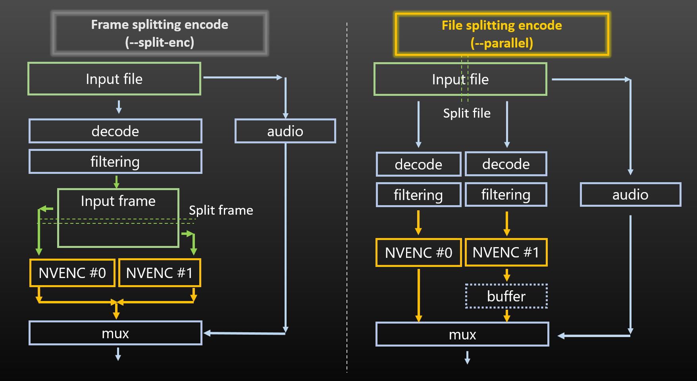


# NVEncC 选项列表

**[日本語版はこちら＞＞](./NVEncC_Options.ja.md)**

**[English version＞＞](./NVEncC_Options.en.md)**

- [NVEncC 选项列表](#nvencc-选项列表)
  - [命令行示例](#命令行示例)
    - [基本命令](#基本命令)
    - [更多示例](#更多示例)
      - [使用 hw (cuvid) 解码器](#使用-hw-cuvid-解码器)
      - [使用 hw (cuvid) 解码器(交错)](#使用-hw-cuvid-解码器交错)
      - [Avisynth 示例 (avs 和 vpy 均可通过 vfw 读取)](#avisynth-示例-avs-和-vpy-均可通过-vfw-读取)
      - [管道输入示例](#管道输入示例)
      - [从 FFmpeg 管道输入](#从-ffmpeg-管道输入)
      - [从 FFmpeg 传递视频和音频](#从-ffmpeg-传递视频和音频)
      - [向 FFmpeg 传递滤波后的结果和音频](#向-ffmpeg-传递滤波后的结果和音频)
      - [视频编码时复制所有轨道和元数据](#视频编码时复制所有轨道和元数据)
  - [选项格式](#选项格式)
  - [显示选项](#显示选项)
    - [-h, -? --help](#-h-----help)
    - [-v, --version](#-v---version)
    - [--option-list](#--option-list)
    - [--check-device](#--check-device)
    - [--check-hw \[\<int\>\]](#--check-hw-int)
    - [--check-features \[\<int\>\]](#--check-features-int)
    - [--check-preset-params](#--check-preset-params)
    - [--check-environment](#--check-environment)
    - [--check-codecs, --check-decoders, --check-encoders](#--check-codecs---check-decoders---check-encoders)
    - [--check-profiles \<string\>](#--check-profiles-string)
    - [--check-formats](#--check-formats)
    - [--check-protocols](#--check-protocols)
    - [--check-avdevices](#--check-avdevices)
    - [--check-filters](#--check-filters)
    - [--check-avversion](#--check-avversion)
  - [基本编码选项](#基本编码选项)
    - [-d, --device \<int\>](#-d---device-int)
    - [-c, --codec \<string\>](#-c---codec-string)
    - [-o, --output \<string\>](#-o---output-string)
    - [-i, --input \<string\>](#-i---input-string)
    - [--raw](#--raw)
    - [--y4m](#--y4m)
    - [--avi](#--avi)
    - [--avs](#--avs)
    - [--vpy](#--vpy)
    - [--avsw \[\<string\>\]](#--avsw-string)
    - [--avhw](#--avhw)
    - [--interlace \<string\>](#--interlace-string)
    - [--video-track \<int\>](#--video-track-int)
    - [--crop \<int\>,\<int\>,\<int\>,\<int\>](#--crop-intintintint)
    - [--frames \<int\>](#--frames-int)
    - [--fps \<int\>/\<int\> or \<float\>](#--fps-intint-or-float)
    - [--input-res \<int\>x\<int\>](#--input-res-intxint)
    - [--output-res \<int\>x\<int\>\[,\<string\>=\<string\>\]](#--output-res-intxintstringstring)
    - [--input-csp \<string\>](#--input-csp-string)
  - [编码模式选项](#编码模式选项)
    - [--qvbr  \<float\>](#--qvbr--float)
    - [--cbr \<int\>](#--cbr-int)
    - [--vbr \<int\>](#--vbr-int)
    - [--cqp \<int\> or \<int\>:\<int\>:\<int\>](#--cqp-int-or-intintint)
  - [其他适用于编码器的选项](#其他适用于编码器的选项)
    - [-u, --preset](#-u---preset)
    - [--tune \<string\>](#--tune-string)
    - [--output-depth \<int\>](#--output-depth-int)
    - [--output-csp \<string\>](#--output-csp-string)
    - [--multipass \<string\>](#--multipass-string)
    - [--lossless \[H.264/HEVC\]](#--lossless-h264hevc)
    - [--max-bitrate \<int\>](#--max-bitrate-int)
    - [--vbv-bufsize \<int\>](#--vbv-bufsize-int)
    - [--qp-init \<int\> or \<int\>:\<int\>:\<int\>](#--qp-init-int-or-intintint)
    - [--qp-min \<int\> or \<int\>:\<int\>:\<int\>](#--qp-min-int-or-intintint)
    - [--qp-max \<int\> or \<int\>:\<int\>:\<int\>](#--qp-max-int-or-intintint)
    - [--chroma-qp-offset \<int\>  \[H.264/HEVC\]](#--chroma-qp-offset-int--h264hevc)
    - [--vbr-quality \<float\>](#--vbr-quality-float)
    - [--dynamic-rc \<int\>:\<int\>:\<int\>\<int\>,\<param1\>=\<value1\>\[,\<param2\>=\<value2\>\],...](#--dynamic-rc-intintintintparam1value1param2value2)
    - [--lookahead \<int\>](#--lookahead-int)
    - [--lookahead-level \<int\>](#--lookahead-level-int)
    - [--no-i-adapt](#--no-i-adapt)
    - [--no-b-adapt](#--no-b-adapt)
    - [--strict-gop](#--strict-gop)
    - [--gop-len \<int\>](#--gop-len-int)
    - [-b, --bframes \<int\>](#-b---bframes-int)
    - [--ref \<int\>](#--ref-int)
    - [--multiref-l0 \<int\> \[H.264/HEVC\]](#--multiref-l0-int-h264hevc)
    - [--multiref-l1 \<int\> \[H.264/HEVC\]](#--multiref-l1-int-h264hevc)
    - [--weightp](#--weightp)
    - [--nonrefp](#--nonrefp)
    - [--unidirectb](#--unidirectb)
    - [--aq](#--aq)
    - [--aq-temporal](#--aq-temporal)
    - [--aq-strength \<int\>](#--aq-strength-int)
    - [--bref-mode \<string\>](#--bref-mode-string)
    - [--direct \<string\> \[H.264\]](#--direct-string-h264)
    - [--(no-)adapt-transform \[H.264\]](#--no-adapt-transform-h264)
    - [--hierarchial-p \[H.264\]](#--hierarchial-p-h264)
    - [--hierarchial-b \[H.264\]](#--hierarchial-b-h264)
    - [--temporal-layers \<int\>](#--temporal-layers-int)
    - [--mv-precision \<string\>](#--mv-precision-string)
    - [--slices \<int\> \[H.264/HEVC\]](#--slices-int-h264hevc)
    - [--cabac \[H.264\]](#--cabac-h264)
    - [--cavlc \[H.264\]](#--cavlc-h264)
    - [--bluray \[H.264\]](#--bluray-h264)
    - [--(no-)deblock \[H.264\]](#--no-deblock-h264)
    - [--cu-max \<int\> \[HEVC\]](#--cu-max-int-hevc)
    - [--cu-min \<int\> \[HEVC\]](#--cu-min-int-hevc)
    - [--alpha-bitrate-ratio \<int\> \[HEVC\]](#--alpha-bitrate-ratio-int-hevc)
    - [--alpha-channel-mode \<string\> \[HEVC\]](#--alpha-channel-mode-string-hevc)
    - [--tf-level \<int\>](#--tf-level-int)
    - [--part-size-min \<int\> \[AV1\]](#--part-size-min-int-av1)
    - [--part-size-max \<int\> \[AV1\]](#--part-size-max-int-av1)
    - [--tile-columns \<int\> \[AV1\]](#--tile-columns-int-av1)
    - [--tile-rows \<int\> \[AV1\]](#--tile-rows-int-av1)
    - [--refs-forward \<int\> \[AV1\]](#--refs-forward-int-av1)
    - [--refs-backward \<int\> \[AV1\]](#--refs-backward-int-av1)
    - [--bitstream-padding \[AV1\]](#--bitstream-padding-av1)
    - [--level \<string\>](#--level-string)
    - [--profile \<string\>](#--profile-string)
    - [--tier \<string\>  \[仅在 HEVC 下有效\]](#--tier-string--仅在-hevc-下有效)
    - [--sar \<int\>:\<int\>](#--sar-intint)
    - [--dar \<int\>:\<int\>](#--dar-intint)
    - [--colorrange \<string\>](#--colorrange-string)
    - [--videoformat \<string\>](#--videoformat-string)
    - [--colormatrix \<string\>](#--colormatrix-string)
    - [--colorprim \<string\>](#--colorprim-string)
    - [--transfer \<string\>](#--transfer-string)
    - [--chromaloc \<int\> or "auto"](#--chromaloc-int-or-auto)
    - [--max-cll \<int\>,\<int\> or "copy" \[HEVC, AV1\]](#--max-cll-intint-or-copy-hevc-av1)
    - [--master-display \<string\> or "copy" \[HEVC, AV1\]](#--master-display-string-or-copy-hevc-av1)
    - [--atc-sei \<string\> or \<int\> \[HEVC only\]](#--atc-sei-string-or-int-hevc-only)
    - [--dhdr10-info \<string\> \[HEVC, AV1\]](#--dhdr10-info-string-hevc-av1)
    - [--dhdr10-info copy \[HEVC, AV1\]](#--dhdr10-info-copy-hevc-av1)
    - [--dolby-vision-profile \<string\> \[HEVC, AV1\]](#--dolby-vision-profile-string-hevc-av1)
    - [--dolby-vision-rpu \<string\> \[HEVC, AV1\]](#--dolby-vision-rpu-string-hevc-av1)
    - [--dolby-vision-rpu copy \[HEVC, AV1\]](#--dolby-vision-rpu-copy-hevc-av1)
    - [--dolby-vision-rpu-prm \<param1\>=\<value1\>\[,\<param2\>=\<value2\>\]...](#--dolby-vision-rpu-prm-param1value1param2value2)
    - [--aud \[H.264/HEVC\]](#--aud-h264hevc)
    - [--repeat-headers](#--repeat-headers)
    - [--pic-struct \[H.264/HEVC\]](#--pic-struct-h264hevc)
    - [--split-enc \<string\>](#--split-enc-string)
    - [--ssim](#--ssim)
    - [--psnr](#--psnr)
    - [--vmaf \[\<param1\>=\<value1\>\]\[,\<param2\>=\<value2\>\],...](#--vmaf-param1value1param2value2)
    - [--vship-ssimulacra2](#--vship-ssimulacra2)
    - [--vship-butteraugli \[\<param1\>=\<value1\>\[,\<param2\>=\<value2\>\]...\]](#--vship-butteraugli-param1value1param2value2)
    - [--vship-cvvdp \[\<param1\>=\<value1\>\[,\<param2\>=\<value2\>\]...\]](#--vship-cvvdp-param1value1param2value2)
  - [输入输出 / 音频 / 字幕设置](#输入输出--音频--字幕设置)
    - [--input-analyze \<float\>](#--input-analyze-float)
    - [--input-probesize \<int\>](#--input-probesize-int)
    - [--trim \<int\>:\<int\>\[,\<int\>:\<int\>\]\[,\<int\>:\<int\>\]...](#--trim-intintintintintint)
    - [--seek \[\<int\>:\]\[\<int\>:\]\<int\>\[.\<int\>\]](#--seek-intintintint)
    - [--seekto \[\<int\>:\]\[\<int\>:\]\<int\>\[.\<int\>\]](#--seekto-intintintint)
    - [--input-format \<string\>](#--input-format-string)
    - [-f, --output-format \<string\>](#-f---output-format-string)
    - [--y4m-timestamp](#--y4m-timestamp)
    - [--video-track \<int\>](#--video-track-int-1)
    - [--video-streamid \<int\>](#--video-streamid-int)
    - [--video-tag  \<string\>](#--video-tag--string)
    - [--video-metadata \<string\> or \<string\>=\<string\>](#--video-metadata-string-or-stringstring)
    - [--avcodec-prms \<string\>](#--avcodec-prms-string)
    - [--audio-copy \[\<int/string\>;\[,\<int/string\>\]...\]](#--audio-copy-intstringintstring)
    - [--audio-codec \[\[\<int/string\>?\]\<string\>\[:\<string\>=\<string\>\[,\<string\>=\<string\>\]...\]...\]](#--audio-codec-intstringstringstringstringstringstring)
    - [--audio-encode-other-codec-only](#--audio-encode-other-codec-only)
    - [--audio-bitrate \[\<int/string\>?\]\<int\> or \[\<int/string\>?\]\<string\>:\<int\>\[,\<string\>:\<int\>\]\[,...\]](#--audio-bitrate-intstringint-or-intstringstringintstringint)
    - [--audio-quality \[\<int/string\>?\]\<int\>](#--audio-quality-intstringint)
    - [--audio-profile \[\<int/string\>?\]\<string\>](#--audio-profile-intstringstring)
    - [--audio-stream \[\<int/string\>?\]{\<string1\>}\[:\<string2\>\]](#--audio-stream-intstringstring1string2)
    - [--audio-samplerate \[\<int/string\>?\]\<int\>](#--audio-samplerate-intstringint)
    - [--audio-resampler \<string\>](#--audio-resampler-string)
    - [--audio-delay \[\<int/string\>?\]\<float\>](#--audio-delay-intstringfloat)
    - [--audio-file \[\<int/string\>?\]\[\<string\>\]\<string\>](#--audio-file-intstringstringstring)
    - [--audio-filter \[\<int/string\>?\]\<string\>](#--audio-filter-intstringstring)
    - [--audio-disposition \[\<int/string\>?\]\<string\>\[,\<string\>\]\[\]...](#--audio-disposition-intstringstringstring)
    - [--audio-metadata \[\<int/string\>?\]\<string\> or \[\<int/string\>?\]\<string\>=\<string\>](#--audio-metadata-intstringstring-or-intstringstringstring)
    - [--audio-bsf \[\<int/string\>?\]\<string\>](#--audio-bsf-intstringstring)
    - [--audio-ignore-decode-error \<int\>](#--audio-ignore-decode-error-int)
    - [--audio-source \<string\>\[:{\<int\>?}\[;\<param1\>=\<value1\>...\]/\[\]...\]](#--audio-source-stringintparam1value1)
    - [--chapter \<string\>](#--chapter-string)
    - [--chapter-copy](#--chapter-copy)
    - [--chapter-no-trim](#--chapter-no-trim)
    - [--key-on-chapter](#--key-on-chapter)
    - [--keyfile \<string\>](#--keyfile-string)
    - [--sub-source \<string\>\[:{\<int\>?}\[;\<param1\>=\<value1\>...\]/\[\]...\]](#--sub-source-stringintparam1value1)
    - [--sub-copy \[\<int/string\>;\[,\<int/string\>\]...\]](#--sub-copy-intstringintstring)
    - [--sub-codec \[\[\<int/string\>?\]\<string\>\]](#--sub-codec-intstringstring)
    - [--sub-disposition \[\<int/string\>?\]\<string\>](#--sub-disposition-intstringstring)
    - [--sub-metadata \[\<int/string\>?\]\<string\> or \[\<int/string\>?\]\<string\>=\<string\>](#--sub-metadata-intstringstring-or-intstringstringstring)
    - [--sub-bsf \[\<int/string\>?\]\<string\>](#--sub-bsf-intstringstring)
    - [--data-copy \[\<int/string\>\[,\<int/string\>\]...\]](#--data-copy-intstringintstring)
    - [--attachment-copy \[\<int\>\[,\<int\>\]...\]](#--attachment-copy-intint)
    - [--attachment-source \<string\>\[:{\<int\>?}\[;\<param1\>=\<value1\>\]...\]...](#--attachment-source-stringintparam1value1)
    - [--input-option \<string1\>:\<string2\>](#--input-option-string1string2)
    - [-m, --mux-option \<string1\>:\<string2\>](#-m---mux-option-string1string2)
    - [--metadata \<string\> or \<string\>=\<string\>](#--metadata-string-or-stringstring)
    - [--avsync \<string\>](#--avsync-string)
    - [--muxer-add-cmd](#--muxer-add-cmd)
    - [--timecode \[\<string\>\]](#--timecode-string)
    - [--tcfile-in \<string\>](#--tcfile-in-string)
    - [--timebase \<int\>/\<int\>](#--timebase-intint)
    - [--input-hevc-bsf \<string\>](#--input-hevc-bsf-string)
    - [--adapt-resolution \<int\>x\<int\>](#--adapt-resolution-intxint)
    - [--input-pixel-format \<string\>](#--input-pixel-format-string)
    - [--offset-video-dts-advance](#--offset-video-dts-advance)
    - [--allow-other-negative-pts](#--allow-other-negative-pts)
  - [Vpp 设置](#vpp-设置)
    - [Vpp 过滤顺序](#vpp-过滤顺序)
    - [--vpp-colorspace \[\<param1\>=\<value1\>\]\[,\<param2\>=\<value2\>\],...](#--vpp-colorspace-param1value1param2value2)
    - [--vpp-libplacebo-tonemapping \[\<param1\>=\<value1\>\]\[,\<param2\>=\<value2\>\],...](#--vpp-libplacebo-tonemapping-param1value1param2value2)
    - [--vpp-libplacebo-tonemapping-lut \<string\>](#--vpp-libplacebo-tonemapping-lut-string)
    - [--vpp-delogo \<string\>\[,\<param1\>=\<value1\>\]\[,\<param2\>=\<value2\>\],...](#--vpp-delogo-stringparam1value1param2value2)
    - [--vpp-rff](#--vpp-rff)
    - [--vpp-deinterlace \<string\>](#--vpp-deinterlace-string)
    - [--vpp-deint-csp \<string\>](#--vpp-deint-csp-string)
    - [--vpp-afs \[\<param1\>=\<value1\>\]\[,\<param2\>=\<value2\>\],...](#--vpp-afs-param1value1param2value2)
    - [--vpp-nnedi \[\<param1\>=\<value1\>\[,\<param2\>=\<value2\>\]...\]](#--vpp-nnedi-param1value1param2value2)
    - [--vpp-rtgmc \[\<param1\>=\<value1\>\]](#--vpp-rtgmc-param1value1)
    - [--vpp-rtgmc-bob \[\<param1\>=\<value1\>\]](#--vpp-rtgmc-bob-param1value1)
    - [--vpp-rtgmc-search-prefilter \[\<param1\>=\<value1\>\]](#--vpp-rtgmc-search-prefilter-param1value1)
    - [--vpp-rtgmc-edi \[\<param1\>=\<value1\>\]](#--vpp-rtgmc-edi-param1value1)
    - [--vpp-rtgmc-retouch \[\<param1\>=\<value1\>\]](#--vpp-rtgmc-retouch-param1value1)
    - [--vpp-rtgmc-shimmer-repair \[\<param1\>=\<value1\>\]](#--vpp-rtgmc-shimmer-repair-param1value1)
    - [--vpp-rtgmc-primitive \[\<param1\>=\<value1\>\]](#--vpp-rtgmc-primitive-param1value1)
    - [--vpp-kfm \[\<param1\>=\<value1\>\[,\<param2\>=\<value2\>\]...\]](#--vpp-kfm-param1value1param2value2)
    - [--vpp-yadif \[\<param1\>=\<value1\>\]](#--vpp-yadif-param1value1)
    - [--vpp-bwdif \[\<param1\>=\<value1\>\]](#--vpp-bwdif-param1value1)
    - [--vpp-decomb \[\<param1\>=\<value1\>\]\[,\<param2\>=\<value2\>\],...](#--vpp-decomb-param1value1param2value2)
    - [--vpp-ivtc \[\<param1\>=\<value1\>\[,\<param2\>=\<value2\>\]...\]](#--vpp-ivtc-param1value1param2value2)
    - [--vpp-decimate \[\<param1\>=\<value1\>\]\[,\<param2\>=\<value2\>\],...](#--vpp-decimate-param1value1param2value2)
    - [--vpp-mpdecimate \[\<param1\>=\<value1\>\]\[,\<param2\>=\<value2\>\],...](#--vpp-mpdecimate-param1value1param2value2)
    - [--vpp-select-every \<int\>\[,\<param1\>=\<int\>\]](#--vpp-select-every-intparam1int)
    - [--vpp-rotate \<int\>](#--vpp-rotate-int)
    - [--vpp-transform \[\<param1\>=\<value1\>\]\[,\<param2\>=\<value2\>\],...](#--vpp-transform-param1value1param2value2)
    - [--vpp-lenscorrection \[\<param1\>=\<value1\>\]\[,\<param2\>=\<value2\>\],...](#--vpp-lenscorrection-param1value1param2value2)
    - [--vpp-v360 \[\<param1\>=\<value1\>\]\[,\<param2\>=\<value2\>\],...](#--vpp-v360-param1value1param2value2)
    - [--vpp-convolution3d \[\<param1\>=\<value1\>\]\[,\<param2\>=\<value2\>\],...](#--vpp-convolution3d-param1value1param2value2)
    - [--vpp-nvvfx-denoise \[\<param1\>=\<value1\>\]\[,\<param2\>=\<value2\>\],...](#--vpp-nvvfx-denoise-param1value1param2value2)
    - [--vpp-nvvfx-framegen \[\<param1\>=\<value1\>\]\[,\<param2\>=\<value2\>\],...](#--vpp-nvvfx-framegen-param1value1param2value2)
    - [--vpp-smooth \[\<param1\>=\<value1\>\]\[,\<param2\>=\<value2\>\],...](#--vpp-smooth-param1value1param2value2)
    - [--vpp-msmooth \[\<param1\>=\<value1\>\]\[,\<param2\>=\<value2\>\],...](#--vpp-msmooth-param1value1param2value2)
    - [--vpp-denoise-dct \[\<param1\>=\<value1\>\]\[,\<param2\>=\<value2\>\],...](#--vpp-denoise-dct-param1value1param2value2)
    - [--vpp-nlmeans \[\<param1\>=\<value1\>\[,\<param2\>=\<value2\>\]...\]](#--vpp-nlmeans-param1value1param2value2)
    - [--vpp-bm3d \[\<param1\>=\<value1\>\]\[,\<param2\>=\<value2\>\],...](#--vpp-bm3d-param1value1param2value2)
    - [--vpp-fft3d \[\<param1\>=\<value1\>\]\[,\<param2\>=\<value2\>\],...](#--vpp-fft3d-param1value1param2value2)
    - [--vpp-degrain \[\<param1\>=\<value1\>\]](#--vpp-degrain-param1value1)
    - [--vpp-knn \[\<param1\>=\<value1\>\]\[,\<param2\>=\<value2\>\],...](#--vpp-knn-param1value1param2value2)
    - [--vpp-pmd \[\<param1\>=\<value1\>\]\[,\<param2\>=\<value2\>\],...](#--vpp-pmd-param1value1param2value2)
    - [--vpp-hqdn3d \[\<param1\>=\<value1\>\[,\<param2\>=\<value2\>\]...\]](#--vpp-hqdn3d-param1value1param2value2)
    - [--vpp-descale \[\<param1\>=\<value1\>\[,\<param2\>=\<value2\>\]...\]](#--vpp-descale-param1value1param2value2)
    - [--vpp-gauss \<int\>](#--vpp-gauss-int)
    - [--vpp-subburn \[\<param1\>=\<value1\>\]\[,\<param2\>=\<value2\>\],...](#--vpp-subburn-param1value1param2value2)
    - [--vpp-libplacebo-shader \[\<param1\>=\<value1\>\]\[,\<param2\>=\<value2\>\],...](#--vpp-libplacebo-shader-param1value1param2value2)
    - [--vpp-resize \<string\> or \[\<param1\>=\<value1\>\]\[,\<param2\>=\<value2\>\],...](#--vpp-resize-string-or-param1value1param2value2)
    - [--vpp-unsharp \[\<param1\>=\<value1\>\]\[,\<param2\>=\<value2\>\],...](#--vpp-unsharp-param1value1param2value2)
    - [--vpp-vinverse \[\<param1\>=\<value1\>\[,\<param2\>=\<value2\>\]...\]](#--vpp-vinverse-param1value1param2value2)
    - [--vpp-chromashift \[\<param1\>=\<value1\>\]\[,\<param2\>=\<value2\>\],...](#--vpp-chromashift-param1value1param2value2)
    - [--vpp-deblock \[\<param1\>=\<value1\>\]\[,\<param2\>=\<value2\>\],...](#--vpp-deblock-param1value1param2value2)
    - [--vpp-deflicker \[\<param1\>=\<value1\>\]\[,\<param2\>=\<value2\>\],...](#--vpp-deflicker-param1value1param2value2)
    - [--vpp-stab \[\<param1\>=\<value1\>\[,\<param2\>=\<value2\>\]...\]](#--vpp-stab-param1value1param2value2)
    - [--vpp-colorfix \[\<param1\>=\<value1\>\]\[,\<param2\>=\<value2\>\],...](#--vpp-colorfix-param1value1param2value2)
    - [--vpp-dehalo \[\<param1\>=\<value1\>\[,\<param2\>=\<value2\>\]...\]](#--vpp-dehalo-param1value1param2value2)
    - [--vpp-finedehalo \[\<param1\>=\<value1\>\[,\<param2\>=\<value2\>\]...\]](#--vpp-finedehalo-param1value1param2value2)
    - [--vpp-hqdering \[\<param1\>=\<value1\>\[,\<param2\>=\<value2\>\]...\]](#--vpp-hqdering-param1value1param2value2)
    - [--vpp-edgelevel \[\<param1\>=\<value1\>\]\[,\<param2\>=\<value2\>\],...](#--vpp-edgelevel-param1value1param2value2)
    - [--vpp-msharpen \[\<param1\>=\<value1\>\]\[,\<param2\>=\<value2\>\],...](#--vpp-msharpen-param1value1param2value2)
    - [--vpp-cas \[\<param1\>=\<value1\>\]\[,\<param2\>=\<value2\>\],...](#--vpp-cas-param1value1param2value2)
    - [--vpp-detailsharpen \[\<param1\>=\<value1\>\]\[,\<param2\>=\<value2\>\],...](#--vpp-detailsharpen-param1value1param2value2)
    - [--vpp-warpsharp \[\<param1\>=\<value1\>\]\[,\<param2\>=\<value2\>\],...](#--vpp-warpsharp-param1value1param2value2)
    - [--vpp-maa \[\<param1\>=\<value1\>\[,\<param2\>=\<value2\>\]...\]](#--vpp-maa-param1value1param2value2)
    - [--vpp-softlight \[\<param1\>=\<value1\>\]\[,\<param2\>=\<value2\>\],...](#--vpp-softlight-param1value1param2value2)
    - [--vpp-tweak \[\<param1\>=\<value1\>\]\[,\<param2\>=\<value2\>\],...](#--vpp-tweak-param1value1param2value2)
    - [--vpp-curves \[\<param1\>=\<value1\>\]\[,\<param2\>=\<value2\>\],...](#--vpp-curves-param1value1param2value2)
    - [--vpp-deband \[\<param1\>=\<value1\>\]\[,\<param2\>=\<value2\>\],...](#--vpp-deband-param1value1param2value2)
    - [--vpp-libplacebo-deband \[\<param1\>=\<value1\>\]\[,\<param2\>=\<value2\>\],...](#--vpp-libplacebo-deband-param1value1param2value2)
    - [--vpp-pad \<int\>,\<int\>,\<int\>,\<int\>](#--vpp-pad-intintintint)
    - [--vpp-overlay \[\<param1\>=\<value1\>\]\[,\<param2\>=\<value2\>\],...](#--vpp-overlay-param1value1param2value2)
    - [--vpp-ngx-truehdr \[\<param1\>=\<value1\>\]\[,\<param2\>=\<value2\>\],...](#--vpp-ngx-truehdr-param1value1param2value2)
    - [--vpp-fruc \[\<param1\>=\<value1\>\]\[,\<param2\>=\<value2\>\],...](#--vpp-fruc-param1value1param2value2)
    - [--vpp-anime4k-shader \[\<param1\>=\<value1\>\]\[,\<param2\>=\<value2\>\],...](#--vpp-anime4k-shader-param1value1param2value2)
    - [--vpp-onnx \[\<param1\>=\<value1\>\]\[,\<param2\>=\<value2\>\],...](#--vpp-onnx-param1value1param2value2)
    - [--vpp-onnx-deint \[\<param1\>=\<value1\>\]\[,\<param2\>=\<value2\>\],...](#--vpp-onnx-deint-param1value1param2value2)
    - [--vpp-onnx-model-dir \<string\>](#--vpp-onnx-model-dir-string)
    - [--vpp-onnx-cache-dir \<string\>](#--vpp-onnx-cache-dir-string)
    - [--vpp-rife-ov \[\<param1\>=\<value1\>\]\[,\<param2\>=\<value2\>\],...](#--vpp-rife-ov-param1value1param2value2)
    - [--vpp-perf-monitor](#--vpp-perf-monitor)
    - [--vpp-nvvfx-model-dir \<string\>](#--vpp-nvvfx-model-dir-string)
  - [其他设置](#其他设置)
    - [--parallel \[\<int\>\] or \[\<string\>\]](#--parallel-int-or-string)
    - [--parallel-force-large-memory-filters](#--parallel-force-large-memory-filters)
    - [--cuda-schedule \<string\>](#--cuda-schedule-string)
    - [--cuda-stream \<int\>](#--cuda-stream-int)
    - [--cuda-mt \<int\>](#--cuda-mt-int)
    - [--disable-nvml \<int\>](#--disable-nvml-int)
    - [--disable-dx11](#--disable-dx11)
    - [--output-buf \<int\>](#--output-buf-int)
    - [--output-thread \<int\>](#--output-thread-int)
    - [--log \<string\>](#--log-string)
    - [--log-level \[\<param1\>=\]\<value\>\[,\<param2\>=\<value\>\]...](#--log-level-param1valueparam2value)
    - [--log-opt \<param1\>=\<value\>\[,\<param2\>=\<value\>\]...](#--log-opt-param1valueparam2value)
    - [--log-framelist \[\<string\>\]](#--log-framelist-string)
    - [--log-packets \[\<string\>\]](#--log-packets-string)
    - [--log-mux-ts \[\<string\>\]](#--log-mux-ts-string)
    - [--thread-affinity \[\<string1\>=\]{\<string2\>\[#\<int\>\[:\<int\>\]...\] or 0x\<hex\>}](#--thread-affinity-string1string2intint-or-0xhex)
    - [--thread-priority \[\<string1\>=\]\<string2\>\[#\<int\>\[:\<int\>\]...\]](#--thread-priority-string1string2intint)
    - [--thread-throttling \[\<string1\>=\]\<string2\>\[#\<int\>\[:\<int\>\]...\]](#--thread-throttling-string1string2intint)
    - [--option-file \<string\>](#--option-file-string)
    - [--max-procfps \<int\>](#--max-procfps-int)
    - [--lowlatency](#--lowlatency)
    - [--fallback-bitdepth](#--fallback-bitdepth)
    - [--avsdll \<string\>](#--avsdll-string)
    - [--vsdir \<string\>](#--vsdir-string)
    - [--vpy-assume-script-dir](#--vpy-assume-script-dir)
    - [--process-codepage \<string\> \[仅限Windows\]](#--process-codepage-string-仅限windows)
    - [--task-perf-monitor](#--task-perf-monitor)
    - [--perf-monitor \[\<string\>\[,\<string\>\]...\]](#--perf-monitor-stringstring)
    - [--perf-monitor-interval \<int\>](#--perf-monitor-interval-int)


## 命令行示例


### 基本命令

```Batchfile
NVEncC.exe [Options] -i <filename> -o <filename>
```

### 更多示例
#### 使用 hw (cuvid) 解码器

```Batchfile
NVEncC --avhw -i "<mp4(H.264/AVC) file>" -o "<outfilename.264>"
```

#### 使用 hw (cuvid) 解码器(交错)

```Batchfile
NVEncC --avhw --interlace tff -i "<mp4(H.264/AVC) file>" -o "<outfilename.264>"
```

#### Avisynth 示例 (avs 和 vpy 均可通过 vfw 读取)

```Batchfile
NVEncC -i "<avsfile>" -o "<outfilename.264>"
```

#### 管道输入示例

```Batchfile
avs2pipemod -y4mp "<avsfile>" | NVEncC --y4m -i - -o "<outfilename.264>"
```

#### 从 FFmpeg 管道输入

```Batchfile
ffmpeg -y -i "<inputfile>" -an -pix_fmt yuv420p -f yuv4mpegpipe - | NVEncC --y4m -i - -o "<outfilename.264>"
```

#### 从 FFmpeg 传递视频和音频

--> 使用 "nut" 格式来通过管道传递视频和音频
```Batchfile
ffmpeg -y -i "<input>" <options for ffmpeg> -codec:a copy -codec:v rawvideo -pix_fmt yuv420p -f nut - | NVEncC --avsw -i - --audio-codec aac -o "<outfilename.mp4>"
```

#### 向 FFmpeg 传递滤波后的结果和音频

--> 使用 "nut" 格式来通过管道传递视频和音频
```Batchfile
NVEncC -i "<input>" <filter options> --audio-copy -c raw --output-format nut -o - | ffmpeg -y -f nut -i - <encode options for ffmpeg> -o output.mp4
```

#### 视频编码时复制所有轨道和元数据

```Batchfile
NVEncC -i "<input>" <encode options> --colormatrix auto --transfer auto --colorprim auto --chromaloc auto --max-cll copy --master-display copy --dhdr10-info copy --dolby-vision-rpu copy --video-metadata copy --audio-copy --audio-metadata copy  --sub-copy --sub-metadata copy --data-copy --attachment-copy --chapter-copy -o output.mkv
```

## 选项格式

```
-<short option name>, --<option name> <argument>

参数类型：
- none
- <int>    ... 整数
- <float>  ... 浮点数
- <string> ... 字符串

带有 [] {} 的参数是可选的。

--(no-)xxx
名为 --no-xxx 的选项将会有和 --xxx 相反的效果。
示例 1: --xxx: 启用 xxx → --no-xxx: 禁用 xxx
示例 2: --xxx: 禁用 xxx → --no-xxx: 启用 xxx
```

## 显示选项

### -h, -? --help

显示帮助

### -v, --version

显示 NVEncC 版本

### --option-list
显示选项列表

### --check-device

显示可以被 NVEnc 识别的 GPU DeviceId 和 PCI Bus ID。DeviceId 遵循 CUDA 设备顺序。

### --check-hw [&lt;int&gt;]

检测指定设备是否可以运行 NVEnc。

若DeviceID未指定则默认检查DeviceID为0的设备。

### --check-features [&lt;int&gt;]

显示指定设备可用的特性。

若DeviceID未指定则默认检查DeviceID为0的设备。

### --check-preset-params
显示 preset 和 tune 参数。需要与 --codec、--device、--preset、--tune 一起使用。

### --check-environment

显示 NVEncC 识别的环境信息

### --check-codecs, --check-decoders, --check-encoders

显示可用的音频编解码器名

### --check-profiles &lt;string&gt;

显示指定的编码器可用的音频 profile 列表

### --check-formats

显示可用的输出格式

### --check-protocols

显示可用的协议

### --check-avdevices
获取可用的设备列表(通过libavdevice)

### --check-filters

显示可用的音频滤镜

### --check-avversion

显示 ffmpeg dll 版本号

## 基本编码选项

### -d, --device &lt;int&gt;

指定 NVEnc 使用的 deviceId。deviceID 可以通过 [--check-device](#--check-device) 获得。

如果未指定，且当前环境有多个可用的GPU，则将会根据以下条件自动选择

- 设备是否支持指定的编码
- 如果启用 --avhw，检查设备是否支持硬件解码该输入文件
- 如果启用交错编码，检查设备是否硬件是否支持
- 视频引擎占用率（Video Engine Utilization）更低的设备将会被优先选择
- GPU 占用率更低的设备将被优先选择
- 更新的 GPU 将会被优先选择
- 更多核心的 GPU 将会被优先选择

视频引擎和 GPU 占用率在 x64 版本中使用 [NVML library](https://developer.nvidia.com/nvidia-management-library-nvml) 获取, 在 x86 版本中通过 执行 nvidia-smi.exe 获取。

nvidia-smi 通常与驱动一起安装在 "C:\Program Files\NVIDIA Corporation\NVSMI\nvidia-smi.exe"。


### -c, --codec &lt;string&gt;

指定输出编码
 - h264 (默认)
 - hevc
 - av1
 - raw
 - av_xxx (使用 avcodec 编码器)

使用 avcodec 编码器（av_xxx 格式）时，可以通过 ```--check-encoders``` 选项查询可用的编码器。此时只能通过 [--avcodec-prms](#--avcodec-prms-string) 选项进行参数设置。

  ```-c raw``` 将不进行编码并直接输出raw帧。raw帧的格式默认为y4m。可以通过```-f raw```指定raw帧的格式.

### -o, --output &lt;string&gt;

设置输出文件名，使用 "-" 进行管道输出。

### -i, --input &lt;string&gt;

设置输入文件名，使用 "-" 进行管道输入。

下表展示了 NVEnc 支持的读取器。当输入格式没有被指定时，将会根据输入文件后缀名确定。

**输入读取器自动选择**  

| 读取器 | 目标扩展名 |
|:---|:---|          
| Avisynth 读取器    | avs |
| VapourSynth 读取器 | vpy |
| avi 读取器         | avi |
| y4m 读取器         | y4m |
| raw 读取器         | yuv |
| avhw/avsw 读取器 | 其他 |

**读取器支持的色彩格式**  

| 读取器 | yuv420 | yuy2 | yuv422 | yuv444 | rgb24 | rgb32 |
|:---|:---:|:---:|:---:|:---:|:---:|:---:|
| raw    |   ◎   |      |   ◎   |   ◎   |       |       |
| y4m    |   ◎   |      |   ◎   |   ◎   |       |       |
| avi    |   ○   |  ○  |        |        |   ○  |   ○  |
| avs    |   ◎   |  ○  |   ◎   |   ◎   |   ○  |   ○  |
| vpy    |   ◎   |      |   ◎   |   ◎   |       |       |
| avhw   |   □   |      |        |   ◇   |       |       |
| avsw   |   ◎   |      |   ◎   |   ◎   |   ○  |   ○  |

◎ ... 支持 8bit / 9bit / 10bit / 12bit / 14bit / 16bit  
◇ ... 支持 8bit / 10bit / 12bit  
□ ... 支持 8bit / 10bit  
○ ... 只支持 8 bit  
未标记 ... 不支持  

### --raw

将输入格式指定为未处理格式（Raw）。必须指定输入分辨率和帧率。

### --y4m

将输入格式指定为 y4m (YUV4MPEG2) 。

### --avi

使用 avi 读取器读取 avi 文件。

### --avs

使用 avs 读取器读取 Avisynth 脚本文件。

NVEncC 默认使用 UTF-8 编码格式读取文件, 因此当 Avisynth 脚本文件存在非ASCII字符时，应使用UTF-8格式保存

当使用系统默认的编码格式保存的脚本时, 例如使用 ANSI,则需要添加 "[--process-codepage](#--process-codepage-string-仅限windows) os" 选项使 NVEncC 也使用操作系统的编码格式

### --vpy

使用 vpy 读取器读取 VapourSynth 脚本文件。

### --avsw [&lt;string&gt;]

使用 avformat + libavcodec 的软件解码器读取文件。可选参数用于指定要使用的解码器名称，未指定时自动选择解码器。

### --avhw

使用 avformat 和 cuvid 的硬件解码器。使用该模式可以提供最佳性能，因为该模式下整个编解码过程均在 GPU 运行。


**avhw reader 支持的编码**  

| Codecs | Status |
|:---|:---:|
| MPEG1      | ○ |
| MPEG2      | ○ |
| H.264/AVC  | ○ |
| H.265/HEVC | ○ |
| VP8        | × |
| VP9        | ○ |
| AV1        | ○ |
| VC-1       | ○ |
| WMV3/WMV9  | × |

○ ... 支持  
× ... 不支持

### --interlace &lt;string&gt;

指定 **输入** 的交错标志。

通过 [--vpp-deinterlace](#--vpp-deinterlace-string) 或 [--vpp-afs](#--vpp-afs-param1value1param2value2) 可以进行反交错。如果未指定反交错，则将会进行交错编码。

- progressive ... 逐行扫描
- tff ... 上场优先
- bff ... 下场优先
- auto ... 根据各帧自动判断 (仅使用[avhw](#--avhw)/[avsw](#--avsw-string)时有效)

### --video-track &lt;int&gt;
设置需要编码的视频轨编号。使用 avhw/avsw 读取器时有效。

 - 1 (默认)  最高分辨率视频轨
 - 2            次高分辨率视频轨
    ...
 - -1           最低分辨率视频轨
 - -2           次低分辨率视频轨
    ...

### --crop &lt;int&gt;,&lt;int&gt;,&lt;int&gt;,&lt;int&gt;
从左、上、右、下方向裁剪视频的像素数。

### --frames &lt;int&gt;
输入的帧的数量(注意，基于输入，而不是基于输出)

### --fps &lt;int&gt;/&lt;int&gt; or &lt;float&gt;
设置输入帧率，未处理格式（Raw）输入时需要。

### --input-res &lt;int&gt;x&lt;int&gt;
设置输入分辨率，未处理格式（Raw）输入时需要。

### --output-res &lt;int&gt;x&lt;int&gt;[,&lt;string&gt;=&lt;string&gt;]
设置输出分辨率。当与输入分辨率不同时，将会自动启用硬件/GPU缩放器。

未指定时将会与输入分辨率相同（不缩放）。

- **使用特殊值**
  - 0 ... 与输入保持一致
  - 宽高其中一个为负值   
    调整尺寸以适合另一侧，同时保持长宽比。将会选择一个能被该负数整除的值。

- **参数**
  - preserve_aspect_ratio=&lt;string&gt;  
    根据指定的宽度**或者**高度调整尺寸, 同时保持长宽比。
    - increase ... 在保持长宽比的同时调整为比指定分辨率大的分辨率（外接于指定分辨率）
    - decrease ... 在保持长宽比的同时调整为比指定分辨率小的分辨率（包含在指定分辨率内）
  - ignore_sar=&lt;bool&gt;  
    使用负值自动调整尺寸时，计算中忽略输入/输出的 SAR（像素长宽比）。默认=off。

- 例子
  ```
  输入分辨率为1280x720...
  --output-res 1024x576 -> 正常更改分辨率为1024x576
  --output-res 960x0    -> 更改分辨率为 960x720 (0 将用与输入相同的 720 代替)
  --output-res 1920x-2  -> 更改分辨率为 1920x1080 (计算出保持纵横比的分辨率)
  
  --output-res 1440x1440,preserve_aspect_ratio=increase -> 更改分辨率为 2560x1440
  --output-res 1440x1440,preserve_aspect_ratio=decrease -> 更改分辨率为 1440x810
  ```

### --input-csp &lt;string&gt;
为--raw 设定输入的色彩空间,默认为yv12
```
  yv12, nv12, p010, yuv420p9le, yuv420p10le, yuv420p12le, yuv420p14le, yuv420p16le
  yuv422p, yuv422p9le, yuv422p10le, yuv422p12le, yuv422p14le, yuv422p16le
  yuv444p, yuv444p9le, yuv444p10le, yuv444p12le, yuv444p14le, yuv444p16le
```

## 编码模式选项
默认选择为 QVBR （固定质量）。

### --qvbr  &lt;float&gt;
以固定质量模式编码 (0.0-51.0, AV1为0.0-63.0, 0 = 自动)

等效于 --vbr 0 --vbr-quality &lt;float&gt;.

### --cbr &lt;int&gt;
### --vbr &lt;int&gt;
设置码率，单位kbps。

### --cqp &lt;int&gt; or &lt;int&gt;:&lt;int&gt;:&lt;int&gt;
将 QP 值设定为 &lt;I 帧&gt;:&lt;P 帧&gt;:&lt;B 帧&gt;。

一般情况下，推荐将 QP 值设置为 I &lt; P &lt; B 的组合。

## 其他适用于编码器的选项

### -u, --preset
编码质量预设，P1~P7选择从API v10.0开始支持
P1为最快，P7为质量最高
- default
- performance
- quality
- P1 (= performance)
- P2
- P3
- P4 (= default)
- P5
- P6
- P7 (= quality)

### --tune &lt;string&gt;

preset 的附加调整选项。

- hq (默认)
- uhq  
  仅限 HEVC 和 AV1，需要 Turing 架构 (RTX20xx) 及更新的显卡。
- lowlatency
- ultralowlatency
- lossless  
  隐式启用 [--lossless](#--lossless-h264hevc)。

### --output-depth &lt;int&gt;
设置输出位深度。
- 8 ... 8 bits (默认)
- 10 ... 10 bits

### --output-csp &lt;string&gt;
设置输出时使用的色彩空间
- yuv420 (默认)
- yuv422
- yuv444
- rgb
- yuva420

### --multipass &lt;string&gt;
多重编码模式，只在--vbr和--cbr模式下有效。 [API v10.0 以后支持]  

在1pass模式下，编码器估计宏块所需的QP并立即编码宏块。


在2pass模式中，在1pass对整个视频进行一次编码，确定视频不同位置所需比特量的分布。在2pass中，根据其结果进行宏块的编码。这可以更适当地对不同位置设置合适的码率，特别是在CBR模式中。


- none  
  1pass模式。 (最快)

- 2pass-quarter  
  以1/4大小的分辨率进行1pass。由此，能够捕捉较大的运动矢量并传递到2pass。

- 2pass-full  
  1pass/2pass都以全分辨率进行。虽然性能下降，但可以将更详细的分析信息传递给2pass。

### --lossless [H.264/HEVC]
进行无损输出。 (默认：关)

### --max-bitrate &lt;int&gt;
最大码率，单位kbps。

### --vbv-bufsize &lt;int&gt;
设定 vbv buffer 大小 (单位为kbps)。 (默认: 自动)

### --qp-init &lt;int&gt; or &lt;int&gt;:&lt;int&gt;:&lt;int&gt;

设置初始 QP 值为 &lt;I 帧&gt;:&lt;P 帧&gt;:&lt;B 帧&gt;。CQP模式下将会被忽略。

这些值将会被在编码开始时被应用。如果希望调节视频起始段的画面质量请设置该值。在 CBR/VBR 模式下有时会不稳定。

### --qp-min &lt;int&gt; or &lt;int&gt;:&lt;int&gt;:&lt;int&gt;

设置最小 QP 值为 &lt;I 帧&gt;:&lt;P 帧&gt;:&lt;B 帧&gt;。CQP模式下将会被忽略。

可被用于限制浪费在部分静止画面的码率。

### --qp-max &lt;int&gt; or &lt;int&gt;:&lt;int&gt;:&lt;int&gt;

设置最大 QP 值为 &lt;I 帧&gt;:&lt;P 帧&gt;:&lt;B 帧&gt;。CQP模式下将会被忽略。

可用于在视频的任何部分保持一定的图像质量，即使这样做可能超过指定的码率。

### --chroma-qp-offset &lt;int&gt;  [H.264/HEVC]
色度分量的QP偏移。 (默认: 0)

### --vbr-quality &lt;float&gt;

当使用 VBR 模式时设置输出质量。 (0.0-51.0, AV1为0.0-63.0, 0 表示自动)

### --dynamic-rc &lt;int&gt;:&lt;int&gt;:&lt;int&gt;&lt;int&gt;,&lt;param1&gt;=&lt;value1&gt;[,&lt;param2&gt;=&lt;value2&gt;],...  
在指定的输入帧编号范围或显示时间戳范围内改变码率控制方法和参数。

- **范围参数**
  - `start=<int>`、`end=<int>`: 按输入帧编号选择，闭区间 `start <= 帧编号 <= end`。`start` 必须指定；省略 `end` 时选择到流结束。
  - `start-time=<float>`、`end-time=<float>`: 按显示时间戳（秒）选择，左闭右开区间 `start-time <= 时间戳 < end-time`。省略的一端表示流的开头或结尾。

  帧编号与时间戳两类范围参数不能在同一条 `--dynamic-rc` 中混用。不同的 `--dynamic-rc` 选项可以分别使用不同的范围类型；当范围重叠时，时间戳范围优先。

**必要参数**   
必须指定以下参数之一。
- [cqp](./NVEncC_Options.zh-cn.md#--cqp-int-or-intintint)=&lt;int&gt; or cqp=&lt;int&gt;:&lt;int&gt;:&lt;int&gt;  
- [cbr](./NVEncC_Options.zh-cn.md#--cbr-int)=&lt;int&gt;   
- [vbr](./NVEncC_Options.zh-cn.md#--vbr-int)=&lt;int&gt;   
- [qvbr](./NVEncC_Options.zh-cn.md#--qvbr-float)=&lt;float&gt; (0.0-51.0, AV1为0.0-63.0, 0 = 自动)

**追加参数**
- [max-bitrate](./NVEncC_Options.zh-cn.md#--max-bitrate-int)=&lt;int&gt;  
- [vbr-quality](./NVEncC_Options.zh-cn.md#--vbr-quality-float)=&lt;float&gt; (0.0-51.0, AV1为0.0-63.0, 0 表示自动)
- [multipass](./NVEncC_Options.zh-cn.md#--multipass-string)=&lt;string&gt;  

```
例1: 输入帧 3000-3999 使用vbr模式12000kbps编码、
     输入帧 5000-5999 使用固定质量29.0编码、
     其他部分使用固定质量25.0编码。
  --vbr 0 --vbr-quality=25.0 --dynamic-rc 3000:3999,vbr=12000 --dynamic-rc 5000:5999,vbr=0,vbr-quality=29.0

例2: 到输入帧 2999 为止使用vbr模式6000kbps编码、
     从输入帧 3000 开始使用vbr模式12000kbps编码。
  --vbr 6000 --dynamic-rc start=3000,vbr=12000

例3: 从显示时间戳 120.5 秒开始（含），到 210.0 秒为止（不含）使用vbr模式3000kbps编码。
  --dynamic-rc start-time=120.5,end-time=210.0,vbr=3000
```

### --lookahead &lt;int&gt;

使用 lookahead 并指定其目标范围的帧数。 (0 - 32) 

对于提高画面质量很有效，允许自适应插入 I 帧和 B帧。

### --lookahead-level &lt;int&gt;  
设置 lookahead 的级别，更高的级别可能以牺牲性能为代价提升编码效率。(0 - 3, default = 0)  
默认值取决于 [--preset](#-u---preset) 和 [--tune](#--tune-string)。

### --no-i-adapt

当 lookahead 启用时禁用自适应 I 帧插入。

### --no-b-adapt

当 lookahead 启用时禁用自适应 B 帧插入。

### --strict-gop

强制固定 GOP 长度。

### --gop-len &lt;int&gt;

设置最大 GOP 长度。当 lookahead 未启用时，将总是使用该值。
(固定 GOP，非可变)

### -b, --bframes &lt;int&gt;

设置连续 B 帧数量。

### --ref &lt;int&gt;

设置参考距离。（最大16）

### --multiref-l0 &lt;int&gt; [H.264/HEVC]  
### --multiref-l1 &lt;int&gt; [H.264/HEVC]  
设置L0和L1的最大参考帧数量(上限为7) [API v9.1以上支持]

### --weightp

启用带权 P 帧。

### --nonrefp
自动插入 non-reference P 帧。

### --unidirectb
为低延迟场景启用单向 B 帧（参考帧全部来自过去帧）。在 LowLatency/UltraLowLatency 场景下可以获得更好的压缩效率。使用普通 B 帧时该参数的值会被忽略。

### --aq

在帧内启用自适应量化（Adaptive Quantization）。（默认：关）

### --aq-temporal

在帧间启用自适应量化（Adaptive Quantization）。（默认：关）

### --aq-strength &lt;int&gt;

指定自适应量化强度（Adaptive Quantization Strength）。(1 (弱) - 15 (强), 0 = 自动)

### --bref-mode &lt;string&gt;
指定 B 帧参考模式。

- auto (默认)
- disabled
- each
  将每一 B 帧作为参考
- middle
  只有第 (B帧数量)/2 个B帧会被作为参考  
- hierarchical
  使用层次化 B 帧参考结构（AV1、NVENC API 13.1 或更高版本）

`hierarchical` 要求 `--bframes` 为 0、1、3、7、15 或 31，启用 PTD，禁用多遍编码，并将分割编码设为 `auto`（推荐）或 `disable`。前向分析必须禁用；或者同时指定 `--lookahead-level 0`、`--no-i-adapt` 和 `--no-b-adapt`。

### --direct &lt;string&gt; [H.264]

指定 H.264 B Direct 模式.
- auto (默认)
- disabled
- spatial
- temporal

### --(no-)adapt-transform [H.264]
启用（或禁用）H.264 的自适应变换模式（Adaptive Transform Mode）。

### --hierarchial-p [H.264]
启用hierarchial P帧。

### --hierarchial-b [H.264]
启用hierarchial B帧。

### --temporal-layers &lt;int&gt;  
指定用于 hierarchial（分层）编码的 temporal layers 数量。
默认值取决于 [--preset](#-u---preset) 和 [--tune](#--tune-string)。

### --mv-precision &lt;string&gt;
运动向量（Motion Vector）准确度 / 默认：自动。

- auto ... 自动
- Q-pel ... 1/4 像素精度 (高精确度)
- half-pel ... 1/2 像素精度
- full-pel ... 1 像素精度 (低精确度)


### --slices &lt;int&gt; [H.264/HEVC]
设定slices值.

### --cabac [H.264]
使用 CABAC (默认: 开)

### --cavlc [H.264]
使用 CAVLC (默认: 关)

### --bluray [H.264]
Bluray 的输出 (默认: 关)

### --(no-)deblock [H.264]
启用去色块（Deblock）滤镜。 (默认: 开)

### --cu-max &lt;int&gt; [HEVC]
### --cu-min &lt;int&gt; [HEVC]
设置最大和最小编码单元（Coding Unit, CU）大小。可以设置8、16、32。

**由于已知这些设置会降低画面质量，不推荐使用这些设置**

### --alpha-bitrate-ratio &lt;int&gt; [HEVC]
设置 alpha 通道的码率比例，可与 ```--output-csp yuva420``` 一起使用。默认值为 0（即 "auto"）。

设为 x 时，alpha 通道大约使用 "1 / (x+1)" 的码率。因此值越小，分配给 alpha 层的码率越多。

### --alpha-channel-mode &lt;string&gt; [HEVC]
设置 alpha 通道模式。(default: straight)
- straight
- premultiplied

### --tf-level &lt;int&gt;  
设置 temporal filtering（时域滤波），需要 bframes >= 4。(Default: 0)
默认值取决于 [--preset](#-u---preset) 和 [--tune](#--tune-string)。
```
  0, 4
```

### --part-size-min &lt;int&gt; [AV1]
指定亮度分量的最小编码块大小 (默认: 0 = auto)
```
  0 (auto), 4, 8, 16, 32, 64
```

### --part-size-max &lt;int&gt; [AV1]
指定亮度分量的最大编码块大小 (默认: 0 = auto)
```
  0 (auto), 4, 8, 16, 32, 64
```

### --tile-columns &lt;int&gt; [AV1]
指定列方向的tile值 (默认: 0 = auto)

```
  0 (auto), 1, 2, 4, 8, 16, 32, 64
```

### --tile-rows &lt;int&gt; [AV1]
指定行方向的tile值 (默认: 0 = auto)

```
  0 (auto), 1, 2, 4, 8, 16, 32, 64
```

### --refs-forward &lt;int&gt; [AV1]
指定用于帧预测的前向参考帧的最大数目。(默认: 0 = auto)

可在1-4之间指定(Last, Last2, last3 and Golden)。注意，并非总是遵循此值。

### --refs-backward &lt;int&gt; [AV1]
指定用于帧预测的L1列表参考帧的最大数目。(默认: 0 = auto)

可在1-3之间指定(Backward, Altref2, Altref)。注意，并非总是遵循此值。

### --bitstream-padding [AV1]
为 AV1 CBR 编码启用 bitstream padding（比特流填充）。(default: off)

### --level &lt;string&gt;

设置编码器等级（Level）。如果未指定，将会自动设置。

```
h264: auto, 1, 1 b, 1.1, 1.2, 1.3, 2, 2.1, 2.2, 3, 3.1, 3.2, 4, 4.1, 4.2, 5, 5.1, 5.2
hevc: auto, 1, 2, 2.1, 3, 3.1, 4, 4.1, 5, 5.1, 5.2, 6, 6.1, 6.2
av1 :  auto, 2, 2.1, 3, 3.1, 4, 4.1, 5, 5.1, 5.2, 5.3, 6, 6.1
```

### --profile &lt;string&gt;

设置编码器 profile。如果未指定，将会自动设置。

```
h264:  auto, baseline, main, high, high10, high422, high444
hevc:  auto, main, main10, main444
av1 :  auto, main, high
```

### --tier &lt;string&gt;  [仅在 HEVC 下有效]

设置编码器 tier。
```
hevc:  main, high
av1 :  0, 1
```

### --sar &lt;int&gt;:&lt;int&gt;

设置 SAR 比例（Pixel Aspect Ratio）。

### --dar &lt;int&gt;:&lt;int&gt;

设置 DAR 比例 (Screen Aspect Ratio)。

### --colorrange &lt;string&gt;   
"--colorrange full"与"--fullrange"相同。   
指定为"auto"时、与输入文件保持一致。(仅当使用[avhw](#--avhw)/[avsw](#--avsw-string)时有效)
```
  limited, full, auto
```

### --videoformat &lt;string&gt;   
```
  undef, ntsc, component, pal, secam, mac
```
### --colormatrix &lt;string&gt;   
指定为"auto"时、与输入文件保持一致。(仅当使用[avhw](#--avhw)/[avsw](#--avsw-string)时有效)
```
  undef, auto, bt709, smpte170m, bt470bg, smpte240m, YCgCo, fcc, GBR, bt2020nc, bt2020c
```
### --colorprim &lt;string&gt;   
指定为"auto"时、与输入文件保持一致。(仅当使用[avhw](#--avhw)/[avsw](#--avsw-string)时有效)
```
  undef, auto, bt709, smpte170m, bt470m, bt470bg, smpte240m, film, bt2020
```
### --transfer &lt;string&gt;   
指定为"auto"时、与输入文件保持一致。(仅当使用[avhw](#--avhw)/[avsw](#--avsw-string)时有效)
```
  undef, auto, bt709, smpte170m, bt470m, bt470bg, smpte240m, linear,
  log100, log316, iec61966-2-4, bt1361e, iec61966-2-1,
  bt2020-10, bt2020-12, smpte2084, smpte428, arib-std-b67
```

### --chromaloc &lt;int&gt; or "auto"
指定为"auto"时、与输入文件保持一致。(仅当使用[avhw](#--avhw)/[avsw](#--avsw-string)时有效)

为输出流设置色度位置标志（Chroma Location Flag），从0到5。
 
默认: 0 = 未指定

### --max-cll &lt;int&gt;,&lt;int&gt; or "copy" [HEVC, AV1]

设置 MaxCLL 和 MaxFall，单位nits。如设定为copy则与输入文件保持一致。(仅当使用[avhw](#--avhw)/[avsw](#--avsw-string)时有效)

注意，此选项将自动启用 [--repeat-headers](#--repeat-headers)

```
例1：--max-cll 1000,300
例2: --max-cll copy  # copy values from source
```

### --master-display &lt;string&gt; or "copy" [HEVC, AV1]

设置 Mastering display 数据。如设定为copy则与输入文件保持一致。(仅当使用[avhw](#--avhw)/[avsw](#--avsw-string)时有效)

注意，此选项将自动启用 [--repeat-headers](#--repeat-headers)

```
例1: --master-display G(13250,34500)B(7500,3000)R(34000,16000)WP(15635,16450)L(10000000,1)
例2: --master-display copy # 从输入文件复制
```

### --atc-sei &lt;string&gt; or &lt;int&gt; [HEVC only]
设置 alternative transfer characteristics SEI，使用下述字符串或整数指定。
```
  undef, auto, bt709, smpte170m, bt470m, bt470bg, smpte240m, linear,
  log100, log316, iec61966-2-4, bt1361e, iec61966-2-1,
  bt2020-10, bt2020-12, smpte2084, smpte428, arib-std-b67
```  

### --dhdr10-info &lt;string&gt; [HEVC, AV1]
从指定JSON文件导入HDR10+的动态范围信息。额外依赖[hdr10plus_gen.exe](https://github.com/rigaya/hdr10plus_gen)。

### --dhdr10-info copy [HEVC, AV1]
从输入文件复制HDR10+的动态范围信息。

使用 avhw 读取文件时，需要使用时间戳对帧进行排序，因此无法取得时间戳的raw ES等输入文件无法使用。

这种情况下请使用 avsw 读取文件。

### --dolby-vision-profile &lt;string&gt; [HEVC, AV1]
按指定的 Dolby Vision profile 输出文件。建议与 [--dolby-vision-rpu](#--dolby-vision-rpu-string-hevc-av1) 一起使用。

HEVC 的 Dolby Vision 输出会自动应用 Dolby Vision VUI 设置，并启用 `--repeat-headers`、`--aud` 和 `--pic-struct`。

"copy" 将沿用输入文件的 Dolby Vision profile（使用 [avhw](#--avhw)/[avsw](#--avsw-string) 读取器时有效）。

```
unset, copy, 5.0, 8.1, 8.2, 8.4, 10.0, 10.1, 10.2, 10.4
```

### --dolby-vision-rpu &lt;string&gt; [HEVC, AV1]
将指定文件的 Dolby Vision RPU metadata 交织输出到输出文件中。建议与 [--dolby-vision-profile](#--dolby-vision-profile-string-hevc-av1) 一起使用。

当前的 Dolby Vision 输出仅支持 BL+RPU，不支持 BL+EL 输出。

为更好地满足 Dolby Vision profile/level 的码率与 HRD 限制，请使用码率/VBV 控制的模式，并适当设置 [--max-bitrate](#--max-bitrate-int) / [--vbv-bufsize](#--vbv-bufsize-int)。`--cqp` 也可以使用，但其本身不会强制这些限制。

### --dolby-vision-rpu copy [HEVC, AV1]
将复制自 HEVC 输入文件的 Dolby Vision RPU metadata 交织输出到输出文件中。建议与 [--dolby-vision-profile](#--dolby-vision-profile-string-hevc-av1) 一起使用。

avhw 读取器的限制：该选项使用时间戳将帧从解码顺序重排为显示顺序，
因此不支持 raw ES 等没有时间戳的输入文件。这种情况请使用 avsw 读取器。

### --dolby-vision-rpu-prm &lt;param1&gt;=&lt;value1&gt;[,&lt;param2&gt;=&lt;value2&gt;]...  

设置 ```--dolby-vision-rpu``` 的参数。

- **参数**
  
  - crop=&lt;bool&gt;  
    将 active area 偏移设为 0（无遮幅黑边）。

- 例子
  ```
  例:  --dolby-vision-rpu-prm crop=true
  ```

### --aud [H.264/HEVC]
插入Access Unit Delimiter NAL。

### --repeat-headers
为每个 IDR frame输出 VPS, SPS and PPS。

### --pic-struct [H.264/HEVC]
插入 Picture Timing SEI。

### --split-enc &lt;string&gt;
- **参数**
  - auto  
    禁用split frame forced 模式，启用 auto 模式。

  - auto_forced  
    并启用split frame forced模式，由驱动自动选择最佳的strips数量

  - forced_2  
    指定使用 2-strip split frame 编码(如果NVENC数量大于1，则使用1-strip编码)

  - forced_3  
    指定使用 3-strip split frame 编码(如果NVENC数量大于2，则使用其他数量的strip编码)
    
  - disable  
    split frame 的 forced 模式和 auto 模式均禁用。

### --ssim  
计算编码结果的SSIM。

### --psnr   
计算编码结果的PSNR。

### --vmaf [&lt;param1&gt;=&lt;value1&gt;][,&lt;param2&gt;=&lt;value2&gt;],...
计算编码结果的VMAF。需要注意的是VMAF通过libvmaf在cpu上计算。这一过程很可能成为性能瓶颈，导致编码变慢。

- **参数**

  - model=&lt;string&gt;  
    设置libvmaf的内部模型版本或外部模型文件路径。默认为内部的"vmaf_v0.6.1"。

    随附的 libvmaf 3.2.0 构建中可用的内置模型名称：
    - `vmaf_v0.6.1`
    - `vmaf_b_v0.6.3`
    - `vmaf_v0.6.1neg`
    - `vmaf_4k_v0.6.1`
    - `vmaf_4k_v0.6.1neg`
    - `vmaf_v1.0.16_3d0h`
    - `vmaf_v1.0.16_3d0h_2160`
    - `vmaf_v1.0.16_5d0h`
    - `vmaf_v1.0.16_1d5h_2160`
    - `vmaf_v1.0.16_hfr_3d0h`
    - `vmaf_v1.0.16_hfr_3d0h_2160`
    - `vmaf_v1.0.16_hfr_5d0h`
    - `vmaf_v1.0.16_hfr_1d5h_2160`

    要使用外部模型文件，请从[连接](https://github.com/Netflix/vmaf/tree/master/model)下载 json 格式模型，并用此选项设定其路径。

  - threads=&lt;int&gt;  (默认: 0)  
    使用多少进程用于计算VMAF。默认使用所有物理核。

  - subsample=&lt;int&gt;  (默认: 1)  
    指定计算VMAF的帧子采样间隔。

  - phone_model=&lt;bool&gt;  (默认: false)  
    使用phone模型，这可以产生更高的vmaf
    
  - enable_transform=&lt;bool&gt;  (默认: false)  
    计算vmaf时启用transform
    

```
例子: --vmaf model=vmaf_v0.6.1
例子: --vmaf model=/path/to/vmaf_4k_v0.6.1neg.json
```

### --vship-ssimulacra2
使用Vship库计算SSIMULACRA2分数(GPU加速)。
结束时，日志会在平均值所在的同一行显示标准差、中位数、5百分位数、95百分位数、最小值和最大值。

### --vship-butteraugli [&lt;param1&gt;=&lt;value1&gt;[,&lt;param2&gt;=&lt;value2&gt;]...]
使用Vship库计算Butteraugli分数(GPU加速)。
 - **参数**
   - Qnorm=&lt;int&gt; (默认: 2)
     Butteraugli距离的归一化参数。
   - intensity_multiplier=&lt;float&gt; (默认: 80.0)
     计算的强度乘数。

### --vship-cvvdp [&lt;param1&gt;=&lt;value1&gt;[,&lt;param2&gt;=&lt;value2&gt;]...]
使用Vship库计算CVVDP(Compressed Video Visual Difference Predictor)分数(GPU加速)。
考虑帧间时间依赖性的质量指标。
 - **参数**
   - model=&lt;string&gt; (默认: standard_4k)
     显示器模型键 (例: "standard_4k", "standard_fhd")。
   - model_config_json=&lt;string&gt;
     自定义显示配置JSON文件的路径。
   - resize=&lt;bool&gt; (默认: false)
     将帧调整为模型定义的显示分辨率。

## 输入输出 / 音频 / 字幕设置 

### --input-analyze &lt;float&gt;

设置 libav 分析视频时使用的视频长度，单位为秒。默认为5秒。如果音频 / 字幕轨等没有被正确检测，尝试增加该值（如60）。

### --input-probesize &lt;int&gt;
指定libav读取时分析的最大大小(单位为byte)


### --trim &lt;int&gt;:&lt;int&gt;[,&lt;int&gt;:&lt;int&gt;][,&lt;int&gt;:&lt;int&gt;]...

只编码指定范围内的帧。

```
示例1: --trim 0:1000,2000:3000    (编码第0~1000帧和2000~3000帧)
示例2: --trim 2000:0              (编码第2000帧到最后)
```

### --seek [&lt;int&gt;:][&lt;int&gt;:]&lt;int&gt;[.&lt;int&gt;]

格式为 hh:mm:ss.ms。"hh" 或 "mm" 可以省略。转码将从这一指定的视频时间开始。

与[--trim](#--trim-intintintintintint)相比，这一设置不那么精确但更快。如果你需要精确，请使用[--trim](#--trim-intintintintintint)。

```
示例 1: --seek 0:01:15.400
示例 2: --seek 1:15.4
示例 3: --seek 75.4
```

### --seekto [&lt;int&gt;:][&lt;int&gt;:]&lt;int&gt;[.&lt;int&gt;]
格式为 hh:mm:ss.ms。"hh" 或 "mm" 可以省略。设定编码的结束时间。

这可能不够精确，所以如果需要精确的帧数进行编码，请使用[--trim](#--trim-intintintintintint)


```
示例 1: --seekto 0:01:15.400
示例 2: --seekto 1:15.4
示例 3: --seekto 75.4
```

### --input-format &lt;string&gt;
为 avhw / avsw 读取器指定输入格式。

### -f, --output-format &lt;string&gt;

- 对于常规编码器

  为混流器指定输出格式。

由于输出格式可以通过输出文件的扩展名自动确定，通常情况下无需指定，但你可以使用该选项强行指定输出格式。

### --y4m-timestamp
在 y4m 每一行 FRAME 字段后追加相对于流起点的显示时间戳 `Xts=<seconds>` 和帧持续时间 `Xdur=<seconds>`。无法取得持续时间时省略 `Xdur`。同时在 y4m 文件头写入 `XTIMEBASE=<num>:<den>`。输入中带有此标记时，该流将按照指定的 timebase 作为 VFR（可变帧率）处理。
此选项仅在与 `-c raw --output-format y4m` 一起使用时有效。

  可用的格式可以通过[--check-formats](#--check-formats)查询。要将 H.264 / HEVC 输出为 Elementary Stream 时，请指定 "raw"。

- 对于 raw 输出 (使用```-c raw```)

  指定输出格式为raw帧

  - 参数
    - y4m (默认)
    - raw

### --video-track &lt;int&gt;

选择要编码的视频轨道。仅在使用avsw/avhw reader时有效。

 - 1 (默认)  最高分辨率的视频轨道
 - 2            第二高分辨率的视频轨道
    ...
 - -1           最低分辨率的视频轨道
 - -2           第二低分辨率的视频轨道
    ...
    
### --video-streamid &lt;int&gt;
使用stream id选择要编码的视频轨道。

### --video-tag  &lt;string&gt;
指定视频标签。
```
 -o test.mp4 -c hevc --video-tag hvc1
```

### --video-metadata &lt;string&gt; or &lt;string&gt;=&lt;string&gt;
设定视频轨道的metadata
  - copy  ... 如果可行，从输入复制metadata
  - clear ... 不复制metadata (默认)


```
例1: 从输入文件复制metadata
--video-metadata 1?copy
  
例2: 清空输入文件的metadata
--video-metadata 1?clear
  
例3: 设定metadata
--video-metadata 1?title="video title" --video-metadata 1?language=jpn
 ```

### --avcodec-prms &lt;string&gt;
以 key=value 格式（逗号分隔）设置 avcodec 视频编码器的参数。
仅当通过 `-c av_xxx`（如 `-c av_libsvtav1`、`-c av_libvvenc`、`-c av_libvpx-vp9`）启用 avcodec 编码器时可用。

- 例子
  ```
  例1: 为 libsvtav1 设置 preset 和 CRF
  -c av_libsvtav1 --avcodec-prms "preset=6,crf=30,svtav1-params=enable-variance-boost=1:variance-boost-strength=2"
  
  例2: 为 libvvenc 设置质量与线程数
  -c av_libvvenc --avcodec-prms qp=28,preset=medium,threads=4
  
  例3: 为 libvpx-vp9 设置参数
  -c av_libvpx-vp9 --avcodec-prms crf=30,b=0,cpu-used=2
  ```

### --audio-copy [&lt;int/string&gt;;[,&lt;int/string&gt;]...]

将音频轨复制到输出文件。仅当使用 avhw / avsw 读取器时有效。

如果工作异常，尝试使用[--audio-codec](#--audio-codec-intstringstringstringstringstringstring)编码音频，它更加稳定。

你也可以使用 [&lt;int&gt;] 指定要抽取的音频轨（1, 2, ...），或使用 [&lt;string&gt;] 按语言选择要复制的音频轨。
在轨道编号前加 `!` 前缀可以排除该轨道（例如 `!1,!3`）。
在语言前加 `!` 前缀表示复制除这些语言以外的全部轨道（例如 `!eng,!jpn`）。

```
示例: 复制全部音频轨
--audio-copy

示例: 抽取并复制#1和#2音频轨
--audio-copy 1,2

示例: 抽取并复制标记为英语和日语的音频轨
--audio-copy eng,jpn

示例: 复制除 #1 以外的全部音频轨
--audio-copy !1
```

### --audio-codec [[&lt;int/string&gt;?]&lt;string&gt;[:&lt;string&gt;=&lt;string&gt;[,&lt;string&gt;=&lt;string&gt;]...]...]

使用指定的编码器编码音频轨。如果没有设定编码器，将会自动使用最合适的编码器。可用的编码器可以通过[--check-encoders](#--check-codecs---check-decoders---check-encoders)查询。

你也可以使用[&lt;int&gt;]选择要抽取的音频轨（1,2,...），或者使用[&lt;string&gt;]选择对应语言的音频轨。
在轨道编号前加 `!` 前缀可以排除该轨道（例如 `--audio-codec !1,!3?aac`）。
在语言前加 `!` 前缀表示编码除这些语言以外的全部轨道（例如 `--audio-codec !eng,!jpn?copy`）。

你可以在":"后指定编码器参数，在"#"后指定解码器参数。
```
示例 1: 把所有音频轨编码为mp3
--audio-codec libmp3lame

示例 2: 把第二根音频轨编码为aac
--audio-codec 2?aac

示例 3: 将英语音频轨道编码为aac
--audio-codec eng?aac
  
示例 4: 将英语和汉语音频轨道编码为aac
--audio-codec eng?aac --audio-codec chs?aac

示例 5: 除 #1 以外的全部音频轨编码为aac
--audio-codec !1?aac

示例 6: 为 "aac_coder" 添加 "twoloop" 参数可以提升低码率下的音频质量。
--audio-codec aac:aac_coder=twoloop
```

### --audio-encode-other-codec-only
与 `--audio-codec` 一起使用时，如果输入音频的编码格式与 `--audio-codec` 指定的相同，则直接复制音频（相当于 `--audio-copy`）；仅当编码格式不同时才执行编码。

- 例子
  ```
  例: 输入为 AAC 时复制，否则编码为 AAC
  --audio-codec aac --audio-encode-other-codec-only
  ```

### --audio-bitrate [&lt;int/string&gt;?]&lt;int&gt; or [&lt;int/string&gt;?]&lt;string&gt;:&lt;int&gt;[,&lt;string&gt;:&lt;int&gt;][,...]
指定音频编码的码率，单位为 kbps。

可以在 ```?``` 之前使用 [&lt;int&gt;] 选择音频轨（1, 2, ...），或使用 [&lt;string&gt;] 按语言选择音频轨。

在 ```?``` 之后使用 [&lt;string&gt;] 指定声道布局（符号见下表），可以为不同的声道布局设置不同的码率。

```
mono, stereo, 2.1, 3.0, 3.0(back), 3.1, 4.0, quad, quad(side), 5.0, 5.1, 6.0, 6.0(front), hexagonal, 6.1, 6.1(front), 7.0, 7.0(front), 7.1, 7.1(wide)
```

```
示例 1: --audio-bitrate 192 (设置音频轨码率为 192kbps)
示例 2: --audio-bitrate 1?320 --audio-bitrate 2?256 (第 1 根音频轨设为 320kbps，第 2 根音频轨设为 256kbps)
示例 3: --audio-bitrate stereo:256,5.1:640 (立体声以 256kbps、5.1ch 以 640kbps 转换)
```

### --audio-quality [&lt;int/string&gt;?]&lt;int&gt;
指定音频编码时的质量。取值取决于所使用的编码器。

你可以使用[&lt;int&gt;]选择对应的音频轨（1,2,...），或者使用[&lt;string&gt;]选择对应语言的音频轨。

### --audio-profile [&lt;int/string&gt;?]&lt;string&gt;
指定音频编码器的profile。

你可以使用[&lt;int&gt;]选择对应的音频轨（1,2,...），或者使用[&lt;string&gt;]选择对应语言的音频轨。

### --audio-stream [&lt;int/string&gt;?]{&lt;string1&gt;}[:&lt;string2&gt;]

分离或合并音频声道。

该选项指定的音频轨将总是被编码（不能使用复制）。

使用半角逗号（","）分隔，你可以给同一输入音频轨生成多个输出音频轨。

**格式**

使用&lt;int&gt;指定要处理的轨道。

使用&lt;string1&gt;指定要使用的声道，如果不指定，则使用全部输入声道。

使用&lt;string2&gt;指定输出声道格式。如果不指定，&lt;string1&gt;指定的全部声道将会被使用。

```
示例 1: --audio-stream FR,FL
把双声道音频轨的左声道和右声道分离到两个单声道音频轨。

示例 2: --audio-stream :stereo
把任何音频轨转换为立体声。

示例 3: --audio-stream 2?5.1,5.1:stereo
把输入文件的第二根5.1ch音频轨编码为5.1ch，另一个立体声下混（downmixed）音频轨道将从同一源音频轨道生成。
```

**可用符号**
```
mono       = FC
stereo     = FL + FR
2.1        = FL + FR + LFE
3.0        = FL + FR + FC
3.0(back)  = FL + FR + BC
3.1        = FL + FR + FC + LFE
4.0        = FL + FR
4.0        = FL + FR + FC + BC
quad       = FL + FR + BL + BR
quad(side) = FL + FR + SL + SR
5.0        = FL + FR + FC + SL + SR
5.1        = FL + FR + FC + LFE + SL + SR
6.0        = FL + FR + FC + BC + SL + SR
6.0(front) = FL + FR + FLC + FRC + SL + SR
hexagonal  = FL + FR + FC + BL + BR + BC
6.1        = FL + FR + FC + LFE + BC + SL + SR
6.1(front) = FL + FR + LFE + FLC + FRC + SL + SR
7.0        = FL + FR + FC + BL + BR + SL + SR
7.0(front) = FL + FR + FC + FLC + FRC + SL + SR
7.1        = FL + FR + FC + LFE + BL + BR + SL + SR
7.1(wide)  = FL + FR + FC + LFE + FLC + FRC + SL + SR
```

### --audio-samplerate [&lt;int/string&gt;?]&lt;int&gt;

设定音频采样率，单位Hz。

你可以使用[&lt;int&gt;]选择对应的音频轨（1,2,...），或者使用[&lt;string&gt;]选择对应语言的音频轨。

```
示例 1: --audio-bitrate 44100 (把音频转换为 44100Hz)
示例 2: --audio-bitrate 2?22050 (把第二根音频轨的音频转换为 22050Hz)
```

### --audio-resampler &lt;string&gt;

指定用于混合音频声道和采样率转换的引擎。

- swr ... swresampler (默认)
- soxr ... sox 重采样器 (libsoxr)

### --audio-delay [&lt;int/string&gt;?]&lt;float&gt; 
设置音频延迟，单位ms。

你可以使用[&lt;int&gt;]选择对应的音频轨（1,2,...），或者使用[&lt;string&gt;]选择对应语言的音频轨。

### --audio-file [&lt;int/string&gt;?][&lt;string&gt;]&lt;string&gt;

把音频轨抽取到指定的路径。输出格式由输出文件后缀名自动确定。仅当使用 avhw / avsw 读取器时有效。

你可以使用[&lt;int&gt;]选择对应的音频轨（1,2,...），或者使用[&lt;string&gt;]选择对应语言的音频轨。

```
示例: 把第二根音频轨的音频抽取到"test_out2.aac"
--audio-file 2?"test_out2.aac"
```

[&lt;string&gt;] 允许你指定输出格式.
```
示例: 不带后缀名的情况下以 adts 格式输出
--audio-file 2?adts:"test_out2"  
```

### --audio-filter [&lt;int/string&gt;?]&lt;string&gt;

为音频轨应用滤镜。滤镜可以到[link](https://ffmpeg.org/ffmpeg-filters.html#Audio-Filters)选择。

你可以使用[&lt;int&gt;]选择要应用滤镜的音频轨（1, 2, ...），或者使用[&lt;string&gt;]按语言选择音频轨。

```
示例 1: --audio-filter volume=0.2  (降低音量)
示例 2: --audio-filter 2?volume=-4dB (降低第二根音频轨的音量)
```

### --audio-disposition [&lt;int/string&gt;?]&lt;string&gt;[,&lt;string&gt;][]...
为指定的音频轨设置 disposition（轨道属性标记）。

你可以使用[&lt;int&gt;]选择对应的音频轨（1,2,...），或者使用[&lt;string&gt;]选择对应语言的音频轨。

- 可设置的 disposition 列表
  ```
  default
  dub
  original
  comment
  lyrics
  karaoke
  forced
  hearing_impaired
  visual_impaired
  clean_effects
  attached_pic
  captions
  descriptions
  dependent
  metadata
  copy
  ```

```
例子:
--audio-disposition 2?default,forced
```

### --audio-metadata [&lt;int/string&gt;?]&lt;string&gt; or [&lt;int/string&gt;?]&lt;string&gt;=&lt;string&gt;

设定音频轨道的metadata
  - copy  ... 如果可行，从输入复制metadata (默认)
  - clear ... 不复制metadata

你可以使用[&lt;int&gt;]选择对应的音频轨（1,2,...），或者使用[&lt;string&gt;]选择对应语言的音频轨。

```
例子 1: 从输入文件复制metadata
--audio-metadata 1?copy
  
例子 2: 清空输入文件的metadata
--audio-metadata 1?clear
  
例子 3: 设定metadata
--audio-metadata 1?title="audio title" --audio-metadata 1?language=jpn
```

### --audio-bsf [&lt;int/string&gt;?]&lt;string&gt;
将[bitstream filter](https://ffmpeg.org/ffmpeg-bitstream-filters.html)应用于音频轨道。

### --audio-ignore-decode-error &lt;int&gt;

忽略持续的音频解码错误，在阈值允许范围内继续转码。无法被正确的解码的音频部分将会使用空白音频替代。

默认值为10。
```
Example1: 五个连续音频解码错误后退出转码
--audio-ignore-decode-error 5

Example2: 任何解码错误后退出转码
--audio-ignore-decode-error 0
```

### --audio-source &lt;string&gt;[:{&lt;int&gt;?}[;&lt;param1&gt;=&lt;value1&gt;...]/[]...]

混流指定的外部音频文件。

- **文件参数**
  - format=&lt;string&gt;  
    指定输入文件的格式。

  - input_opt=&lt;string&gt;  
    指定输入文件的选项。

**轨道参数**

  - copy  
    直接复制音频轨。

  - codec=&lt;string&gt;  
    使用指定编码器编码音频轨。

  - profile=&lt;string&gt;  
    指定编码音频时使用的profile。

  - bitrate=&lt;int&gt;  
    指定音频编码时使用的码率，单位kbps。

  - samplerate=&lt;int&gt;  
    指定音频编码时使用的采样率，单位Hz。

  - delay=&lt;int&gt;  
    指定音频延迟 (单位为毫秒)。
  
  - dec_prm=&lt;string&gt;  
    指定音频解码参数。

  - enc_prm=&lt;string&gt;  
    指定音频编码参数。

  - filter=&lt;string&gt;  
    指定音频编码滤镜。

  - disposition=&lt;string&gt;  
    指定默认音频。
    
  - metadata=&lt;string1&gt;=&lt;string2&gt;  
    指定音频轨道的metadata。
    
  - bsf=&lt;string&gt;  
    指定用于音频轨道的bitstream过滤器。

```
例1: --audio-source "<audio_file>:copy"
例2: --audio-source "<audio_file>:codec=aac"
例3: --audio-source "<audio_file>:1?codec=aac;bitrate=256/2?codec=aac;bitrate=192;metadata=language=chs;disposition=default,forced"
例4: --audio-source "hw:1:format=alsa/codec=aac;bitrate=256"
```

### --chapter &lt;string&gt;

使用章节文件设置章节信息。章节文件可以是 nero、apple 或 matroska 格式。无法与 --chapter-copy 同时使用。


nero格式
```
CHAPTER01=00:00:39.706
CHAPTER01NAME=chapter-1
CHAPTER02=00:01:09.703
CHAPTER02NAME=chapter-2
CHAPTER03=00:01:28.288
CHAPTER03NAME=chapter-3
```

apple格式 (utf-8)
```
<?xml version="1.0" encoding="UTF-8" ?>
  <TextStream version="1.1">
   <TextStreamHeader>
    <TextSampleDescription>
    </TextSampleDescription>
  </TextStreamHeader>
  <TextSample sampleTime="00:00:39.706">chapter-1</TextSample>
  <TextSample sampleTime="00:01:09.703">chapter-2</TextSample>
  <TextSample sampleTime="00:01:28.288">chapter-3</TextSample>
  <TextSample sampleTime="00:01:28.289" text="" />
</TextStream>
```

matroska格式 (utf-8)

[其他例子](https://github.com/nmaier/mkvtoolnix/blob/master/examples/example-chapters-1.xml)
```
<?xml version="1.0" encoding="UTF-8"?>
<Chapters>
  <EditionEntry>
    <ChapterAtom>
      <ChapterTimeStart>00:00:00.000</ChapterTimeStart>
      <ChapterDisplay>
        <ChapterString>chapter-0</ChapterString>
      </ChapterDisplay>
    </ChapterAtom>
    <ChapterAtom>
      <ChapterTimeStart>00:00:39.706</ChapterTimeStart>
      <ChapterDisplay>
        <ChapterString>chapter-1</ChapterString>
      </ChapterDisplay>
    </ChapterAtom>
    <ChapterAtom>
      <ChapterTimeStart>00:01:09.703</ChapterTimeStart>
      <ChapterDisplay>
        <ChapterString>chapter-2</ChapterString>
      </ChapterDisplay>
    </ChapterAtom>
    <ChapterAtom>
      <ChapterTimeStart>00:01:28.288</ChapterTimeStart>
      <ChapterTimeEnd>00:01:28.289</ChapterTimeEnd>
      <ChapterDisplay>
        <ChapterString>chapter-3</ChapterString>
      </ChapterDisplay>
    </ChapterAtom>
  </EditionEntry>
</Chapters>
```

### --chapter-copy

从输入文件复制章节信息。

### --chapter-no-trim

读取章节时不应用--trim

### --key-on-chapter

在章节分割处设置关键帧。

### --keyfile &lt;string&gt;

由文件指定关键帧位置（从0,1,2,...起）。文件应一行一个帧序号。

### --sub-source &lt;string&gt;[:{&lt;int&gt;?}[;&lt;param1&gt;=&lt;value1&gt;...]/[]...]
读取指定字幕文件并混流。

- **文件参数**
  - format=&lt;string&gt;  
    指定输入文件的格式。

  - input_opt=&lt;string&gt;  
    指定输入文件的选项。

- **轨道参数**
  - disposition=&lt;string&gt;  
    设置默认字幕
    
  - metadata=&lt;string1&gt;=&lt;string2&gt;  
    指定字幕轨的metadata

    
  - bsf=&lt;string&gt;  
    指定用于字幕轨的bitstream过滤器。
  
```
例1: --sub-source "<sub_file>"
例2: --sub-source "<sub_file>:disposition=default,forced;metadata=language=chs"
  ```

### --sub-copy [&lt;int/string&gt;;[,&lt;int/string&gt;]...]

从输入文件复制字幕轨。仅当使用 avhw / avsw 读取器时有效。

你也可以使用 [&lt;int&gt;] 指定要抽取的字幕轨（1, 2, ...），或使用 [&lt;string&gt;] 按语言选择要复制的字幕轨。
在轨道编号前加 `!` 前缀可以排除该轨道（例如 `!1,!3`）。
在语言前加 `!` 前缀表示复制除这些语言以外的全部轨道（例如 `!eng,!jpn`）。

支持 PGS / srt / txt / ttxt 格式字幕。

```
示例1: 复制所有字幕轨
--sub-copy
示例2: 复制第一、第二根字幕轨
--sub-copy 1,2
示例3: 复制标记了英语和汉语的字幕轨
--sub-copy eng,chs
示例4: 复制除 #1 以外的全部字幕轨
--sub-copy !1
```

### --sub-codec [[&lt;int/string&gt;?]&lt;string&gt;]
将字幕轨转换为指定的编码格式。可以用轨道编号或语言选择字幕轨，在选择符前加 `!` 前缀表示排除。

- 例子
  ```
  例: 将除 #1 以外的全部字幕轨转换为 ass
  --sub-codec !1?ass
  ```

### --sub-disposition [&lt;int/string&gt;?]&lt;string&gt;
为指定的字幕轨设置 disposition（轨道属性标记）

- 可用于设置默认倾向的参数列表
  ```
   default
   dub
   original
   comment
   lyrics
   karaoke
   forced
   hearing_impaired
   visual_impaired
   clean_effects
   attached_pic
   captions
   descriptions
   dependent
   metadata
   copy
  ```


### --sub-metadata [&lt;int/string&gt;?]&lt;string&gt; or [&lt;int/string&gt;?]&lt;string&gt;=&lt;string&gt;
指定字幕轨的metadata
  - copy  ... 如果可行，从输入复制metadata (默认)
  - clear ... 不复制metadata

```
例1: 从输入文件复制metadata
--sub-metadata 1?copy
  
例2: 清空输入文件的metadata
--sub-metadata 1?clear
  
例3: 设定metadata
--sub-metadata 1?title="subtitle title" --sub-metadata 1?language=jpn
```

### --sub-bsf [&lt;int/string&gt;?]&lt;string&gt;
将[bitstream filter](https://ffmpeg.org/ffmpeg-bitstream-filters.html)应用于字幕轨。

### --data-copy [&lt;int/string&gt;[,&lt;int/string&gt;]...]   
复制 Data 流，使用avhw/avsw时有效。
可用轨道编号或语言选择 Data 流。在选择符前加 `!` 前缀表示排除对应的轨道编号或语言（例如 `!1,!3` 或 `!eng,!jpn`）。

### --attachment-copy [&lt;int&gt;[,&lt;int&gt;]...]   
复制输入文件的附加文件流，使用avhw/avsw时有效。

### --attachment-source &lt;string&gt;[:{&lt;int&gt;?}[;&lt;param1&gt;=&lt;value1&gt;]...]...
从指定文件读取为附加文件并混流。
- **参数** 
  - metadata=&lt;string1&gt;=&lt;string2&gt;  
    指定附加文件的metadata，必须要设定mimetype
  
```
例1: --attachment-source <png_file>:metadata=mimetype=image/png
例2: --attachment-source <font_file>:metadata=mimetype=application/x-truetype-font
```


### --input-option &lt;string1&gt;:&lt;string2&gt;   
使用 avsw/avhw 读取视频时透传的参数。&lt;string1&gt;为参数名，&lt;string2&gt;为参数值。

```
示例: 读取BD的Playlist 1
-i bluray:D:\ --input-option playlist:1
```

### -m, --mux-option &lt;string1&gt;:&lt;string2&gt;

为混流器传递附加参数。用&lt;string1&gt;指定参数名，用&lt;string2&gt;指定参数值。

```
示例: 输出 HLS
-i <input> -o test.m3u8 -f hls -m hls_time:5 -m hls_segment_filename:test_%03d.ts --gop-len 30

示例: 在没有设定为“default”的字幕轨的情况下，抑制自动赋予"default"（仅mkv）
  -m default_mode:infer_no_subs
```

### --metadata &lt;string&gt; or &lt;string&gt;=&lt;string&gt;
为输出文件设定全局metadata
  - copy  ... 如果可行，从输入复制metadata (默认)
  - clear ... 不复制metadata

```
例1: 从输入文件复制metadata
--metadata copy
  
例2: 清空输入文件的metadata
--metadata clear
  
例3: 设定metadata
--metadata title="video title" --metadata language=jpn
```

### --avsync &lt;string&gt;
  - auto (默认)  

  - forcecfr  
    检查输入文件的PTS（Presentation Time Stamp），重复或者移除帧来保持固定帧率，以维持与音频的同步。无法和 --trim 一起使用。

  - vfr  
    遵循输入文件的时间戳并启用可变帧率输出。仅当使用 avsw/avhw 读取器时有效。无法和 --trim 一起使用。

### --muxer-add-cmd
将输入命令行参数追加到混流器 metadata 的 `encoding_tool` 中。

### --timecode [&lt;string&gt;]  
将时间码文件保存到指定路径，如果未设置路径，将保存为"&lt;output file path&gt;.timecode.txt"。


### --tcfile-in &lt;string&gt;  
读取timecode文件从而设置输入帧的时间戳，适用于avhw以外的读取器

### --timebase &lt;int&gt;/&lt;int&gt;  
设定时间刻度。也用于读取timecode文件时的时间刻度。

### --input-hevc-bsf &lt;string&gt;  
对于硬件解码器的输入，切换hevc bitstream过滤器。(用于调试目的)

- 参数

  - internal  
    使用内部实现。 (默认)

  - libavcodec  
    使用 hevc_mp4toannexb bitstream 过滤器.

### --adapt-resolution &lt;int&gt;x&lt;int&gt;
指定允许中途变更分辨率的最大分辨率。

对于 avhw，这设定了 CUVID 解码器的最大分辨率；对于 avsw，这设定了输入表面的分配尺寸。该值必须不小于最初的输入分辨率。未指定时，以容器声明的输入分辨率作为上限。

上限越大，解码/输入表面占用的内存越多。

### --input-pixel-format &lt;string&gt;
为输入 avdevice 设置 "pixel_format"（不适用于其他场景）。

### --offset-video-dts-advance  
通过偏移时间戳来消除 B 帧延迟。

### --allow-other-negative-pts  
允许语音字幕有着负timestamp。原则上只用于调试。

## Vpp 设置

用于在编码前添加过滤的选项。

### Vpp 过滤顺序

vpp过滤器的应用顺序是固定的，与命令行的顺序无关，将按以下顺序应用:

- [--vpp-deinterlace](#--vpp-deinterlace-string)
- [--vpp-colorspace](#--vpp-colorspace-param1value1param2value2)
- [--vpp-libplacebo-tonemapping](#--vpp-libplacebo-tonemapping-param1value1param2value2)
- [--vpp-rff](#--vpp-rff)
- [--vpp-delogo](#--vpp-delogo-stringparam1value1param2value2)
- [--vpp-afs](#--vpp-afs-param1value1param2value2)
- [--vpp-nnedi](#--vpp-nnedi-param1value1param2value2)
- [--vpp-rtgmc](#--vpp-rtgmc-param1value1)
- [--vpp-kfm](#--vpp-kfm-param1value1param2value2)
- [--vpp-rtgmc-bob](#--vpp-rtgmc-bob-param1value1)
- [--vpp-rtgmc-search-prefilter](#--vpp-rtgmc-search-prefilter-param1value1)
- [--vpp-rtgmc-edi](#--vpp-rtgmc-edi-param1value1)
- [--vpp-degrain](#--vpp-degrain-param1value1) (`mode=analyze`)
- [--vpp-yadif](#--vpp-yadif-param1value1)
- [--vpp-bwdif](#--vpp-bwdif-param1value1)
- [--vpp-decomb](#--vpp-decomb-param1value1param2value2)
- [--vpp-ivtc](#--vpp-ivtc-param1value1param2value2)
- [--vpp-decimate](#--vpp-decimate-param1value1param2value2)
- [--vpp-mpdecimate](#--vpp-mpdecimate-param1value1param2value2)
- [--vpp-select-every](#--vpp-select-every-intparam1int)
- [--vpp-transform/rotate](#--vpp-rotate-int)
- [--vpp-convolution3d](#--vpp-convolution3d-param1value1param2value2)
- [--vpp-nvvfx-denoise](#--vpp-nvvfx-denoise-param1value1param2value2)
- [--vpp-nvvfx-framegen](#--vpp-nvvfx-framegen-param1value1param2value2)
- [--vpp-smooth](#--vpp-smooth-param1value1param2value2)
- [--vpp-denoise-dct](#--vpp-denoise-dct-param1value1param2value2)
- [--vpp-bm3d](#--vpp-bm3d-param1value1param2value2)
- [--vpp-fft3d](#--vpp-fft3d-param1value1param2value2)
- [--vpp-knn](#--vpp-knn-param1value1param2value2)
- [--vpp-nlmeans](#--vpp-nlmeans-param1value1param2value2)
- [--vpp-pmd](#--vpp-pmd-param1value1param2value2)
- [--vpp-hqdn3d](#--vpp-hqdn3d-param1value1param2value2)
- [--vpp-descale](#--vpp-descale-param1value1param2value2)
- [--vpp-degrain](#--vpp-degrain-param1value1) (`mode=degrain` / `tr=1,2`)
- [--vpp-rtgmc-shimmer-repair](#--vpp-rtgmc-shimmer-repair-param1value1) (`stage=rep1/rep2`)
- [--vpp-rtgmc-retouch](#--vpp-rtgmc-retouch-param1value1)
- [--vpp-rtgmc-primitive](#--vpp-rtgmc-primitive-param1value1)
- [--vpp-gauss](#--vpp-gauss-int)
- [--vpp-subburn](#--vpp-subburn-param1value1param2value2)
- [--vpp-libplacebo-shader](#--vpp-libplacebo-shader-param1value1param2value2)
- [--vpp-resize](#--vpp-resize-string-or-param1value1param2value2)
- [--vpp-unsharp](#--vpp-unsharp-param1value1param2value2)
- [--vpp-vinverse](#--vpp-vinverse-param1value1param2value2)
- [--vpp-chromashift](#--vpp-chromashift-param1value1param2value2)
- [--vpp-deblock](#--vpp-deblock-param1value1param2value2)
- [--vpp-deflicker](#--vpp-deflicker-param1value1param2value2)
- [--vpp-stab](#--vpp-stab-param1value1param2value2)
- [--vpp-colorfix](#--vpp-colorfix-param1value1param2value2)
- [--vpp-dehalo](#--vpp-dehalo-param1value1param2value2)
- [--vpp-finedehalo](#--vpp-finedehalo-param1value1param2value2)
- [--vpp-hqdering](#--vpp-hqdering-param1value1param2value2)
- [--vpp-edgelevel](#--vpp-edgelevel-param1value1param2value2)
- [--vpp-cas](#--vpp-cas-param1value1param2value2)
- [--vpp-detailsharpen](#--vpp-detailsharpen-param1value1param2value2)
- [--vpp-warpsharp](#--vpp-warpsharp-param1value1param2value2)
- [--vpp-maa](#--vpp-maa-param1value1param2value2)
- [--vpp-curves](#--vpp-curves-param1value1param2value2)
- [--vpp-softlight](#--vpp-softlight-param1value1param2value2)
- [--vpp-tweak](#--vpp-tweak-param1value1param2value2)
- [--vpp-deband](#--vpp-deband-param1value1param2value2)
- [--vpp-libplacebo-deband](#--vpp-libplacebo-deband-param1value1param2value2)
- [--vpp-padding](#--vpp-pad-intintintint)
- [--vpp-overlay](#--vpp-overlay-param1value1param2value2)
- [--vpp-ngx-truehdr](#--vpp-ngx-truehdr-param1value1param2value2)
- [--vpp-fruc](#--vpp-fruc-param1value1param2value2)
- [--vpp-anime4k-shader](#--vpp-anime4k-shader-param1value1param2value2)
- [--vpp-onnx](#--vpp-onnx-param1value1param2value2)
- [--vpp-onnx-deint](#--vpp-onnx-deint-param1value1param2value2)
- [--vpp-onnx-model-dir](#--vpp-onnx-model-dir-string)
- [--vpp-onnx-cache-dir](#--vpp-onnx-cache-dir-string)
- [--vpp-rife-ov](#--vpp-rife-ov-param1value1param2value2)

### --vpp-colorspace [&lt;param1&gt;=&lt;value1&gt;][,&lt;param2&gt;=&lt;value2&gt;],...  
对视频进行颜色空间变换。仅x64版可用。

当参数设置为"input"时，将参考输入文件的色彩空间。(仅当使用avhw/avsw时有效)

- **参数**
  - matrix=&lt;from&gt;:&lt;to&gt;  
    
  ```
    bt709, smpte170m, bt470bg, smpte240m, YCgCo, fcc, GBR, bt2020nc, bt2020c, auto
  ```
  
  - colorprim=&lt;from&gt;:&lt;to&gt;  
  ```
    bt709, smpte170m, bt470m, bt470bg, smpte240m, film, bt2020, auto
  ```
  
  - transfer=&lt;from&gt;:&lt;to&gt;  
  ```
    bt709, smpte170m, bt470m, bt470bg, smpte240m, linear,
    log100, log316, iec61966-2-4, iec61966-2-1,
    bt2020-10, bt2020-12, smpte2084, arib-std-b67, auto
  ```
  
  - range=&lt;from&gt;:&lt;to&gt;  
  ```
    limited, full, auto
  ```
  
  - lut3d=&lt;string&gt;  
    对输入的文件应用3D LUT，目前只支持.cube文件
    
  - lut3d_interp=&lt;string&gt;  
    ```
    nearest, trilinear, tetrahedral, pyramid, prism
    ```
  
  - hdr2sdr=&lt;string&gt;   
    指定tone-mapping算法将HDR10转换成SDR
  
    - none (默认)  
      禁止进行hdr到sdr的转换
    
    - hable  
      试图保留明亮和黑暗的细节，但画面会很暗。
      可为下面的hable色调映射函数指定参数(a,b,c,d,e,f)。

      hable(x) = ( (x * (a*x + c*b) + d*e) / (x * (a*x + b) + d*f) ) - e/f  
      output = hable( input ) / hable( (source_peak / ldr_nits) )

      默认值：a=0.22,b=0.3,c=0.1,d=0.2,e=0.01,f=0.3
  
    - mobius  
      能够尽量保留画面的亮度和对比度，但可能损坏亮部的细节。
      - transition=&lt;float&gt;  (默认: 0.3)  
        由线性变换改用 mobius 色调映射的临界点。
      - peak=&lt;float&gt;  (默认: 1.0)  
        参考峰值亮度。
    
    - reinhard  
      - contrast=&lt;float&gt;  (默认: 0.5)  
        局部对比度系数。
      - peak=&lt;float&gt;  (默认: 1.0)  
        参考峰值亮度。
        
    - bt2390  
      BT.2390中规定的色调映射(EETF)
  
  - source_peak=&lt;float&gt;  (默认: 1000.0)  
  
  - ldr_nits=&lt;float&gt;  (默认: 100.0)  
    hdr2sdr的目标亮度
    
  - desat_base=&lt;float&gt;  (默认: 0.18)  
    在hdr2sdr中使用的desaturation curve的偏移。
  
  - desat_strength=&lt;float&gt;  (默认: 0.75)  
    hdr2sr中使用的desaturation curve强度。
    0.0将禁用desaturation，1.0将使过于明亮的颜色趋向于白色。
  
  - desat_exp=&lt;float&gt;  (默认: 1.5)  
    hdr2sdr中使用的desaturation curve的指数，控制从多少亮度开始进行处理。
    较低的值表示更积极地进行处理。

```
例1: BT.601 -> BT.709 的变换
--vpp-colorspace matrix=smpte170m:bt709
  
例2: 使用 hdr2sdr (hable色调映射)
--vpp-colorspace hdr2sdr=hable,source_peak=1000.0,ldr_nits=100.0
  
例3: 使用 hdr2sdr (hable色调映射) 并设定coefs (例子中的参数是默认参数)
--vpp-colorspace hdr2sdr=hable,source_peak=1000.0,ldr_nits=100.0,a=0.22,b=0.3,c=0.1,d=0.2,e=0.01,f=0.3
  
例4: 使用 lut3d
--vpp-colorspace lut3d="example.cube",lut3d_interp=trilinear
```

### --vpp-libplacebo-tonemapping [&lt;param1&gt;=&lt;value1&gt;][,&lt;param2&gt;=&lt;value2&gt;],...

使用 [libplacebo](https://code.videolan.org/videolan/libplacebo) 进行色调映射（tone mapping）。

- **参数**
  - src_csp=&lt;string&gt;  
    输入色彩空间。
    ```
    auto, sdr, hdr10, hlg, dovi, rgb
    ```
  
  - dst_csp=&lt;string&gt;  
    输出色彩空间。
    ```
    auto, sdr, hdr10, hlg, dovi, rgb
    ```

  - src_max=&lt;float&gt;  
    输入最大亮度（nits）。(默认: auto，尽可能从输入文件获取信息，否则为 1000.0 (HDR) / 203.0 (SDR))
  - src_min=&lt;float&gt;  
    输入最小亮度（nits）。(默认: auto，尽可能从输入文件获取信息，否则为 0.005 (HDR) / 0.2023 (SDR))
  - dst_max=&lt;float&gt;  
    输出最大亮度（nits）。(默认: auto，尽可能从参数获取信息，否则为 1000.0 (HDR) / 203.0 (SDR))
  - dst_min=&lt;float&gt;  
    输出最小亮度（nits）。(默认: auto，尽可能从参数获取信息，否则为 0.005 (HDR) / 0.2023 (SDR))
  - dynamic_peak_detection=&lt;bool&gt;  
    启用信号统计计算，以优化 HDR 色调映射质量。默认: true
  - smooth_period=&lt;float&gt;  
    检测值的平滑系数。默认: 20.0
  - scene_threshold_low=&lt;float&gt;  
    场景切换检测的下阈值 (dB)。默认: 1.0
  - scene_threshold_high=&lt;float&gt;  
    场景切换检测的上阈值 (dB)。默认: 3.0
  - percentile=&lt;float&gt;  
    亮度直方图考虑的百分位。默认: 99.995
  - black_cutoff=&lt;float&gt;  
    黑电平截断强度 (PQ%)。默认: 1.0
  - gamut_mapping=&lt;string&gt;  
    色域映射模式。(默认: perceptual)
    ```
    clip, perceptual, softclip, relative, saturation, absolute, desaturate, darken, highlight, linear
    ```

  - tonemapping_function=&lt;string&gt;  
    色调映射函数。(默认: bt2390)
    ```
    clip, st2094-40, st2094-10, bt2390, bt2446a, spline, reinhard, mobius, hable, gamma, linear, linearlight
    ```

  - tonemapping_function=st2094-40、st2094-10、spline 时
  
    - knee_adaptation=&lt;float&gt;   (float, 0.0 - 1.0, 默认: 0.4)  
      以 PQ 空间中源与目标平均亮度的比例配置拐点 (knee point)。
      - 1.0: 始终将场景平均亮度源适应到缩放后的目标平均值
      - 0.0: 不修改场景亮度
    
    - knee_min=&lt;float&gt;   (0.0 - 0.5, 默认: 0.1)  
      以 PQ 亮度范围比例表示的最小拐点。
    
    - knee_max=&lt;float&gt;   (0.5 - 1.0, 默认: 0.8)  
      以 PQ 亮度范围比例表示的最大拐点。
    
    - knee_default=&lt;float&gt;   (knee_min - knee_max, 默认: 0.4)  
      源场景平均元数据不可用时使用的默认拐点。
  
  - tonemapping_function=bt2390 时

    - knee_offset=&lt;float&gt;   (0.5 - 2.0, 默认: 1.0)  
      拐点偏移量。
  
  - tonemapping_function=spline 时

    - slope_tuning=&lt;float&gt;   (0.0 - 10.0, 默认: 1.5)  
      样条曲线斜率的系数。
    
    - slope_offset=&lt;float&gt;   (0.0 - 1.0, 默认: 0.2)  
      样条曲线的斜率偏移。
    
    - spline_contrast=&lt;float&gt;   (0.0 - 1.5, 默认: 0.5)  
      样条函数的对比度。值越大中间调保留越好，但可能损失暗部/高光细节。
  
  - tonemapping_function=reinhard 时

    - reinhard_contrast=&lt;float&gt;   (0.0 - 1.0, 默认: 0.5)  
      reinhard 函数在显示峰值处的对比度系数。
  
  - tonemapping_function=mobius、gamma 时

    - linear_knee=&lt;float&gt;   (0.0 - 1.0, 默认: 0.3)  
  
  - tonemapping_function=linear、linearlight 时

    - exposure=&lt;float&gt;   (0.0 - 10.0, 默认: 1.0)  
      应用的线性曝光/增益。
  - metadata=&lt;int&gt;  
    色调映射所使用的数据来源。
    ```
    any, none, hdr10, hdr10plus, cie_y
    ```

  - contrast_recovery=&lt;float&gt;  
    对比度恢复强度。默认: 0.3
  - contrast_smoothness=&lt;float&gt;  
    对比度恢复低通核的大小。默认: 3.5
  - inverse_tone_mapping=&lt;bool&gt;  
    反向色调映射。默认: false
  - visualize_lut=&lt;bool&gt;  
    可视化色调映射曲线/LUT。默认: false
  - show_clipping=&lt;bool&gt;  
    以图形方式突出显示硬截断的像素。默认: false
  - use_dovi=&lt;bool&gt;  
    是否将 Dolby Vision RPU 作为 ST2086 元数据使用。默认: auto（从 Dolby Vision 进行色调映射时启用）
  - dst_pl_transfer=&lt;string&gt;  
    输出传输函数。必须与 ```dst_pl_colorprim``` 一起使用。
    ```
    unknown, srgb, bt1886, linear, gamma18, gamma20, gamma22, gamma24, gamma26, gamma28,
    prophoto, st428, pq, hlg, vlog, slog1, slog2
    ```

  - dst_pl_colorprim=&lt;string&gt;  
    输出色域基准。必须与 ```dst_pl_transfer``` 一起使用。
    ```
    unknown, bt601_525, bt601_625, bt709, bt470m, ebu_3213, bt2020, apple, adobe,
    prophoto, cie_1931, dci_p3, display_p3, v_gamut, s_gamut, film_c, aces_ap0, aces_ap1
    ```

- **例子**
  ```
  例: 将 Dolby Vision 色调映射为 SDR
  --vpp-libplacebo-tonemapping src_csp=dovi,dst_csp=sdr
  ```

### --vpp-libplacebo-tonemapping-lut &lt;string&gt;

  --vpp-libplacebo-tonemapping 使用的 lut 文件路径。

### --vpp-delogo &lt;string&gt;[,&lt;param1&gt;=&lt;value1&gt;][,&lt;param2&gt;=&lt;value2&gt;],...
指定需要消除的Logo的Logo文件及设置。Logo文件支持".lgd"、".ldp"、".ldp2"格式。

- **参数**
  - select=&lt;string&gt;  
    对于logo包，通过以下任一项指定要使用的logo:
    - Logo 名称
    - 编号 (1, 2, ...)
    - 通过 ini 文件自动选择
      ```
       [LOGO_AUTO_SELECT]
       logo<num>=<pattern>,<logo name>
      ```
      
      例子:
      ```ini
      [LOGO_AUTO_SELECT]
      logo1= (NHK-G).,NHK総合 1440x1080
      logo2= (NHK-E).,NHK-E 1440x1080
      logo3= (MX).,TOKYO MX 1 1440x1080
      logo4= (CTC).,チバテレビ 1440x1080
      logo5= (NTV).,日本テレビ 1440x1080
      logo6= (TBS).,TBS 1440x1088
      logo7= (TX).,TV東京 50th 1440x1080
      logo8= (CX).,フジテレビ 1440x1088
      logo9= (BSP).,NHK BSP v3 1920x1080
      logo10= (BS4).,BS日テレ 1920x1080
      logo11= (BSA).,BS朝日 1920x1080
      logo12= (BS-TBS).,BS-TBS 1920x1080
      logo13= (BSJ).,BS Japan 1920x1080
      logo14= (BS11).,BS11 1920x1080 v3
      ```
  
  
  - pos &lt;int&gt;:&lt;int&gt;
    在x:y方向上以1/4像素精度调整Logo位置。 
  
  - depth &lt;int&gt;
    调整Logo透明度。(默认: 128) 
  
  - y=&lt;int&gt;  
  - cb=&lt;int&gt;  
  - cr=&lt;int&gt;  
    调整Logo各颜色成分。
  
  - auto_fade=&lt;bool&gt;  
    根据Logo的实际深度自动调整淡入度值 (默认: false) 
    
  - auto_nr=&lt;bool&gt;  
    动态调整降噪强度 (默认: false)  
  
  - nr_area=&lt;int&gt;  
    水印附近的降噪范围. (默认: 0 (关闭), 0 - 3)  
  
  - nr_value=&lt;int&gt;  
    水印附近的降噪强度. (默认: 0 (关闭), 0 - 4)
  
  - log=&lt;bool&gt;  
    使用auto_fade、auto_nr时，输出淡入淡出值变化日志。

```
例子:
--vpp-delogo logodata.ldp2,select=delogo.auf.ini,auto_fade=true,auto_nr=true,nr_value=3,nr_area=1,log=true
```

### --vpp-rff
RFF（Reflect the Repeat Field）标记。可以解决由于 RFF 引发的 avsync 错误。仅当使用[--avhw](#--avhw)时有效。

2或以上的值不被支持（仅支持 rff = 1）。同时，无法与[--trim](#--trim-intintintintintint)和[--vpp-deinterlace](#--vpp-deinterlace-string)一起使用。

### --vpp-deinterlace &lt;string&gt;

激活硬件反交错器。仅当使用[--avhw](#--avhw)(硬件解码)时有效，并且需要为[--interlace](#--interlace-string)选项指定tff或bff。

- none ... 不反交错 (默认)
- normal ... 标准 60i → 30p 反交错.
- adaptive ... 与 normal 相同
- bob ... 60i → 60p 交错.

对于 IT(inverse telecine), 使用 [--vpp-afs](#--vpp-afs-param1value1param2value2).

### --vpp-deint-csp &lt;string&gt;

选择反交错滤镜使用的 CSP。默认值为 `input`。

**参数**

- input
  启用 CUDA 反交错滤镜时，在输入 CSP 上运行反交错和紧密相关的滤镜。
- output
  在输出 CSP 上运行反交错滤镜，与以前的行为一致。

### --vpp-afs [&lt;param1&gt;=&lt;value1&gt;][,&lt;param2&gt;=&lt;value2&gt;],...

激活自动场偏移（Activate Auto Field Shift, AFS）反交错。

**参数**
- top=&lt;int&gt;
- bottom=&lt;int&gt;
- left=&lt;int&gt;
- right=&lt;int&gt;
  裁剪出场偏移的范围

- method_switch=&lt;int&gt;  (0 - 256)  
  切换场偏移算法的阈值

- coeff_shift=&lt;int&gt;  (0 - 256)  
  场偏移阈值，更大的值会导致更多的场偏移

- thre_shift=&lt;int&gt;  (0 - 1024)  

  条纹检测（stripe detection）的阈值，将用于偏移决策。较低的值将导致更多的条纹检测。

- thre_deint=&lt;int&gt;   (0 - 1024)  
  反交错时使用的条纹检测（stripe detection）阈值。较低的值将导致更多的条纹检测。

- thre_motion_y=&lt;int&gt;  (0 - 1024)  
- thre_motion_c=&lt;int&gt;  (0 - 1024)  
  运动检测阈值。较低的值会导致更多的运动检测。

- level=&lt;int&gt;  (0 - 4)  
  选择如何移除条纹。

| level | 处理方法 | 目标 | 描述 |
|:---|:---|:---|:---|
| 0 | none  | | 不移除条纹。<br>将会输出场偏移生成的新帧。|
| 1 | triplication | 所有像素 | 将前一场混合到场偏移生成的新帧中。<br>运动引起的条纹将会变成残像。 |
| 2 | duplicate | 检测到条纹的像素 | 仅在检测到条纹的帧，将前一场混合到场偏移生成的新帧中。<br>适合运动较少的影片。 |
| 3 (默认) | duplicate  | 检测到运动的像素 | 仅在检测到运动的帧，将前一场混合到场偏移生成的新帧中。<br>该模式与2相比可以保留更多边缘和细小文字 | 
| 4 | interpolate | 检测到运动的像素 | 在检测到运动的像素，丢弃一个场，并从另一个场插值来生成像素。<br>这不会导致残像，但是运动的像素的垂直分辨率将减半。 |

- shift=&lt;bool&gt;  
  启用场偏移（Field Shift）。

- drop=&lt;bool&gt;  
  丢弃显示时间小于1帧的帧。

  注意：启用该选项会生成可变帧率视频。当混流由 NVEncC 完成时，时间码（timecode）将会被自动应用。
  
  但当使用未处理输出（Raw）时，你需要为 vpp-afs 添加 "timecode=true" 来输出时间码文件，然后混流。

- smooth=&lt;bool&gt;  
  平滑图像显示时间

- 24fps=&lt;bool&gt;  
  强制 30fps -> 24fps 转换.

- tune=&lt;bool&gt;  
  当该选项设置为 true ，输出将会是运动和条纹检测结果，由下表颜色指示

| 颜色 | 描述 |
|:---:|:---|
| 暗蓝色 | 检测到运动 |
| 灰色 | 检测到条纹 |
| 亮蓝色 | 检测到运动和条纹 |

- rff=&lt;bool&gt;   
  当该选项设置为 true，输入的 RFF 标记将会被检查，当有RFF编码的逐行扫描帧时，反交错将不会被使用。

- log=&lt;bool&gt;  
  为每一帧生成AFS状态日志（调试用）。

- preset=&lt;string&gt;  
  参数如下表

|preset name   | default | triple | double | anime<br>cinema | min_afterimg |  24fps  | 30fps |
|:---          |:---:| :---:| :---:|:---:|:---:|:---:| :---:|
|method_switch |     0   |    0   |     0  |       64        |       0      |    92   |   0   |
|coeff_shift   |   192   |  192   |   192  |      128        |     192      |   192   |  192  |
|thre_shift    |   128   |  128   |   128  |      128        |     128      |   448   |  128  |
|thre_deint    |    48   |   48   |    48  |       48        |      48      |    48   |   48  |
|thre_motion_y |   112   |  112   |   112  |      112        |     112      |   112   |  112  |
|thre_motion_c |   224   |  224   |   224  |      224        |     224      |   224   |  224  |
|level         |     3   |    1   |     2  |        3        |       4      |     3   |    3  |
|shift         |    on   |  off   |    on  |       on        |      on      |    on   |  off  |
|drop          |   off   |  off   |    on  |       on        |      on      |    on   |  off  |
|smooth        |   off   |  off   |    on  |       on        |      on      |    on   |  off  |
|24fps         |   off   |  off   |   off  |      off        |     off      |    on   |  off  |
|tune          |   off   |  off   |   off  |      off        |     off      |   off   |  off  |
|rff           |   off   |  off   |   off  |      off        |     off      |   off   |  off  |

```
示例: same as --vpp-afs preset=24fps
--vpp-afs preset=anime,method_switch=92,thre_shift=448,24fps=true
```

### --vpp-nnedi [&lt;param1&gt;=&lt;value1&gt;[,&lt;param2&gt;=&lt;value2&gt;]...]

使用 nnedi 进行反交错。

**参数**
- planes=&lt;string&gt;
  目标平面。`all`，或以 `:` 分隔的 `y`、`u`、`v` 列表。默认：`all`。

- field=&lt;string&gt;
  目标场选择。`bob`, `auto` (默认), `top`, `bottom`, `bob_tff`, `bob_bff`。

- nsize=&lt;string&gt;
  近邻区域大小。`8x6`, `16x6`, `32x6`, `48x6`, `8x4`, `16x4`, `32x4` (默认)。

- nns=&lt;int&gt;
  神经元数量。`16`, `32` (默认), `64`, `128`, `256`。

- quality=&lt;string&gt;
  质量模式。`fast` (默认) 或 `slow`。

- prescreen=&lt;int&gt;
  支持 `2/3/4`。`0/1` 尚未实现。默认: `2`。

- errortype=&lt;string&gt;
  误差类型。`abs` (默认) 或 `square`。

- clamp=&lt;int&gt;
  裁剪范围模式。`0-4`。默认: `1`。

- double_height=&lt;bool&gt;
  输出高度加倍。仅支持 `field=auto/top/bottom`。默认: off。

- weightfile=&lt;path&gt;
  `nnedi3_weights.bin` 的路径。省略时，Windows 构建会搜索 `nnedi3_weights.bin`，Linux 构建会使用嵌入的权重。

**注意**
- `prescreen=0/1` 目前未实现。

```
示例：--vpp-nnedi field=auto,nns=64,nsize=32x6,quality=slow,prescreen=2,clamp=1
```

### --vpp-rtgmc [&lt;param1&gt;=&lt;value1&gt;]
面向 GPU 放宽实现的高质量 QTGMC 反交错滤镜。

- **主要参数**

  - preset=&lt;string&gt;
    `slower`、`slow`、`medium`、`fast`、`faster`（默认）、`veryfast`、`superfast`、`ultrafast`、`draft`。
    此处沿用原始 QTGMC 的取值。
  - tuning=&lt;string&gt;
    `none`（默认）、`dv-sd`、`dv-hd`。

  - preset 展开表（实际实现值）

    | preset | tr0 | tr1 | tr2 | rep0-thin | rep2-thin | edi | nnsize | nneurons | search_refine | search | searchparam | pelsearch | search_early_sad | chroma_motion | precise | prog_sad_mask |
    |:--|--:|--:|--:|--:|--:|:--|--:|--:|--:|--:|--:|--:|--:|:--|:--|--:|
    | slower | 2 | 2 | 1 | 4 | 4 | nnedi3 | 1 | 1 | 3 | 4 | 2 | 2 | 0 | on | off | 10.0 |
    | slow | 2 | 1 | 1 | 4 | 4 | nnedi3 | 1 | 1 | 3 | 4 | 2 | 2 | 0 | off | off | 10.0 |
    | medium | 2 | 1 | 1 | 3 | 4 | nnedi3 | 5 | 1 | 3 | 4 | 2 | 1 | 8 | off | off | 10.0 |
    | fast | 2 | 1 | 0 | 3 | 4 | nnedi3 | 5 | 0 | 2 | 4 | 2 | 1 | 8 | off | off | 0.0 |
    | faster | 1 | 1 | 0 | 0 | 4 | nnedi3 | 4 | 0 | 2 | 4 | 2 | 1 | 16 | off | off | 0.0 |
    | veryfast | 1 | 1 | 0 | 0 | 4 | nnedi3 | 4 | 0 | 2 | 4 | 1 | 1 | 16 | off | off | 0.0 |
    | superfast | 1 | 1 | 0 | 0 | 3 | nnedi3 | 4 | 0 | 1 | 0 | 1 | 1 | 16 | off | off | 0.0 |
    | ultrafast | 1 | 1 | 0 | 0 | 3 | repyadif | 4 | 0 | 1 | 0 | 1 | 1 | 16 | off | off | 0.0 |
    | draft | 0 | 1 | 0 | 0 | 0 | bob | 4 | 0 | 0 | 0 | 1 | 1 | 16 | off | off | 0.0 |

    - `blksize` 在 `slower..fast` 下由 tuning 决定（`dv-hd=32`，其余 `16`），在 `faster..draft` 下固定为 `32`。
    - `overlap` 在 `slower..faster` 下为 `blksize/2`，在 `veryfast..draft` 下为 `blksize/4`。
    - `subpel` 在 `slower..slow` 下为 `2`，在 `medium..draft` 下为 `1`。

  - source_match=&lt;int&gt;
    `0-3`。`match_tr1/match_tr2` 为 `0-2`；`match_enhance` 为 `0.0-1.0`。

  - edi/match_edi=&lt;string&gt;
    `bob`、`yadif`、`cyadif`、`repyadif`、`repcyadif`、`nnedi3`、`passthrough`。
    当 `source_match>0` 时，`match_edi` 仅限 `bob/yadif/cyadif/repyadif/repcyadif/nnedi3`。
  - tr0/rep0-thin/rep0-pad/search_refine
    `tr0=-1..2`、`rep0-thin=0-7`、`rep0-pad=0-3`、`search_refine=0-3`。

  - mv_spatial_refine=&lt;int|auto&gt;  
    运动矢量空间细化次数。运动估计会经过由粗到细的多层金字塔；此选项控制在每一层执行多少次空间细化（即**参考相邻块的运动矢量以进一步提高精度**）。
    默认为 `auto`（`-1`）：**仅在块数最少的最粗（最低分辨率）层执行空间细化，其余更细的层全部跳过**。这样把基于空间邻居的细化集中到其串行依赖开销可忽略的层，而块数众多的更细层则以最大 GPU 并行度运行。
    `0` 在所有层都禁用空间细化；`1` 在每一层执行一次，`2` 执行两次，以此类推。

  - search_early_sad=&lt;int|off&gt;  
    当预测子 SAD 低于该阈值时跳过 level0 全搜索。数值以 8x8 块、8bit SAD 为单位（`0-65535`），并根据 blksize 和位深自动缩放；`off`（`-1`）禁用。各 preset 的默认值见上表。
  - spatial_early_sad=&lt;int|off&gt;  
    当 level1 搜索选出的 SAD 低于该阈值时跳过该块的空间细化。数值以 8x8 块、8bit SAD 为单位（`0-65535`），并根据 blksize 和位深自动缩放。默认：`off`（`-1`）。
  - rep1-thin/rep1-pad/rep2-thin/rep2-pad
    `repN-thin=0-7`、`repN-pad=0-3`。

  - noise 组
    该阶段控制噪声提取、降噪以及颗粒/噪声还原。
    - `noise_process`
      噪声路径主模式。`0` 禁用噪声处理，`1` 启用当前的降噪/还原路径，`2` 暂不支持。
    - `denoiser`
      降噪器选择。`nlmeans` 使用 NLMeans 路径，`fft3d` 使用 FFT3D 路径。
    - `noise_deint`
      提取出的噪声的反交错模式。`none` 保持原样，`bob` 使用 bob 式插值，`generate` 暂不支持。
    - `sigma`
      降噪强度代理值；数值越大平滑越强。
    - `chroma_noise`
      噪声处理是否包含色度平面。
    - `grain_restore` / `noise_restore`
      降噪后还原的纹理/噪声量；目前仅在 `noise_process=1` 时有效。
    实际支持范围受下方 **注（限制）** 所列约束。

  - motion 组
    该阶段控制运动矢量搜索行为与时域参考方向。
    - `searchparam` / `pelsearch`
      搜索预设因子。`1` 更轻/更快，`2` 更穷尽。
    - `useflag`
      时域方向限制。`0` 双向，`1` 仅后向，`2` 仅前向。
    - `pel` / `levels` / `lambda` / `lsad` / `pnew` / `plevel` / `globalmotion`
      块匹配的其他控制项：子像素粒度、搜索层级、惩罚项与全局运动处理。
    为保持与 CUDA 参考实现一致，`subpelinterp=2`、`truemotion=false`、`dct=0` 为固定值。

  - retouch 组
    最终的锐化/限幅阶段，用于边缘恢复与抑制过冲。
    - `sharpness`
      基础锐化量（`0.0-1.0`）。
    - `limit`
      兼容旧版的限幅因子（`0.0-1.0`），用于减少锐化过冲。
    - `smode`
      锐化路径选择器（`0-2`）。`0` 相当于关闭；`1/2` 使用不同的 retouch 路径。
    - `slmode` / `slrad` / `sovs`
      锐化限幅模式、半径与过冲允许量（`slmode=0-4`、`slrad=0-3`、`sovs>=0`）。
    - `svthin`
      垂直变细强度（`0.0-1.0`），用于抑制线条变粗的伪影。
    - `sbb`
      back-blend 模式（`0-3`），控制锐化/非锐化差值混合的位置。
    - `precise`
      启用精确 retouch 路径变体（`on/off`）。

- **注（限制）**

  - EDI 仅限与 bob/yadif/cyadif/repyadif/repcyadif/nnedi3(rnnedi3) 等价的模式。不支持
    NNEDI2/NNEDI/EEDI3(+NNEDI3)/EEDI2/TDeint、EdiMaxD 和 EdiThreads。
  - chroma_edi 仅支持 none 或 nnedi3(rnnedi3)。
  - 噪声处理不支持 noise_process=2、ezkeepgrain、denoise_mc=true、noise_tr>0、noise_deint=generate、
    ShowNoise、StabilizeNoise、dfttest/KNLMeansCL，以及 lsb/lsbd/DftDither 等价路径。
  - source_match 支持 stage 0-3，但不支持逐 stage 的 MatchPreset/MatchPreset2 设置、独立的 MatchEdi2
    以及与 EdiMaxD 相关的设置。match_edi 仅限 bob/yadif/cyadif/repyadif/repcyadif/nnedi3。
  - 不支持 FPSDivisor、ShutterBlur、ShutterAngleSrc/Out、SBlurLimit 等运动模糊与抽帧选项。
  - 部分 KTGMC/MVTools 参数被固定或限制：subpelinterp=2、dct=0、truemotion=false，
    searchparam/pelsearch 仅限 1-2。

### --vpp-rtgmc-bob [&lt;param1&gt;=&lt;value1&gt;]
用于调试。参数：`order=auto|tff|bff`。

### --vpp-rtgmc-search-prefilter [&lt;param1&gt;=&lt;value1&gt;]
用于调试。参数：`tr0`、`rep0-thin`、`rep0-pad`、`search_refine`、`tv_range`、`chroma_motion`、`dump_y4m`、`dump_stage`、`dump_max_frames`。

### --vpp-rtgmc-edi [&lt;param1&gt;=&lt;value1&gt;]
用于调试。参数：`mode`、`nnsize`、`nneurons`、`ediqual`、`chroma_edi`。

### --vpp-rtgmc-retouch [&lt;param1&gt;=&lt;value1&gt;]
用于调试。参数：`sharpness`、`limit`、`smode`、`slmode`、`slrad`、`sovs`、`svthin`、`sbb`、`precise`、`tr1`、`tr2`。

### --vpp-rtgmc-shimmer-repair [&lt;param1&gt;=&lt;value1&gt;]
用于调试。参数：`stage=rep1|rep2`、`rep-thin`、`rep-pad`、`rep_chroma`。

### --vpp-rtgmc-primitive [&lt;param1&gt;=&lt;value1&gt;]
用于调试。参数：`op`、`ref`、`mode`、`weight`、`chroma`。

### --vpp-kfm [&lt;param1&gt;=&lt;value1&gt;[,&lt;param2&gt;=&lt;value2&gt;]...]
自适应逆 Telecine 滤镜，支持 24/30/60 混合 VFR 输出。此滤镜较慢，建议在独立 GPU 上使用。

**参数**
- mode=&lt;string&gt;  
  输出模式。`vfr` (默认), `60`, `24`。

- preset=&lt;string&gt;  
  内部 preset。`slower`, `slow`, `medium`, `fast`, `faster` (默认), `veryfast`, `superfast`, `ultrafast`, `draft`。

- search_early_sad=&lt;int|auto|off&gt;  
  跳过 level0 全搜索的 SAD 阈值，以 8x8 块、8bit SAD 为单位（`0-65535`），并根据 blksize 和位深自动缩放。`auto`（默认）使用 preset 值；`off`（`-1`）禁用。

- spatial_early_sad=&lt;int|auto|off&gt;  
  当 level1 搜索选出的 SAD 低于该阈值时跳过该块的空间细化。以 8x8 块、8bit SAD 为单位（`0-65535`），并根据 blksize 和位深自动缩放。`auto`（默认）使用 preset 值（`slower`/`slow`: 0，`medium`: 16，`fast`: 32，`faster` 至 `draft`: 64）；`off`（`-1`）禁用。

- timing=&lt;string&gt;  
  时间分析模式。`realtime`, `realtime+` (默认), `strict`。

- past_cycles=&lt;int&gt;  
  `realtime+` 的 commit delay cycle 数。默认: 30。

- thswitch=&lt;float&gt;  
  60p 切换阈值。默认: 0.5。

- ucf=&lt;bool&gt;  
  启用 UCF stage。默认: off。

- nr=&lt;bool&gt;  
  对最终 KFM 输出应用 degrain。默认: off。

- is120=&lt;bool&gt;  
  120fps duration 修正用保留参数。默认: on。

- rff=&lt;bool&gt;  
  保留逐行 RFF 输入帧，不对其反交错。输入时间戳将作为计时锚点。默认: on。

- debug=&lt;bool&gt;  
  指定 `timecode` 时输出 `.result.dat` / `.frameinfo.tsv` dump。默认: off。

- debug_stage=&lt;string&gt;  
  `none`, `switch-flag` (`switch-flag-min`), `contains-combe`, `combe-mask` (`combe-mask-min`)。
  用于 24p debug 输出选择。

- timecode=&lt;path&gt;  
  timecode v2 dump path。`mode=24/vfr` 时也会输出 `*.duration.txt`。

### --vpp-yadif [&lt;param1&gt;=&lt;value1&gt;]
使用 yadif 进行反交错。

**参数**
- mode

  - auto (default)  
    自动选择保持不变的场
  - tff  
    保持上场不变
  - bff  
    保持下场不变
  - bob   
    处理成60fps（场序自动选择）
  - bob_tff   
    处理成60fps（上场优先）
  - bob_bff  
    处理成60fps（下场优先）

### --vpp-bwdif [&lt;param1&gt;=&lt;value1&gt;]
Bwdif 反交错滤镜。

- **参数**

  - mode

    - frame（默认）
      以与输入相同的帧率输出。
    - bob
      以两倍帧率输出。

  - order

    - auto（默认）
      自动从每个输入帧检测场序。
    - tff
      按上场优先处理。
    - bff
      按下场优先处理。
  - deint=&lt;all|interlaced&gt;  
    要反交错的帧。默认：all。`interlaced` 会直接透传未标记为交错语的帧。
  - thr=&lt;float&gt;  
    运动检测阈值。默认 0.0（0.0 - 100.0）。

### --vpp-decomb [&lt;param1&gt;=&lt;value1&gt;][,&lt;param2&gt;=&lt;value2&gt;],...  
Decomb 反交错滤镜。

- **参数**
  
  - full=&lt;bool&gt;  
    对所有帧进行反交错。默认 on。
  - threshold=&lt;int&gt;  
    交错帧检测阈值。默认 20（0 - 255）。
  - dthreshold=&lt;int&gt;  
    对被判定为交错的帧进行反交错的阈值。默认 7（0 - 255）。
  - blend=&lt;bool&gt;  
    使用混合而非插值。默认 off。

### --vpp-ivtc [&lt;param1&gt;=&lt;value1&gt;[,&lt;param2&gt;=&lt;value2&gt;]...]
针对软 telecine / 硬 telecine 源的逆 Telecine。

- **参数**
  - guide=&lt;int&gt;  （默认：1）  
    匹配模式。
    - 0
      从 C/P/N 中选择匹配质量最小者。
    - 1
      C 足够干净时优先选择 C，否则从 P/N 中选择。
    - 2
      PAL 2:2 模式。
  - post=&lt;int&gt;  （默认：2）  
    残余梳齿的后处理。
    - 0
      不做后处理。
    - 2
      仅对被判定为梳齿的像素应用自适应混合。
  - cycle=&lt;auto|int&gt;  （默认：auto）  
    抽帧周期。输入 fps ≥ 26 时 `auto` 才启用 3:2 抽帧。
  - drop=&lt;int&gt;  （默认：1）  
    每个周期丢弃的帧数。目前仅支持 `1`。
  - combthresh=&lt;float&gt;  （默认：0.12）  
    逐像素梳齿阈值。`0.0 - 1.0`。
  - cleanfrac=&lt;float&gt;  （默认：0.20）  
      C 仍被视为干净所允许的梳齿像素比例上限。
  - dthresh=&lt;int&gt;  （默认：7）  
    逐像素反交错门限。`0 - 255`。`0` 禁用该门限。
  - chroma=&lt;bool&gt;  
    匹配质量评分时是否包含色度平面。
  - back=&lt;int&gt;  
    何时测试 match=P。`0` = 始终测试，`1` = 仅在 C 看起来有梳齿时测试。
  - y0=&lt;int&gt;
  - y1=&lt;int&gt;  
    梳齿度量的排除区间。适用于压除内嵌字幕的影响。
  - nt=&lt;int&gt;  （默认：10）  
    匹配度量的噪声容忍度（8bit 标度）。
  - cthresh=&lt;int&gt;  （默认：4）  
    匹配评分中使用的逐像素梳齿阈值（8bit 标度）。
  - combpel=&lt;int&gt;  （默认：8）  
    32x8 块内梳齿像素达到该数量时将该块计为交错。
  - scthresh=&lt;float&gt;  （默认：0.0）  
    以最大 SAD 比例表示的场景切换阈值。`0.0` 使用自适应阈值。
  - cadlock=&lt;auto|on|off&gt;  
    启用节奏模式锁定。`auto` 在 `guide>=1` 时启用。
  - gthresh=&lt;int&gt;  
    按节奏预测覆盖匹配结果的容差。`0 - 100`。`0` 禁用覆盖。
  - vthresh=&lt;int&gt;  
    组装后梳齿否决阈值。`0 - 256`。`0` 禁用。
  - expand=&lt;auto|on|off&gt;  
    兼容 DGDecode 的 RFF 展开。`auto` 在 `guide>=1` 且检测到软 telecine 时启用。
  - mixed=&lt;bool&gt;  
    用于同时包含 RFF/逐行片段与真正交错片段的输入的混合模式。需要 `--avsw` 或 `--avhw`。
  - hysteresis=&lt;float&gt;  
    对相邻帧之间切换所选匹配类型的惩罚。`0.0 - 1.0`。
  - tff=&lt;auto|on|off&gt;  
    场序。`auto` 从输入 `picstruct` 推导。
  - log=&lt;path|bool&gt;  
    输出逐帧匹配日志。

### --vpp-decimate [&lt;param1&gt;=&lt;value1&gt;][,&lt;param2&gt;=&lt;value2&gt;],...  
删除重复帧。

**参数**
  - cycle=&lt;int&gt;  (默认: 5)  
    丢弃帧的周期。从每该设置的值的帧中丢弃1帧。

  - drop=&lt;int&gt;  (默认: 1)  
    一个周期内丢弃的帧数

  - thredup=&lt;float&gt;  (默认: 1.1,  0.0 - 100.0)  
    重复帧判断阈值。

  - thresc=&lt;float&gt;   (默认: 15.0,  0.0 - 100.0)  
    场景变化判断阈值。

  - blockx=&lt;int&gt;  
  - blocky=&lt;int&gt;  
    判定重复时计算使用的块大小。默认：32。
    块大小可以设置为 16、32、64。

  - chroma=&lt;bool&gt;  
    考虑色度成分进行判断。(默认: on)

  - log=&lt;bool&gt;  
    输出判断结果日志。 (默认: off)

### --vpp-mpdecimate [&lt;param1&gt;=&lt;value1&gt;][,&lt;param2&gt;=&lt;value2&gt;],...  
通过删除连续的重复帧，制作VFR动画，这有助于提高编码速度和压缩率。
注意，此过滤器将自动启用[--avsync](./NVEncC_Options.zh-cn.md#--avsync-string) vfr。

- **参数**
  - hi=&lt;int&gt;  (默认: 768, 8x8x12)  
    作为是否丢弃的阈值。如果8x8块中任意一个块的差异大于"hi"，则从丢弃对象中排除。

  - lo=&lt;int&gt;  (默认: 320, 8x8x5)  
  - frac=&lt;float&gt;  (默认: 0.33)  
    对于8x8块，如果差异小于"lo"的块的数量大于"frac"，则帧可能会被丢弃。

  - max=&lt;int&gt;  (默认: 0)  
    可以丢弃的最大连续帧数 (如果为正数)。
    丢弃帧之间的最小间隔 (如果为负数)。
    
  - keep=&lt;int&gt;  (默认: 0)  
    开始丢弃前保留的相似连续帧数。

  - log=&lt;bool&gt;  
    输出日志文件 (默认: off)

### --vpp-select-every &lt;int&gt;[,&lt;param1&gt;=&lt;int&gt;]

每隔特定数量的帧，选取一帧进行输出。

**参数**
- step=&lt;int&gt;
- offset=&lt;int&gt; (默认：0)

```
示例一： (即 "select even"): --vpp-select-every 2
示例二： (即 "select odd "): --vpp-select-every 2,offset=1
```

### --vpp-rotate &lt;int&gt;   
旋转视频。可以旋转90、180、270度。

### --vpp-transform [&lt;param1&gt;=&lt;value1&gt;][,&lt;param2&gt;=&lt;value2&gt;],...   

**参数**
- flip_x=&lt;bool&gt;

- flip_y=&lt;bool&gt;

- transpose=&lt;bool&gt;

### --vpp-lenscorrection [&lt;param1&gt;=&lt;value1&gt;][,&lt;param2&gt;=&lt;value2&gt;],...

使用 Brown-Conrady 系数校正径向镜头畸变。

- k1=&lt;float&gt;、k2=&lt;float&gt;：径向畸变系数。
- cx=&lt;float&gt;、cy=&lt;float&gt;：以归一化图像坐标表示的校正中心（默认：0.5）。

```
--vpp-lenscorrection k1=-0.20,k2=0.04
```

### --vpp-v360 [&lt;param1&gt;=&lt;value1&gt;][,&lt;param2&gt;=&lt;value2&gt;],...

在全景（equirect）、平面（flat）与立方图（cubemap）投影之间转换。

- in=&lt;string&gt;、out=&lt;string&gt;：输入/输出投影方式：equirect / flat / cubemap。
- yaw=&lt;float&gt;、pitch=&lt;float&gt;、roll=&lt;float&gt;：视角旋转角度（度）。
- h_fov=&lt;float&gt;：平面输出的水平视场角。
- w=&lt;int&gt;、h=&lt;int&gt;：输出分辨率。

```
--vpp-v360 in=equirect,out=flat,yaw=30,pitch=0,h_fov=90,w=1920,h=1080
```

### --vpp-convolution3d [&lt;param1&gt;=&lt;value1&gt;][,&lt;param2&gt;=&lt;value2&gt;],...
3维空间降噪

- **参数**
  - matrix=&lt;string&gt;  (default=original)  
    选择要使用的矩阵。  

    - 标准
      ```
      1 2 1 2 4 2 1 2 1 
      2 4 1 4 8 4 2 4 1 
      1 2 1 2 4 2 1 2 1 
      ```
    - 简单
      ```
      1 1 1 1 1 1 1 1 1 
      1 1 1 1 1 1 1 1 1 
      1 1 1 1 1 1 1 1 1 
      ```
    
  - fast=&lt;bool&gt  (默认: false)  
    使用简化计算的快速模式。
  
  - ythresh=&lt;float&gt;  (默认: 3, 0-255)  
    以空间方向的亮度成分的阈值进行轮廓的保护。值越大，则噪声去除越强，但轮廓可能会变得模糊。
  
  - cthresh=&lt;float&gt;  (默认: 4, 0-255)  
    以空间方向的色度分量的阈值进行轮廓的保护。值越大，则噪声去除越强，但轮廓可能会变得模糊。
  
  - t_ythresh=&lt;float&gt;  (默认: 3, 0-255)  
    通过时间方向的亮度成分的阈值，防止场景改变中的残像。值越大，则噪声去除越强，但在场景变化中容易产生残像。推荐10以下的值。
  
  - t_cthresh=&lt;float&gt;  (默认: 4, 0-255)  
    通过时间方向的色度分量的阈值，防止场景变化中的残像。值越大，则噪声去除越强，但在场景变化中容易产生残像。推荐10以下的值。
  

```
例子: 使用简单矩阵
--vpp-convolution3d matrix=simple
```

### --vpp-nvvfx-denoise [&lt;param1&gt;=&lt;value1&gt;][,&lt;param2&gt;=&lt;value2&gt;],...
[NVIDIA MAXINE VideoEffects SDK](https://github.com/NVIDIA/MAXINE-VFX-SDK),提供的摄像头降噪过滤器，仅x64版本支持此功能。

从摄像机视频中去除低亮度摄像机噪声，同时保留纹理细节，

支持80p到1080p之间的分辨率。

这一过滤器支持 Turing 架构(RTX20xx)及更新的显卡。VFX SDK 1.3 需要 `nvvfxdenoising` 功能包中的 `nvVFXDenoising.dll`。
使用此过滤器时，需要下载可选软件包 [NVEncNVVFXDenoise_20260925_x64.7z](https://github.com/rigaya/NVEnc/releases/download/9.35/NVEncNVVFXDenoise_20260925_x64.7z)，并将其解压到 NVEncC 可执行文件所在的目录。
如果可执行文件旁边存在 `models` 目录，将自动加载适用于当前 GPU 架构的模型。

- **参数**
  - strength=&lt;int&gt;
    - 0  
      较弱的效果，更重视保护纹理细节

    - 1  
      较强的效果，更重视去除噪声

原有的 `--vpp-nvvfx-artifact-reduction` 已被移除，因为 NVIDIA VFX SDK 1.1 及更高版本不再提供此功能。此选项不会映射到其他滤镜。

### --vpp-nvvfx-framegen [&lt;param1&gt;=&lt;value1&gt;][,&lt;param2&gt;=&lt;value2&gt;],...
[NVIDIA MAXINE VideoEffects SDK](https://github.com/NVIDIA-Maxine/Maxine-VFX-SDK) 提供的视频帧生成 (Video Frame Generation, VFG) 过滤器，仅 x64 版本支持。
该过滤器在相邻两帧之间合成中间帧，提高输出视频的帧率。

支持 Ada 架构 (RTX40xx) 及更新的 GPU。
要使用该过滤器，请下载并安装 [Video Effect models and runtime dependencies](https://www.nvidia.com/broadcast-sdk-resources)。

- **参数**
  - mode=&lt;string&gt;
    - low  
      选择复杂度最低的模型。

    - medium (默认)  
      选择均衡型模型。

    - high  
      选择复杂度最高的模型。

  - multiplier=&lt;int&gt;  (default=2, 2-8)  
    指定每 1 帧输入输出多少帧。
    设为 2 - 8 时，在每对相邻输入帧之间生成 (multiplier - 1) 帧，
    输出帧率变为指定的倍数。

  - autoshotchange=&lt;bool&gt;  (default=true)  
    启用自动场景切换检测。检测到场景切换时跳过插帧，改为复制当前帧。

注意，该过滤器会改变帧数，不应与同样会改变帧数的其他过滤器（如 --vpp-fruc）组合使用。

### --vpp-smooth [&lt;param1&gt;=&lt;value1&gt;][,&lt;param2&gt;=&lt;value2&gt;],...

**参数**
- quality=&lt;int&gt;  (default=3, 1-6)  
  过滤器的目标质量，值越大精度越高速度越慢。

- qp=&lt;int&gt;  (default=12, 1 - 63)    
  滤镜强度。较高的值可带来较强的去噪点效果，但会导致模糊不清。

- prec (默认: auto)  
  选择计算精度。
  - auto  
    如可以使用fp16且fp16似乎更快，则自动选择fp16。   
    当前对Turing架构的GPU自动使用fp16。   
    Pascal的GPU虽然可以使用fp16但速度很慢默认不使用。

  - fp16 (仅64位版本)  
    主要使用半精度浮点数进行计算。在某些环境下速度很快。Maxwell以前的GPU和32位版本无法使用。

  - fp32  
    使用单精度浮点数进行计算。

### --vpp-msmooth [&lt;param1&gt;=&lt;value1&gt;][,&lt;param2&gt;=&lt;value2&gt;],...
保边平滑滤镜。

- **参数**
  - strength=&lt;int&gt;  （默认=3，0 - 20）  
    平滑强度（迭代次数）。
  
  - threshold=&lt;float&gt;  （默认=15.0，0.0 - 255.0）  
    边缘检测阈值。
  - threshold_c=&lt;float&gt;  （默认=-1.0，-1.0 / 0.0 - 255.0）  
    色度平面的边缘检测阈值。-1.0 表示与 threshold 使用相同值。
  - highq=&lt;bool&gt;  （默认=true）  
    高质量模式。增加边缘检测点的数量。
  
  - mask=&lt;bool&gt;  （默认=false）  
    输出边缘掩膜（用于调试）。
  
- 示例
  ```
  --vpp-msmooth strength=3,threshold=15.0,threshold_c=18.0
  ```

### --vpp-denoise-dct [&lt;param1&gt;=&lt;value1&gt;][,&lt;param2&gt;=&lt;value2&gt;],...

- **参数**
  - step=&lt;int&gt;  

    影响过滤器的质量，较小的值会产生较高的质量，但有着较低的速度

    - 1 (高质量，慢)
    - 2 (默认)
    - 4
    - 8 (快)
  
  - sigma=&lt;float&gt;  (default=4.0)    

    过滤器的强度，更大的值有着较高的降噪效果，但会导致模糊
    
  - block_size=&lt;int&gt;  (default=8)  
    - 8
    - 16 (慢)
    
### --vpp-nlmeans [&lt;param1&gt;=&lt;value1&gt;[,&lt;param2&gt;=&lt;value2&gt;]...]
Non Local Means（非局部均值）降噪滤镜。仅支持 64 位程序。

- **参数**
  - sigma=&lt;float&gt;  （默认=0.005，0.0 -）  
    噪声方差。值越大降噪越强。
  
  - h=&lt;float&gt;  （默认=0.05，0.0 <）  
    参数。值越大权重越平缓。
  
  - patch=&lt;int&gt;  （默认=5，3 - 21）  
    设置 patch 大小。必须为奇数。
  
  - search=&lt;int&gt;  （默认=11，3 - 21）  
    设置搜索大小。必须为奇数。
  - d=&lt;int&gt;  （默认=0，0 - 5）  
    时域半径。`0` 仅使用空间 NLMeans。
  - search_t=&lt;int&gt;  （默认=11，3 - 21）  
    设置时域搜索大小。必须为奇数。
  - fp16=&lt;string&gt;  （默认=blockdiff）
    - none  
      不使用 fp16，使用 fp32。精度高但慢。

    - blockdiff  
      在块差值计算中使用 fp16。性能与精度折中。

    - all  
      在权重计算中也使用 fp16。快但精度低。
  
- 示例
  ```
  示例：使用更大的搜索区域
  --vpp-nlmeans patch=7,search=15

  示例：启用时域 NLMeans
  --vpp-nlmeans d=1,search_t=7
  ```

### --vpp-bm3d [&lt;param1&gt;=&lt;value1&gt;][,&lt;param2&gt;=&lt;value2&gt;],...
使用块匹配与协同三维滤波的 BM3D 降噪过滤器。先进行硬阈值 (hard-threshold) 处理的初步估计，再进行 Wiener 滤波的最终估计。支持最高 12bit 的平面 YUV 格式。

- **参数**
  - profile=&lt;string&gt; (default=fast)  
    通过一个参数同时设定 `block_step`、`group_size` 和 `bm_range`：可选 `fast`、`lc`、`np`、`high`。写在 `profile` 之后的参数会覆盖预设值。
  - sigma=&lt;float&gt; (default=3.0, 0 或 0.5-100)  
    以 8bit 为基准的噪声标准差。`0` 表示按位原样复制输出。
  - block_step=&lt;int&gt; (default=8, 1-8)  
    参考块的步长。块大小本身固定为 8。
  - group_size=&lt;int&gt; (default=8, 1-32)  
    一个组内相似块的最大数量。时域模式下上限为 16。
  - bm_range=&lt;int&gt; (default=9, 1-32)  
    块匹配的搜索半径。
  - radius=&lt;int&gt; (default=0, 0-4)  
    时域历史帧半径。`0` 为空间域 BM3D。处理从已有的历史帧开始，最初的 `radius` 帧使用未满的历史帧参与处理，而不是退回空间域 BM3D。
  - chroma=&lt;bool&gt; (default=false)  
    同时对色度平面降噪。

### --vpp-fft3d [&lt;param1&gt;=&lt;value1&gt;][,&lt;param2&gt;=&lt;value2&gt;],...

  基于 FFT 的降噪滤镜。

- **参数**
  - sigma=&lt;float&gt;  
    滤镜强度。（默认=1.0，0.0 - 100.0）
  - sigma2=&lt;float&gt; / sigma3=&lt;float&gt; / sigma4=&lt;float&gt;  
    中高频 / 中低频 / 低频的滤镜强度。0.0 表示与 sigma 使用相同值。（默认=0.0，0.0 - 100.0）
  
  - amount=&lt;float&gt;  （默认=1.0，0.0 - 1.0）  
    降噪量。
    
  - block_size=&lt;int&gt;  （默认=32）  
    - 8
    - 16
    - 32
    - 64

  - overlap=&lt;float&gt;  （默认=0.5，0.2 - 0.8）  
    块重叠比例，建议取值 0.5 或更大。
  
  - method=&lt;int&gt; （默认 = 0）
    - 0 ... wiener 方法
    - 1 ... 硬阈值法

  - temporal=&lt;int&gt; （默认 = 1）
    - 0 ... 仅空间滤波
    - 1 ... 启用时域滤波

  - bt=&lt;int&gt; （默认 = 0）
    - 0 ... 随时域滤波
    - 1 ... 仅空间
    - 2 ... 前一帧 + 当前帧
    - 3 ... 前一帧 + 当前帧 + 下一帧
    - 4 ... 前两帧 + 前一帧 + 当前帧 + 下一帧
    - -1 ... 仅锐化/去块格

  - sharpen=&lt;float&gt;  
    频域锐化强度。0.0 禁用。（默认=0.0，-10.0 - 10.0）
  - scutoff=&lt;float&gt;  
    锐化截止频率。（默认=0.30，0.0 - 1.0）
  - svr=&lt;float&gt;  
    锐化垂直比例。0.0 禁垂直方向锐化。（默认=1.00，0.0 - 10.0）
  - smin=&lt;float&gt; / smax=&lt;float&gt;  
    锐化下限 / 上限。（默认=10.0/100.0）
  - degrid=&lt;float&gt;  
    块格补偿强度。0.0 禁用，1.0 应用标准补偿。（默认=0.0，0.0 - 2.0）
  - signorm=&lt;bool&gt;  
    将 sigma/smin/smax 解释为真实噪声功率单位。false 保持与旧版兼容的标度。（默认=false）
  - prec=&lt;string&gt; （默认 = auto）
    - auto ... 尽可能使用 fp16（更快）
    - fp32 ... 始终使用 fp32

### --vpp-degrain [&lt;param1&gt;=&lt;value1&gt;]
运动补偿 degrain 调试滤镜。

- **参数**
  - preset=&lt;string&gt;
    Surface 预设。`custom`（默认）、`auto`。
  - mode=&lt;string&gt;
    输出模式。`source`、`analyze`、`compb`、`compf`、`compb2`、`compf2`、`degrain`（默认）、`mv`、`sad`。
  - stage=&lt;string&gt;
    Step2 阶段标记。`auto`（默认）、`tr1`、`tr2`。
  - tr=&lt;int&gt;
    auto 预设的时域半径。`1` 或 `2`。会设置 `mode=degrain`、`stage` 和 `delta`。
  - blksize/search/overlap/delta/levels/pel
    块匹配几何与时域半径参数。
  - thsad/thsadc/thscd1/thscd2
    degrain 与场景切换阈值。
  - tr0/rep0/search_refine
    搜索参考预滤波参数。
  - searchparam/pelsearch/truemotion/lambda/lsad/pnew/plevel/globalmotion/dct/useflag
    运动搜索微调参数。
  - mv_spatial_refine=&lt;int|auto&gt;
    运动矢量空间细化次数。默认为 `auto`（`-1`）：仅在最粗的分析层执行空间细化，更细的层全部跳过。
  - search_early_sad=&lt;int|off&gt;
    当预测子 SAD 低于该阈值时跳过 level0 全搜索。数值以 8x8 块、8bit SAD 为单位（`0-65535`），并根据 blksize 和位深自动缩放。默认：`off`（`-1`）。
  - spatial_early_sad=&lt;int|off&gt;
    当 level1 搜索选出的 SAD 低于该阈值时跳过该块的空间细化。数值以 8x8 块、8bit SAD 为单位（`0-65535`），并根据 blksize 和位深自动缩放。默认：`off`（`-1`）。
  - chroma/binomial/tv_range
    色度分析与预滤波/范围控制。

- **注（限制）**
  - `mode=analyze` 插入在 `--vpp-kfm` 之后；`mode=degrain` / `tr=1,2` 插入在降噪滤镜之后。与多阶段 degrain 流水线一致。
  - 分析模式要求 levels=2。
  - 分析仅支持 blksize=8、16 或 32。
  - overlap 仅支持 0 或 blksize/2。
  - delta 支持 1-5，但 delta>2 仅用于 analyze 或 stage=tr2 的 degrain。
  - pel 仅支持 1、2 或 4。

### --vpp-knn [&lt;param1&gt;=&lt;value1&gt;][,&lt;param2&gt;=&lt;value2&gt;],...
强降噪滤镜。

**参数**
- radius=&lt;int&gt;  (默认=3, 1-5)   
  滤镜半径

- d=&lt;int&gt;  (默认=0, 0 - 2)  
  时域半径。将前/后帧包含在加权窗口内。

- strength=&lt;float&gt;  (默认=0.08, 0.0 - 1.0)   
  滤镜强度

- lerp=&lt;float&gt;   (默认=0.2, 0.0 - 1.0)  
  原始像素与降噪像素的混合程度

- th_lerp=&lt;float&gt;  (默认=0.8, 0.0 - 1.0)  
  边缘检测阈值

```
示例: slightly stronger than default
--vpp-knn radius=3,strength=0.10,lerp=0.1
```

### --vpp-pmd [&lt;param1&gt;=&lt;value1&gt;][,&lt;param2&gt;=&lt;value2&gt;],...

由修改过的 pmd 方法提供的较弱的降噪，尝试在降噪的同时保留边缘。

**参数**
- apply_count=&lt;int&gt;  (默认=2, 1- )  
  应用滤镜的次数

- strength=&lt;float&gt;  (默认=100, 0-100)  
  滤镜强度

- threshold=&lt;float&gt;  (默认=100, 0-255)  
  边缘检测阈值。较小的值会导致更多的（像素）被识别为边缘从而保留。
- useexp=&lt;bool&gt;  (默认=true)  
  系数计算使用 exp 函数。设为 false 时使用简化公式。

```
示例: 比默认更弱一点点
--vpp-pmd apply_count=2,strength=90,threshold=120
```

### --vpp-hqdn3d [&lt;param1&gt;=&lt;value1&gt;[,&lt;param2&gt;=&lt;value2&gt;]...]
HQDN3D 空间+时域降噪滤镜。CUDA 路径使用 FP32 临时缓冲区。

- **参数**
  - luma_spatial=&lt;float&gt;  （默认=4.0，0-255）  
    亮度空间降噪强度。
  - chroma_spatial=&lt;float&gt;  （默认=3.0，0-255）  
    色度空间降噪强度。
  - luma_temporal=&lt;float&gt;  （默认=6.0，0-255）  
    亮度时域降噪强度。
  - chroma_temporal=&lt;float&gt;  （默认=4.5，0-255）  
    色度时域降噪强度。

- 示例
  ```
  --vpp-hqdn3d luma_spatial=4.0,chroma_spatial=3.0,luma_temporal=6.0,chroma_temporal=4.5
  ```

### --vpp-descale [&lt;param1&gt;=&lt;value1&gt;[,&lt;param2&gt;=&lt;value2&gt;]...]
针对已知的放大核求解逆方程来抵消放大（upscale），输出较低的原生分辨率。

- **参数**
  - kernel=&lt;string&gt;  
    要反转的放大核。默认：bicubic。
    ```
    bilinear, bicubic, spline16, spline36, spline64, lanczos2, lanczos3, lanczos4, auto
    ```

  - width=&lt;int&gt; / height=&lt;int&gt;  
    目标原生分辨率。使用显式 kernel 时需同时指定两者。
  - b=&lt;float&gt;、c=&lt;float&gt;  
    Bicubic 参数。默认：b=0.0、c=0.5。
  - src_left=&lt;float&gt;、src_top=&lt;float&gt;  
    源子像素偏移。默认：0.0。
  - src_width=&lt;float&gt;、src_height=&lt;float&gt;  
    原生尺寸非整数来源的小数有效宽/高。默认：0.0（关闭）。
  - border_handling=&lt;string&gt;  
    边界扩展模式。默认：mirror。
    ```
    mirror, zero, repeat
    ```

  - auto=&lt;bool&gt;  
    启用 `kernel=auto` 与原生分辨率搜索。这会单独重新打开输入并分析 `detect_frames` 帧，因此不支持 stdin 和管道。
  - search_min=&lt;int&gt;、search_max=&lt;int&gt;、search_step=&lt;int&gt;  
    `auto=true` 时的搜索范围与细步长。默认 search_step：1。
  - detect_frames=&lt;int&gt;  
    自动检测所平均的帧数。默认：10。
  - show_scores=&lt;bool&gt;  
    记录自动检测各候选项的得分。默认：false。

- **示例**
  ```
  --vpp-descale kernel=bicubic,width=1280,height=720,b=0,c=0.5
  --vpp-descale auto=true,detect_frames=8
  ```

### --vpp-gauss &lt;int&gt;

设置高斯滤镜的大小。可用3、5、7。

需要NVEncC64所在文件夹下存在nppc64_11.dll, nppif64_11.dll, nppig64_11.dll。只在x64版本支持。

npp dll可以在[这里](https://github.com/rigaya/NVEnc/releases/tag/8.01) (npp64_11_dll.7z)下载。安装 CUDA 11 时也可以在 ```<CUDA Install Path>\bin``` 下找到。

### --vpp-subburn [&lt;param1&gt;=&lt;value1&gt;][,&lt;param2&gt;=&lt;value2&gt;],...
将指定字幕压入。文本格式的字幕使用[libass](https://github.com/libass/libass)渲染。

**参数**
- track=&lt;int&gt;  
  压入输入文件的指定字幕轨（仅当使用--avhw、--avsw时有效，字幕轨从1起编号）

- filename=&lt;string&gt;  
  压入指定字幕文件。

- charcode=&lt;string&gt;  
  指定字幕的文本编码。（当字幕为文本格式时有效）

- shaping=&lt;string&gt;  
  指定字幕的渲染质量。（当字幕为文本格式时有效）
  - simple
  - complex (默认)

- scale=&lt;float&gt; (默认=0.0 (auto))  
  bitmap格式字幕缩放倍率。  

- transparency=&lt;float&gt; (默认=0.0, 0.0 - 1.0)   
  字幕透明度。  

- brightness=&lt;float&gt; (默认=0.0, -1.0 - 1.0)   
  字幕亮度调整。  

- contrast=&lt;float&gt; (默认=1.0, -2.0 - 2.0)   
  字幕对比度调整。  

- vid_ts_offset=&lt;bool&gt;  
  为字幕轨增加偏移使其与视频的起始时间戳相合。 (默认=on)   
  使用"track"时该设置总是有效。

- ts_offset=&lt;float&gt; (默认=0.0)   
  字幕时间戳偏移，单位秒。

- fontsdir=&lt;string&gt;  
  使用的字体目录
    
- forced_subs_only=&lt;bool&gt;  
  仅渲染压入强制字幕 (默认: off).

```
例1: 将输入文件的第1字幕轨压入
--vpp-subburn track=1
例2: 压入PGS字幕
--vpp-subburn filename="subtitle.sup"
例3: 压入Shift-JIS编码的ass字幕文件
--vpp-subburn filename="subtitle.sjis.ass",charcode=sjis,shaping=complex
```

### --vpp-libplacebo-shader [&lt;param1&gt;=&lt;value1&gt;][,&lt;param2&gt;=&lt;value2&gt;],...

使用 [libplacebo](https://code.videolan.org/videolan/libplacebo) 应用指定路径下的自定义着色器（shader）。

- **参数**
    - shader=&lt;string&gt;  
      目标着色器文件路径。（glsl 文件）
    - &lt;name&gt;=&lt;value&gt;  
      在解析前替换着色器中 `#define &lt;name&gt; ...` 的值。这是着色器源码（编译期）参数，可以指定多次。与 `custom=` 参数相互独立。
    - custom=&lt;name&gt;=&lt;value&gt;  
      设置着色器中用 `//!PARAM` 声明的运行时参数。libplacebo 会检查参数的类型与范围。此参数可以指定多次。
    - res=&lt;int&gt;x&lt;int&gt;  
      滤镜的输出分辨率。
    - csp=&lt;string&gt;  
      传给 libplacebo 的输入 CSP。
      `yuv444`（默认）保持现有行为，在着色器处理前先上采样到 4:4:4。
      `yuv420` 跳过该上采样，直接对 4:2:0 输入由 libplacebo 内部处理色度。
      ```
      yuv444, yuv420
      ```

    - colorsystem=&lt;string&gt;  
      使用的颜色系统。默认：自动检测。
      ```
      unknown, bt601, bt709, smpte240m, bt2020nc, bt2020c, bt2100pq, bt2100hlg, dolbyvision, ycgco, rgb, xyz, ycgco-re, ycgco-ro
      ```

    - transfer=&lt;string&gt;  
      输出转换函数（transfer function）。默认：自动检测。
      ```
      unknown, srgb, bt1886, linear,
      gamma18, gamma20, gamma22, gamma24, gamma26, gamma28,
      prophoto, st428, pq, hlg, vlog, slog1, slog2
      ```

    - resampler=&lt;string&gt;  
      需要重采样时使用的滤波函数。默认：libplacebo-ewa-lanczos。
      ```
      libplacebo-spline16, libplacebo-spline36, libplacebo-spline64, libplacebo-nearest,
      libplacebo-bilinear, libplacebo-gaussian, libplacebo-sinc, libplacebo-lanczos, 
      libplacebo-ginseng, libplacebo-ewa-jinc, libplacebo-ewa-lanczos, 
      libplacebo-ewa-lanczossharp, libplacebo-ewa-lanczos4sharpest, 
      libplacebo-ewa-ginseng, libplacebo-ewa-hann, libplacebo-ewa-hanning, 
      libplacebo-bicubic, libplacebo-triangle, libplacebo-hermite, libplacebo-catmull-rom, 
      libplacebo-mitchell, libplacebo-mitchell-clamp, libplacebo-robidoux, 
      libplacebo-robidouxsharp, libplacebo-ewa-robidoux, libplacebo-ewa-robidouxsharp
      ```

    - radius=&lt;float&gt;  
      调整滤波函数的半径。默认：auto。必须在 0.0 到 16.0 之间。
    - clamp=&lt;float&gt;  
      负权重的钳制系数。默认：0.0。必须在 0.0 到 1.0 之间。
    - taper=&lt;float&gt;  
      额外的锥形（taper）系数。默认：0.0。必须在 0.0 到 1.0 之间。
    - blur=&lt;float&gt;  
      额外的模糊系数。默认：0.0。必须在 0.0 到 100.0 之间。
    - antiring=&lt;float&gt;  
      振铃抑制强度。默认：0.0。必须在 0.0 到 1.0 之间。
    
    - linear=&lt;bool&gt;  
      在缩放前将图像线性化。默认：false。
    - sigmoid=&lt;bool&gt;  
      缩放过程中启用 sigmoid 变换。默认：false。
      需要 `linear=true`，主要对放大路径有效。
    - sigmoid_center=&lt;float&gt;  
      Sigmoid 中心参数。必须在 0.0 到 1.0 之间。
      省略时使用 libplacebo 默认值（0.75）。
    - sigmoid_slope=&lt;float&gt;  
      Sigmoid 斜率参数。必须在 1.0 到 20.0 之间。
      省略时使用 libplacebo 默认值（6.5）。

- **示例**
    ``` 
    示例：应用自定义着色器（1280x720 -> 2560x1440）
    --vpp-libplacebo-shader shader=default-shader-pack-2.1.0\Anime4K_Upscale_CNN_x2_L.glsl,res=2560x1440

    示例：设置着色器的 //!PARAM。
    --vpp-libplacebo-shader shader=example.glsl,custom=GAIN=1.5

    示例：设置着色器的 #define。
    --vpp-libplacebo-shader shader=example.glsl,GAIN=1.5
    ```

### --vpp-resize &lt;string&gt; or [&lt;param1&gt;=&lt;value1&gt;][,&lt;param2&gt;=&lt;value2&gt;],...
设置缩放算法。

- **选项**
  - algo=&lt;string&gt;  
    未指定时自动选择。选择要使用的算法。

    - CUDA 缩放过滤器

      | 选项名 | 描述 |
      |:---|:---|
      | auto           | 自动选择                                                |
      | bilinear       | 线性插值                                       |
      | bicubic        | 双三次插值                                      |
      | spline16       | 4x4 样条曲线插值                             |
      | spline36       | 6x6 样条曲线插值                             |
      | spline64       | 8x8 样条曲线插值                             |
      | lanczos2       | 4x4 Lanczos 插值                                     |
      | lanczos3       | 6x6 Lanczos 插值                                     |
      | lanczos4       | 8x8 Lanczos 插值                                     |
      | lanczos5       | 10x10 Lanczos 插值                                   |
      | lanczos6       | 12x12 Lanczos 插值                                   |
      | lanczos7       | 14x14 Lanczos 插值                                   |
      | lanczos8       | 16x16 Lanczos 插值                                   |
      | mitchell       | Mitchell-Netravali 滤波器                                  |
      | catmull-rom    | Catmull-Rom 滤波器                                  |
      | hermite        | Hermite 滤波器                                             |
      | jinc36         | EWA Jinc 插值 (radius=3)                             |
      | jinc64         | EWA Jinc 插值 (radius=4)                             |
      | jinc144        | EWA Jinc 插值 (radius=6)                             |
      | jinc256        | EWA Jinc 插值 (radius=8)                             |
      | nis            | NVIDIA Image Scaling 1.0.3                                 |
      | fsr1           | AMD FidelityFX Super Resolution 1.0 (EASU + RCAS)          |

      - fsr1 的追加参数

        - sharpness=&lt;float&gt;  
          RCAS 的锐度。(0.0 - 1.0, default = 0.5)

      - nis / bicubic 的追加参数

        - sharpness=&lt;float&gt;  
          NIS 的锐度。(0.0 - 1.0, default = 0.5)
        - cascade=&lt;string&gt;  
          NIS 在超过 2 倍放大时的级联模式: auto、on、off。
        - hdr=&lt;string&gt;  
          NIS 的锐化频带: auto、sdr、pq。
        - b=&lt;float&gt;, c=&lt;float&gt;  
          bicubic 的 Mitchell-Netravali B/C 系数。(default B=0.0, C=0.6)

    - [npp](https://developer.nvidia.com/npp) 库的缩放过滤器

      | 选项名 | 描述 |
      |:---|:---|
      | nn             | 近邻法                                           |
      | npp_linear     | NPP 库提供的线性插值                       |
      | cubic          | 4x4 三次插值                                    |
      | super          | NPP 库提供的所谓的 "super sampling"（仅缩小） |
      | lanczos        | Lanczos 插值                                      |
      
       上表中的过滤器使用 [NPP library](https://developer.nvidia.com/npp)，仅在 x64 版本支持。
       要使用这些算法，需要另外下载 nppc64_11.dll, nppif64_11.dll, nppig64_11.dll 并把它和 NVEncC64.exe 放置在同一目录。
       这些 npp dll 可以在[这里](https://github.com/rigaya/NVEnc/releases/tag/8.01) (npp64_11_dll.7z) 下载。安装 CUDA 11 时也可以在 ```<CUDA Install Path>\bin``` 下找到。

    - [NGX](https://docs.nvidia.com/rtx/ngx/programming-guide/index.html) 库的缩放过滤器

      | 选项名 | 描述 |
      |:---|:---|
      | ngx-vsr        | NVIDIA VSR (Video Super Resolution)     |   |

      原有的 ```nvvfx-superres``` 滤镜已被移除。为保持兼容，指定它会显示警告并映射到 ```ngx-vsr```。

      需要 Turing 及更新的 GPU，以及 550.58 或更高版本的驱动。仅支持 Windows 系统。

      - 追加参数
        - vsr-quality=&lt;int&gt;  
          选择 ngx-vsr 的模型/模式（NVIDIA 侧的参数名为 "QualityLevel"；0, 1 - 4, 8 - 19, 21, 23, default=1）
          - 0 ... bicubic 基准（非 AI，可作为对比基准）
          - 1 - 4 ... VSR 质量等级
          - 8 - 11 ... 降噪
          - 12 - 15 ... 去模糊
          - 16 - 19 ... 高码率细节还原
          - 21 ... streaming medium
          - 23 ... streaming ultra
          在 1 - 4、16 - 19、21、23 范围内值越大质量越高，在 8 - 15 范围内值越大效果越强。
          模式 0 和 8 - 19 需要 VFX SDK 1.2 或更新版本的 nvngx_vsr.dll。
          模式 21 和 23 需要 VFX SDK 1.3 或更新版本的 nvngx_vsr.dll，且需要 Ampere 或更新的 GPU。
          模式 5 - 7、20、22 为 NVIDIA 保留，不能使用。
          模式 8 - 15 不改变帧尺寸，要求输出分辨率与输入相同。
        - vsr-strength=&lt;float&gt;  
          ngx-vsr 效果的强度 (0.0 - 1.0, default=1.0)
          值越大增强效果越强。
          需要 VFX SDK 1.3 或更新版本的 nvngx_vsr.dll，在 1.2 版本的 dll 下会被忽略。
      
    - [libplacebo](https://code.videolan.org/videolan/libplacebo) 库的缩放过滤器

      | 选项名 | 描述 | 可变半径 |
      |:---|:---|:---:|
      | libplacebo-spline16       | 4x4 样条曲线插值                                      | |
      | libplacebo-spline36       | 6x6 样条曲线插值                                      | |
      | libplacebo-spline64       | 8x8 样条曲线插值                                      | |
      | libplacebo-nearest        | 近邻法                                    | |
      | libplacebo-bilinear       | 线性插值                                | &check; |
      | libplacebo-gaussian       | 高斯滤波器                                     | &check; |
      | libplacebo-sinc           | Sinc 滤波器                                         | &check; |
      | libplacebo-lanczos        | Lanczos 插值                                  | &check; |
      | libplacebo-ginseng        | Ginseng 滤波器                                      | &check; |
      | libplacebo-ewa-jinc       | EWA Jinc 插值                                 | &check; |
      | libplacebo-ewa-lanczos    | EWA Lanczos 插值                              | &check; |
      | libplacebo-ewa-lanczossharp | EWA Lanczos sharp 插值                      | &check; |
      | libplacebo-ewa-lanczos4sharpest | EWA Lanczos 4 sharpest 插值             | &check; |
      | libplacebo-ewa-ginseng    | EWA Ginseng 插值                                | &check; |
      | libplacebo-ewa-hann       | EWA Hann 滤波器                                     | &check; |
      | libplacebo-ewa-hanning    | EWA Hanning 滤波器                                  | &check; |
      | libplacebo-bicubic        | 双三次插值                               | |
      | libplacebo-triangle       | Triangle 滤波器                                     | |
      | libplacebo-hermite        | Hermite 滤波器                                      | |
      | libplacebo-catmull-rom    | Catmull-Rom 样条插值                    | |
      | libplacebo-mitchell       | Mitchell-Netravali 滤波器                           | |
      | libplacebo-mitchell-clamp | 带截断的 Mitchell-Netravali 滤波器             | |
      | libplacebo-robidoux       | Robidoux 滤波器                                     | |
      | libplacebo-robidouxsharp  | Robidoux sharp 滤波器                               | |
      | libplacebo-ewa-robidoux   | EWA Robidoux 滤波器                                 | |
      | libplacebo-ewa-robidouxsharp | EWA Robidoux sharp 滤波器                        | |

      这些过滤器仅在 Windows x64 版本支持。

      - 追加参数
      
        - pl-radius=&lt;float&gt;  
          libplacebo 缩放中可变半径算法使用的半径。(0.0 - 16.0, default = auto)
      
        - pl-clamp=&lt;float&gt;  
          libplacebo 缩放中负权重的截断系数，设为 1.0 时负权重变为 0。(0.0 - 1.0, default = 0.0)
      
        - pl-taper=&lt;float&gt;  
          使 libplacebo 缩放的权重函数中心区域平坦化。(0.0 - 1.0, default = 0.0)
      
        - pl-blur=&lt;float&gt;  
          libplacebo 缩放的追加模糊系数。(0.0 - 100.0, default = 0.0)
      
        - pl-antiring=&lt;float&gt;  
          libplacebo 缩放的抗振铃强度。(0.0 - 1.0, default = 0.0)

- **例子**
  ```
  例: 使用 spline64（简写形式）
  --vpp-resize spline64

  例: 使用 spline64
  --vpp-resize algo=spline64 

  例: 以最高质量使用 ngx-vsr
  --vpp-resize algo=ngx-vsr,vsr-quality=4

  例: 使用 libplacebo 缩放过滤器
  --vpp-resize algo=libplacebo-sinc,pl-radius=3.0,pl-antiring=0.5

  例: 使用 fsr1
  --vpp-resize algo=fsr1,sharpness=0.8

  例: 使用 nis
  --vpp-resize algo=nis,sharpness=0.5,cascade=auto,hdr=sdr

  例: 使用 jinc144
  --vpp-resize algo=jinc144
  ```

### --vpp-unsharp [&lt;param1&gt;=&lt;value1&gt;][,&lt;param2&gt;=&lt;value2&gt;],...
反锐化滤镜，用于边缘和细节增强。

**参数**
- radius=&lt;int&gt; (默认=3, 1-9)  
  边缘和细节检测半径

- weight=&lt;float&gt; (默认=0.5, 0-10)  
  边缘和细节强调强度。较大的值会导致更强的效果

- threshold=&lt;float&gt;  (默认=10.0, 0-255)  
  边缘和细节检测阈值

```
示例: 稍强的unsharp
--vpp-unsharp weight=1.0
```

### --vpp-vinverse [&lt;param1&gt;=&lt;value1&gt;[,&lt;param2&gt;=&lt;value2&gt;]...]
去除反交错后残留的梳齿。

- **参数**
  - mode=&lt;vinverse|vinverse2&gt; （默认=vinverse）  
    滤镜模式。
  - sstr=&lt;float&gt; （默认=2.7，0.0 - 8.0）  
    对比参考的强度。
  - amnt=&lt;float&gt; （默认=255.0，0.0 - 255.0）  
    8bit 标度下逐像素最大变化量。255.0 表示不设上限。
  - scl=&lt;float&gt; （默认=0.25，0.0 - 4.0）  
    残差与参考差值符号相反时使用的软裁剪比例。
  - thr=&lt;float&gt; （默认=0.0，0.0 - 255.0）  
    8bit 标度的残差阈值。低于此阈值的像素保持不变。
  - chroma=&lt;bool&gt; （默认=true）  
    是否处理色度平面。

- 示例
  ```
  --vpp-vinverse
  --vpp-vinverse mode=vinverse2,sstr=2.0,amnt=160,thr=4,chroma=false
  ```

### --vpp-chromashift [&lt;param1&gt;=&lt;value1&gt;][,&lt;param2&gt;=&lt;value2&gt;],...
平移色度平面以校正色度/亮度的对齐。

- **参数**
  - x=&lt;float&gt; （默认=0.0，-4.0 - 4.0）  
    以亮度像素为单位的水平平移。
  - y=&lt;float&gt; （默认=0.0，-4.0 - 4.0）  
    以亮度像素为单位的垂直平移。
  - show=&lt;normal|laplacian&gt; （默认=normal）  
    输出用于诊断的拉普拉斯图像。
  - auto=&lt;bool&gt; （默认=false）  
    从开始的几帧中检测偏移量。
  - auto_frames=&lt;int&gt; （默认=5，1-100）  
    自动检测所采用的分析帧数。
  - auto_min_pairs=&lt;int&gt; （默认=200，10-10000）  
    每个分析帧所需的最少过零对数。

- 示例
  ```
  --vpp-chromashift x=1.0,y=-0.5
  --vpp-chromashift auto=true,auto_frames=5
  --vpp-chromashift show=laplacian
  ```

### --vpp-deblock [&lt;param1&gt;=&lt;value1&gt;][,&lt;param2&gt;=&lt;value2&gt;],...
H.264 非强滤波风格的空间去块滤镜。这是作用于输入图像的 VPP 滤镜，与编码器侧的 `--no-deblock` 选项不同。

- **参数**
  - qp=&lt;int&gt; （默认=24，0-51）  
    用于滤波强度的 QP。
  - alpha=&lt;int&gt; （默认=0，-6 - 6）  
    Alpha 偏移。
  - beta=&lt;int&gt; （默认=0，-6 - 6）  
    Beta 偏移。
  - chroma=&lt;bool&gt; （默认=false）  
    对平面色度平面同样处理。NV12/P010 等半平面色度不支持。

- 示例
  ```
  --vpp-deblock
  --vpp-deblock qp=30,alpha=2,beta=2,chroma=true
  ```

### --vpp-deflicker [&lt;param1&gt;=&lt;value1&gt;][,&lt;param2&gt;=&lt;value2&gt;],...
以统计方式稳定帧间亮度闪烁的时域滤镜。

- **参数**
  - strength=&lt;float&gt; （默认=1.0，0.0-1.0）  
    校正的混合强度。
  - damping=&lt;float&gt; （默认=0.8，0.0-1.0）  
    利用前一帧校正结果的时域阻尼。
  - scene_threshold=&lt;float&gt; （默认=2.0，0.5-5.0）  
    场景切换检测阈值。被判定为场景切换的帧不做校正直接输出。
  - frames=&lt;int&gt; （默认=30，5-300）  
    用于参考统计的滚动帧数。
  - predictor=&lt;bool&gt; （默认=true）  
    使用两遍预测-校正细化。
  - chroma=&lt;bool&gt; （默认=false）  
    对色度平面同样应用校正。

- 示例
  ```
  --vpp-deflicker
  --vpp-deflicker strength=0.8,damping=0.9,frames=60,predictor=false,chroma=true
  ```

### --vpp-stab [&lt;param1&gt;=&lt;value1&gt;[,&lt;param2&gt;=&lt;value2&gt;]...]
CUDA 相机抖动稳定器。通过相位相关性从亮度平面估计帧间平移，并对画面进行形变补偿。

- **参数**
  - strength=&lt;float&gt; （默认=1.0，0.0 - 1.0）  
    校正强度。
  - damping=&lt;float&gt; （默认=0.9，0.0 - 1.0）  
    平滑阻尼。
  - trust=&lt;float&gt; （默认=0.3，0.0 - 1.0）  
    相位相关峰的置信阈值。
  - max_shift=&lt;float&gt; （默认=32.0，1 - 256）  
    最大补偿位移（像素）。
  - border=&lt;string&gt; （默认=black）  
    边界模式：black、clamp、mirror 之一。

- 示例
  ```
  --vpp-stab
  --vpp-stab strength=0.8,damping=0.95,trust=0.25,max_shift=48,border=mirror
  ```

### --vpp-colorfix [&lt;param1&gt;=&lt;value1&gt;][,&lt;param2&gt;=&lt;value2&gt;],...
校正偏色与白平衡。

- **参数**
  - mode=&lt;manual|auto|gray&gt; （默认=manual）  
    校正模式。
  - space=&lt;auto|rgb|yuv&gt; （默认=auto）  
    工作色彩空间。
  - matrix=&lt;auto|bt601|bt709|bt2020&gt; （默认=auto）  
    YUV/RGB 转换矩阵。
  - white=&lt;rrggbb&gt; （默认=ffffff）  
    手动白点。
  - black=&lt;rrggbb&gt; （默认=000000）  
    手动黑点。
  - frames=&lt;int&gt; （默认=30，10-5000）  
    auto/gray 模式的分析帧数。
  - strength=&lt;float&gt; （默认=1.0，0.0-1.0）  
    auto/gray 模式的校正强度。
  - variance_threshold=&lt;float&gt; （默认=2.0，>0）  
    闪光/淡入淡出的剔除阈值。

- 示例
  ```
  --vpp-colorfix
  --vpp-colorfix mode=auto,frames=60,strength=0.8
  --vpp-colorfix mode=manual,space=rgb,white=fff6e8,black=050505
  ```

### --vpp-dehalo [&lt;param1&gt;=&lt;value1&gt;[,&lt;param2&gt;=&lt;value2&gt;]...]
去晕轮（halo）滤镜。仅对亮度进行处理，色度原样复制。

- **参数**
  - mode=&lt;string&gt; （默认=legacy，legacy|alpha）  
    滤镜模式。`legacy` 保持原有实现，`alpha` 使用高精度晕轮检测路径。
  - rx=&lt;float&gt; （默认=2.0，0.5 - 10.0）  
    水平晕轮半径。
  - ry=&lt;float&gt; （默认=2.0，0.5 - 10.0）  
    垂直晕轮半径。
  - darkstr=&lt;float&gt; （默认=1.0，0.0 - 1.0）  
    压暗亮晕轮的强度。
  - brightstr=&lt;float&gt; （默认=0.0，0.0 - 1.0）  
    提亮暗晕轮的强度。
  - lowsens=&lt;int&gt; （默认=50，0 - 100）  
    灵敏度斜坡的下锚点。
  - highsens=&lt;int&gt; （默认=50，0 - 100）  
    灵敏度斜坡的上锚点。
  - ss=&lt;float&gt; （默认=1.5，1.0 - 4.0）  
    超采样比例。
  - search_rade=&lt;int&gt; （默认=auto，1 - 10）  
    `mode=alpha` 下生成掩膜时外扩侧的搜索半径。省略时使用 `max(round(max(rx,ry)),3)`。
  - search_radi=&lt;int&gt; （默认=search_rade，1 - 10）  
    `mode=alpha` 下生成掩膜时内缩侧的搜索半径。省略时使用 `search_rade`。

- 示例
  ```
  --vpp-dehalo
  --vpp-dehalo mode=alpha,rx=2.4,ry=2.0,darkstr=0.8,brightstr=0.1,lowsens=40,highsens=70,ss=1.5,search_rade=3
  ```

### --vpp-finedehalo [&lt;param1&gt;=&lt;value1&gt;[,&lt;param2&gt;=&lt;value2&gt;]...]
带边缘保护的精细节晕轮滤镜。

- **参数**
  - mode=&lt;string&gt; （默认=alpha，legacy|alpha）  
    内部 dehalo 模式。
  - rx、ry、darkstr、lowsens、highsens、ss
    与 `--vpp-dehalo` 相同。
  - search_rade=&lt;int&gt; （默认=1，1 - 10）  
    `mode=alpha` 下内部 dehalo 外扩侧的搜索半径。
  - search_radi=&lt;int&gt; （默认=search_rade，1 - 10）  
    `mode=alpha` 下内部 dehalo 内缩侧的搜索半径。省略时使用 `search_rade`。
  - brightstr=&lt;float&gt; （默认=1.0，0.0 - 1.0）  
    提亮暗晕轮的强度。
  - thmi=&lt;int&gt; （默认=80，0 - 255）  
    边缘掩膜下限阈值。
  - thma=&lt;int&gt; （默认=128，0 - 255）  
    边缘掩膜上限阈值。
  - thlimi=&lt;int&gt; （默认=50，0 - 255）  
    弱边缘掩膜下限阈值。
  - thlima=&lt;int&gt; （默认=100，0 - 255）  
    弱边缘掩膜上限阈值。
  - showmask=&lt;int&gt; （默认=0，0 - 4）  
    调试用掩膜输出。1=outside，2=shrink，3=edges，4=strong。
  - excl=&lt;bool&gt; （默认=true）  
    启用强边缘及邻近弱边缘周围的排除区。
  - edgeproc=&lt;float&gt; （默认=0.0，0.0 - 1.0）  
    将强边缘掩膜加到 outside 掩膜上。
  - edge=&lt;string&gt; （默认=prewitt）  
    边缘检测器：prewitt、sobel、scharr、kirsch、laplacian。

- 示例
  ```
  --vpp-finedehalo
  --vpp-finedehalo edge=scharr,thmi=60,thma=160,thlimi=30,thlima=120,showmask=4
  ```

### --vpp-hqdering [&lt;param1&gt;=&lt;value1&gt;[,&lt;param2&gt;=&lt;value2&gt;]...]
DCT 振铃（ringing）抑制滤镜。默认对亮度进行处理。

- **参数**
  - mrad=&lt;int&gt; （默认=1，1 - 3）  
    环状掩膜膨胀半径。
  - mthr=&lt;int&gt; （默认=10，0 - 255）  
    边缘掩膜阈值。
  - sigma=&lt;float&gt; （默认=1.5，0.5 - 5.0）  
    高斯模糊 sigma。
  - showmask=&lt;bool&gt; （默认=false）  
    仅输出有效掩膜。
  - protect=&lt;bool&gt; （默认=true）  
    保护原始边缘像素。
  - edge=&lt;string&gt; （默认=log）  
    边缘检测器：log、sobel、prewitt、scharr、kirsch、laplacian。
  - thr=&lt;int&gt; （默认=0）  
    8bit 标度下逐像素变化量上限。`0` 禁用上限。
  - elast=&lt;float&gt; （默认=2.0，1.0 - 3.0）  
    `thr` 的弹性衰减。
  - darkthr=&lt;int&gt; （默认=-1）  
    压暗方向的独立上限。`-1` 表示跟随 `thr`。
  - minp=&lt;int&gt; （默认=0，0 - 3）  
    从环状掩膜中排除的边缘核心内缩迭代次数。
  - msmooth=&lt;int&gt; （默认=0，0 - 3）  
    环状掩膜平滑迭代次数。
  - drrep=&lt;int&gt; （默认=0）  
    修复模糊后的裁剪。`0`=关闭，`1`=钳制到源 3x3 的最小/最大值。
  - sharp=&lt;int&gt; （默认=0，0 - 3）  
    contra-sharpening 级别。恢复因模糊损失的线条强度，而不会重新引入振铃。
  - planes=&lt;string&gt; （默认=y）  
    目标平面。`all`，或以 `:` 分隔的 `y`、`u`、`v` 列表。

- 示例
  ```
  --vpp-hqdering
  --vpp-hqdering mrad=2,mthr=12,sigma=2.0,protect=true,edge=scharr
  ```

### --vpp-edgelevel [&lt;param1&gt;=&lt;value1&gt;][,&lt;param2&gt;=&lt;value2&gt;],...
边缘等级调整滤镜，用于锐化边缘。


**参数**
- strength=&lt;float&gt; (默认=5.0, -31 - 31)  
  边缘锐化强度。较大的值会导致更强的边缘锐化。

- threshold=&lt;float&gt;  (默认=20.0, 0 - 255)  
  噪点阈值以避免增强噪点。较大的值会将更大的亮度变化视作噪点。

- black=&lt;float&gt;  (默认=0.0, 0-31)  
  增强边缘暗部的强度

- white=&lt;float&gt;  (默认=0.0, 0-31)  
  增强边缘亮部的强度

```
示例: 稍强的边缘等级调整 (Aviutl 默认)
--vpp-edgelevel strength=10.0,threshold=16.0,black=0,white=0

Example: 增强边缘的暗部
--vpp-edgelevel strength=5.0,threshold=24.0,black=6.0
```

### --vpp-msharpen [&lt;param1&gt;=&lt;value1&gt;][,&lt;param2&gt;=&lt;value2&gt;],...
基于边缘的动态锐化滤镜。仅在边缘附近锐化。

- **参数**
  - strength=&lt;float&gt;  （默认=1.0，0.0 - 1.0）  
    锐化强度。
  
  - threshold=&lt;float&gt;  （默认=15.0，0.0 - 255.0）  
    边缘检测阈值。
  - slope=&lt;float&gt; （默认=0.0，0.0 -）  
    sigmoid 软掩膜的斜率。0.0 保持旧版的二值掩膜。
  - luma_limit=&lt;float&gt; （默认=0.0，0.0 - 255.0）  
    减弱比该值更暗的亮度区域的锐化。0.0 禁用。
  - block_protect=&lt;float&gt; （默认=0.0，0.0 - 1.0）  
    减弱检测到的 DCT 块边界附近的锐化。0.0 禁用。
  
  - highq=&lt;bool&gt;  （默认=true）  
    高质量模式。增加边缘检测点的数量。
  
  - mask=&lt;bool&gt;  （默认=false）  
    输出边缘掩膜（用于调试）。
  
- 示例
  ```
  --vpp-msharpen strength=1.0,threshold=15.0

  示例：使用软掩膜、暗部衰减与块保护
  --vpp-msharpen strength=0.8,threshold=18.0,slope=8.0,luma_limit=32.0,block_protect=0.5
  ```

### --vpp-cas [&lt;param1&gt;=&lt;value1&gt;][,&lt;param2&gt;=&lt;value2&gt;],...
对比度自适应锐化（Contrast Adaptive Sharpening）滤镜。默认对亮度应用 CAS。

- **参数**
  - sharpness=&lt;float&gt; （默认=0.4，0.0 - 1.0）  
    锐化强度。内部映射为 CAS 的峰值参数。
  - hdr=&lt;bool&gt; （默认=false）  
    跳过 SDR gamma 2.0 亮度近似。PQ、HLG 等 HDR 源请启用。
  - chroma=&lt;bool&gt; （默认=false）  
    同时对色度平面锐化。

- 示例
  ```
  示例：默认设置
  --vpp-cas

  示例：更强的锐化
  --vpp-cas sharpness=0.7

  示例：HDR 源
  --vpp-cas sharpness=0.5,hdr=true
  ```

### --vpp-detailsharpen [&lt;param1&gt;=&lt;value1&gt;][,&lt;param2&gt;=&lt;value2&gt;],...
用于增强精细细节的锐化滤镜。在抑制大边缘上过强增强的同时，提升纹理与低幅值细节。

- **参数**
  - z=&lt;float&gt;  （默认=4.0，0.001 - 64.0）  
    零点。值越大，越弱化较小的亮度差异。
  - sstr=&lt;float&gt;  （默认=1.5，0.0 - 16.0）  
    增强强度。值越大细节提升越强。
  - power=&lt;float&gt;  （默认=4.0，1.0 - 16.0）  
    非线性增强的指数。值越大越优先增强中等幅值的细节。
  - ldmp=&lt;float&gt;  （默认=1.0，0.0 - 1000.0）  
    低幅值阻尼。值越大越抑制接近噪声的微小变化。
  - mode=&lt;int&gt;  （默认=1，0 - 1）  
    模糊类型。0 使用 3x3 高斯，1 使用 3x3 均值。
  - med=&lt;bool&gt;  （默认=false）  
    对模糊后的图像额外应用 3x3 中值滤波。

- 示例
  ```
  示例：默认
  --vpp-detailsharpen

  示例：使用高斯模糊+中值，并稍增强化
  --vpp-detailsharpen z=3,sstr=2.0,power=3,mode=0,med=true
  ```

### --vpp-warpsharp [&lt;param1&gt;=&lt;value1&gt;][,&lt;param2&gt;=&lt;value2&gt;],...
边缘细化(锐化)过滤器。用于轮廓调整。

- **参数**
  - threshold=&lt;float&gt;  (默认=128.0, 0 - 255)  
    检测轮廓的阈值。值越高，过滤器的效果越强。
  
  - blur=&lt;int&gt;  (默认=2)  
    模糊的次数。模糊次数越多，锐化越弱。
  
  - type=&lt;int&gt;  (默认=0)  
    - 0 ... 进行 13x13 大小的模糊处理
    - 1 ... 进行 5x5 大小的模糊处理。会产生更高的质量，但需要更多次数的模糊。
    
  - depth=&lt;float&gt;  (默认=16.0, -128.0 - 128.0)  
    细化的深度，增加该值会有着更强的锐化效果。
    
  - chroma=&lt;int&gt;  (默认=0)  
    设定处理色度通道的方式。
    - 0 ... 使用基于亮度生成的掩膜来处理色度通道。
    - 1 ... 为各色度通道分别生成掩膜。

  - depth_min=&lt;float&gt;  (默认=与 depth 相同, -128.0 - 128.0)  
    弱边缘掩膜像素使用的细化深度。允许大于 `depth_max`，以减弱对强边缘的细化。
  - depth_max=&lt;float&gt;  (默认=与 depth 相同, -128.0 - 128.0)  
    强边缘掩膜像素使用的细化深度。
  - edge_thr=&lt;float&gt;  (默认=192.0, 1.0 - 255.0)  
    自适应深度达到 `depth_max` 时的边缘掩膜值（8bit 标度）。
  - gamma=&lt;float&gt;  (默认=1.0, 0.01 - 8.0)  
    自适应深度的响应曲线。小于 1.0 时增强对弱边缘的作用，大于 1.0 时把作用集中到强边缘。
  
```
例子: 使用 type 1
--vpp-warpsharp threshold=128,blur=3,type=1

例子: 自适应深度
--vpp-warpsharp depth=8,depth_min=4,depth_max=12,edge_thr=192,gamma=0.7
```


### --vpp-maa [&lt;param1&gt;=&lt;value1&gt;[,&lt;param2&gt;=&lt;value2&gt;]...]
面向动画内容（动漫、卡通渲染）的掩膜抗锯齿。将方向性 9-cost AA 与边缘掩膜结合，在不损伤非边缘内容的前提下对抗锯齿化斜线。

- **参数**
  - ss=&lt;float&gt; （默认=2.0，1.0 - 4.0）  
    超采样倍率。
  - aa=&lt;int&gt; （默认=48，0 - 255）  
    亮度 AA 强度。
  - aac=&lt;int&gt; （默认=aa-8，0 - 255）  
    色度 AA 强度。仅在 chroma=on 时使用。
  - mask=&lt;bool&gt; （默认=on）  
    启用边缘掩膜。
  - mthresh=&lt;int&gt; （默认=7，1 - 255）  
    边缘阈值。值越大，被视作边缘的像素越少。
  - chroma=&lt;bool&gt; （默认=off）  
    处理色度平面。速度大约慢 50-100%。
  - show=&lt;int&gt; （默认=0）  
    调试叠加模式。0=正常，1=仅掩膜，2=掩膜+AA。
  - edge=&lt;string&gt; （默认=sobel）  
    边缘算子。可选 sobel、prewitt、sobel_full、scharr、kirsch、laplacian。

- 示例
  ```
  示例：默认设置
  --vpp-maa

  示例：更强的亮度 AA + 边缘掩膜
  --vpp-maa aa=64,mthresh=8

  示例：使用 Scharr 边缘检测
  --vpp-maa edge=scharr
  ```

### --vpp-softlight [&lt;param1&gt;=&lt;value1&gt;][,&lt;param2&gt;=&lt;value2&gt;],...
基于全帧统计量来消除偏色、归一化明度或提升对比度/饱和度。

- **参数**
  - mode=&lt;string&gt; （默认=neutralize）
    - neutralize：消除偏色，同时保持原始亮度。
    - lightness：归一化亮度，同时保持原始色调与饱和度。
    - neutralize_boost_sat：消除偏色并提升饱和度。
    - neutralize_full：消除颜色和亮度，不恢复亮度。
    - neutralize_boost：在 neutralize_full 基础上叠加 RGB 对比度提升。
    - boost：仅应用 RGB 对比度提升。
    - saturation：仅应用饱和度提升。

  - formula=&lt;string&gt; （默认=pegtop）
    - pegtop
    - illusionshu
    - w3c

  - skipblack=&lt;bool&gt; （默认=false）  
    计算均值时排除纯黑像素，适用于有黑边的源。

- 示例
  ```
  示例：
  --vpp-softlight
  --vpp-softlight mode=lightness
  --vpp-softlight mode=boost,formula=w3c
  --vpp-softlight mode=neutralize,skipblack=true
  ```

### --vpp-tweak [&lt;param1&gt;=&lt;value1&gt;][,&lt;param2&gt;=&lt;value2&gt;],...
- **参数**
  - brightness=&lt;float&gt; (default=0.0, -1.0 - 1.0)  
  
  - contrast=&lt;float&gt; (default=1.0, -2.0 - 2.0)  
  
  - gamma=&lt;float&gt; (default=1.0, 0.1 - 10.0)  
  
  - saturation=&lt;float&gt; (default=1.0, 0.0 - 3.0)  
  
  - hue=&lt;float&gt; (default=0.0, -180 - 180)  

  - coring=&lt;bool&gt;  (default=false)

  - start_hue=&lt;float&gt; (default=0.0, 0.0 - 360.0)
  - end_hue=&lt;float&gt; (default=360.0, 0.0 - 360.0)  
    将色调/饱和度调整限制在指定色相角范围内。
  - swapuv=&lt;bool&gt;  (default=false)

  - y_offset=&lt;float&gt; (default=0.0, -1.0 - 1.0)  
  - y_gain=&lt;float&gt; (default=1.0, -2.0 - 2.0)  

  - cb_offset=&lt;float&gt; (default=0.0, -1.0 - 1.0)  
  - cb_gain=&lt;float&gt; (default=1.0, -2.0 - 2.0)  

  - cr_offset=&lt;float&gt; (default=0.0, -1.0 - 1.0)  
  - cr_gain=&lt;float&gt; (default=1.0, -2.0 - 2.0)  

  - r_offset=&lt;float&gt; (default=0.0, -1.0 - 1.0)  
  - r_gain=&lt;float&gt; (default=1.0, -2.0 - 2.0)  
  - r_gamma=&lt;float&gt; (default=1.0, 0.1 - 10.0)  

  - g_offset=&lt;float&gt; (default=0.0, -1.0 - 1.0)  
  - g_gain=&lt;float&gt; (default=1.0, -2.0 - 2.0)  
  - g_gamma=&lt;float&gt; (default=1.0, 0.1 - 10.0)  

  - b_offset=&lt;float&gt; (default=0.0, -1.0 - 1.0)  
  - b_gain=&lt;float&gt; (default=1.0, -2.0 - 2.0)  
  - b_gamma=&lt;float&gt; (default=1.0, 0.1 - 10.0)  
  
- 示例
  ```
  例子:
  --vpp-tweak brightness=0.1,contrast=1.5,gamma=0.75
  ```

### --vpp-curves [&lt;param1&gt;=&lt;value1&gt;][,&lt;param2&gt;=&lt;value2&gt;],...  
使用指定变换曲线调整颜色的过滤器。

- **参数**
  - preset=&lt;float&gt;  
    - none
    - color_negative
    - process
    - darker
    - lighter
    - increase_contrast
    - linear_contrast
    - medium_contrast
    - strong_contrast
    - negative
    - vintage
  
  - m=&lt;string&gt;  
    指定用于亮度调整的曲线。将在RGB处理后作为后处理执行。

  - r=&lt;string&gt;  
    指定应用于红色分量的曲线。会覆盖之前的配置。
  
  - g=&lt;string&gt;  
    指定应用于绿色分量的曲线。会覆盖之前的配置。
  
  - b=&lt;string&gt;  
    指定应用于蓝色分量的曲线。会覆盖之前的配置。
  
  - all=&lt;string&gt;  
    指定所有分量的曲线。在r、g、b的曲线未指定的情况下使用。会覆盖之前的配置。
  - interp=&lt;string&gt; (默认=spline)  
    插值方式。`spline` 使用自然三次样条，`pchip` 使用单调三次插值，可避免点之间的过冲。

```
例子:
--vpp-curves r="0/0.11 0.42/0.51 1/0.95":g="0/0 0.50/0.48 1/1":b="0/0.22 0.49/0.44 1/0.8"
```

### --vpp-deband [&lt;param1&gt;=&lt;value1&gt;][,&lt;param2&gt;=&lt;value2&gt;],...

**参数**
- range=&lt;int&gt; (默认=15, 0-127)  
  模糊范围。用于模糊的样本在此范围内选取

- sample=&lt;int&gt; (默认=1, 0-2)  
  - sample = 0
    通过参考“范围”内的像素来执行模糊处理。

  - sample = 1
    通过参考总计2像素，包括一“范围”内的像素及其点对称像素来执行模糊处理

  - sample = 2
    通过参考总计4像素，包括两个“范围”内的像素及其点对称像素来执行模糊处理

- thre=&lt;int&gt; (为 y, cb 和 cr 设置相同阈值)
- thre_y=&lt;int&gt; (默认=15, 0-31)
- thre_cb=&lt;int&gt; (默认=15, 0-31)
- thre_cr=&lt;int&gt; (默认=15, 0-31)  
  为 y, cb, cr 模糊设定阈值。较高的值会导致更强的滤镜强度，但线条和边缘有可能消失

- dither=&lt;int&gt;   (set same dither for y & c)
- dither_y=&lt;int&gt; (default=15, 0-31)
- dither_c=&lt;int&gt; (default=15, 0-31)  
  y 和 c 的抖动强度

- seed=&lt;int&gt;  
  随机数种子

- blurfirst (默认=off)  
  首先处理模糊以达到更强的效果。副作用也可能更明显，细线条可能会消失。

- rand_each_frame (默认=off)  
  每一帧改变用于滤镜的随机数
- keep_tv_range=&lt;bool&gt; (默认=off)  
  将输出钳制到 TV 范围，按位深缩放（`Y: 16-235`、`Cb/Cr: 16-240`）。

```
示例:
--vpp-deband range=31,dither=12,rand_each_frame
```

### --vpp-libplacebo-deband [&lt;param1&gt;=&lt;value1&gt;][,&lt;param2&gt;=&lt;value2&gt;],...

  由 [libplacebo](https://code.videolan.org/videolan/libplacebo) 实现的去色带（deband）滤镜。

- **参数**
  - iterations=&lt;int&gt;  
    迭代次数（默认=1，0-）
  - threshold=&lt;float&gt;  
    截断阈值（默认=4.0，0-）
  - radius=&lt;float&gt;  
    初始半径（默认=16.0，0-）
  - grain_y=&lt;float&gt;  
    亮度附加噪点（默认=6.0，0-）
  - grain_c=&lt;float&gt;  
    色度附加噪点（默认=grain_y，0-）
  - dither=&lt;string&gt;  
    抖动模式，仅对 8bit 有效。
    - none
    - blue_noise（默认）
    - ordered_lut
    - ordered_fixed
    - white_noise

  - lut_size=&lt;int&gt;  
    LUT 大小。（默认=64）
    ```2, 4, 8, 16, 32, 64, 128, 256 ```
  
- 示例
  ```
  示例：
  --vpp-libplacebo-deband iterations=1,radius=32
  ```

### --vpp-pad &lt;int&gt;,&lt;int&gt;,&lt;int&gt;,&lt;int&gt;

为左、上、右、下边缘添加内边距，单位像素。

### --vpp-overlay [&lt;param1&gt;=&lt;value1&gt;][,&lt;param2&gt;=&lt;value2&gt;],...
将指定的图像(图片或视频)覆盖在视频上。

- **参数**
  - file=&lt;string&gt;  
    文件的路径。
    当文件为视频时，视频的帧率需要等于要覆盖的视频的帧率。
  
  - pos=&lt;int&gt;x&lt;int&gt;  
    添加图像的位置
  
  - size=&lt;int&gt;x&lt;int&gt;  
    图像大小
  
  - alpha=&lt;float&gt; (默认: 1.0 (0.0 - 1.0))  
    图像的透明度(alpha值)，1.0表示不透明，0.0表示完全透明
  
  - alpha_mode=&lt;string&gt;  
    - override ... 直接使用alpha值覆盖
    - mul      ... 使用alpha值进行乘算
    - lumakey  ... 根据亮度作为alpha值进行覆盖
  
  - lumakey_threshold=&lt;float&gt; (默认: 0.0 (dark: 0.0 - 1.0 :bright))  
    亮度值作为透明度
  
  - lumakey_tolerance=&lt;float&gt; (默认: 0.1 (0.0 - 1.0))  
    指定亮度值的透明度范围。
  
  - lumakey_softness=&lt;float&gt; (默认: 0.0 (0.0 - 1.0))  
    指定亮度值的softness范围。
  
  - loop=&lt;bool&gt; (默认=false)  
    当叠加的文件为视频时，循环播放该视频以覆盖整个输出。

```
例子:
--vpp-overlay file=logo.png,pos=1620x780,size=300x300
--vpp-overlay file=logo.mp4,pos=0x800,alpha_mode=lumakey,lumakey_threshold=0.0,lumakey_tolerance=0.1
```

### --vpp-ngx-truehdr [&lt;param1&gt;=&lt;value1&gt;][,&lt;param2&gt;=&lt;value2&gt;],...  
使用 RTX Video SDK 的 AI 增强 SDR 转 HDR。输出会被转换为 colormatrix bt.2020。
建议同时添加 ```--colormatrix bt2020nc --colorprim bt2020 --transfer smpte2084```。

需要 Turing 或更新的 GPU，且需要驱动版本 550.58 或更高。仅支持 Windows 系统。

默认参数基于 [该链接](https://www.reddit.com/r/nvidia/comments/1b03yfg/rtx_hdr_paper_white_gamma_reference_settings/) 中的取值。请注意，contrast 和 saturation 的参数范围与该链接不同，链接中的 ```contrast``` 和 ```saturation``` 数值需要加上 "+100"。

- **参数**
  - contrast=&lt;int&gt;  （默认=125，0 - 200）  
    调整明暗差异。
  - saturation=&lt;int&gt;  （默认=75，0 - 200）  
    调整颜色强度。
  - middlegray=&lt;int&gt;  （默认=44，10 - 100）  
    调整平均亮度。
  - maxluminance=&lt;int&gt;  （默认=1000，400 - 2000）  
    以 nits 为单位调整峰值亮度。

- 示例
  ```
  --vpp-ngx-truehdr maxluminance=1200
  ```

### --vpp-fruc [&lt;param1&gt;=&lt;value1&gt;][,&lt;param2&gt;=&lt;value2&gt;],...
  基于 [NVIDIA Optical Flow FRUC（Frame Rate Up Conversion）](https://docs.nvidia.com/video-technologies/optical-flow-sdk/nvfruc-programming-guide/index.html) 的帧率转换。

  需要 Turing 或更新的 GPU，且需要驱动版本 528.24 或更高。仅支持 Windows 系统。

  另外，受 NVIDIA Optical Flow FRUC 的限制，即使输入或输出为 10bit，此滤镜也以 8bit 模式处理。

- **参数**
  - double
    转换为两倍帧率。
  - fps=&lt;int&gt;/&lt;int&gt;  
    转换为指定的帧率。

- 示例
  ```
  示例：转换为两倍帧率
  --vpp-fruc double
  
  示例：转换为 59.94fps
  --vpp-fruc fps=60000/1001
  ```

### --vpp-anime4k-shader [&lt;param1&gt;=&lt;value1&gt;][,&lt;param2&gt;=&lt;value2&gt;],...
启用基于 bloc97 Anime4K v3.2 的 CUDA 亮度增强 / 2x 上采样链。目前仅支持 8bit YUV420 输入。
本滤镜不包含 CNN 模型；CNN 类模型请使用 [`--vpp-onnx`](#--vpp-onnx-param1value1param2value2)。

一次通过完成整条链：可选预滤波降噪 -> Anime4K 主模式 -> 可选线条加深/变细/降噪 -> 可选高光钳制与抗振铃 -> 色度处理 -> 链末缩放。

- **参数**
  - mode=&lt;string&gt; （默认：ani4k_original）  
    选择 Anime4K 变体。
    - ani4k_original ... 边缘细化 2x 上采样（强度 0.5）
    - ani4k_deblur ... 边缘细化 2x 上采样，更强（强度 1.0）
    - ani4k_darken_hq ... 线条加深 2x 上采样
    - ani4k_thin_hq ... 线条变细 2x 上采样
    - ani4k_dog_sharpen ... 1x 高斯差分（DoG）锐化
    - ani4k_dog ... 2x DoG 上采样
    - ani4k_dtd ... 2x 合成式 darken-thin-deblur 上采样

  - scale=&lt;int&gt; （默认：2）  
    1 = 在源分辨率上细化，2 = 2x 上采样 + 细化。
    部分模式隐含 scale（dog_sharpen=1，dog/dtd=2）。
  - strength=&lt;float&gt; （默认：0.50）  
    细化强度乘数。mode=ani4k_deblur 且未显式指定时提升为 1.0。
  - prefilter_denoise=&lt;string&gt; （默认：off）  
    在主处理前对亮度降噪。
    off / mean / median / mode（双边滤波）
  - darken=&lt;string&gt; （默认：off）  
    主处理后的线条加深通道。
    off / hq / fast / veryfast
  - thin=&lt;string&gt; （默认：off）  
    主处理后的线条变细通道。
    off / hq / fast / veryfast
  - denoise=&lt;string&gt; （默认：off）  
    主处理后的降噪通道。
    off / mean / median / mode（双边滤波）
  - denoise_intensity、denoise_spatial、denoise_curve、denoise_hist_reg=&lt;float&gt;  
    降噪通道的微调参数（高级，可选）。
  - clamp_highlights=&lt;bool&gt; （默认：false）  
    将输出高光钳制到局部源最大值。
  - antiring=&lt;float&gt; （默认：0.0）  
    抗振铃强度。将每个上采样后的亮度像素钳制到其 2x2 源最小/最大包络。
  - chroma_resize=&lt;string&gt; （默认：spline36）  
    scale=2 时 U/V 的重采样核。
    spline36 / bilinear / bicubic / lanczos3 / joint
    joint = 亮度引导的联合双边色度重建。
  - chroma=&lt;bool&gt; （默认：true）  
    scale=2 时是否重采样色度（true）或原样透传（false）。scale=1 始终透传。
  - out_res=&lt;WxH&gt;  
    链末缩放到任意最终尺寸，在 Anime4K 阶段之后应用。
    某一轴取负值可保持源宽高比（如 out_res=-2x1080）。
  - resize=&lt;string&gt; （默认：spline16）  
    out_res 使用的重采样器。  
    lanczos4 / spline16 / spline36 / jinc144 / nis / bicubic / ...

- 示例
  ```
  --vpp-anime4k-shader mode=ani4k_original,scale=2
  --vpp-anime4k-shader mode=ani4k_deblur,antiring=0.8,chroma_resize=joint
  --vpp-anime4k-shader mode=ani4k_dog_sharpen,strength=0.6,out_res=1920x1080
  ```

### --vpp-onnx [&lt;param1&gt;=&lt;value1&gt;][,&lt;param2&gt;=&lt;value2&gt;],...
通过 ONNX Runtime CUDA / TensorRT 执行提供器运行 ONNX 模型的 CNN 滤镜。需要为 CUDA 12 构建的 ONNX Runtime GPU 包。

#### Windows

所需的 ONNX Runtime / cuDNN / TensorRT DLL 已打包在下方链接中。下载并解压 7z 压缩包，将 DLL 放到与 `NVEncC64.exe` 相同的文件夹。

- [nvenc_vpp_onnx_dlls_20260627.7z](https://github.com/rigaya/HWEnc-onnx-models/releases/download/20260627/nvenc_vpp_onnx_dlls_20260627.7z)

仅使用 `provider=cuda` 时也是同一个包。除非使用 `provider=tensorrt`，否则运行时不会加载 TensorRT DLL。

<details>
<summary>所需模块详情</summary>

手动收集 DLL 时，请确保以下 DLL 可从 `PATH` 访问，或放在与 `NVEncC64.exe` 相同的文件夹中。

```text
NVEncC64.exe
├─ onnxruntime.dll
│  ├─ onnxruntime_providers_shared.dll
│  ├─ onnxruntime_providers_cuda.dll
│  │  ├─ cudart64_12.dll
│  │  ├─ cublas64_12.dll
│  │  ├─ cublasLt64_12.dll
│  │  ├─ cufft64_11.dll
│  │  └─ cudnn64_9.dll
│  │     ├─ cudnn_adv64_9.dll
│  │     ├─ cudnn_cnn64_9.dll
│  │     ├─ cudnn_ext64_9.dll
│  │     ├─ cudnn_graph64_9.dll
│  │     │  ├─ cudnn_heuristic64_9.dll
│  │     │  ├─ cudnn_engines_precompiled64_9.dll
│  │     │  ├─ cudnn_engines_runtime_compiled64_9.dll
│  │     │  └─ cudnn_engines_tensor_ir64_9.dll
│  │     └─ cudnn_ops64_9.dll
│  └─ onnxruntime_providers_tensorrt.dll (使用 provider=tensorrt 时)
│     ├─ nvinfer_10.dll
│     │  └─ nvinfer_builder_resource_*.dll
│     ├─ nvonnxparser_10.dll
│     ├─ nvinfer_plugin_10.dll
│     ├─ cudart64_12.dll
│     ├─ cublas64_12.dll
│     └─ cudnn64_9.dll
```

即使使用 `provider=tensorrt`，也需要 CUDA 提供器的 DLL 集合，因为 NVEnc 还会追加 CUDA 提供器作为 TensorRT 无法运行的算子的回退。
`nvinfer_builder_resource_*.dll` 是 TensorRT 构建引擎时使用的、按 GPU 架构区分的资源 DLL，`*` 处为 `sm89`、`ptx` 等名称。使用 TensorRT 插件的模型需要 `nvinfer_plugin_10.dll`，因此推荐下载附加的 TensorRT DLL 包。
`nvinfer_dispatch_10.dll`、`nvinfer_lean_10.dll`、`nvinfer_vc_plugin_10.dll` 在常规的 ONNX Runtime TensorRT 提供器执行中不需要。

- ONNX Runtime：从 [ONNX Runtime Releases](https://github.com/microsoft/onnxruntime/releases) 下载支持 CUDA 的 Windows x64 GPU 包（`onnxruntime-win-x64-gpu-*.zip`）。例：`onnxruntime-win-x64-gpu-1.23.2.zip`
- CUDA runtime / cuBLAS / cuFFT：从 [CUDA Toolkit Downloads](https://developer.nvidia.com/cuda-downloads) 或 [CUDA Toolkit Archive](https://developer.nvidia.com/cuda-toolkit-archive) 安装 CUDA 12.x。
- cuDNN：从 [cuDNN Downloads](https://developer.nvidia.com/cudnn-downloads) 安装面向 CUDA 12.x 的 cuDNN 9.x。
- TensorRT（仅使用 `provider=tensorrt` 时）：从 [TensorRT Downloads](https://developer.nvidia.com/tensorrt/download) 安装面向 Windows x64 / CUDA 12.x 的 TensorRT 10.x。下载可能需要登录 NVIDIA Developer 并接受许可协议。

</details>

#### Linux

按如下方式安装所需的 ONNX Runtime / cuDNN / TensorRT 模块。解压 ONNX Runtime GPU 包，并通过 NVIDIA apt 仓库安装 CUDA/cuDNN/TensorRT。

```bash
tar xf onnxruntime-linux-x64-gpu-*.tgz
export LD_LIBRARY_PATH=/path/to/onnxruntime-linux-x64-gpu/lib:/usr/local/cuda/targets/x86_64-linux/lib:$LD_LIBRARY_PATH
```

CUDA 12.8 示例：

```bash
sudo apt-get install cuda-cudart-12-8 libcublas-12-8 libcufft-12-8 libcurand-12-8
```

对于 cuDNN 9 / TensorRT 10，先注册 NVIDIA 本地仓库 `.deb` 包，再安装运行时库。

```bash
sudo dpkg -i cudnn-local-repo-ubuntu2404-9.x.y_1.0-1_amd64.deb
sudo cp /var/cudnn-local-repo-ubuntu2404-9.x.y/cudnn-*-keyring.gpg /usr/share/keyrings/
sudo apt-get update
sudo apt-get install libcudnn9-cuda-12
```

```bash
sudo dpkg -i nv-tensorrt-local-repo-ubuntu2404-10.x.x-cuda-12.x_1.0-1_amd64.deb
sudo cp /var/nv-tensorrt-local-repo-ubuntu2404-10.x.x-cuda-12.x/*-keyring.gpg /usr/share/keyrings/
sudo apt-get update
sudo apt-get install libnvinfer10 libnvonnxparsers10
```

<details>
<summary>所需模块详情</summary>

在 Linux 上，解压 ONNX Runtime GPU 的 `.so` 文件，并通过 apt 安装 CUDA/cuDNN/TensorRT 运行时库。将解压出的 ONNX Runtime `lib` 目录加入 `LD_LIBRARY_PATH` 使其可见。

```text
nvencc
└─ libonnxruntime.so -> libonnxruntime.so.1 -> libonnxruntime.so.1.23.2
   ├─ libonnxruntime_providers_shared.so
   ├─ libonnxruntime_providers_cuda.so
   │  ├─ libcudart.so.12           (cuda-cudart-12-8)
   │  ├─ libcublas.so.12           (libcublas-12-8)
   │  ├─ libcublasLt.so.12         (libcublas-12-8)
   │  ├─ libcurand.so.10           (libcurand-12-8)
   │  ├─ libcufft.so.11            (libcufft-12-8)
   │  └─ libcudnn.so.9             (libcudnn9-cuda-12)
   │     ├─ libcudnn_adv.so.9
   │     ├─ libcudnn_cnn.so.9
   │     ├─ libcudnn_ext.so.9
   │     ├─ libcudnn_graph.so.9
   │     ├─ libcudnn_heuristic.so.9
   │     ├─ libcudnn_engines_precompiled.so.9
   │     ├─ libcudnn_engines_runtime_compiled.so.9
   │     ├─ libcudnn_engines_tensor_ir.so.9
   │     └─ libcudnn_ops.so.9
   └─ libonnxruntime_providers_tensorrt.so (使用 provider=tensorrt 时)
      ├─ libnvinfer.so.10          (libnvinfer10)
      │  └─ libnvinfer_builder_resource_*.so.10
      ├─ libnvonnxparser.so.10     (libnvonnxparsers10)
      ├─ libcudart.so.12
      ├─ libcublas.so.12
      ├─ libcublasLt.so.12
      └─ libcudnn.so.9
```

- ONNX Runtime：从 [ONNX Runtime Releases](https://github.com/microsoft/onnxruntime/releases) 下载支持 CUDA 的 Linux x64 GPU 包（`onnxruntime-linux-x64-gpu-*.tgz`）并解压到任意位置。
- CUDA runtime / cuBLAS / cuFFT / cuRAND：从 [CUDA Toolkit Downloads](https://developer.nvidia.com/cuda-downloads) 配置 NVIDIA CUDA apt 仓库，然后安装与所用 CUDA 12.x 版本对应的包。CUDA 12.8 示例：

```bash
sudo apt-get install cuda-cudart-12-8 libcublas-12-8 libcufft-12-8 libcurand-12-8
```

- cuDNN：从 [cuDNN Downloads](https://developer.nvidia.com/cudnn-downloads) 下载面向 Ubuntu / x86_64 / CUDA 12 的 cuDNN 9 本地仓库 `.deb`，然后安装 `libcudnn9-cuda-12`。

```bash
sudo dpkg -i cudnn-local-repo-ubuntu2404-9.x.y_1.0-1_amd64.deb
sudo cp /var/cudnn-local-repo-ubuntu2404-9.x.y/cudnn-*-keyring.gpg /usr/share/keyrings/
sudo apt-get update
sudo apt-get install libcudnn9-cuda-12
```

- TensorRT（仅使用 `provider=tensorrt` 时）：从 [TensorRT Downloads](https://developer.nvidia.com/tensorrt/download) 下载面向 Ubuntu / x86_64 / CUDA 12 的 TensorRT 10 本地仓库 `.deb`，然后安装运行时库。下载可能需要登录 NVIDIA Developer 并接受许可协议。

```bash
sudo dpkg -i nv-tensorrt-local-repo-ubuntu2404-10.x.x-cuda-12.x_1.0-1_amd64.deb
sudo cp /var/nv-tensorrt-local-repo-ubuntu2404-10.x.x-cuda-12.x/*-keyring.gpg /usr/share/keyrings/
sudo apt-get update
sudo apt-get install libnvinfer10 libnvonnxparsers10
```

`libcudnn*.so.9`、`libnvinfer*.so.10`、`libnvonnxparser.so.10` 通常安装在 `/lib/x86_64-linux-gnu` 下，apt 安装后可通过 `ldconfig` 访问。若找不到 CUDA 库，请同时将 CUDA 的 `lib` 目录加入 `LD_LIBRARY_PATH`。

</details>

模型可从 [https://github.com/rigaya/HWEnc-onnx-models/releases](https://github.com/rigaya/HWEnc-onnx-models/releases) 下载。解压后，若使用 `model=artcnn_c4f32` 这类简短模型名，请通过 `--vpp-onnx-model-dir` 指定目录。

前后处理由模型的通道数推断：1ch=亮度 SR，3ch=RGB，4ch=RGB+噪声，2ch=灰度+噪声，3->2ch=色度。

- **参数**
  - model=&lt;string&gt;  
    ONNX 模型文件路径（必需）。指定了 `--vpp-onnx-model-dir` 时，models.json 中注册的模型可省略扩展名。
  - provider=&lt;string&gt; （默认：auto）  
    执行提供器。auto / cuda / tensorrt (trt)
  - prec=&lt;string&gt; （默认：auto）  
    TensorRT 计算精度。auto / fp16 (f16) / fp32 (f32)。使用 TensorRT 时 auto 为 fp16。CUDA 提供器使用 fp32。
  - colormatrix=&lt;string&gt; （默认：auto）  
    接受与 [`--colormatrix`](#--colormatrix-string) 相同的名称。`--vpp-onnx` 支持 auto / auto_res / smpte170m / bt470bg / bt709 / bt2020nc。旧名称 bt601、bt2020 也作为 smpte170m、bt2020nc 的别名接受。
  - colormatrix_out=&lt;string&gt; （默认：auto）  
    输出侧 RGB 转 YUV 的颜色矩阵。`auto` 表示与 `colormatrix` 使用相同矩阵。输出 BT.2020/PQ RGB 的 SDR 转 HDR 模型请使用 bt2020nc。
  - colorrange=&lt;string&gt; （默认：auto）  
    接受与 [`--colorrange`](#--colorrange-string) 相同的名称。`--vpp-onnx` 支持 auto / tv / limited / pc / full。
  - colorspace=&lt;string&gt; （默认：rgb）  
    3ch 模型的色彩空间。rgb / ycbcr（用于 ArtCNN *_YCbCr 模型）
  - noise=&lt;int&gt; （默认：15，范围：0 - 255）  
    噪声模型的噪声 sigma。
  - frames=&lt;int&gt; （默认：1）  
    适用于输入为 `T*3` 个 RGB 通道、输出 3 通道的模型的时域窗口大小。请指定正奇数，使输出对应中间帧。
    对于在 `models.json` 中设置了 `frames` 的注册模型，以注册表中的值为准。
  - mask=&lt;string&gt;  
    用于双输入 ONNX 模型的灰度掩膜图像。白色像素被处理，黑色像素被保留。适用于 logo / 水印去除等静态掩膜。
  - out_res=&lt;WxH&gt;  
    链末缩放到任意最终尺寸，在模型推理之后应用。
    某一轴取负值可保持源宽高比（如 out_res=-2x1080）。
  - resize=&lt;string&gt; （默认：lanczos4）  
    out_res 使用的重采样器。

  - list
    列出 models.json 中注册的模型。必须指定 `--vpp-onnx-model-dir`。

- **兼容性参数**
  - device=&lt;string&gt;、interop=&lt;string&gt;  
    为与 QSVEnc/VCEEnc 的命令行兼容性而接受，但 NVEnc 不会用它们选择推理设备或传输方式。推理绑定到编码器所用的 CUDA 设备，并使用经由主机内存回读的路径。

- **可用模型名**

  models.json 中注册的模型可省略扩展名指定（如 `model=artcnn_c4f32`）。使用此功能必须指定 [`--vpp-onnx-model-dir`](#--vpp-onnx-model-dir-string)。
  注册模型可在 models.json 中指定 `"colormatrix_out": "bt2020nc"`。当 `colormatrix_out=auto` 时，NVEnc 使用注册表中登记的输出矩阵。

  | 系列 | 模型名 |
  |--------|------------|
  | ArtCNN | artcnn_c4f16, artcnn_c4f16_dn, artcnn_c4f16_ds, artcnn_c4f32, artcnn_c4f32_dn, artcnn_c4f32_ds, artcnn_r4f32, artcnn_r4f32_dn, artcnn_r8f64, artcnn_r8f64_chroma, artcnn_r8f64_chroma_dn, artcnn_r8f64_chroma_dn_int8_perf, artcnn_r8f64_chroma_int8_perf, artcnn_r8f64_int8_perf, artcnn_r8f64_jpeg420, artcnn_r8f64_jpeg420_ycbcr, artcnn_r8f64_jpeg444, artcnn_r8f64_jpeg444_ycbcr, artcnn_r8f64_rgb, artcnn_r16f96, artcnn_r16f96_int8_perf, artcnn_r16f128, artcnn_r16f128_int8, artcnn_r16f128_int8_perf |
  | ACNet | acnet_s, acnet_s_box, acnet_s_box_hdn, acnet_s_hdn, acnet_m, acnet_m_box, acnet_m_box_hdn, acnet_m_hdn, acnet_l, acnet_l_box, acnet_l_box_hdn, acnet_l_hdn |
  | ARNet | arnet_s, arnet_s_box, arnet_s_box_hdn, arnet_s_hdn, arnet_m, arnet_m_box, arnet_m_box_hdn, arnet_m_hdn, arnet_l, arnet_l_box, arnet_l_box_hdn, arnet_l_hdn, arnet_xl, arnet_xl_box, arnet_xl_box_hdn, arnet_xl_hdn |
  | FSRCNNX | fsrcnnx_s, fsrcnnx_s_dp, fsrcnnx_m, fsrcnnx_m_dp |
  | Anime3D | anime3d_aa_x2, anime3d_x2 |
  | Anime4K Restore | anime4k_restore_cnn_l, anime4k_restore_cnn_soft_l, anime4k_restore_cnn_soft_ul, anime4k_restore_cnn_soft_vl, anime4k_restore_cnn_ul, anime4k_restore_cnn_vl |
  | Anime4K Upscale CNN | anime4k_upscale_cnn_s, anime4k_upscale_cnn_s_dn, anime4k_upscale_cnn_m, anime4k_upscale_cnn_m_dn, anime4k_upscale_cnn_l, anime4k_upscale_cnn_l_dn, anime4k_upscale_cnn_ul, anime4k_upscale_cnn_ul_dn, anime4k_upscale_cnn_vl, anime4k_upscale_cnn_vl_dn |
  | Anime4K GAN | anime4k_gan_s_x2, anime4k_gan_m_x2, anime4k_gan_l_x3, anime4k_gan_vl_x3, anime4k_gan_ul_x4, anime4k_gan_uul_x4 |
  | HDRTVNet++ | hdrtvnetpp_agcm_dynamic, hdrtvnetpp_ensemble_dynamic |
  | FBCNN | fbcnn_color_blind, fbcnn_gray_blind, fbcnn_color_flex, fbcnn_gray_flex |
  | NAFNet | nafnet_gopro_width32, nafnet_reds_width64, nafnet_sidd_width32, nafnet_sidd_width64 |
  | super-image | pan_2x/3x/4x, pan_bam_2x/3x/4x, carn_2x/3x/4x, carn_bam_2x/3x/4x, a2n_2x/3x/4x, awsrn_bam_2x/3x/4x, msrn_2x/3x/4x |
  | WebSR | websr_cnn2x_s_rl, websr_cnn2x_s_an, websr_cnn2x_s_3d, websr_cnn2x_m_rl, websr_cnn2x_m_an, websr_cnn2x_m_3d, websr_cnn2x_l_rl, websr_cnn2x_l_an, websr_cnn2x_l_3d |
  | waifu2x CUNet | waifu2x_cunet_scale2x, waifu2x_cunet_noise0, waifu2x_cunet_noise0_scale2x, waifu2x_cunet_noise1, waifu2x_cunet_noise1_scale2x, waifu2x_cunet_noise2, waifu2x_cunet_noise2_scale2x, waifu2x_cunet_noise3, waifu2x_cunet_noise3_scale2x |
  | waifu2x UpConv7 | waifu2x_upconv7_art_scale2x, waifu2x_upconv7_art_noise0_scale2x, waifu2x_upconv7_art_noise1_scale2x, waifu2x_upconv7_art_noise2_scale2x, waifu2x_upconv7_art_noise3_scale2x, waifu2x_upconv7_photo_scale2x, waifu2x_upconv7_photo_noise0_scale2x, waifu2x_upconv7_photo_noise1_scale2x, waifu2x_upconv7_photo_noise2_scale2x, waifu2x_upconv7_photo_noise3_scale2x |
  | waifu2x VGG7 | waifu2x_vgg7_art_scale2x, waifu2x_vgg7_art_noise0, waifu2x_vgg7_art_noise1, waifu2x_vgg7_art_noise2, waifu2x_vgg7_art_noise3, waifu2x_vgg7_art_y_scale2x, waifu2x_vgg7_art_y_noise1, waifu2x_vgg7_art_y_noise2, waifu2x_vgg7_art_y_noise3, waifu2x_vgg7_photo_scale2x, waifu2x_vgg7_photo_noise0, waifu2x_vgg7_photo_noise1, waifu2x_vgg7_photo_noise2, waifu2x_vgg7_photo_noise3, waifu2x_vgg7_ukbench_scale2x |
  | Real-CUGAN | up2x_latest_no_denoise, up2x_latest_conservative, up2x_latest_denoise1x, up2x_latest_denoise2x, up2x_latest_denoise3x, up3x_latest_no_denoise, up3x_latest_conservative, up3x_latest_denoise3x, up4x_latest_no_denoise, up4x_latest_conservative, up4x_latest_denoise3x, upcunet2x_no_denoise, upcunet2x_no_denoise_int8, upcunet2x_no_denoise_int8_v2 |
  | Real-ESRGAN | realesr_animevideov3, realesr_general_x4v3, realesr_general_wdn_x4v3, realesrgan_anime_6b, realesrgan_anime_6b_int8, realesrgan_anime_6b_int8_v3, realesrgan_x2plus, realesrgan_x4plus, realesrgan_x4plus_anime_6b, realesrnet_x4plus |
  | BSRGAN | bsrgan, bsrganx2, bsrnet |
  | RAVU | ravu_lite_r2, ravu_lite_r3, ravu_lite_r4, ravu_r2, ravu_r3, ravu_r4, ravu_3x_r2, ravu_3x_r3, ravu_3x_r4, ravu_zoom_2x_r2, ravu_zoom_2x_r2_ar, ravu_zoom_3x_r2, ravu_zoom_3x_r2_ar, ravu_zoom_4x_r2, ravu_zoom_4x_r2_ar, ravu_zoom_2x_r3, ravu_zoom_2x_r3_ar, ravu_zoom_3x_r3, ravu_zoom_3x_r3_ar, ravu_zoom_4x_r3, ravu_zoom_4x_r3_ar |
  | EDSR | edsr_baseline_x2, edsr_baseline_x3, edsr_baseline_x4 |
  | ESRGAN/FSSR/RealSR | esrgan, fssr_dped, fssr_jpeg, realsr_dped, realsr_jpeg |
  | NNEDI3 | nnedi3_nns16_win8x4, nnedi3_nns16_win8x6, nnedi3_nns32_win8x4, nnedi3_nns32_win8x6, nnedi3_nns64_win8x4, nnedi3_nns64_win8x6, nnedi3_nns128_win8x4, nnedi3_nns128_win8x6, nnedi3_nns256_win8x4, nnedi3_nns256_win8x6 |
  | KAIR Denoise | dncnn3, dncnn_15, dncnn_25, dncnn_50, dncnn_color_blind, dncnn_gray_blind, drunet_color, drunet_color_int8, drunet_gray, drunet_deblocking_color, drunet_deblocking_grayscale, fdncnn_color, fdncnn_color_clip, fdncnn_gray, fdncnn_gray_clip, ffdnet_color, ffdnet_color_clip, ffdnet_gray, ffdnet_gray_clip |
  | KAIR SR | dpsr_x2, dpsr_x2_int8, dpsr_x3, dpsr_x4, dpsr_x4_gan, srmd_x2, srmd_x3, srmd_x4, srmdnf_x2, srmdnf_x3, srmdnf_x4 |

- 示例
  ```
  --vpp-onnx model=artcnn_c4f32
  --vpp-onnx model=acnet/acnet_s.onnx,provider=cuda,out_res=1920x1080,resize=lanczos4
  --vpp-onnx model=anime4k_restore_cnn_l,out_res=-2x1080
  --vpp-onnx model=hdrtvnetpp_agcm_dynamic,colormatrix=bt709 --output-depth 10 --colormatrix bt2020nc --colorprim bt2020 --transfer smpte2084
  ```

### --vpp-onnx-deint [&lt;param1&gt;=&lt;value1&gt;][,&lt;param2&gt;=&lt;value2&gt;],...
基于 ONNX 模型的反交错滤镜。模型通过在 `onnx_deint_models.json` 中的注册名选择，不接受直接指定 ONNX 路径。该清单中的 `architecture` 字段是内部元数据，不能作为命令行参数选择。

`stdeint` 与 `stdeint_fast` 注册项使用 ST-DeInt（3 通道输入，6 通道半高输出）。`DDD` 注册项使用 DDD（三场、转置的 9 通道输入与 3 通道输出）。`mode=bob` 对每个输入帧输出两个逐行帧并使帧率翻倍；`mode=normal` 使用首先显示的场输出一帧。TFF/BFF 场序得以保留。逐行输入直接透传，不做神经网络反交错。

此滤镜仅接受 8bit YUV420 输入，帧高须为不小于 4 的偶数。推理使用带 CUDA 或 TensorRT 执行提供器的 ONNX Runtime。DDD 将张量打包与输出交织放在主机内存上执行，推理仍在 GPU 上运行。

- **参数**
  - enable=&lt;bool&gt; （默认：指定该选项时为 true）  
    启用或禁用该滤镜。
  - model=&lt;string&gt; （必需）  
    [`--vpp-onnx-model-dir`](#--vpp-onnx-model-dir-string) 下 `onnx_deint_models.json` 中的注册名。`stdeint`、`stdeint_fast`、`DDD` 等为示例名称；文件路径会被拒绝。
  - precision=&lt;string&gt; （默认：fp32）  
    推理精度：fp32 / auto。`auto` 允许 TensorRT fp16。
  - mode=&lt;string&gt; （默认：bob）  
    输出模式：bob / normal。
  - colormatrix=&lt;string&gt; （默认：auto）  
    输入颜色矩阵：auto / auto_res / bt709 / smpte170m / bt470bg / bt2020nc。
  - colorrange=&lt;string&gt; （默认：auto）  
    输入彩色范围：auto / limited (tv) / full (pc)。

NVEnc 和 HWEnc-onnx-models 的发布压缩包中均不包含 ST-DeInt 或 DDD 模型文件。请自行确认相关权利与许可，单独放置或生成模型，然后在 [HWEnc-onnx-models 仓库](https://github.com/rigaya/HWEnc-onnx-models) 中运行 `run_all.py` 生成 `onnx_deint_models.json`。

```
--vpp-onnx-model-dir C:\models\HWEnc-onnx-models
--vpp-onnx-deint model=stdeint,mode=bob,precision=fp32
--vpp-onnx-deint model=DDD,mode=normal,precision=auto
```

### --vpp-onnx-model-dir &lt;string&gt;
指定包含 models.json 及注册 ONNX 模型文件的目录。

使用 `--vpp-onnx model=<name>` 的简短模型名，或用 `--vpp-onnx list` 列出注册模型时，必须指定此选项。

模型文件可从 [https://github.com/rigaya/HWEnc-onnx-models/releases](https://github.com/rigaya/HWEnc-onnx-models/releases) 下载。下载 zip 压缩包，解压到任意目录并指定该目录。

发布压缩包中不包含 ST-DeInt 或 DDD 模型，也不包含反交错清单文件。请自行生成或放置这些文件、确认权利与许可，并使用 `run_all.py` 生成 `onnx_deint_models.json` 后再使用 `--vpp-onnx-deint`。

此选项仅指定模型文件的位置。ONNX Runtime GPU、CUDA runtime、cuDNN、TensorRT 及相关 DLL 仍需通过 `PATH` 或放到 `NVEncC64.exe` 同目录使其可见。

```
--vpp-onnx-model-dir C:\models\HWEnc-onnx-models
```

### --vpp-onnx-cache-dir &lt;string&gt;
用于缓存 TensorRT 引擎的目录。

省略此选项时禁用缓存。首次运行会构建引擎；此后在模型内容、精度、输入形状与运行环境相同的情况下可直接加载缓存引擎，显著缩短启动时间。

按 NVEnc 版本与修订号、ONNX Runtime 版本、CUDA 驱动 API 版本和 GPU 分别使用不同的子目录。TensorRT 版本不匹配会由 TensorRT 自身的引擎兼容性检查检出，随后相应引擎会重建一次。同一运行环境中的模型共享 timing cache。旧环境的目录不会被自动删除。

```
--vpp-onnx-cache-dir C:\models\HWEnc-onnx-cache
```

### --vpp-rife-ov [&lt;param1&gt;=&lt;value1&gt;][,&lt;param2&gt;=&lt;value2&gt;],...
使用 ONNX Runtime CUDA/TensorRT 的 RIFE v4.x 补帧滤镜。输入必须为 8-bit YUV420，且宽高须为 32 的倍数。

- **参数**
  - model=&lt;string&gt;  
    已注册的 RIFE v4.x 模型名或 ONNX 模型路径（必需）。指定 `--vpp-onnx-model-dir` 时，可使用 `rife_ov_models.json` 中的名称，如 `rife_v4_6`。为兼容性，包含 `/`、`\\` 或 `.` 的值按直接路径处理。
  - multi=&lt;int&gt; （默认：2，最小值：2）  
    帧率倍率。
  - device=&lt;string&gt; （默认：GPU.0）  
    为跨编码器兼容性而接受；NVEnc 使用自己选定的 CUDA 设备。
  - colormatrix=&lt;string&gt; （默认：auto）  
    auto / bt601 / bt709 / bt2020。
  - colorrange=&lt;string&gt; （默认：auto）  
    auto / tv / pc。

  ```
  --vpp-onnx-model-dir C:\models\HWEnc-onnx-models --vpp-rife-ov model=rife_v4_6,multi=2
  --vpp-rife-ov model=C:\models\rife_v4.6.onnx,multi=2
  ```

### --vpp-perf-monitor
监视每个vpp滤镜的性能，输出应用的滤镜处理每帧的平均时间。开启该选项可能会对整体编码性能产生轻微影响。

### --vpp-nvvfx-model-dir &lt;string&gt;
设置Video Effect module模型文件的路径

## 其他设置

### --parallel [&lt;int&gt;] or [&lt;string&gt;]
通过文件分割启用并行编码。将输入文件切分为多个片段，使用独立的线程并行编码以加速处理。

多数情况下，建议并行数不超过系统可用的编码器数量。最大并行数为 ```max((系统可用的 NVENC 编码器数)*2, 4)```。

- **限制**

  以下情况会自动禁用并行编码：
  - 输入来自管道
  - 输入不可 seek
  - 帧时间戳不稳定
  - 不执行编码 (-c raw)
  - 启用了 --dynamic-rc
  - 启用了 --trim 选项
  - 指定了 --timecode 选项
  - 指定了 --tcfile-in 选项
  - 指定了 --keyfile 选项
  - 启用了 --key-on-chapter 选项
  - 启用了 ssim/psnr/vmaf
  - 指定了 --vpp-subburn（字幕烧录）
  - 启用了 --vpp-fruc（补帧）

- **例子**
  ```
  例: 自动决定并行数
  --parallel auto

  例: 以 3 个并行线程运行
  --parallel 3
  ```

- **与 --split-enc（分帧编码）的比较**

  
  
  |                   | --split-enc <br>（分帧编码） | --parallel <br>（文件分割编码） |
  | :--:              |:--:                                     |:--:                                   |
  | 并行环节          |仅编码                             | 读取/解码<br>滤镜/编码         | 
  | 支持的读取器      |全部                                     | avsw / avhw / avs / vpy              |
  | 支持的编码器      |HEVC/AV1                                | 全部                                  | 
  | 多 GPU            |不支持                                   | 支持                                  | 
  | 压缩率损失        |小                                       | 微小                                  | 
  | 限制              |无                                       | 多（见上文限制）                      |
  | 内存占用          |正常                                     | 高                                    |

### --parallel-force-large-memory-filters
解除启用高显存占用滤镜时自动施加的 --parallel 数量上限。

仅在显存充足时使用，否则会增大显存分配错误或性能下降的风险。

### --cuda-schedule &lt;string&gt;
  调整当等待 GPU 任务完成时 CPU 的表现。默认为 auto。

- auto (默认)
  将模式选择交由 CUDA 驱动。

- spin
  总是使 CPU 监视 GPU 任务的完成情况。同步的延迟将最小化，会总是使一个逻辑核的占用率达到100%

- yeild
  与 spin 基本相同，但允许切换到另一运行中的线程

- sync
  睡眠线程直到 GPU 任务完成。性能可能下降，但会减少 CPU 占用率，尤其是使用硬件解码时。

### --cuda-stream &lt;int&gt;
启用基于 CUDA stream 的优化。默认为 1（=启用）。

- 注意
  - 启用后，通过更好地重叠 GPU 任务可能提升性能。
  - 在某些 GPU/驱动上，启用该选项可能导致不稳定。如果出现卡死或崩溃，请尝试禁用该选项。

### --cuda-mt &lt;int&gt;
启用 CUDA 操作的多线程控制。默认为 0（=禁用），建议保持禁用。

- 注意
  - 启用后，通过并行化主机端的 CUDA 控制可能小幅提升性能。
  - 在某些 GPU/驱动上，启用该选项可能导致不稳定。如果出现卡死或崩溃，请尝试禁用该选项。

### --disable-nvml &lt;int&gt;
禁用 NVML GPU 监视器

- **参数**
  - 0 (默认)  
    启用 NVML。

  - 1
    当系统存在一个 CUDA 设备时禁用 NVML。

  - 2
    总是禁用 NVML。

### --disable-dx11
跳过 DX11 初始化。使用此选项时无法使用 NGX 和 libplacebo 滤镜。

### --output-buf &lt;int&gt;

指定输出缓冲区大小。单位为 MB，默认为 8，最大为 128。

输出缓冲区会存储输出数据，当数据量达到缓冲区上限时，数据将会被一次性写入。这可以带来更高的性能和更少的磁盘文件碎片。

此外，缓冲区太大可能会降低性能，因为向磁盘写入大量数据将会花费更长的时间。一般来说，默认值是较好的选择。

如果输出不是文件，缓冲区不会被使用。

### --output-thread &lt;int&gt;

是否使用单独线程输出。

- -1 ... 自动 (默认)
- 0 ... 不使用输出线程
- 1 ... 使用输出线程

使用输出线程会增加内存占用，但有时可以提高编码性能。

### --log &lt;string&gt;

把日志输出到指定文件。

### --log-level [&lt;param1&gt;=]&lt;value&gt;[,&lt;param2&gt;=&lt;value&gt;]...

指定日志输出等级。

- **等级**
  - trace ... 每一帧都输出信息 (慢)
  - debug ... 输出更多信息，主要用于调试
  - info ... 显示编码信息 (默认)
  - warn ... 输出错误和警告
  - error ...只输出错误
  - quiet ... 不显示日志

- **目标**  
  日志的目标类别，默认为 all
  - all ... 所有目标
  - app ... 除了libav, libass, perfmonitor, amf以外的所有目标
  - device ... 设备初始化
  - core ... core的日志，包括 core_progress 和 core_result
  - core_progress ... 进度指示器
  - core_result ... 编码结果
  - parallel ... 并行编码
  - gpu_select ... GPU 自动选择
  - decoder ... 解码器日志
  - input ... 文件输入日志
  - output ... 文件输出日志
  - vpp ... vpp 过滤器日志
  - amf ... amf 库日志
  - opencl ... opencl 日志
  - libav ... 内部 libav 库日志
  - libass ... ass 库日志
  - perfmonitor ... 性能监视器日志

```
例子: 启用 debug 日志
--log-level debug
  
例子: 仅显示 application 的 debug 日志
--log-level app=debug
  
例子: 仅显示 progress 的日志
--log-level error,core_progress=info
```


### --log-opt &lt;param1&gt;=&lt;value&gt;[,&lt;param2&gt;=&lt;value&gt;]...
关于日志输出的其他选项
- **参数**
  - addtime (默认=off)  
    日志信息包含时间

  - addlevel (默认=off)  
    在每行日志中显示日志等级

  - color (默认=on)
    启用/禁用日志颜色。

### --log-framelist [&lt;string&gt;]
只用于调试
输出avsw/avhw reader的日志

### --log-packets [&lt;string&gt;]
只用于调试
输出avsw/avhw reader的packets read日志

### --log-mux-ts [&lt;string&gt;]
只用于调试
输出packets written日志

### --thread-affinity [&lt;string1&gt;=]{&lt;string2&gt;[#&lt;int&gt;[:&lt;int&gt;]...] or 0x&lt;hex&gt;}
设置NVEncC的进程和线程的cpu核心亲和性。

- **目标** (&lt;string1&gt;)
  设置要设置线程亲和性的目标。默认为"all"。
  
  - all ... 以下全部目标
  - process ... NVEncC 进程整体
  - main ... 主线程
  - decoder ... avhw 解码线程
  - csp ... 色彩空间转换线程 (CPU)
  - input ... 输入线程
  - output ... 输出线程
  - audio ... 音频处理线程
  - perfmonitor ... 性能监视线程
  - videoquality ... ssim/psnr/vmaf 计算线程

- **进程偏好** (&lt;string2&gt;)
  - all ... 所有核心(无限制)
  - pcore ... 性能核心(P核)(仅限混合体系架构)
  - ecore ... 能效核心(E核)(仅限混合体系架构)
  - logical ... "#"后指定的逻辑核心 (仅限windows)
  - physical ... "#"后指定的物理核心 (仅限windows)
  - cachel2 ... 使用了"#"后指定的L2缓存的核心，用法见例4 (仅限windows)
  - cachel3 ... 使用了"#"后指定的L3缓存的核心，用法见例4 (仅限windows)
  - <hex> ... 以 0x<hex> 掩码设置 (与 "start /affinity" 相同)

```
例1: 设置进程亲和0,1,2,5,6号物理核心
--thread-affinity process=physical#0-2:5:6
  
例2: 设置进程亲和0,1,2,3号逻辑核心
--thread-affinity process=0x0f
--thread-affinity process=logical#0-3
--thread-affinity process=logical#0:1:2:3
  
例3: 设置性能监控进程亲和E核(在混合体系架构)
--thread-affinity perfmonitor=ecore
  
例4: 设置进程亲和Ryzen CPU的第一个CCX
--thread-affinity process=cachel3#0
```

### --thread-priority [&lt;string1&gt;=]&lt;string2&gt;[#&lt;int&gt;[:&lt;int&gt;]...]
设置进程或线程的优先级 [仅限Windows]

- **目标** (&lt;string1&gt;)
  设置要设置优先级的目标。默认为"all"。
  
  - all ... 以下全部目标
  - process ... 进程整体
  - main ... 主线程
  - decoder ... avhw 解码线程
  - csp ... 色彩空间转换线程 (CPU)
  - input ... 输入线程
  - encoder ... 后台编码线程
  - output ... 输出线程
  - audio ... 音频处理线程
  - perfmonitor ... 性能监视线程
  - videoquality ... ssim/psnr/vmaf 计算线程
  
- **优先级** (&lt;string2&gt;)
  - background, idle, lowest, belownormal, normal (default), abovenormal, highest
  
```
例子: 将整个进程的优先级设为belownormal(低于正常)
--thread-priority process=belownormal

例子: 将输出线程设为belownormal，性能监控线程设为background
--thread-priority output=belownormal,perfmonitor=background
```

### --thread-throttling [&lt;string1&gt;=]&lt;string2&gt;[#&lt;int&gt;[:&lt;int&gt;]...]  
  为应用的线程设置电源节流 (Power Throttling) 模式 [仅限Windows]

- **目标** (&lt;string1&gt;)
  设置要应用电源节流模式的线程目标。默认为"all"。
  
  - all ... 以下全部目标
  - main ... 主线程
  - decoder ... avhw 解码线程
  - csp ... 色彩空间转换线程 (CPU)
  - input ... 输入线程
  - filter ... 滤镜线程
  - encoder ... 后台编码线程
  - output ... 输出线程
  - audio ... 音频处理线程
  - perfmonitor ... 性能监视线程
  - videoquality ... ssim/psnr/vmaf 计算线程
  
- **模式** (&lt;string2&gt;)
  - unset (默认)    ... 根据编码目标自动设置
  - auto            ... 由操作系统决定
  - on              ... 偏好能效
  - off             ... 偏好性能
  
```
例子: 将output线程和性能监控线程设定为偏好能效
--thread-throttling output=on,perfmonitor=on
  
例子: 将main线程和input线程设定为偏好性能
--thread-throttling main=off,input=off
```

### --option-file &lt;string&gt;

从文件中载入选项列表

换行符被视为空格，因此一个选项或值不应拆分为多行。

### --max-procfps &lt;int&gt;

设置转码速度上限。默认为0（不限制）。

当你想要同时编码多个流，并且不想其中一个占用全部 CPU 或 GPU 资源时可以使用该选项。

```
示例: 限制最大转码速度为 90fps
--max-procfps 90
```

### --lowlatency   
降低编码延迟的模式。由于会降低最大编码速度（吞吐量），一般不会使用。

向管道输出且 `--output-thread` 保持 auto 时，该模式会自动禁用输出线程
并缩短视频混流队列，以降低输入流结束后的关闭延迟。

### --fallback-bitdepth
启用后，若所有可用 GPU 均不支持 10bit 编码，编码器将自动回退到 8bit 编码。只要存在一块支持 10bit 编码的 GPU，就会优先选用该 GPU。

### --avsdll &lt;string&gt;
指定要使用的AviSynth DLL位置。未指定时，将使用默认的AviSynth.dll。

### --vsdir &lt;string&gt;
指定要使用的 VapourSynth 便携版目录。仅限 Windows。

### --vpy-assume-script-dir
使用 vpy 读取器时，将 `.vpy` 脚本中的相对路径按脚本文件所在目录解析，而不是按当前工作目录解析。

### --process-codepage &lt;string&gt; [仅限Windows]  
- **参数**  
  - utf8  
    使用utf-8作为编码方式(默认)
  
  - os  
    使用系统默认的编码方式
    
    这将允许AviSynth脚本文件使用非-ASCII字符。
    
    要应用此选项，需要更改执行文件中嵌入的名为manifest的信息。因此将自动复制执行文件，生成改写了manifest的临时执行文件，并执行该文件。
    

### --task-perf-monitor
输出主线程各任务的大致耗时（包含等待时间）。

### --perf-monitor [&lt;string&gt;[,&lt;string&gt;]...]

输出性能信息。可以从下表中选择要输出的信息的名字，默认为全部。

- **参数**
  ```
  all          ... 监视全部信息
  cpu_total    ... CPU 总占用 (%)
  cpu_kernel   ... CPU 核心占用 (%)
  cpu_main     ... CPU 核心线程占用 (%)
  cpu_enc      ... CPU 编码线程占用 (%)
  cpu_in       ... CPU 输入线程占用 (%)
  cpu_out      ... CPU 输出线程占用 (%)
  cpu_aud_proc ... cpu aud proc 线程占用 (%)
  cpu_aud_enc  ... cpu aud enc 线程占用 (%)
  cpu          ... 监视全部 CPU 信息
  gpu_load    ... GPU 占用 (%)
  gpu_clock   ... GPU 平均时钟频率
  vee_load    ... GPU 视频编码器占用 (%)
  ved_load    ... GPU 视频解码器占用 (%)
  gpu         ... 监视全部 GPU 信息
  queue       ... 队列占用
  mem_private ... 私有内存 (MB)
  mem_virtual ... 虚拟内存 (MB)
  mem         ... 监视全部内存信息
  io_read     ... 读取速度  (MB/s)
  io_write    ... 写入速度 (MB/s)
  io          ... 监视全部I/O信息
  fps         ... 编码速度 (fps)
  fps_avg     ... 平均编码速度 (fps)
  bitrate     ... 编码码率 (kbps)
  bitrate_avg ... 平均编码码率 (kbps)
  frame_out   ... 已写入的帧数
  ```

### --perf-monitor-interval &lt;int&gt;
指定[--perf-monitor](#--perf-monitor-stringstring)性能监视的间隔，单位ms（应为50或更高）。默认为500。
