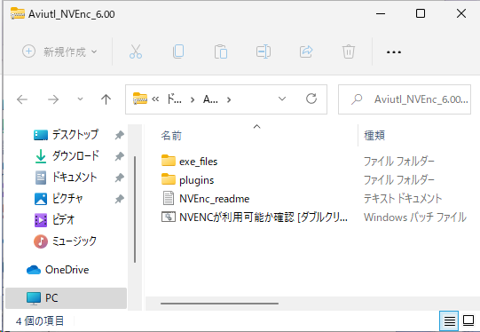
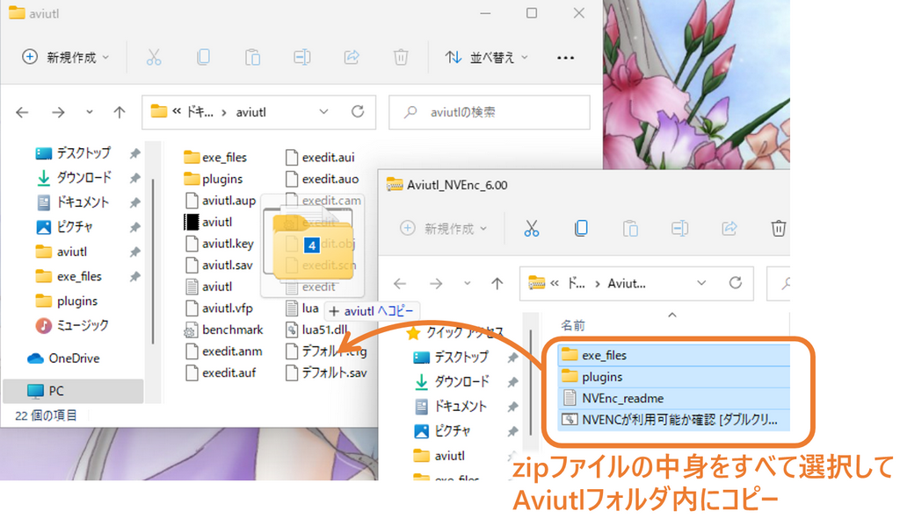
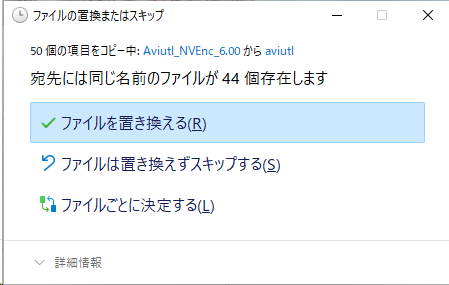
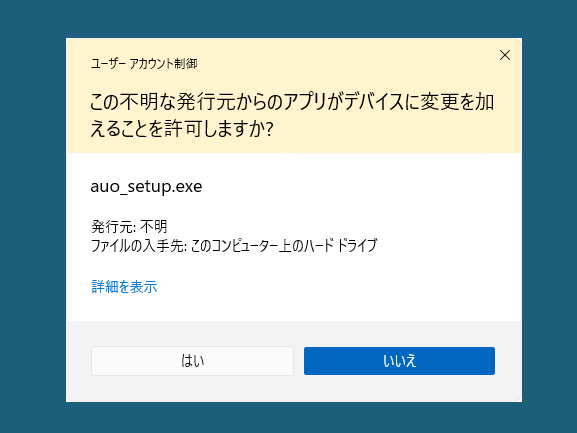
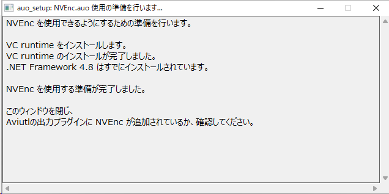
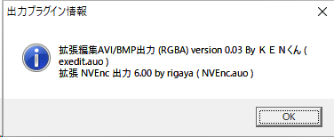
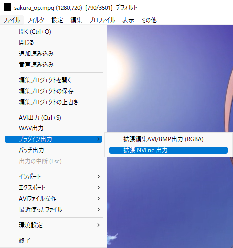
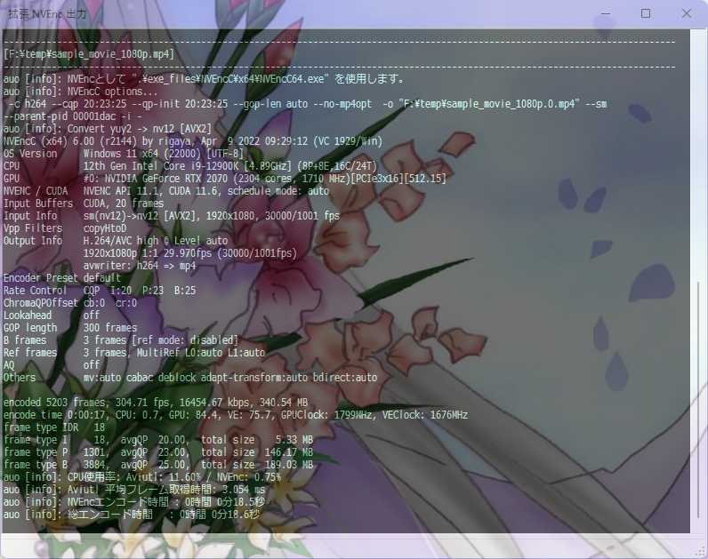
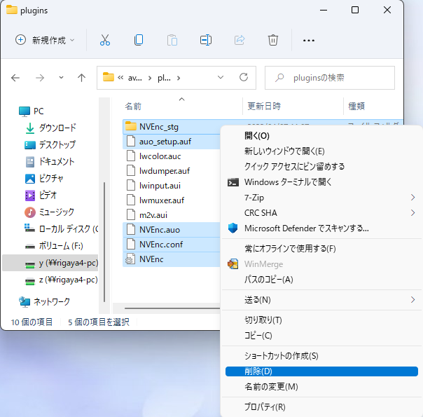

# NVEnc.auo  
by rigaya  

    

このソフトウェアは、NVIDIAのGPU/APUに搭載されているHWエンコーダ(NVENC)の画質や速度といった性能の実験を目的としています。
[Aviutl](http://spring-fragrance.mints.ne.jp/aviutl/)の出力プラグイン版と単体で動作するコマンドライン版があります。  

- [NVEncC.exe](./Readme.ja.md)  
  単体で動作するコマンドライン版については、[こちら](./NVEnc_auo_readme.md)を参照してください。

- NVEnc.auo  
  NVIDIAのNVEncを使用してエンコードを行う[Aviutl](http://spring-fragrance.mints.ne.jp/aviutl/)の出力プラグインです。本項で説明します。

- cufilters  
  [Aviutl](http://spring-fragrance.mints.ne.jp/aviutl/)用CUDAフィルタです。

## 配布場所 & 更新履歴  
[こちら](https://github.com/rigaya/NVEnc/releases)から、Aviutl_NVEnc_x.xx.zipをダウンロードしてください。

## NVEnc 使用にあたっての注意事項  
無保証です。自己責任で使用してください。   
NVEncを使用したことによる、いかなる損害・トラブルについても責任を負いません。  

NVEncによる出力は、max_dec_frame_buffering フィールドを含まないことがあり、
一部の再生環境では問題となることがあります。

## NVEnc の Aviutl への導入・更新

### ダウンロード

まず、NVEncを[こちら](https://github.com/rigaya/NVEnc/releases)から、Aviutl_NVEnc_x.xx.zipをダウンロードしてください。

### 導入・更新

ダウンロードしたzipファイルをダブルクリックして開きます。中身はこんな感じです。

中身をすべてAviutlフォルダにコピーします。

更新時には、下記のように上書きするか聞いてくることがあります。

その場合には「ファイルを置き換える」を選択して上書きしてください。

  
  
  
このあとAviutlをダブルクリックして起動してください。

初回起動時に必要に応じて下の図のようにNVEncの使用準備をするというメッセージが出ます。環境によっては準備が不要な場合があり、その場合は表示されません。

OKをクリックすると使用準備が開始されます。

  
  
  
下の図のように、「この不明な発行元からのアプリがデバイスに変更を加えることを許可しますか?」というメッセージが表示されますので、「はい」をクリックしてください。

  
  
  
下の図のようなウィンドウが表示され、NVEncの使用に必要なモジュールがインストールされます。

エラーなくインストールが完了すると下記のように表示されますので、右上の[x]ボタンでウィンドウを閉じてください。

これで使用準備は完了です。

### 確認

NVEnc がAviutlに認識されているか確認します。

Aviutlの [その他] > [出力プラグイン情報]を選択します。

拡張 NVEnc 出力 が表示されていれば成功です。

### エンコード
[ ファイル ] > [ プラグイン出力 ] > [ 拡張 NVEnc 出力 ] を選択し、出力ファイル名を入力して、「保存」をクリックしてください。

エンコードが開始されます。

エンコードが完了するまで待ちます。お疲れ様でした。

## 基本動作環境  
Windows 10/11 (x86/x64)  
[Aviutl](http://spring-fragrance.mints.ne.jp/aviutl/) 1.00 以降 (NVEnc.auo)  
NVEncが載ったハードウェア  
  NVIDIA製 GPU GeForce Kepler世代以降 (GT/GTX 6xx 以降)  
  ※GT 63x, 62x等はFermi世代のリネームであるため非対応なものがあります。  

|NVEnc       |対応するNVENC SDK API|必要なグラフィックドライバのバージョン   |
|:------------- |:------------------ |:--------------------------------------- |
| NVEnc 0.00 以降 | 4.0                  | NVIDIA グラフィックドライバ 334.89 以降 |
| NVEnc 1.00 以降 | 5.0                  | NVIDIA グラフィックドライバ 347.09 以降 |
| NVEnc 2.00 以降 | 6.0                  | NVIDIA グラフィックドライバ 358 以降    |
| NVEnc 2.08 以降 | 7.0                  | NVIDIA グラフィックドライバ 368.69 以降 |
| NVEnc 3.02 以降 | 7.0                  | NVIDIA グラフィックドライバ 369.30 以降 |
| NVEnc 3.08 以降 | 8.0                  | NVIDIA グラフィックドライバ 378.66 以降 |
| NVEnc 4.00 以降 | 8.1                  | NVIDIA グラフィックドライバ 390.77 以降 |
| NVEnc 4.31 以降 | 9.0                  | NVIDIA グラフィックドライバ 418.81 以降 |
| NVEnc 4.51 以降 | 9.1                  | NVIDIA グラフィックドライバ 436.15 以降 |
| NVEnc 5.10 以降 | 9.0, 9.1, 10.0       | NVIDIA グラフィックドライバ 418.81 以降 |
| NVEnc 5.18 以降 | 9.0, 9.1, 10.0, 11.0 | NVIDIA グラフィックドライバ 418.81 以降 (x64)   NVIDIA グラフィックドライバ 456.81 以降 (x86) |
| NVEnc 5.24 以降 | 9.0, 9.1, 10.0, 11.0 | NVIDIA グラフィックドライバ 418.81 以降 (x64)   NVIDIA グラフィックドライバ 456.81 以降 (x86) |
| NVEnc 5.36 以降 | 9.0, 9.1, 10.0, 11.0, 11.1 | NVIDIA グラフィックドライバ 418.81 以降 (x64)   NVIDIA グラフィックドライバ 456.81 以降 (x86) |

| 対応するNVENC SDK API | 必要なグラフィックドライバのバージョン |
|:-------------- |:--------------------------------- |
| 9.0  | NVIDIA グラフィックドライバ (Win 418.81 / Linux 418.30) 以降 |
| 9.1  | NVIDIA グラフィックドライバ (Win 436.15 / Linux 435.21) 以降 |
| 10.0 | NVIDIA グラフィックドライバ (Win 445.87 / Linux 450.51) 以降 |
| 11.0 | NVIDIA グラフィックドライバ (Win 456.71 / Linux 455.28) 以降 |
| 11.1 | NVIDIA グラフィックドライバ (Win 471.41 / Linux 470.57.02) 以降 |

| CUDAバージョン | 必要なグラフィックドライバのバージョン |
|:------ |:--------------------------------- |
| 10.1    | NVIDIA グラフィックドライバ (Win 418.96 / Linux 418.39)    以降 |
| 10.2.89 | NVIDIA グラフィックドライバ (Win 440.33 / Linux 441.22)    以降 |
| 11.0.2  | NVIDIA グラフィックドライバ (Win 451.48 / Linux 450.51.05) 以降 |
| 11.0.3  | NVIDIA グラフィックドライバ (Win 451.82 / Linux 450.51.06) 以降 |
| 11.1.0  | NVIDIA グラフィックドライバ (Win 456.38 / Linux 455.23)    以降 |
| 11.1.1  | NVIDIA グラフィックドライバ (Win 456.81 / Linux 455.32)    以降 |
| 11.2    | NVIDIA グラフィックドライバ (Win 460.89 / Linux 460.27.04) 以降 |

## 各GPUのエンコード機能情報の調査結果  
NVEncC --check-features の結果をまとめたものです。ドライバに問い合わせた結果となっています。そのため、ドライバのバージョンによって結果が異なる可能性があります。 

| GPU世代 | Windows | Linux |
|:---|:---|:---|
| Kepler | [GTX660Ti](./GPUFeatures/gtx660ti.txt) | [Tesla K80](./GPUFeatures/teslaK80_linux.txt) |
| Maxwell | [GTX970](./GPUFeatures/gtx970.txt) | [Tesla M80](./GPUFeatures/teslaM80_linux.txt) |
| Pascal | [GTX1080](./GPUFeatures/gtx1080.txt), [GTX1070](./GPUFeatures/gtx1070.txt), [GTX1060](./GPUFeatures/gtx1060.txt) | [GTX1080](./GPUFeatures/gtx1080_linux.txt) |
| Volta | [GTX1650](./GPUFeatures/gtx1650.txt) | |
| Turing | [RTX2070](./GPUFeatures/rtx2070.txt), [RTX2060](./GPUFeatures/rtx2060.txt), [GTX1660Ti](./GPUFeatures/gtx1660ti.txt), [GTX1650 Super](./GPUFeatures/gtx1650super.txt)  | [Tesla T4](./GPUFeatures/teslaT4_linux.txt)  |
| Ampere | [RTX3090](./GPUFeatures/rtx3090.txt), [RTX3080](./GPUFeatures/rtx3080.txt)  | |

## マルチGPU環境でのGPU自動選択

NVEncCでは、NVENCを実行可能なGPUが複数存在する場合、
指定されたオプションをもとに実行時に最適なGPUを自動選択します。
自動選択に任せず、自分でGPUを選択する場合には--deviceオプションで指定してください。

1. 指定オプションを実行可能なGPUを選択  
  指定されたオプションから下記をチェックします。  
  - 指定されたコーデック、プロファイル、レベルのサポート
  - 下記を指定した場合、それをサポートしているかチェック
    - 10ビット深度
    - ロスレス
    - インターレース保持
    - psnr/ssim/vmaf計算時のHWデコード
  
2. 指定オプションを満たすGPUを優先  
  下記条件のチェックし、実行可能なGPUを優先します。  
  - Bフレームの使用が指定された場合、Bフレームのサポート
  
3. 1と2の条件を満たすGPUが複数ある場合、下記のGPUを優先して自動選択します。  
  - Video Engine(VE)使用率の低いもの
  - GPU使用率の低いもの
  - GPUの世代の新しいもの
  - GPUのCUDAコア数の多いもの
   VE/GPU使用率の低いGPUで実行することで、複数のGPUを効率的に使用し、エンコード速度の最大限引き出します。また、一般に世代が新しく、CUDAコア数の多いGPUのほうが高速であると考えこれを優先します。
  
  なお、VE/GPU使用率の取得はエンコードの開始時に行われ、その値には数秒のタイムラグがあるため、
  エンコードをほぼ同時に複数開始すると、複数のエンコードが同じGPUに割り当てられてしまうことが
  多いのでご注意ください。

## NVEnc の Aviutl からの削除

NVEnc の Aviutl から削除するには、"plugins" フォルダ内の下記ファイルとフォルダを削除してください。

- [フォルダ] NVEnc_stg
- [ファイル] NVEnc.auo
- [ファイル] NVEnc.conf (存在する場合のみ)
- [ファイル] NVEnc(.ini)
- [ファイル] auo_setup.auf

