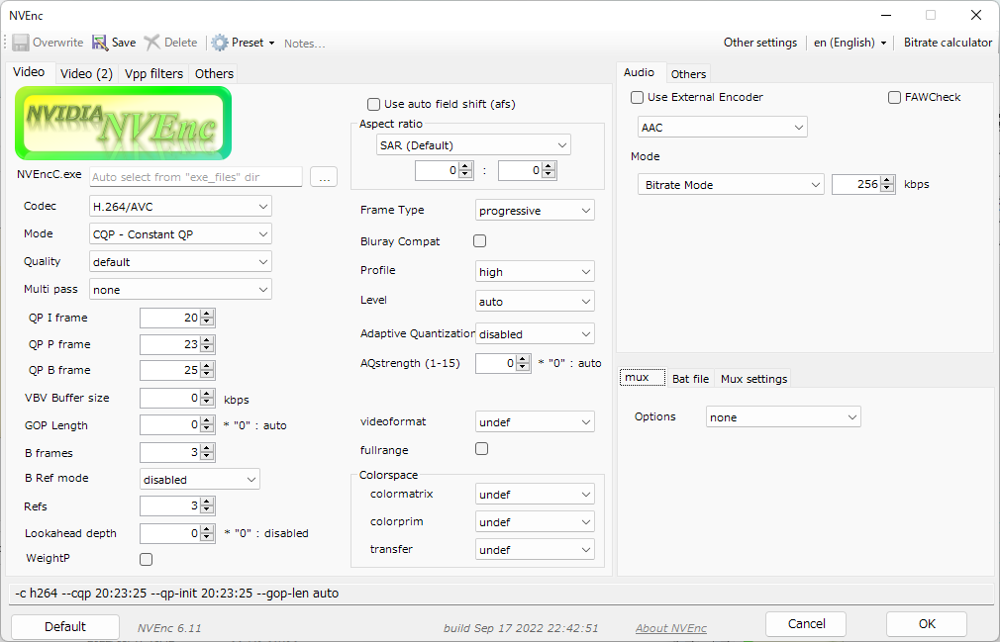

# NVEnc
by rigaya

**[日本語版はこちら＞＞](./Readme.ja.md)**
**[简体中文版本＞＞](./Readme.cn.md)**

     

This software is meant to investigate performance and image quality of HW encoder (NVENC) of NVIDIA.
There are 2 types of software developed, one is command line version that runs independently, and the nother is a output plug-in of [Aviutl](http://spring-fragrance.mints.ne.jp/aviutl/).

- NVEncC.exe ... Command line version supporting transcoding.  
- NVEnc.auo ... Output plugin for [Aviutl](http://spring-fragrance.mints.ne.jp/aviutl/).

## Downloads & update history
[rigayaの日記兼メモ帳＞＞](http://rigaya34589.blog135.fc2.com/blog-category-17.html)  
[github releases](https://github.com/rigaya/NVEnc/releases)  
  
## Install
[Install instructions for Windows and Linux](./Install.en.md)

## Build
[Build instructions for Windows and Linux](./Build.en.md)

## System Requirements
Windows 10/11 (x86 / x64)  
Linux (x64/aarch64)  
Aviutl 1.00 or later (NVEnc.auo)  
Hardware which supports NVENC  
  NVIDIA GPU GeForce Late Kepler gen or later (GK110, GK208, GK210 or later)  
  ※ Since GT 63x, 62x etc. are renames of the Fermi generation, they cannot run NVEnc.  
NVIDIA graphics driver 452.39 or later

## Usage and options of NVEncC
[Option list and details of NVEncC](./NVEncC_Options.en.md)

## Examples of supported encode features  
Result of --check-features, a feature list returned from the driver. May depend on the driver version.  

| GPU Gen | Windows | Linux |
|:---|:---|:---|
| Kepler | [GTX660Ti](./GPUFeatures/gtx660ti.txt) | [Tesla K80](./GPUFeatures/teslaK80_linux.txt) |
| Maxwell | [GTX970](./GPUFeatures/gtx970.txt) | [Tesla M80](./GPUFeatures/teslaM80_linux.txt) |
| Pascal | [GTX1080](./GPUFeatures/gtx1080.txt), [GTX1070](./GPUFeatures/gtx1070.txt), [GTX1060](./GPUFeatures/gtx1060.txt), [GTX1050Ti](./GPUFeatures/gtx1050ti.txt) | [GTX1080](./GPUFeatures/gtx1080_linux.txt) |
| Volta | [GTX1650](./GPUFeatures/gtx1650.txt) | |
| Turing | [RTX2070](./GPUFeatures/rtx2070.txt), [RTX2060](./GPUFeatures/rtx2060.txt), [GTX1660Ti](./GPUFeatures/gtx1660ti.txt), [GTX1650 Super](./GPUFeatures/gtx1650super.txt)  | [Tesla T4](./GPUFeatures/teslaT4_linux.txt), [Tesla T4G @ aarch64](./GPUFeatures/teslaT4G_linux_arm.txt)  |
| Ampere | [RTX3090](./GPUFeatures/rtx3090.txt), [RTX3080](./GPUFeatures/rtx3080.txt), [RTX3050Ti](./GPUFeatures/rtx3050ti.txt)  | |
| Ada Lovelace | [RTX4090](./GPUFeatures/rtx4090.txt), [RTX4080](./GPUFeatures/rtx4080.txt) | |
| Blackwell | [RTX5090](./GPUFeatures/rtx5090.txt) | |

## Precautions for using NVEnc
THE SOFTWARE IS PROVIDED "AS IS", WITHOUT WARRANTY OF ANY KIND.

## Main usable functions
### Common to NVEnc / NVEncC
- Encoding using NVENC
   - H.264 / AVC
      - YUV420 / YUV444 / RGB
   - H.265 / HEVC (2nd Gen Maxwell or later)
      - YUV420 / YUV444 / RGB / YUVA420 (YUV + alpha channel)
      - 10 bits
   - AV1 (Ada Lovelace or later)
- Each encode mode of NVENC
   - CQP (fixed quantization)
   - CBR (Constant bitrate)
   - CBRHQ (Constant bitrate, high quality)
   - VBR (Variable bitrate)
   - VBRHQ (Variable bitrate, high quality)
- Interlaced encoding (by PAFF)
- Lossless output (YUV 420 / YUV 444)
- supports setting of codec profile & level, SAR, colormatrix, maxbitrate, GOP len, etc...

### NVEncC
- Supports cuvid decoding
  - MPEG1
  - MPEG2
  - H.264 / AVC
  - HEVC (10 bit / 12bitdepth with YUV444 support)
  - VC-1
  - VP9
  - AV1
- Supports various formats such as avs, vpy, y4m, and raw
- Supports demux/muxing using libavformat
- Supports decode using libavcodec
- Parallel encoding supporting multi GPU
- Calculation of ssim/psnr/vmaf of the encode
- High performance filtering (VPP, Video Pre-Processing)
  - cuvid built-in hw processing
    - resize
    - deinterlace (normal / bob)
  - GPU filtering by CUDA
    - rff (apply rff flag)
    - deinterlacer
      - afs (Automatic field shift)
      - nnedi
      - yadif
      - decomb
    - decimate
    - mpdecimate
    - colorspace conversion (x64 version only)
      - hdr2sdr
      - sdr2hdr (NGX TrueHDR)
      - tonemap ([libplacebo](https://code.videolan.org/videolan/libplacebo))
      - lut3d
    - delogo
    - subburn
    - custom shader ([libplacebo](https://code.videolan.org/videolan/libplacebo))
    - resize
      - bilinear
      - spline16, spline36, spline64
      - lanczos2, lanczos3, lanczos4
      - various algorithms by [npp](https://developer.nvidia.com/npp) library are available (x64 version only)
      - [nvvfx-superres](https://github.com/NVIDIA/MAXINE-VFX-SDK)
      - [ngx-vsr](https://docs.nvidia.com/rtx/ngx/programming-guide/index.html)
      - [libplacebo](https://code.videolan.org/videolan/libplacebo)
    - transpose / rotate / flip
    - padding
    - select-every
    - deband
      - deband
      - [libplacebo](https://code.videolan.org/videolan/libplacebo)
    - noise reduction
      - smooth (dct based denoise)
      - denoise-dct (another dct based denoise)
      - fft3d (fft based 3D denoise)
      - knn (K-nearest neighbor)
      - pmd (modified pmd method)
      - gauss ([npp](https://developer.nvidia.com/npp) library, x64 version only)
      - convolution3d
      - nvvfx-artifact-reduction
      - nvvfx-denoise
    - edge / detail enhancement
      - unsharp
      - edgelevel (edge ​​level adjustment)
      - warpsharp

### NVEnc.auo (Aviutl plugin)
- Audio encoding
- Mux audio and chapter
- afs (Automatic field shift) support

## Auto GPU selection in multi GPU envinronment

NVEncC will automatically select a GPU depending on the options used,
when there are multiple GPUs available which support NVENC.
--device option can be used to specify on which GPU to run manually. 

1. Select GPU which supports...  
  Items below will be checked whether the GPU supports it or not  
  - Codec, Profile, Level
  - Additionally, below items will be checked if specified
    - 10bit depth encoding
    - Lossless encoding
    - Interlaced encoding
    - HW decode support for ssim/psnr/vmaf calculation
  
2. Prefer GPU which supports...  
  - B frame support
  
3. If there are multiple GPUs which suports all the items checked in 1. and 2., GPU below will be prefered.  
  - GPU which has low Video Engine(VE) utilization
  - GPU which has low GPU core utilization
  - newer Generation GPU
  - GPU with more CUDA cores
  
  The purpose of selecting GPU with lower VE/GPU ulitization is to assign tasks to mulitple GPUs
  and improve the throughput of the tasks. Also, newer Gen GPU and GPU with more cores are assumed to
  have improved performance.  
  
  Please note that VE and GPU ulitization are check at the initialization pahse of the app,
  and there are delays in values taken. Therefore, it is likely that the multiple tasks started at the same time
  to run on the same GPU, and divided into multiple GPUs, even if the options are supported in every GPUs.

## NVIDIA Driver Requirements of previous versions

| NVEnc               | Supported NVENC API | Required graphics driver version       |
|:----------------- |:------------------ |:----------------------------        |
| NVEnc 0.00 or later | 4.0              | NVIDIA graphics driver 334.89 or later |
| NVEnc 1.00 or later | 5.0              | NVIDIA graphics driver 347.09 or later |
| NVEnc 2.00 or later | 6.0              | NVIDIA graphics driver 358 or later    |
| NVEnc 2.08 or later | 7.0              | NVIDIA graphics driver 368.69 or later |
| NVEnc 3.02 or later | 7.0              | NVIDIA graphics driver 369.30 or later |
| NVEnc 3.08 or later | 8.0              | NVIDIA graphics driver 378.66 or later |
| NVEnc 4.00 or later | 8.1              | NVIDIA graphics driver 390.77 or later |
| NVEnc 4.31 or later | 9.0              | NVIDIA graphics driver 418.81 or later |
| NVEnc 4.51 or later | 9.1              | NVIDIA graphics driver 436.15 or later |
| NVEnc 5.10 or later | 9.0 - 10.0       | NVIDIA graphics driver 418.81 or later |
| NVEnc 5.18 or later | 9.0 - 11.0       | NVIDIA graphics driver 418.81 or later |
| NVEnc 5.24 or later | 9.0 - 11.0       | NVIDIA graphics driver 418.81 or later (x64)   NVIDIA graphics driver 456.81 or later (x86) |
| NVEnc 5.36 or later | 9.0 - 11.1       | NVIDIA graphics driver 418.81 or later (x64)   NVIDIA graphics driver 456.81 or later (x86) |
| NVEnc 7.00 or later | 9.0 - 12.0       | NVIDIA graphics driver 418.81 or later (x64)   NVIDIA graphics driver 456.81 or later (x86) |
| NVEnc 7.26 or later | 9.0 - 12.1       | NVIDIA graphics driver 418.81 or later (x64)   NVIDIA graphics driver 456.81 or later (x86) |
| NVEnc 7.49 or later | 9.0 - 12.2       | NVIDIA graphics driver 418.81 or later (x64)   NVIDIA graphics driver 456.81 or later (x86) |
| NVEnc 8.00 or later | 10.0 - 13.0      | NVIDIA graphics driver 452.39 or later |

| Supported NVENC API | Required graphics driver version |
|:-------------- |:--------------------------------- |
| 9.0  | NVIDIA graphics driver (Win 418.81 / Linux 418.30) or later |
| 9.1  | NVIDIA graphics driver (Win 436.15 / Linux 435.21) or later |
| 10.0 | NVIDIA graphics driver (Win 445.87 / Linux 450.51) or later |
| 11.0 | NVIDIA graphics driver (Win 456.71 / Linux 455.28) or later |
| 11.1 | NVIDIA graphics driver (Win 471.41 / Linux 470.57.02) or later |
| 12.0 | ??? |
| 12.1 | NVIDIA graphics driver (Win 531.61 / Linux 530.41.03) or later |
| 12.2 | NVIDIA graphics driver (Win 551.76 / Linux 550.54.144) or later |
| 13.0 | NVIDIA graphics driver (Win 570.00 / Linux 570.00) or later |

| CUDA version | Required graphics driver version |
|:------ |:--------------------------------- |
| 10.1    | NVIDIA graphics driver (Win 418.96 / Linux 418.39)    or later |
| 10.2.89 | NVIDIA graphics driver (Win 440.33 / Linux 441.22)    or later |
| 11.0.2  | NVIDIA graphics driver (Win 451.48 / Linux 450.51.05) or later |
| 11.0.3  | NVIDIA graphics driver (Win 451.82 / Linux 450.51.06) or later |
| 11.1.0  | NVIDIA graphics driver (Win 456.38 / Linux 455.23)    or later |
| 11.1.1  | NVIDIA graphics driver (Win 456.81 / Linux 455.32)    or later |
| 11.2    | NVIDIA graphics driver (Win 460.89 / Linux 460.27.04) or later |
| 11.8    | NVIDIA graphics driver (Win 452.39 / Linux 450.80.02) or later |

## NVEnc source code
- MIT license.
- This program is based on NVIDA CUDA Samples and includes sample code of [NVIDIA Video Codec SDK](https://developer.nvidia.com/video-codec-sdk) and [NVIDIA Optical Flow SDK](https://developer.nvidia.com/optical-flow-sdk).
  This software contains source code provided by NVIDIA Corporation.
- --vpp-nvvfx fiters are power by NVIDIA BROADCAST.  
  
- This software depends on
  [jitify](https://github.com/NVIDIA/jitify),
  [ffmpeg](https://ffmpeg.org/),
  [libplacebo](https://code.videolan.org/videolan/libplacebo),
  [libhdr10plus](https://github.com/quietvoid/hdr10plus_tool),
  [libdovi](https://github.com/quietvoid/dovi_tool),
  [vmaf](https://github.com/Netflix/vmaf),
  [tinyxml2](http://www.grinninglizard.com/tinyxml2/),
  [dtl](https://github.com/cubicdaiya/dtl),
  [libass](https://github.com/libass/libass),
  [ttmath](http://www.ttmath.org/) &
  [Caption2Ass](https://github.com/maki-rxrz/Caption2Ass_PCR).
  For these licenses, please see the header part of the corresponding source and NVEnc_license.txt.

### About source code
Windows ... VC build

Character code: UTF-8-BOM  
Line feed: CRLF  
Indent: blank x4  
